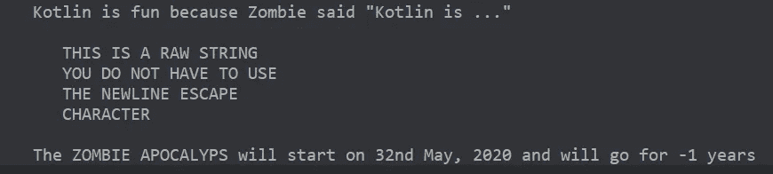
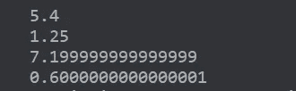
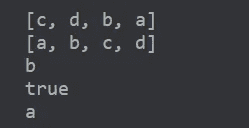
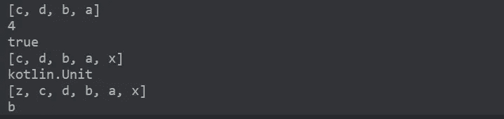

# 科特林—跳跃启动

> 原文：<https://medium.datadriveninvestor.com/kotlin-jump-start-feeaa4801bb?source=collection_archive---------11----------------------->

Kotlin 是一种跨平台、静态类型、通用的编程语言，具有类型推断功能。这里有一些关于 Kotlin 的基础知识，你需要了解这些知识，尤其是对于思想开放的 Java 程序员来说。是的，我说的没错，开明的 Java 程序员。只有他们知道我的意思，加上生命太短暂，担心分号。我的假设是你知道任何其他编程语言的基础。科特林区分大小写。

# 变量

[变量](https://en.wikipedia.org/wiki/Variable_(computer_science))基本上就像程序中保存数值的容器。科特林有两种变量；

1.  可变变量——这些变量可以被改变或重新分配，并用一个**变量**声明

2.不可变变量——这些变量不能被改变或重新分配，并且用值**声明**

就像 Python 一样，Kotlin 具有类型推断功能，您不必为变量中保存的值显式声明数据类型，但您也可以这样做。

# 用线串

字符串基本上是字符的集合。有两种类型的字符串，即转义字符串和原始字符串

Escaped strings and Raw Strings

output

有很多其他的方法可以用在你的弦上，比如:

**。包含()，。toUpperCase()，。toLowerCase()，。toString()，。子序列()**

# 数字和运算符

output

# 功能

为了编写一个函数，我们使用关键字 **fun。**调用一个函数和你已经知道的没有什么不同。

# λ表达式

lambda 表达式是一个函数文字。你会注意到一个关键字 **Unit** 与 Java 中的 **void** 相同。

关于 Lambda 表达式有几点需要注意；

1.  左边是我们传递给它的参数，箭头的右边是返回语句
2.  所有 lambda 函数都在花括号“{}”内
3.  它们在执行异步任务时非常有用

output

关于 lambda 函数的更多信息，请查看 Kotlin 文档

# 条件式

所有的条件操作符和 if 语句都类似于 Java 中的一部分，来自于 **when** 语句，其工作方式与 **switch** 语句相同。您也可以用它来代替长嵌套的 if else if 语句

# 收集

Kotlin 没有自己的集合类，因为它们是基于 Java 集合类构建的。Java 开发人员就像…

集合有两种，即**可变** — *可改变*和**不可变** — *不可改变*

## 列表/数组

Immutable lists

output

Mutable lists

mutable list output

## 地图/字典+For-循环

# 处理空值—空值安全

Kotlin 是一种空安全语言。变量必须在声明时初始化。

如果您希望您的变量包含空值，请使用— **？**如果您确定您的变量不会包含任何空值，请使用**！！**

注意我们的变量**可空的**也可以在下面赋值为空；

# 最后，类和继承

默认情况下，Kotlin 中的所有类都是 Final，你不只是继承。你需要在**父类**和**方法**上使用单词 **open** ，在**子类**中你需要覆盖父类中的**方法。**

我们用冒号“**::**来表示继承。那些想知道“扩展”的人…

say good bye to extends keyword in Kotlin

以我对拉力赛车的热爱来看看下面这个例子吧。由于拉力赛车是基于普通赛车构建的，我们决定为普通赛车创建一个 Car 类作为父类，RallyCar 类作为子类。换句话说，RallyCar 继承了 Car 类。我们将在 RallyCar 类中覆盖的每个方法在父类中都有 open 关键字。由于对拉力赛车加速的期望很高，我们确实忽略了加速方法，不仅仅是“vroom vroom ”,而是在一个“vroom”下达到 200 英里/小时

*请注意，我们父类中的所有参数也应该在我们的子类中*

感谢您的关注，我希望我通过回顾 Kotlin 的基础知识，对您的过渡或学习体验有所帮助。我非常欢迎您的反馈— [Twitter、](https://twitter.com/EAyeeta)LinkedIn