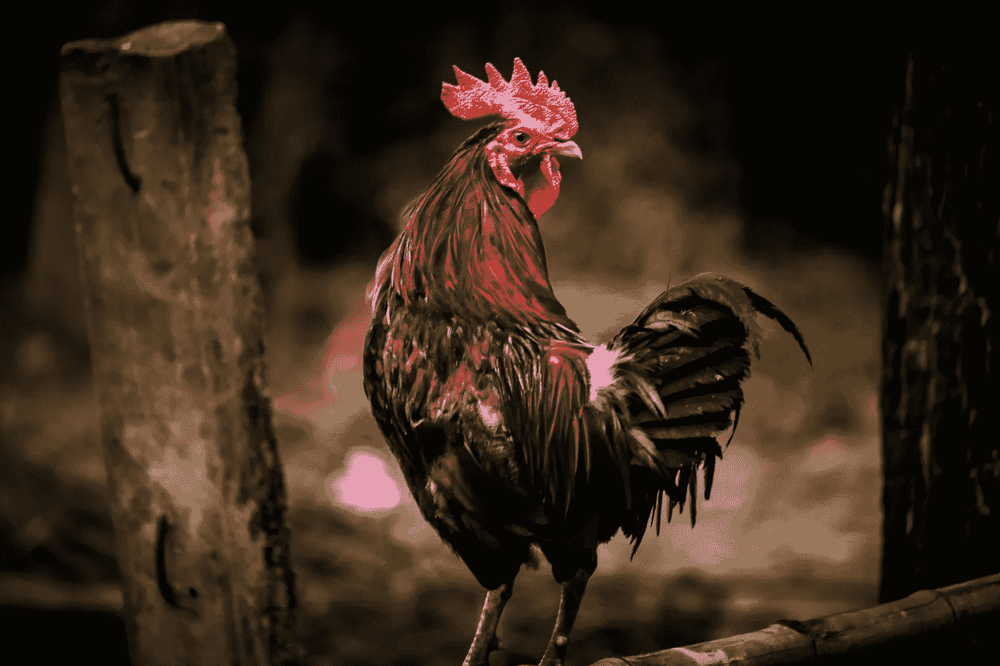

# Kwacha，马拉维迎来了新的黎明！

> 原文：<https://medium.datadriveninvestor.com/kwacha-its-a-new-dawn-opinion-of-the-new-goverment-s-first-100-85388b6e9df6?source=collection_archive---------29----------------------->

Photo by [Kazi Faiz Ahmed Jeem](https://unsplash.com/@djkazi8?utm_source=unsplash&utm_medium=referral&utm_content=creditCopyText) on [Unsplash](https://unsplash.com/s/photos/cockerel?utm_source=unsplash&utm_medium=referral&utm_content=creditCopyText)

许多马拉维人投票支持的总统就职已经 100 多天了。我仍然感激他赢了。像许多人一样，我对本届总统任期总体上甚至短期内能够取得的成就抱有过高期望。正如我们经常被提醒的那样，现实是，在我们看到实际结果之前，将需要大量的重建和基础工作。这种发人深省的想法不仅难以下咽，而且是看待事物的唯一合乎逻辑和理智的方式。

话虽如此，但还是有不小的失望感，例如:

**1。社会福利部将街头流浪儿童赶出街头，毫无疑问，这些儿童是他们必须意识到的某种事情的受害者，如果他们有家，他们在自己家里的情况会糟糕得多。同样是这些孩子，也许在州立儿童之家遇到了其他痛苦的挑战(如果我们也有这些的话)。听到这些生活在悲惨条件下的街头儿童在回家后被迫面对更可怕的情况，我很伤心。这个部长的决定再次证实了我对这个职位的不满。除了午夜的六项指控之外，我还期望总统能在法庭上处理这些指控……我就是放不下它，坦率地说，这是损害我对这个内阁的看法的事情之一。更让我困扰的是，我知道我们的现任总统对街头儿童非常同情。作为他曾经担任牧师的教会的一员，他有一个专门设立的部门(和许多其他部门一样),专门负责关爱儿童，并在以后帮助他们恢复到稳定的家庭环境中。**

这些孩子中有许多成为了班上的尖子。这座教堂建造的房子在建造时就考虑到了质量问题。受雇抚养和照顾这些孩子的家庭对养育和供养这些孩子有着疯狂的投入。这是温暖人心的，令人印象深刻的，现在仍然如此。我相信，这就是我们的总统希望在全国范围内实施的。我相信他有这样的心。然而，在该部目前的领导下，这可行吗？我很乐意看到总统的价值观在这一层面得到体现，不幸的是，似乎没有。

**2。是的，逮捕了一些人。在我看来，这些被质疑的逮捕似乎是政府为了抓到罪犯而进行的。让我印象深刻的是，小鱼似乎被抓住了(或者说被抓住了),但是大鲨鱼..鲸鱼不是。有罪不罚吗？只有时间会告诉我们…还是“时间已经告诉我们了”？**

 [## 区块链投票和美国选举|数据驱动的投资者

### 在不到 70 天的时间里，这个世界上最古老的民主国家将以前所未有的方式面临最大的摊牌…

www.datadriveninvestor.com](https://www.datadriveninvestor.com/2020/08/26/blockchain-voting-and-the-american-elections/) 

**3。关于 Covid 预防的混合信息:**官方渠道说我们应该做的事情之间缺乏一致性，然后我们看到某些领导人建议或劝告相反的事情。问题是，我们在听，我们在看。我记得在收音机里听百日庆典时，听到一位领导人在总统讲话前说了些关于摘掉面具的话，还说“毕竟他们是不带面具竞选的”。媒体还刊登了另一位部长在访问某个社区的贫困老人时没有戴口罩的照片。如果这位部长不知道他们患有罗纳 ***** ，并最终感染了这些高危人群，会怎么样？它引起了我的注意，大多数情况下人们是没有症状的。我也意识到我们的死亡人数一直在下降，恐惧和焦虑现在几乎处于正常水平。太好了。然而，我担心这会给人们传递什么样的信息。如我所说，我们在观察。如果言行一致，那就太好了。我认为这是一个合理的期望。

**4。妇女问题:**在内阁选举中，大多数妇女仅被选为副部长和董事会成员，只有极少数女性担任主席，以及堕胎法案中的敏感问题。对于碰巧是女性的开机的马拉温来说，这是一个令人不安的时刻。

# 不管怎样，除此之外，我认为我们有值得赞赏的进展:

[Image from Pixabay.com](https://pixabay.com/photos/sunrise-more-the-republic-of-malawi-5183022/)

**1。取消马拉维希望从国际货币基金组织获得的扩大信贷便利。我想可能有一些附加条件，我们的现任总统正试图保护我们免受其害。值得称赞。:).我确实想知道，从以前的时代到现在，马拉维已经积累了多少债务。我想象这是可怕的水平。因此，在我看来，这一取消是朝着作为一个国家走向自治的正确方向迈出的一大步。**

**2。旅游、文化和野生动物部发起了某种倡议，支持艺术家度过困难时期。我相信它叫做困难基金？我认为这一点非常重要，但却没有得到应有的重视。我希望他们能够获得全面实施这一计划所需的支持和资源。马拉维有成千上万有技能、有资格、有热情的艺术家和创意者，他们需要这样一笔资金来度过严酷的现实。由于新冠肺炎几乎摧毁了许多艺术家(尤其是表演艺术家)谋生的能力，这样一个基金解决了一个没有多少马拉维人能够理解或者关心的问题。这可能是短视的，因为许多艺术家(音乐家、作家等)创作的作品不仅增加了我们的文化、遗产和社区，而且还简单地提供了某种程度的“生活质量”，这可能是无法量化的。**

作为一名艺术家，我说话带有偏见，但关于这一点可以说很多。我期待着这个部门所能做出的努力，并对他们的能力充满信心。

**3。数据缩减(按需付费):**虽然我对它的结果不满意。我也知道数百万其他马拉维人希望实际的数据捆绑费用能够降低。我认为它所激发的对话和社会运动的重要性令人鼓舞。我们的社会正在尽其所能让人们听到我们的声音。我觉得很棒。不幸的是，捆绑销售的成本并没有下降，我认为这就是问题所在。但是，我对此的看法有点不同。我不认为当前的互联网服务提供商应该被迫降低价格。我觉得这完全没有必要。我会分享我认为。

**4。试图追回被盗资金**:我认为这是不言自明的。

# 最后

期望值极高。当你想看到更多的东西时，很难欣赏工作。它也只有大约 3 个月。无论如何，我们都希望所有的承诺在承诺的时间内实现。所以，我们希望。有希望。 ***现在用完还为时过早。***

Rona =电晕

*想了解更多关于麦克莱恩·姆伯普拉的信息吗？在 Linkedin 上找到* [*她在*](https://mw.linkedin.com/in/macleanmbepula) *或* [*在 Medium 上找到*](https://medium.com/@macleanmbepula) *。她在* [*写了 3 本书(一本从草根的角度看创业(《接受挑战》)和两本诗集，在亚马逊*](https://www.amazon.com/author/macleanmbepula) *上可以买到。请随时支持她的工作，成为她在 Patreon* *的顾客之一。*

## 访问专家视图— [订阅 DDI 英特尔](https://datadriveninvestor.com/ddi-intel)