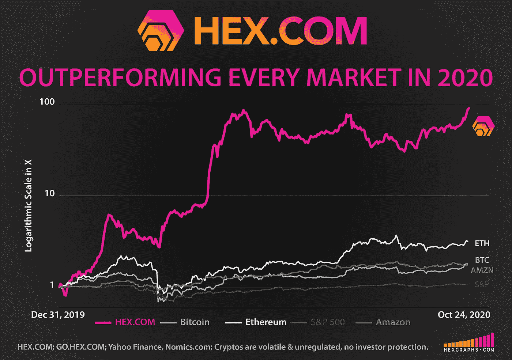
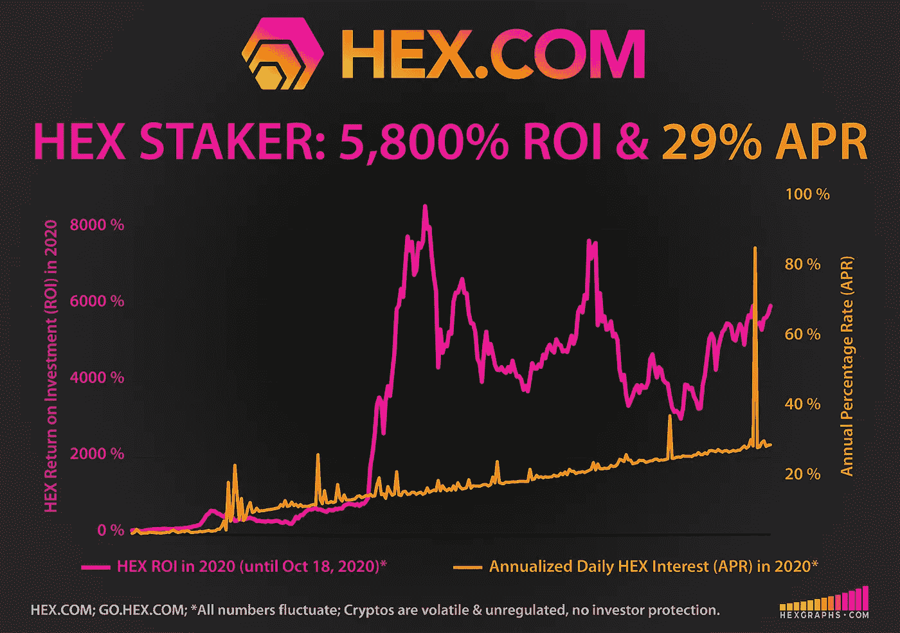
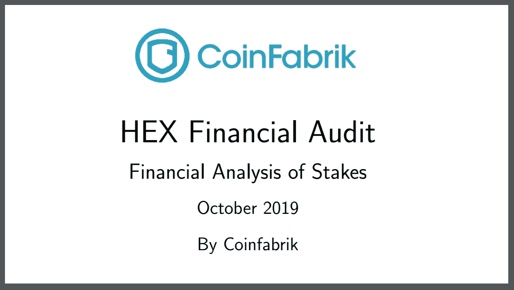
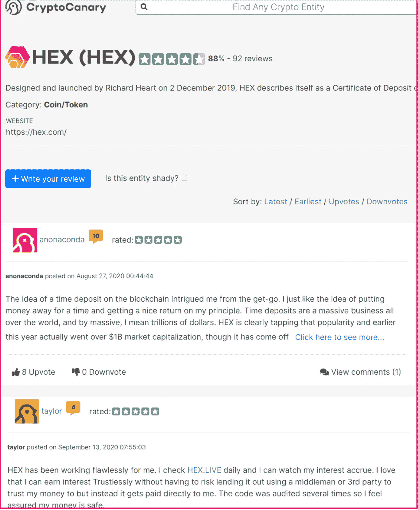
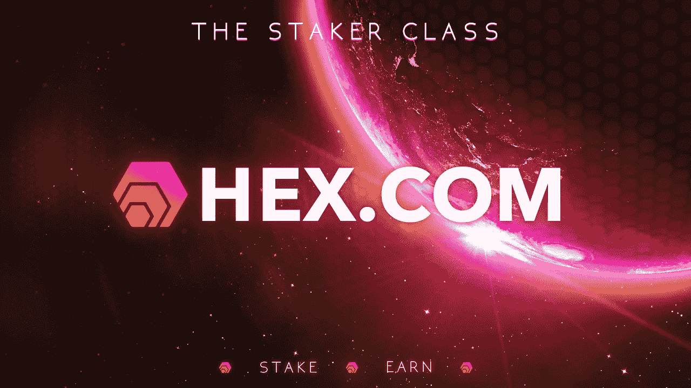
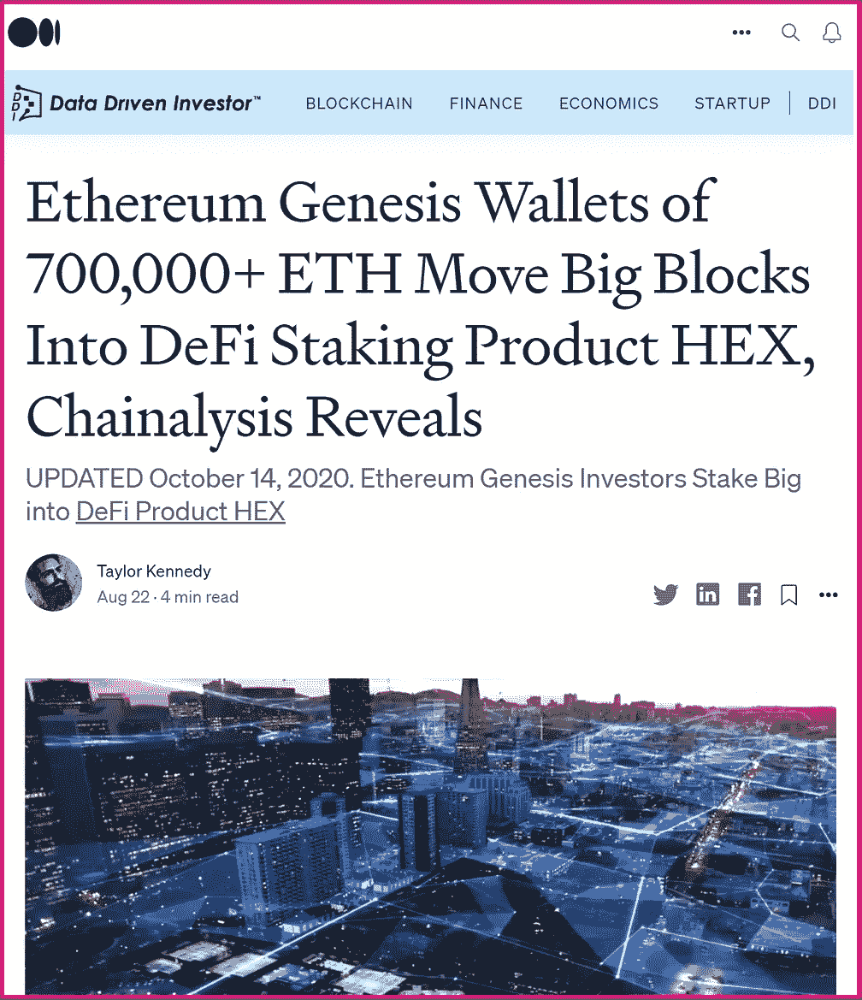

# 下注的最后机会:2020 年 11 月 19 日，10 多亿美元的十六进制红利

> 原文：<https://medium.datadriveninvestor.com/last-chance-to-get-staked-1-billion-hex-payout-november-19th-2020-870d03b976cf?source=collection_archive---------4----------------------->

## [HEX 的大发薪日活动](https://news.bitcoin.com/last-chance-to-get-staked-750-million-hex-payout-november-19th-2020/)为激动人心的发布阶段画上了圆满的句号

最初于 2020 年 10 月 22 日发表于 Bitcoin.com [经作者许可更新并印刷。](https://news.bitcoin.com/last-chance-to-get-staked-750-million-hex-payout-november-19th-2020/)

****——第一张高息区块链存单——已经** [**跑赢了 2020 年**](https://hexgraphs.com/performance) **的每一项资产。通过 Nomics 排名前 20(**[**BTI 验证市场数据完整性排名第 1**](https://btiverified.com/crypto-market-data-report-2020/) **)，超过 3.9 亿美元的 HEX 正在积极收购可变 29%的 APY 股份。平均持股时间为 5 年；最长的赌注是 15 年。这种在 HEX** **中看到的** [**可验证的 onchain 承诺在加密货币中是前所未有的。**](https://hex.vision/goto/610cdd1b335c2fbccd70ef56296bf782)**

# **十六进制是为了超越和它的工作**

**11 月 19 日 HEX 的大支付日强调了为期一年的激动人心的启动阶段的强劲结束，将 1830 亿 HEX 的价值超过 10 亿美元的活跃股份记入贷方。在下面阅读更多关于这个意外收获的事件。本文在撰写时引用的所有数字。**

****

**设计意图从来都不是承诺，但看到 HEX 按照设计表现出来确实非常有希望:HEX 的价格相对于比特币上涨了 92 倍，相对于以太坊上涨了 79 倍，相对于美元上涨了 115 倍。它只用了 129 天就完成了这一切。通过设计，HEX 以极具吸引力的 APY 和额外奖励丰富了赌注者职业。**

> *****第一个 Onchain 真相引擎:*****
> 
> *****传统银行对不履行定期存款条款的惩罚——HEX 直接支付给 Staker 类。*****

# **加密货币是人类历史上升值最高的资产类别**

**比特币的( [BTC](https://markets.bitcoin.com/crypto/BTC) )价格在 7 年内从 0.01 美元涨到 2 万美元，翻了 200 万倍。以太坊( [ETH](https://markets.bitcoin.com/crypto/ETH) )在 2.5 年内从 0.15 美元到 1595 美元做了 10000 多倍。如果你投入 1 美元，你可以赚到数百万，很多人都是这样做的。HEX 是一个完整的成品，旨在提供更多。**

****HEX 凭借卓越的产品契合度，面向比比特币更大的市场。美国和中国的定期存款超过 7.2 万亿美元。这是一个比点对点货币市场大 50%的市场，比特币旨在解决印刷现金总额约为 5 万亿美元的问题。****

# **认真对待安全性
HEX 是一款经过全面审核的完整产品**

**HEX 树立了一个新的标准，它与 DeFi pack 的不同之处在于它在上线之前就已经是一个完整的产品，而不是项目。**

****

**这使得 HEX 具有从他人的未来工作中获得零期望利润的特性:HEX 是一个完整的产品，并按照设计执行。**

**HEX 的合同代码创造了一个强大的经济护城河，版权所有，由全球顶级合同审计员中的 2 位进行 [3 次独立审计](https://medium.com/datadriveninvestor/defis-cream-of-the-crop-blazes-ahead-with-2-000-tps-at-0-01-tx-privacy-100-uptime-audits-e3a0708b498a?source=friends_link&sk=85ab262c22f38942a755fc7fea188fc3)。如此关注细节使得 HEX 精确地按照设计运行，100%正常运行。**

> *****“HEX 延迟了将近一年才获得安全权限，这就是为什么它有 3 个审核；2 项安全审计，1 项经济审计。十六进制没有管理密钥。没有关闭开关。没有暂停开关。它是完全自主的。*****
> 
> *****如果 HEX.COM 下线，我死了，系统继续正常工作。这是不可阻挡的:代码在区块链。你来经营。你自己创造奖励。就是这样。*****

****

**[-Richard Heart，HEX 发明者 2020 年 10 月 15 日接受@ Hardforking 采访](https://www.youtube.com/watch?v=O3QUZdx8vjs)**

**.**

**.**

**.**

# **购买和赌注 HEX 很容易**

****

# **赚大钱的日子
下注的最后机会**

**HEX 的早期采用者将在 2020 年 11 月 19 日庆祝约 1830 亿 HEX 的意外通货膨胀分配，价值超过 10 亿美元，记入 active stakes。这种一次性事件被称为大支付日(BPD)，唯一的资格要求是股份在 BPD 之前活跃，之后结束。对赌注者职业来说，这种妖术看起来就像记入你赌注的任何其他每日利息一样，但是实质上更大。**

# **10 年后的 11 月 19 日**

**比特币的硬币发行通胀模型在 10 年间从 0 个硬币到 1800 万个；HEX 有效地加速了这一过程，在 11 月 19 日完成了整个高通胀发行。紧随其后，HEX 进入低通胀阶段，最大通胀率为 3.69%。比特币花了 10 年时间跨越多次减半才完成同样的任务。**

# **(许多人会忽略的最大回报)**

**[**——2 分钟难得一见的 BPD 从理心**](https://www.youtube.com/watch?v=mCTFiyl96p0&t=70s)**

**[HEX 富有远见的产品设计利用股票](https://medium.com/datadriveninvestor/fully-audited-earnings-per-share-in-stakings-sweetspot-hex-means-big-payouts-for-shareholders-10972b1f5a3c?source=friends_link&sk=f2c8ad8a846b852ab6a70ad4e7b61584)的真实可量化和全面审计的每股收益(EPS)来交付真正的传统金融成品。**

**在 HEX 中拥有更多股份就像在不拥有矿工或支付电费的情况下，堆积更多的比特币矿工以获得更多的 hashrate。你的股份越多，你的造币能力就越强。相似之处是显而易见的:阅读 Richard Heart 关于 [HEX 的完整帖子，了解更多信息。](https://twitter.com/RichardHeartWin/status/1311277866244505602)**

# **用户体验:别人在说什么**

**随着增长和性能吸引越来越多的投资者到 HEX，一直不缺少个人描述他们在 Cryptocanary 上的经历——有点像 crypto 的 Yelp。**

****

**上图是一个小样本。每篇评论都是独一无二的，给每个人使用 HEX 的体验增添了真实的味道。并非每篇评论都是 5 星，但读者会发现大多数都是 5 星。这篇文章鼓励它的读者去探索一些有趣的事情。**

**阅读这些评论——许多描述了多年来投资和交易的个人经历——提醒人们，虽然不能回到过去改变开始，但许多人意识到他们可以从现在的地方开始，改变结局。这适用于许多领域；在加密货币领域，许多人都将目光投向了 HEX，随着它的持续表现，将会有更多人这样做。**

****

# **为什么 HEX 可能会在高薪日之后很长一段时间继续表现出色**

**想象一下，如果比特币向承诺在他们选择的时间段内不出售的持有者支付更多比特币:定期存款。现在想象一下，如果承诺更长的时间会得到更好的回报，当其他人违背承诺时，那些遵守承诺的人会得到更多的比特币。整体净买卖活动会是什么样的？HEX 做了所有这些，还做了更多。**

**HEX 是一个成品，旨在以加密货币从未有过的方式为赌注者提供丰厚的回报。利益相关者阶层享受的回报激励净积极的购买和赌注活动，而不是出售。此外，当 HEX 被标桩时，这些硬币就从流通中消失了——这是另一个积极影响供给需求压力的关键设计特征。**

# **市场领导者有着相似的道路**

**前 2 名的加密货币在早期经历了最严重的口头辱骂。以前经常看到比特币骗局或以太坊骗局被无知和无知地说出来。历史常常是押韵的，人们不禁会注意到许多从未研究过它的有影响力的大人物在谈论[妖术骗局](https://hackernoon.com/is-hex-is-the-most-notorious-scam-in-the-history-of-cryptocurrencies-r9m53azs)。具有讽刺意味的是，就像比特币和以太坊的早期一样，唯一的骗局似乎是虚假标签，阻止许多人在适当的时候投资真正的产品。**

> *****“当房间里有一头大象时，介绍它们。”*****
> 
> ***——兰迪·波许，*最后一讲**

**CoinMarketCap。虽然 HEX 可能是有史以来第一个有两个独立安全审计的硬币，但由于不断流行的 CoinMarketCap HEX 的明显把关做法，HEX 尚未在那里正确排名。事实上，CoinMarketCap 可疑地将 HEX 列在第 201 位——似乎被埋没在第 3 页。这不仅让新投资者极难发现 HEX，也让数据报告实践受到质疑。**

**全球顶尖的区块链数据监控公司区块链透明研究所(block chain Transparency Institute)给 CoinMarketCap 的评分是全线 C；像 Nomics 这样的网站，HEX 的排名是正确的，得到了 BTI 认证的所有 A 的分数。同样值得注意的是，尽管 HEX 的设计非常强调安全性和可验证的链上透明性，但加密货币中许多(大多数)最大的人物和社会影响者迄今为止都不愿意公开讨论 HEX。**

**因此，对于那些此时发现 HEX 的投资者来说，这可能意味着参与早期采纳者阶段和后期多数之间的差异。**

# ****盗梦空间****

**HEX 是由连续创业者和早期比特币采用者 Richard Heart 先生发明的。如今，Heart 先生是以太坊的精通支持者，也是各种主题中令人振奋的思想领袖。凭借其鼓舞人心的舞台表现和坦率流畅的采访，哈特先生的观众总是座无虚席。**

**更多信息请访问:[**HEX.COM**](http://www.hex.com/)**

**新闻和更新，关注 Twitter:[**@ hex crypto**](https://twitter.com/HEXcrypto)**

# ****桩子十六进制&看着它倍增****

**[打桩工。App](https://staker.app/invite/PQn8) 让您安全可靠地在链上积累 100%的财富，并实时观察其增长:**

****

# **相关文章**

********