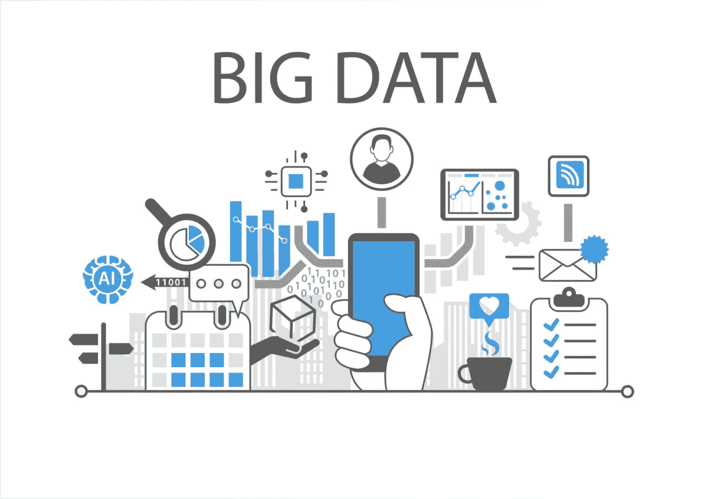
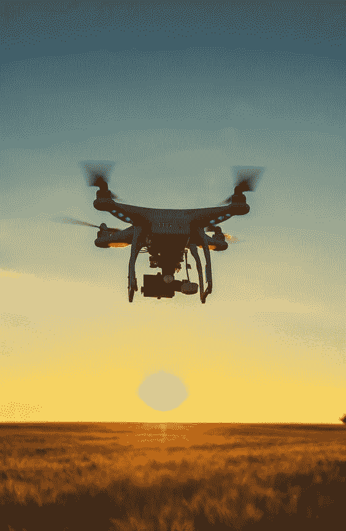

# 改变农业产业的最新技术趋势

> 原文：<https://medium.datadriveninvestor.com/latest-tech-trends-transforming-the-agriculture-industry-5f2648908c7d?source=collection_archive---------1----------------------->

trends in agriculture

农业产业正在慢慢利用可以帮助农民受益和增加收入的技术。有必要说明的是，除了我们在农业中经历的 [**技术**](https://technologylimitless.com/) 转变(如开发作物改良流程)之外，我们在如何处理作物健康方面将会有一个非常独特的转变，因为自从 4.0 代技术问世以来，利用大数据、人工智能和精准农业等概念的可能性是无限的。

**农业大数据**

Big data in agriculture industry

随着人口的增长，对食物的需求越来越高，为了满足这些不断增长的需求，农业应该更新技术。有了农业内部的技术，它能提高农民的收入，使之更加灵活，从而促进作物生产的扩大。在这些技术中，大数据预计将在未来几年产生巨大影响。大数据技术在农业领域不乏使用案例。一些比较突出的在这里。

 [## 为什么数据将改变投资管理|数据驱动的投资者

### 有人称之为“新石油”虽然它与黑金没有什么相似之处，但它的不断商品化…

www.datadriveninvestor.com](https://www.datadriveninvestor.com/2019/01/25/why-data-will-transform-investment-management/) 

**产量预测**

大数据有助于利用数学模型研究作物周围的数据，从而准确预测产量。预测作物可以让农民了解什么时候该种什么。利用传感器收集数据意味着只需要少量的人工工作，就可以为每个企业提供一本手册，保证他们的作物获得最简单的回报。 [**阅读更多……**](https://www.enterprisetechnologyreview.com/news/big-data-is-now-an-entrant-to-agriculture-farmers-must-be-set-to-its-course-nwid-237.html)

**为什么基于人工智能的农业科技是农学家的新宠？**

AI in agriculture

技术的引进在许多方面影响了农业部门。从播种到检查土壤标准，基于人工智能(AI)的农业技术不断提供下一代农业解决方案。由于世界人口的增长，对更智能的农业产品和解决方案的需求也在增加。

今天，农学家正在采用技术驱动的农业设备和耕作策略，以高质量的产品满足人们日益增长的需求。 [**基于人工智能的农业**](https://technologylimitless.com/artificial-intelligence-in-manufacturing/) 工具和应用提供了许多好处，如有效控制害虫，有效监控土壤和作物状况，确定化肥的必要性，以及改善农业供应链。通过对农业市场的巨大影响，AI 继续帮助农民探索新的方法来提高他们的作物产量和收入。

**·农场数据的智能分析**

农业从来都不是一项简单的任务，因为它需要对天气、土壤质量、市场内的作物需求等进行精确的分析。人工智能技术允许农民选择最简单的杂交种子进行播种，这支持了他们的土壤质量报告。 [**阅读更多……**](https://www.enterprisetechnologyreview.com/news/why-aibased-agtech-is-agriculturist-s-new-favorite-nwid-479.html)

**农业行业的无人机**

Drones helping in the agriculture industry

许多企业利用无人机进行空中监视或仅仅用于娱乐，而农业平台正在逐渐认识到无人机(UAV)可能对土地管理产生的巨大影响。无人机正在成为下一代农业工具之一，这一趋势也被称为智能农业，这是一种以软件为中心的全面发展的传统。因为人口每天都在增长，所以粮食产量也必须增长 70%才能适当地供应给每个人。这通常是无人机进入图像的地方。无人机打开了管理作物的大门，帮助农民扩大生产，而不影响商品的标准。

**种植**

目前无人机技术的应用已经大大降低了播种成本。在 3D 测绘技术的辅助下，无人机改善田间布置，制作播种图案。它们不仅有助于播种，也有助于将种子埋在地下适当的深度，以便正常生长。种植完成后，无人机驱动的土壤检测为灌溉和氮水平监督提供了信息。 [**阅读更多……**](https://www.enterprisetechnologyreview.com/news/why-are-agriculture-enterprises-embracing-uavs-for-better-farming-nwid-409.html)

 [## 企业技术评论| LinkedIn

### 了解如何在《企业技术评论》工作。今天免费加入 LinkedIn。查看您在企业中认识的人…

www.linkedin.com](https://www.linkedin.com/company/enterprise-technology-review/)  [## 企业技术评论

### 企业技术评论(@EnterpriseTech7)最新推文。《企业技术评论》是由…

twitter.com](https://twitter.com/EnterpriseTech7)