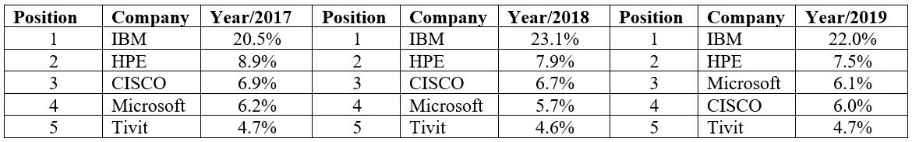

# 拉丁美洲云战场:科技巨头在公共云和私有云之间战斗

> 原文：<https://medium.datadriveninvestor.com/latin-american-cloud-battlefield-tech-giants-fighting-in-the-public-and-the-private-cloud-f47af78c8fdf?source=collection_archive---------10----------------------->

毫无疑问，云计算正引领着近年来科技行业的创新。从高性能的新基础设施和开源选项的更多使用，公司正在使用这些可用资源来更新和基本重建他们的一些核心业务，主要是重新定位大量数据和数字服务。云创新的一大优势是有可能通过数字渠道快速改善整个服务和产品；从区块链网络实施到人工智能自动化，云计算对所有规模的公司和所有行业来说都是一件大事。

 [## 信息图:云之旅|数据驱动的投资者

### 聪明的企业领导者了解利用云的价值。随着数据存储需求的增长，他们已经…

www.datadriveninvestor.com](https://www.datadriveninvestor.com/2018/09/22/infographic-journey-to-the-clouds/) 

云计算领域的大公司正在激烈争夺拉丁美洲的市场份额。然而，尽管 AWS、微软、谷歌和 IBM 等公司因其积极的战略和创新而享誉全球，但在该地区，科技商业环境发出了复杂的信号。

Source: [papi247](https://papi247.tumblr.com/post/190047947162)

例如，在全球范围内，AWS 可能是通用云领域的最大玩家，但在拉丁美洲，主要供应商显然是微软。然而，微软和 AWS 在 2019 年末各自的收入都有所放缓，而谷歌一直在推动在该地区的大力投资，以便在中期内获得市场份额。此外，AWS 似乎正在遵循谷歌位于阿根廷的新数据中心的相同战略。另一方面，尽管 IBM 在该地区拥有悠久的历史、地理位置和服务，但它正在努力保持在通用云战场上的统治地位。

更具体地说，在公有云细分市场，微软已经连续三年获得第一的位置，但紧随其后的是其主要竞争对手 AWS。这意味着，这两家大公司不仅是这一特定细分市场的王者，而且与市场上的其他竞争对手相比，它们拥有明显的财务优势，因为这一更大的市场份额最终意味着更大的收入。到目前为止，微软和 AWS 的优势几乎是最接近的竞争对手的四倍。此外，我们必须考虑到，这一差距正在年复一年地加深。

拉丁美洲市场份额:公共云

Source: own elaboration with IDC data on Public and Private Cloud Services 2019 [https://www.idc.com/](https://www.idc.com/)

在公共云战场上，业务环境非常不同，因为我们在这里看到拥有最大市场份额的老玩家。IBM、HPE 和思科是明显的主导公司，然而，最近微软由于其在组合云服务方面的改进而获得了一些地盘。IBM 去年的主导地位几乎是其最接近的竞争对手的三倍，这是由于该公司在过去几十年中的扩张，其著名的名称和品牌，以及其在该地区部署的强大能力。

拉丁美洲市场份额:私有云

Source: own elaboration with IDC data on Public and Private Cloud Services 2019 [https://www.idc.com/](https://www.idc.com/)

最后，公共云和私有云服务的各种行业基本如下:

1.银行

2.电信

3.航空公司

4.制造业(从工业产品到消费品)

因此，老实说，在不久的将来，我们不认为云用户的行业会有大的变化，但他们当前核心业务中部署的服务和功能会有很大的改进。区块链和人工智能实施将包含大多数新的创新；如果 2019 年是这些领域的伟大实验，那么 2020 年将是智能和有利可图的实施的伟大一年。

现在，云业务各个领域的大公司应该整合科技行业最热门的创新，而不仅仅是保持他们“更大玩家”的地位，因为正如我们所知，我们处于一个“赢家通吃”的市场。近年来，我们在区块链和人工智能领域面临着广泛的研发阶段，现在市场只要求一件事:行动。

2020 年我们会因为云计算的完善而面临一场彻底的数字服务革命吗？或者仅仅是又一年的“实验”和无效的真正业务实现？