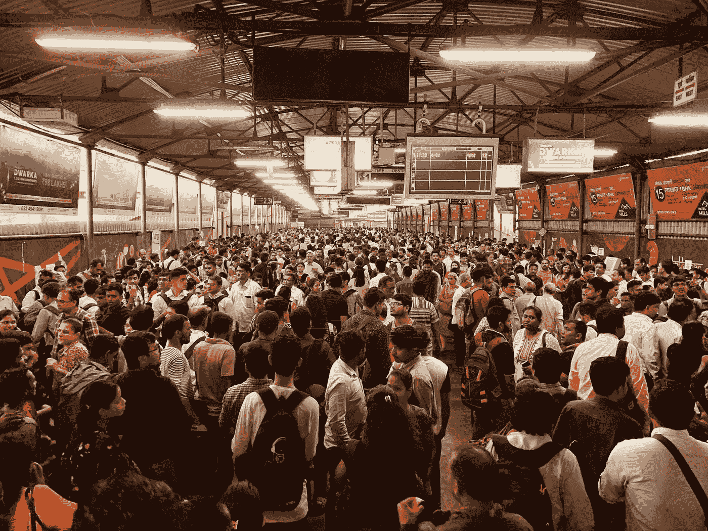

# 大笑休息

> 原文：<https://medium.datadriveninvestor.com/laugh-break-1e1bce56bc78?source=collection_archive---------14----------------------->

Photo by [Smith Mehta](https://unsplash.com/@smithmehta?utm_source=medium&utm_medium=referral) on [Unsplash](https://unsplash.com?utm_source=medium&utm_medium=referral)

## 请上来，先生…

*(给真正疲惫不堪的顾客的服务建议。真实故事，真希望我当时在场)*

*场景*:长长的队伍，拥挤的机场。疲惫烦躁的人。尖叫，疲惫，饥饿的孩子。没有座位可以休息，飞机上也没有。

延误的航班。取消的航班。

 [## 幸福的算法？数据驱动的投资者

### 从一开始，我们就认为技术正在使我们的生活变得更好、更快、更容易和更实用。社交媒体…

www.datadriveninvestor.com](https://www.datadriveninvestor.com/2019/03/08/an-algorithm-for-happiness/) 

忙碌的柜台职员。尽他们所能做好他们所拥有的。带着他们所拥有的*离开*。

大个子白人站在队伍里，怒气冲冲。

烟雾越来越多，他脸上鲜红的颜色也越来越多，他等待的时间越长。

坐立不安。向哭闹的孩子抛媚眼。对筋疲力尽的母亲咆哮。拒绝让人们通过他们需要去的线路，即使他的线路阻碍了交叉交通。

打他手机上的电话。婊子们。抱怨。太大声了。和他亲近的人都捂着耳朵。

队伍绕着几排椅子蜿蜒前进。移动缓慢。

最后，愤怒的白人大汉被叫到柜台前。

当精疲力竭的女职员问他需要什么时，他就声嘶力竭地喊道:

# 你不知道我是世卫组织吗？？？？？？？？？？？？？？？？？？？？？？？？

疲惫不堪的职员身体前倾，将航班广播系统的麦克风拉到嘴边。整个机场平静地面无表情:

# 女士们先生们。我们有一个人在(航空公司)柜台世卫组织不知道他是世卫组织。有人能提供帮助吗？

*麦克风掉落。*

(我偷了这个，向那位伟大的店员道歉，上帝保佑，我又要用它了。再一次。再一次。当面对愤怒的自以为是，有权的混蛋时，请偷窃，撕开和使用。)