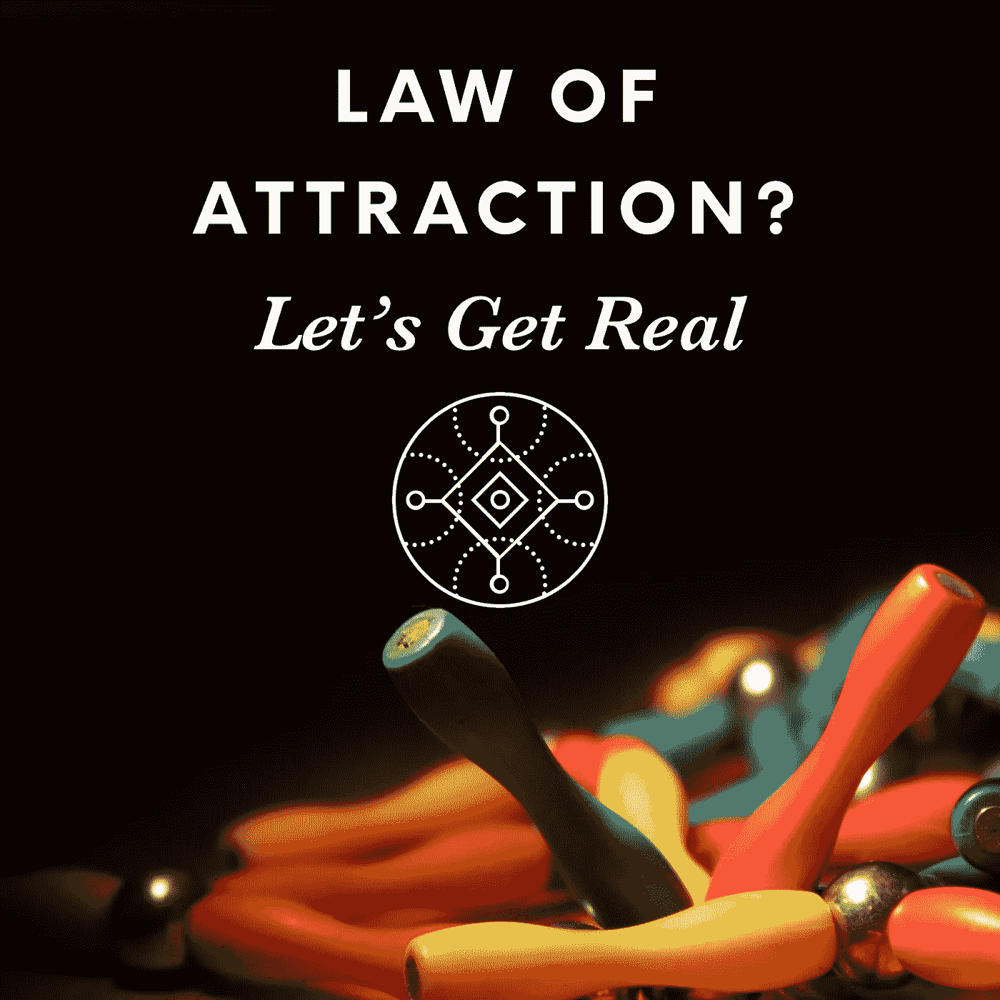
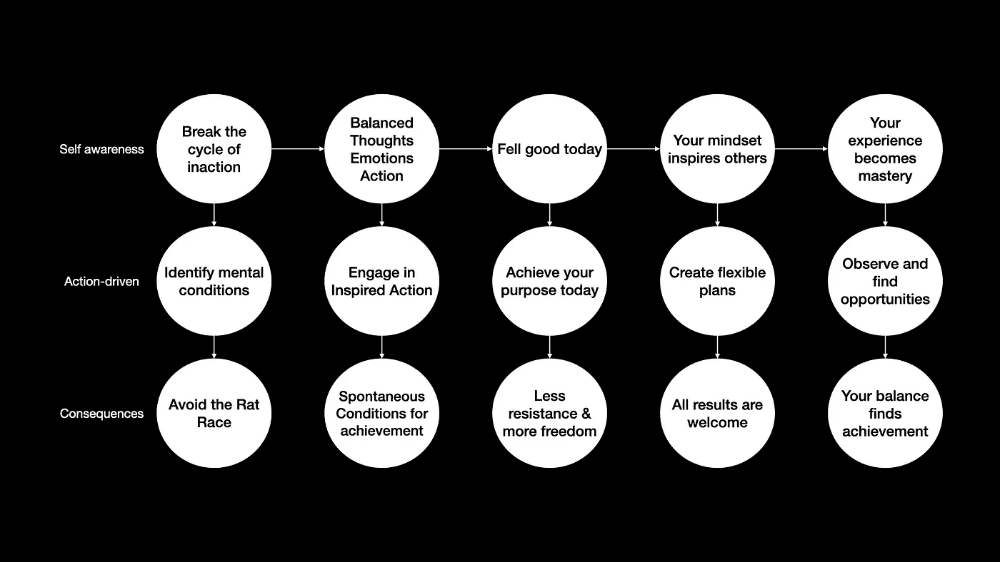

# 吸引力法则？让我们现实一点。

> 原文：<https://medium.datadriveninvestor.com/law-of-attraction-lets-get-real-cb51bb539738?source=collection_archive---------6----------------------->

许多人对吸引力法则感兴趣。虽然我喜欢所有与灵性、哲学、宇宙学相关的主题，但我不太喜欢那些容易被购买和误解的肤浅概念。著名的 LOA 就是一个很好的例子，它是一个在大多数情况下都只是表面处理的深刻主题。

抛开所有关于 LOA 话题的废话，我发现了一些有用的智慧。我想在这篇文章中与你分享，但首先，我需要告诉你我是如何走出无所作为的循环的，我希望这一切在最后都是有意义的。我鼓励你从不同的段落中找到联系，我试着按逻辑顺序呈现它们，但我确信我的逻辑需要一些改进。

# 行动很重要。

当我遇到麻烦时，当我偏离目标时，我会焦急地寻找提示和窍门。我浏览互联网寻找灵感和希望。不幸的是，这种扫描过程会成为一种习惯，一种难以打破的恶性循环，让我很难摆脱自己的思维并付诸行动。现在我知道要识别行为:

*   如果我开始相信某件事是绝对真理，我可能会把一个想法转变成一种信仰，甚至是一种宗教。这是一个明确的信号，让我走出去做一些实际的事情。
*   如果我对学习的渴望变得比做一些事情来解决我的挑战更重要，那么我知道我必须停下来，并与我的目标保持一致。

LOA 说“物以类聚，人以群分。”我还听过一个简化并稍加修改的版本:“你的思想创造了你的现实。”将这种想法转化为一种精神状态很容易，“如果你专注于你想要的，你就会得到它”，但对许多人来说，这并不奏效。

 [## 领导力。赢得|数据驱动型投资者需要更广阔的视角

### 不管他们愿不愿意，领导者都是快速运转的机器中的齿轮，这就要求他们夹住自己的爪子…

www.datadriveninvestor.com](https://www.datadriveninvestor.com/2020/02/07/leadership-it-takes-a-wider-perspective-to-win/) 

当我做的事情没有达到预期效果时，我经常会回到无所事事、学习、希望的状态。那些未被满足的期望揭示了一种精神状态正在运作，我可能需要改变它或者消除它。

**精神状况**对我来说比较棘手；他们很快就形成了激烈竞争的局面。让我们评价一下这个:

> ***“如果你做了正确的事情，那么你就会得到你想要的，否则。”***

如果我做了我认为正确的事情，但我没有得到我想要的，会发生什么？很容易得出这样的结论:我不具备成功的条件，我什么都不知道，甚至更糟，我不配得到我想要的。这种精神状态是有害的，它应该直接被淘汰。

# 物以类聚的意思。

为了理解 LOA，我试着去发现“物以类聚”对我来说意味着什么。以下是一个探索我的精神状态和现实中发生的事情之间联系的心理序列:

1.  我的思想产生情绪，更多的思想，更多的情绪。
2.  消极、无能、悲观的想法会产生同样的情绪，影响我的行为方式。
3.  我的行动参与创造了我想要达到的结果。
4.  我有意识的想法并不是影响我精神状态的唯一因素。潜意识过程、我的身体机能和外部环境也会影响。
5.  将我的思想状态从有害的转变为建设性的支持激发了行动、创造力和独创性。这就是许多人定义的流动。

因此，当我设法保持积极或建设性的心态时，我倾向于做让我感觉良好的事情，增加我获得快乐、成就和成功的机会。即使计划没有成功，积极的态度也能帮助我发现隐藏的机会和意想不到的有益结果。

如果我真的感觉很好，不管环境如何，我会为自己产生更好的结果，强化这个过程；这就是“物以类聚”对我的意义。相反，举个例子，如果我想报复一个恶霸，我可能会成为一个恶霸。

> “当心，在与怪物战斗时，你自己不会变成怪物……因为当你长久凝视深渊时。深渊也凝视着你。”―弗里德里希·尼采

为了保持积极的心态，正如你将在这个视频中看到的，我把我的目标陈述作为一个工具:

> 当我很棒的时候，我感觉很棒，我的生活也很棒

# 连接时间，我，和所有其他人。

LOA 的支持来自许多不同的宗教、哲学和思想流派，它们与我们分享了他们对如何过上美好生活的理解。我们都希望无条件地让**感觉良好。为此，我们必须停止在有害的精神状态和对未来的预测上浪费时间；我们首先要保证今天没事。我们需要建立一种不断发展的个人方法，不管环境、我们行为的结果以及人生的不确定性如何，都能保持积极的心态。**

采取行动的舞台永远是现在。计划是好的，但是实现它们的每一步都发生在现在。过好生活就是减少未来的重要性，同时增加对现在的关注；这就是我们如何让未来在没有阻力或阻力较小的情况下展开。

如果“物以类聚”是真的，那么我需要更好地理解为什么我吸引我当前的生活经历，包括我不喜欢的。我和其他人有什么关系？

赫尔墨斯·特里梅吉斯特说:

> "如上，如下，如内，如外，如宇宙，如灵魂……"

我把这句话理解为宇宙统一的观点，其中积极和消极，二元性和极性，只是对整体和部分解释的机械描述，它们相辅相成。换句话说，我们的思想、情感和行动只是一个**更大的过程**的一部分，在这个过程中一切都相互作用。描述这些部分而不考虑所有其他部分的上下文是一个常见的错误。

不过，我意识到我无法控制这个过程；因为它，我在这里写这篇文章。发生的一切让这一刻成为可能；因此，我认为**这个过程值得信任**。

我想学会放弃试图控制自己行为的结果，我知道准确预测未来是不可能的。我想专注于**我有直接权力做的事情**。我们人性中所有的自然不确定性只是一种控制未来的倾向。我需要确保我保持平衡，与我的目标保持一致，并为每天的激励行动做好准备。那个，我可以做！我总是可以选择我的感受和采取行动的方式。

当我感觉良好和平衡时，我会自然而然地对我自己和我至今所取得的成就感到感激。在这种精神状态下，任何出现在我面前的东西都会变成惊喜，包括钱。带着这种心态采取行动，我称之为激励行动。

反过来可能会有帮助(假装它，直到你接近它)，但它创造了一种**心理状态**，将结果投射到未来，这是你知道我试图避免的:

1.  如果你有好的想法，好事就会发生。
2.  如果你心存感激，你会得到更多你喜欢的东西。
3.  如果你看上去和感觉上成功了，你就会成功，等等。

当你学会现在感觉良好，你不需要等待，你不想控制结果，你真诚地欣赏当前的机会，你相信这个过程。如果你周围发生的事情没有让你失去平衡，那么一切看起来都是奇迹，其他人会认为你勇敢、真实、自信。那些不就是伟大的条件吗？

“先有钱”的想法逐渐消失，因为它的目标是让你感觉良好，但你已经感觉良好了。你并不贫穷，你知道环境可能会在任何时候变得不利，当你准备好的时候，运气会敲你的门。你对改变的抗拒消失了，你的好奇心增加了，你的想象力扩展了。你知道你可以实现你的想法。你学会了掌控人类的生活，你感到被赋予了力量。你所经历的结果是一个结果。

> “苹果的*目标不是*让*赚钱*。*我们的目标*是 ***设计*******开发*******把*带给*市场*** *好产品*……*我们* ***信任*** 作为*后果*的证明，*但是我们很清楚**什么*我们的目标是*** 。”―史蒂夫·乔布斯***

> ***设计、开发并推向市场**:目的。什么时候可以实现？每一天，在当下。*
> 
> *信任:放开对结果的控制，观察并调整你的行动，始终与你的目标保持一致。*
> 
> *另一个后果:后果是过程的一部分，不在我们的控制范围内，但在我们的影响范围内。*
> 
> ***我们的目标是什么**:不断地、有意识地与目标保持一致。*

**

*A different way to understand it.*

*我与其他一切事物的关系是，当我不抗拒现实时，我感觉很好。当我抗拒发生的事情时，我会将摩擦视为紧张、痛苦或消极。当我感觉好的时候，我会识别那些我感觉不好的时候看不到的机会。*

*我坚持与我们的生活目标保持一致的原因是，这个过程有助于你将精神能量转化为行动。该行动将致力于实现物质成果，实现目标，执行计划。感觉良好、满足和感激会帮助你处于最佳状态，让你的梦想成真。相反的情况会让你更容易失败，而失败最终会让你明白，当你和你的团队充满热情、团结一致、富有创造力和生产力的时候，你的机会就来了。*

*如你所知，有经验的企业家，学会不害怕失败；换句话说，他们学会无条件地平衡他们的情绪和他们当下的目的、目标和梦想。*

*据我所知，LOA 是一个有标题的邀请，邀请你在达到精通时体验人类的状况。如果我能改变邀请的标题，我会写，“生活如镜；生活经历反映了你是怎样的人。”*

*你好吗？现实超越了极性、理解、思想、情感，也远远超过了成就和财产。你对生活的体验取决于你的态度和心态，所以最好尽可能让生活快乐。*

> *“过一个充满你喜欢做的事情的短暂的人生，总比悲惨地度过漫长的一生要好。”―艾伦·沃茨。*

# *一些笔记*

> *"如果生活感觉像玫瑰花园或垃圾填埋场，我们就忽略了更大的东西."*

*当我感到受害，焦虑，抑郁，生活感觉像一场噩梦，自己无法走出困境时，我会打电话给愿意倾听的朋友或家人。如果这样的情况持续下去，其他都不管用，我就去找专业的支持。*

*我确信我的头脑能够产生大量无用的想法，使我看不到隧道尽头的光明。当这种情况发生时，我也知道我是在看整体的一部分，而没有适当的背景。*

*祝你过得愉快！-何塞。*

*如果你觉得这有用，你可能会喜欢参加我的[目的感在线培训](https://sop.visionofpresent.com/#)。*

***访问专家视图—** [**订阅 DDI 英特尔**](https://datadriveninvestor.com/ddi-intel)*