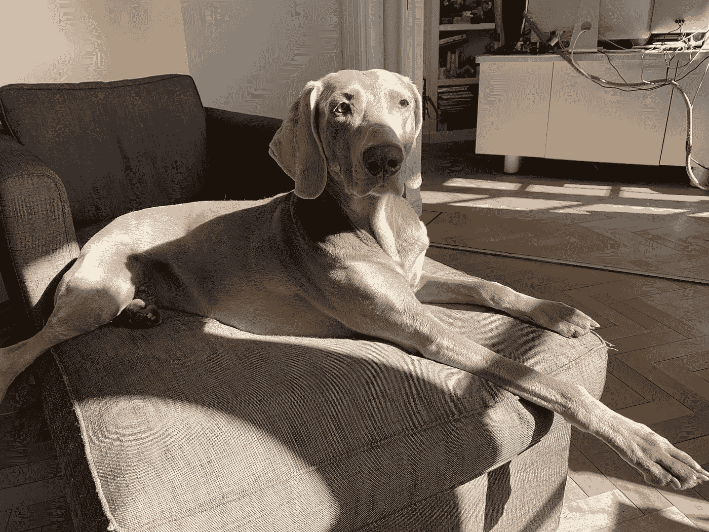

# 不确定时期一只狗的领导力课程

> 原文：<https://medium.datadriveninvestor.com/leadership-lessons-from-a-dog-in-uncertain-times-16d551d08146?source=collection_archive---------10----------------------->

## 我的魏玛猎犬“在家工作”时的管理技巧

“为什么看着一只狗变成一只狗会让一个人充满快乐？” —乔纳森·萨福兰·弗尔

在不确定的时候，在社交媒体上观看关于狗的视频可以放松。这有助于你忘记当前的危机。至少在短时间内。

是的，内容可以很傻很幼稚。但是我喜欢。在过去的几周里，我一定看了 500 个狗视频。

但是，有一个次流派我觉得特别讨厌。狗被装扮成人的视频。我不知道为什么，但是他们确实激怒我。

 [## 领导力。赢得|数据驱动型投资者需要更广阔的视角

### 不管他们愿不愿意，领导者都是快速运转的机器中的齿轮，这就要求他们夹住自己的爪子…

www.datadriveninvestor.com](https://www.datadriveninvestor.com/2020/02/07/leadership-it-takes-a-wider-perspective-to-win/) 

我们不应该强迫狗表现得像人一样。如果我们让狗成为狗，我们可以从狗身上学到很多东西*。在这里，我指的不是享受当下和真正快乐的能力。不，我说的是他们在危机时刻的“领导技能”。所以，让我来分享一下我的经历吧，我的狗是如何成为在家工作环境中的有效领导者的。*

# 狗的生活

狗和人类一直是绝配。人类和狗一起生活可以追溯到几千年前。狗让我们变得完整。他们可以协助狩猎。他们帮助农民放牧和看守牲畜。有他们在身边提供保护，我们的财产会更安全。他们可以向有需要的人提供必要的帮助。

随着时间的推移，我们与狗的关系不断发展和加深。狗已经成为男人和女人的“最好的朋友”陪伴。忠诚。诚实。无条件的爱。

实话实说吧。当一只“好莱坞”狗出事时，我们大多数人都发现很难忍住眼泪。由一只拉布拉多犬主演的《马利和我》入选了 2010 年的“[20 部让男人哭泣的电影](https://www.bbc.com/news/magazine-10814813)”名单。我仍然对动作惊悚片《我是传奇》中罗伯特·内维尔(威尔·史密斯饰)被迫杀死自己的狗(萨曼莎饰)感到不安。

我还发现，在电视上播出的许多真人秀节目中，狗的镜头是最令人愉快的部分。尽管我不是真人秀的狂热粉丝，但我对现场 PD 中的 K-9 和边境安全节目中的所有狗的出色工作深表敬意。我甚至看到一篇[文章](https://www.bbc.com/news/uk-england-tyne-52057543)说英国科学家正在研究是否可以训练狗识别冠状病毒。

当我和我的狗在一起时，我感到很舒服。稍息。姑且称之为禅时刻吧。她帮助我正确看待事物，减少对过去和未来的担忧，享受生活的简单美好。

当我下班回家的时候，狗已经在窗前等我了。她热情的问候给了我一股能量。陪她散步从来都不麻烦。太阳、雪或雨。和她出去总是很有趣。

我们的狗是一只雌性威马犬，名叫托巴。我们以一个日本城市的名字给她命名。我们在蜜月期间参观了这个城镇。2009 年 12 月，当她还是一只小狗的时候，我们把她抱了起来。我永远不会忘记我妻子和我如何度过圣诞节，训练我们的新小狗。此外，我们忙得不可开交，要确保我们的家具能经受住新家庭成员的到来。

我喜欢多巴，但我认为“在家工作”和富有成效的日子已经结束了。她非常容易分心。你不能忽视她。不会吧。她想成为关注的焦点。

我妻子对和她一起去服从学校寄予厚望。我只加入了他们几次。我再也看不下去了。假设我们有混合的结果。最终我们得出结论，还是让我们的狗当狗比较好。

十多年后的今天，我们在这里。我们的狗已经成为我们家不可或缺的一部分。

最近，很多事情在很短的时间内发生了变化。世界还会和以前一样吗？我现在已经是在家工作的第三周了。有一点没有改变，我们的狗仍然像小狗一样。她不仅仅是我们最好的朋友。令人惊讶的是，她没有阻止我工作。相反，她确保我在困难时期尽可能地高效。

# 我们的狗和领导力

但是，最重要的是，我钦佩和欣赏多巴的领导才能。她已经迅速发展成为你在不确定时期需要的领袖。

**协调员。在家工作时，很难管理时间。但是我们的狗帮助我们的生活变得有条理。她强迫我们有一个时间表。早点醒来。穿好衣服。站起来(不要整天坐着)，定期休息。我们的狗让我工作几个小时，但它明白结构化的工作方式可以提高我的注意力和效率。她明白工作日就是要保持平衡。**

**Inspirator。**我们的狗也很鼓舞人心。她让我振作精神，帮我制定锻炼计划。她有一个内置闹钟，可以帮助你做运动，出去跑步或散步。但是远不止如此。她知道和她一起玩能让你保持新鲜感和创造力。她好奇的头脑鼓励你也要有创造力。她的乐观和热情提醒我，问题总有解决的办法。

**通信员。**她是一个优秀的沟通者，不需要很多话。你很清楚别人对你的期望(只要看着她)。而且这里我说的不仅仅是她自己的需求和欲望(吃、睡、走、玩、重复)。她也是一个出色的倾听者。当你感到沮丧时(在冗长乏味的电话会议或视频电话后)，你可以让你的沮丧随风而去。她会听的。我甚至觉得她对正在发生的事情有很好的感觉。她表现出真诚的情感，并提供一个可以依靠的“肩膀”。

**干扰物。**然后她就是一个干扰物。我知道这听起来很糟糕，但实际上在压力大的时候，这是一项伟大而必要的“领导”技能。三周后，一些人开始感到孤立。一天中也有几个时刻是缺乏动力的。当你再次被一些毁灭性的、可怕的消息通知时，你的工作根本没有任何意义。突然间，你正在做的事情变得不那么重要了。然后，我们的狗会立即介入，把事情放在正确的位置，减少压力，给我继续下去的能量。

**喜剧演员。一个好的领导者明白在危机时刻减轻压力是至关重要的。嗯，当我们需要开怀大笑时，我们的狗就在我们身边。她很有趣——当你在家工作时也是如此。每当我开电话会议或视频会议时，她都在你身边。而且她平时也不沉默。**

这听起来可能很奇怪，但是，特别是当在许多虚拟会议中提出具体的困难意见时，她开始吠叫，使讨论更加轻松。

# 狗&工作的未来

在过去的十年里，我们的工作方式发生了迅速的变化。传统的“办公室”消失了，取而代之的是开放的办公空间。现在，远程工作和在家工作正在成为新常态(在后冠状病毒时代，这不会立即消失)。

狗的角色也在演变。在未来的工作中，我们会看到更多的狗。在危机之前，已经有狗在工作场所变得更挑剔的例子了。我记得一家风险投资公司有一只狗作为“首席快乐官”。此外，“带你的狗去上班日”在我的公司非常成功。具有讽刺意味的是，在远程工作的数字化世界中，当狗在办公室时，大多数人都不想呆在家里。

我相信狗不仅仅给员工带来好处。它们也是商业领袖和经理们的灵感来源，他们必须确保公司在近期和长期的未来保持相关性。

想想吧。在危机时刻，我们需要真正的领导者。传统的战时领导人、“控制狂”和微观管理者并不能解决我们今天面临的问题。我们不需要发布具体命令的领导者，也不需要在寻找最佳解决方案的过程中给员工很大程度的自主权的领导者。我们需要一个不同类型的领导者。未来的领导力是关于激发企业家精神、创新和创造力的。这与“命令和控制”无关。

在过去的三周里，我们的狗向我展示了“情境驱动”领导方法的好处。未来的领导力是开放、透明和诚实的。它是关于激励企业家精神、创新和创造力的。它是关于建立一个工作环境，不断地正确看待事物，给你能量，并帮助你克服最具挑战性的问题。

我们可以从四条腿的朋友身上学到很多东西。