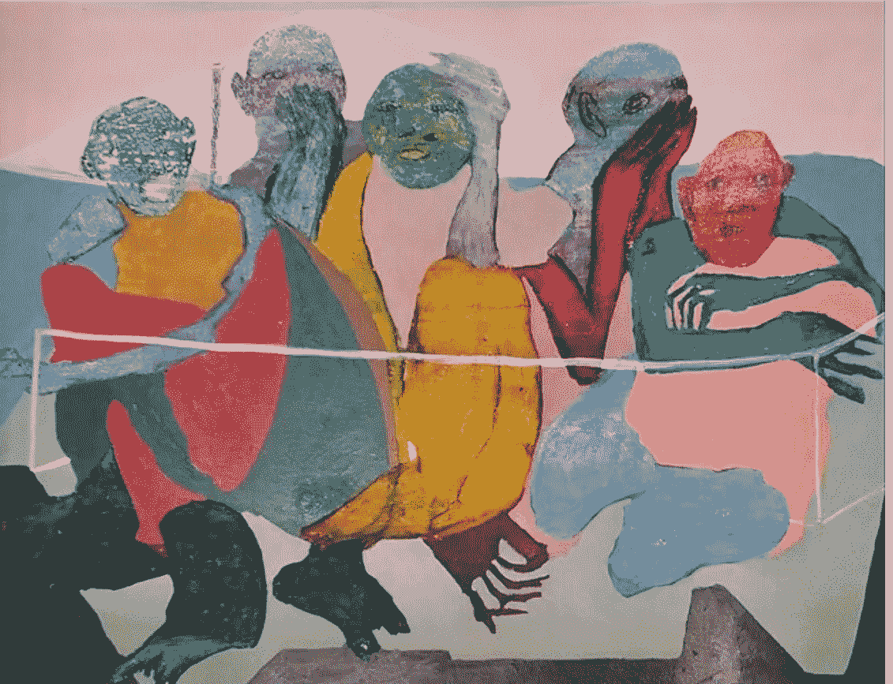

# 领导力还是法西斯主义——组织的虚构故事|数据驱动的投资者

> 原文：<https://medium.datadriveninvestor.com/leadership-or-fascism-the-fictional-story-of-organization-data-driven-investor-fbbe555c68fe?source=collection_archive---------17----------------------->

故事对于我们人类的生存非常重要，因为它们帮助我们找到生活的意义，帮助我们找到一种为共同目标而组织起来的方式。哈拉里在他的书《21 世纪的 21 课》中解释了故事是如何让我们在构建主体间虚拟现实时比其他物种更具优势的。这些主体间的现实可以给我们希望、勇气、牺牲的意愿和快乐，从而帮助我们在艰难时刻团结一致。故事可以有不同的类型；它们可以是宗教形式，也可以是政治形式，或者像我们在 21 世纪看到的那样，是商业形式。这篇文章的目的既不是破坏这些故事的真实性，也不是忽视它们在生活中的重要性。事实上，故事非常有用，没有它我们无法生存。然而，不管这些故事的重要性和他们的信徒对他们毋庸置疑的现实的信心，问题仍然是，一个故事应该被考虑到什么程度。这个故事是关于法西斯主义如何成为商业框架的一部分，尽管企业家们很乐意。

Artwork by Shahgol Safarzadeh

虽然法西斯主义一词有非常具体的政治定义，但法西斯主义的概念也可以应用于其他领域。“法西斯主义”一词的词根是意大利语 fascio，意思是捆，它基于一捆树枝很难折断的想法。正如牛津大学对其概念的定义"*法西斯主义倾向于包括对一个国家或种族群体至高无上的信仰，对民主的蔑视，坚持服从一个强有力的领导人，以及强烈的煽动方法*。因此，法西斯主义是关于对一个特定统治故事的强烈依恋，换句话说，相信一个人所属的群体是所有群体中的优等群体。这难道不是领导者在组织内部寻找的故事吗？企业家总是寻找那些对组织有着强烈归属感的员工，他们认为组织的荣耀是他们生活意义的源泉。这种对组织目标的态度确实激励并有助于面对挑战。但是，这并不意味着，拥有一个专注于他们的组织并拥有高度主人翁意识的团队是错误的。相反，在任何组织中，这都是强有力的领导的标志。当故事，这种非常有用的主体间的现实，强加给个人生活的其他方面时，问题就出现了。

就像任何主义一样，组织主义(我称之为相信你的组织)是一个对企业家和组织成员有益的故事。就像在艰难时刻给予安慰和平静的宗教故事一样，它给员工带来了希望，希望他们的组织最终会变得更好。它通过向员工提供他们自己的未来形象来支持他们，并激励他们奋斗和前进，以证明自己在竞争市场中的主导地位。但是像任何其他主义一样，当追随者面对个人问题和伦理困境时会发生什么？在招募新成员时，我有时会问的一个问题是，我让这个人想象一种情况，在这种情况下，员工的选择可能会终止整个公司，但符合他们的道德章程。我想知道的是，与他们对我的组织的故事的依恋相比，他们对自己的好或坏的感觉的坚持。从一个企业家的角度来看，我可能会发现知道我的队友将组织目标置于他们所有的个人信仰之上对我来说至关重要，尽管我确实一直提醒自己，组织本身只是一个故事。组织是主体间的虚拟现实，没有成员就不存在，即使成员离开组织也存在。它们存在于法律文件中，但在这种媒介之外，它们只是在其成员和客户的头脑中形成的一种身份。

> *从一个企业家的角度来看，我可能会发现，让我的队友将组织目标置于个人信仰之上对我来说至关重要，尽管我确实一直提醒自己，组织本身只是一个故事。*

每天我们都在新闻中听到一些宗教恐怖分子袭击并杀害了自己和他人，或者我们看到国家之间的战争。他们中的哪一个不是以上帝和国家的荣耀的名义做的？那些被我们发现和/或创造、接受的故事，原本是为了让我们的生活更平静、更快乐、更有价值，结果却让生活变得更混乱、更危险、更没有价值。发生这种情况是因为忽略了一点，即这些故事，无论其真实性如何，都不会凌驾于人类唯一的客观现实之上。但是现实是什么呢？

哈拉里在他的书的最后一章提出，人类的痛苦，而不是团体、组织、国家等等。，而是人类自身，是唯一存在的客观现实。人的苦难存在于所有故事和小说之外。事实上，降低这种痛苦是故事的原因。正是缺乏资源和自然竞争对手和敌人的痛苦迫使智人形成部落，然后他们的突然突变导致他们发展了认知能力，为更大的有组织的团队创造和分享这些小说。虽然对于人类历史的绝大部分来说，这些小说并没有减少人类的痛苦，反而给自然、其他物种，甚至是智人自己带来了更多的痛苦，但很明显，相信故事会加剧人类的痛苦并不是他们的本意。回顾 21 世纪的人类历史，我们目前的意识和智慧应该给我们带来更美好未来的愿景；一个尊重故事的未来，接受人类改编这些小说的自由，同时总是提醒他们有更好的理由，即提高生活质量和减少痛苦。

> 回顾 21 世纪的人类历史，我们目前的意识和智慧应该给我们带来更美好未来的愿景

作为一名企业家，这在伦理上和精神上都很重要，要注意的是，将这些故事作为领导工具应该总是被限制在一定的水平上。即使员工希望放弃自己的健康和幸福来实现组织目标，精神领袖也必须意识到这个故事的错误意图，并防止造成伤害。精神企业家是关于理解商业实践可能是我们生活意义的来源，而不是商业产出和成就。正是人与人之间的关系、员工和客户的幸福以及减少痛苦带来的巨大快乐，使企业变得有意义和有灵性。故事是领导和组织的强有力的有用的手段，虽然唯一真实的故事是真实的血肉之躯聚集在一起形成一个虚构的身份称为组织的优先权。

Hamed 毕业于石油技术大学工程学士学位和亚太国际学院项目管理工商管理硕士学位，在石油和天然气行业拥有超过 15 年的经验。在过去的 7 年里，他一直活跃在创业领域。除了工作经验之外，他对研究哲学和人文科学的兴趣使他专注于企业家精神的哲学方面。他现在正在研究和实践，以确定一个精神企业家的框架。

*原载于 2020 年 11 月 5 日*[*【https://www.datadriveninvestor.com】*](https://www.datadriveninvestor.com/2020/11/05/leadership-or-fascism-the-fictional-story-of-organization/)*。*