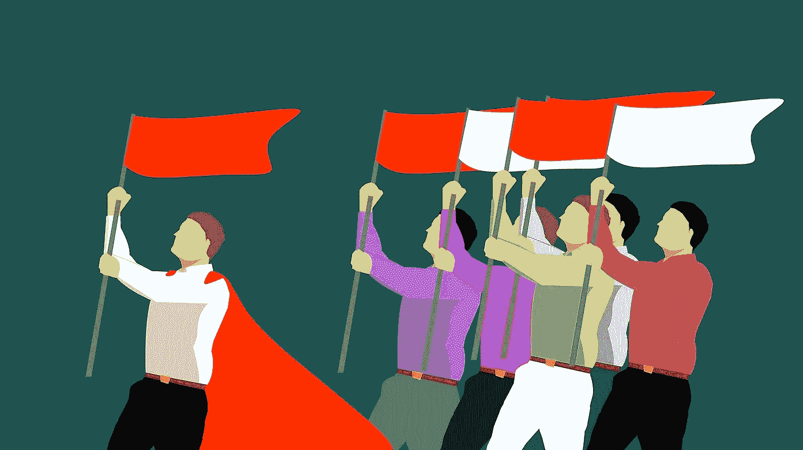
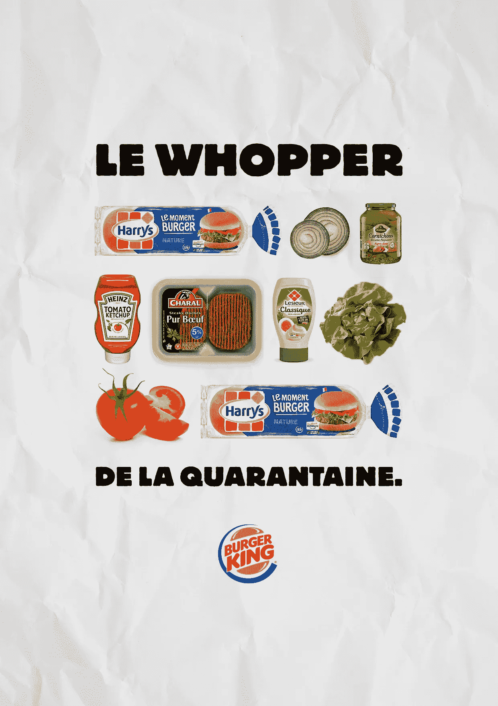
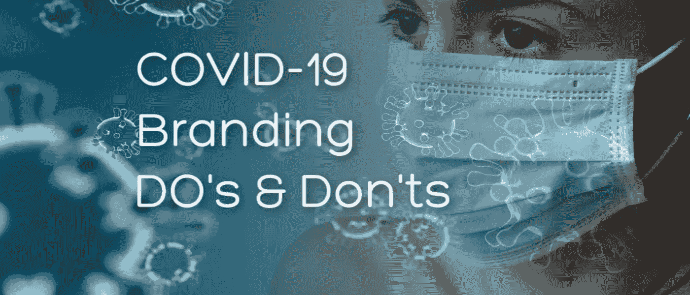

# 在危机时刻领先——你是赢得了品牌战还是输掉了品牌战？

> 原文：<https://medium.datadriveninvestor.com/leading-in-time-of-crisis-are-you-winning-or-losing-the-brand-battle-421e2b03cf89?source=collection_archive---------3----------------------->

## 该做的，不该做的，成功的和失败的——当谈到品牌营销时，我们处于未知的水域

Do’s, Don’ts, Hits and Misses for Brands During the COVID-19 Pandemic Image by [mohamed Hassan](https://pixabay.com/users/mohamed_hassan-5229782/?utm_source=link-attribution&utm_medium=referral&utm_campaign=image&utm_content=3580742) from [Pixabay](https://pixabay.com/?utm_source=link-attribution&utm_medium=referral&utm_campaign=image&utm_content=3580742)

事情变化得多快。说世界有点混乱是一种保守的说法。新冠肺炎疫情已经引爆了，我们离看到整体崩溃还有几个月甚至几年的时间。我们已经从为全面的营销活动做好准备，以盛大的方式开始 2020 年，到仅仅几周之后就撤退到紧急生存模式。

全世界都在看！现在和不久的将来，品牌和品牌领导者如何应对将对消费者和员工产生持久的影响。

在新冠肺炎之前，强调公司的社会目的和影响的目的驱动营销已经非常成熟，并且是许多成功品牌战略的关键组成部分。这是企业与消费者及其员工(尤其是千禧一代和年轻一代)建立忠诚联系的关键区别和方式。一个伟大的计划，因为越来越多的消费者认为世界是一个社区，必须互相照顾，并向世界展示你的公司关心。然而，这些运动可能并且确实会适得其反，尤其是在像当前冠状病毒疫情造成的危机时期。

Do’s and Don’ts and Hits and Misses for Brands During the COVID-19 Pandemic Image by [mohamed Hassan](https://pixabay.com/users/mohamed_hassan-5229782/?utm_source=link-attribution&utm_medium=referral&utm_campaign=image&utm_content=2821540) from [Pixabay](https://pixabay.com/?utm_source=link-attribution&utm_medium=referral&utm_campaign=image&utm_content=2821540)

我们仍处于新冠肺炎疫情的适应和分类阶段，在我看来，已经有一些成功和失败的案例:

**小姐:阿迪达斯**

> 阿迪达斯集团首席执行官卡斯帕·罗斯特德写道:“我们必须让公司继续运营，继续营业，以确保我们能够支付每个月的账单和工资。”“倒闭很容易；在健康的环境中保持开放需要勇气、坚持和专注。”

24 小时后，这个决定被推翻了。

**受打击:福特汽车公司**

福特汽车公司应对冠状病毒健康危机的“[造出援手”](https://media.ford.com/content/fordmedia/fna/ca/en/news/2020/03/21/ford-of-canada-_built-to-lend-a-hand-program-provides-assistance.html)计划是全球汽车制造商中最积极的计划之一。现有客户可以致电福特信贷，申请最长 90 天的付款延期，通过福特信贷融资的大多数 2019 年和 2020 年车型的合格新采购将获得最长 6 个月的付款减免；三个月延期付款，三个月由加拿大福特公司支付

**热播:汉堡王**

汉堡王很快改变了其在北美的营销，以解决已经实施的安全预防措施，如在所有车道的非接触式支付。

在法国，所有的汉堡王都关门了，他们发布了如何在家做巨无霸的指导。“检疫大汉堡”(Quarantine Whopper)、“T1”或“检疫大汉堡”(Le Whopper de la Quarantine)只需要 8 种配料，顺序如下:顶层小圆面包、洋葱、泡菜、番茄酱、牛肉馅饼、蛋黄酱、生菜和西红柿，然后是底层小圆面包。

Le Whopper de la Quarantine

**小姐——加拿大特许银行**

2020 年 3 月 18 日:加拿大银行家协会主席尼尔·帕门特(Neil Parmenter)通过推特宣布，加拿大所有主要银行将立即为受#COVID19 影响的人提供支持，包括抵押贷款延期支付 6 个月，以及其他信贷产品的减免机会。所有需要做的就是联系他们的银行。

2020 年 4 月 11 日:CBC 头条 ***大银行因向客户收取延期抵押贷款利息而受到抨击***

监督企业和政府道德的组织“民主观察”说，加拿大的金融机构需要采取更多行动来帮助受疫情重创的人们。

> “银行现在做得很少，”民主观察的联合创始人达夫·科纳彻说。"联邦政府现在应该要求他们做得更多."

潜在打击:在政府着手解决问题之前，第一个采取行动的主要银行。

**小姐:美国亿万富翁戴维·格芬**

格芬在 Instagram 上向他的 84000 多名粉丝发送了爱和良好的祝愿，称他希望他们“保持安全”迷人的信息，但当它从一艘价值 5.9 亿美元、454 英尺的豪华超级游艇上发出时，却变得五音不全。

热门人物:安大略省省长道格·福特

安格斯·里德研究所(Angus Reid Institute)最近公布的一项调查发现，安大略省 74%的受访者认为道格·福特(Doug Ford)总理的政府处理事情的方式很好，甚至受到了包括自由党副总理克里斯蒂娅·弗里兰(Chrystia Freeland)在内的各政治派别的赞扬。

福特的领导力被描述为直率、透明和富有同情心。在这个时期，他是少数几个相信对公众完全透明的领导人之一。他甚至在没有通知他的员工的情况下，跳上他的卡车去拿牙科品牌捐赠的 9 万个口罩。

## 冠状病毒疫情期间营销和品牌推广的注意事项

**做:保持人性。**

现在是时候把你的员工和顾客当作人类，而不是钱包或达到目的的手段。我们都知道口碑有多重要，员工、员工家属、现在的客户都有大扩音器。

尽管品牌每天都有影响力，但在这种时候，这种影响力可能会急剧减弱。在危机期间，人们需要人际关系，尤其是在我们被迫分开、失业、对许多人来说面临经济不确定性的情况下，这是几代人以来世界上从未见过的。顾客现在不是钱包；他们是正与你和你的家人一起经历一个全球现象的人，而不是你的品牌。

**DO:把员工及其家人的健康放在第一位。**

> 随着话题转移到人们何时可以重返工作岗位，亿万富翁企业家马克·库班警告公司不要在这段时间让员工过早返回工作岗位。库班在美国消费者新闻与商业频道的“动荡的市场”特别节目中说:“这不仅是一个安全问题，也是一个商业问题。”。
> 
> “公司如何回答这个问题将决定他们未来几十年的品牌。如果你冲进去，有人生病了，你就是那个公司。如果你没有照顾好你的员工或利益相关者，把他们放在第一位，你就是那个公司，”他补充道。

做:说心里话。

告诉他们你理解这是一个困难的时刻，我们都在一起，你希望每个人都能安全度过。谈论你的组织采取了什么行动来保证每个人的安全。

传达关于如何最好地与公司互动的重要信息，以及对你和公司未来的期望。重申公司的核心价值观，并再次保证你会继续忠实地贯彻这些价值观。

虽然这可能看起来违背直觉，但不要回避分享里程碑。我们不仅都渴望好消息，而且它还传达了一种坚定和希望的感觉——一种一切都会好起来，事情会在适当的时候恢复正常的感觉。只是要注意在这些时候适当地分享信息。

**做:改变你的品牌信息。**

根据你销售的产品或服务，你可能需要改变你的信息。无论是将包含社交互动的广告内容改变为更类似于我们的现状，还是将标题从硬销售调整为软销售，你都需要确保你的信息与当前发生的事情产生共鸣。

**做:坦诚沟通。**

您目前的运营方式，您为确保安全所做的调整，以及您在此期间将继续提供高水平的客户服务。现在，让客户知道如何与你互动是非常重要的。这是一个很好的时机，确保你在社交媒体和其他客户服务渠道上倾听和回应信息。在那里。有空。

不要:对已经存在的合格潜在客户咄咄逼人。

你必须假设你试图联系的每个人都受到了疫情冠状病毒的严重影响，并像你一样处于分流模式。首先交流你公司的反应和应急方案——你如何照顾你的员工，确保安全等。在这段时间里，围绕你能提供什么帮助进行沟通。根据未来会发生什么，可能会有机会举办一次虚拟的咖啡或午餐，邀请潜在的潜在客户。

**不要:强行推销。**

今天，我收到了一个直接消息，关于一个热水浴缸的交易。不要这样。对于大多数人来说，奢侈品和大件商品将会被推迟。如果你销售的是一种奢侈品，或者是一种没有解决当前危机的产品，那么现在不是进行激进销售活动的时候。关注现有客户和员工，确保他们拥有度过这场危机所需的一切。

不要推。通过社交媒体渠道保持联系，乐于助人、体贴真诚。

**做:考虑赞助内容。**

如果你有一个产品解决方案可以在当前时代提供帮助，并且你有很好的讲故事内容，那么就考虑在社交媒体渠道上开展付费活动，将故事呈现在正确的人面前。

如果你的产品或解决方案有一个学习曲线，或者它还不是主流，现在是通过内容教育潜在客户的好时机。现在是在你的唱诗班之外布道的好时机。

**做:专注于视频。**

随着消费者花更多的时间在家里的电脑屏幕前，视频营销比以往任何时候都有更大的影响。无论是 Youtube 上的五秒钟广告，一个伟大的 DIY，还是一个关于你的产品或服务如何在这个时候大有用处的视频教程，好好看看你的视频策略，看看它在哪里可以被放大。只要记得在这段时间专注于服务。

**做:回顾你的数字营销策略**。

尽管销售额下降，你的本能可能是削减你的数字营销预算，反之亦然。现在是加强你的搜索引擎优化，清理网站技术错误，更新 CTA 和利用分析的好时机。这种情况将会结束，你会希望你的数字战略准备就绪。

**Do:加速您的企业数字化转型。**

这场危机创造了近年来最重要的业务转型需求。在新冠肺炎之前，一切都已经转向数字化和虚拟化。这场全球危机加速了它的普及。

二十年前，在家工作的想法几乎闻所未闻，大多数专业人士更喜欢传统的面对面模式。这一切都变了。转向由人工智能和机器学习支持的基于云的数字系统，可以解决网络安全、数据管理需求，并增强远程团队协作。

数字化转型的风险很高。那些实施最新下一代技术的企业可以获得巨大的竞争优势。

**不要:完全停止营销**

现在不是停止营销努力的时候；现在是时候改变你广告/营销的地点和方式了。现在有一个机会让你的信息出现在正确的人面前。如果你正在考虑基于账户的营销，瞄准 Linkedin、Reddit 和/或其他社交渠道上的个人账户，这些账户有关于你如何成为我们当前环境的完美解决方案的强化内容。如果你可以通过精心制作的故事来提供希望、教育、一线希望、解决方法或理想的远程工具，那么就通过社交媒体渠道来推广它。

**做:支持你的团队。**

现在比以往任何时候都更重要的是，通过提供激励性的领导、同理心和清晰的方向来支持你的员工，让他们知道你如何团结每个人成为一个团队，带领公司渡过前面的难关。表现出你愿意适应你的团队和他们富有挑战性的环境，并且你会支持他们。

**金融服务高级顾问& Fintech 高管** [**克里斯·怀特**](https://www.linkedin.com/in/christopherwhyte1/) **创始人兼总裁** [**美国弗雷斯通集团公司**](https://www.freestonegroup.ca/)

我采访了弗雷斯通集团公司创始人兼总裁、金融服务和金融科技高管克里斯·怀特，他就如何抓住增长、运营效率、客户参与和数字化转型的机会向公司提供咨询，以下是他的建议:

1.  **专注** —这总是很重要，但在充满挑战的时代尤为重要，对一些公司来说也很难做到。围绕什么对你的业务至关重要进行艰难的讨论，消除所有不重要的努力和支出。
2.  节约——这将是一场马拉松，而不是短跑。你越早控制成本，消除不必要的支出，你就越有“持久力”来度过难关。了解你的优先事项，消除不重要的开支会为你赢得更多的时间(见上面的关注点)
3.  **沟通—** 现在，你比以往任何时候都更应该与所有利益相关者沟通——你的董事会、管理层、团队成员和客户。沟通应该清晰、透明、以行动为导向(例如，我们在做什么，而不仅仅是说)并且实用。
4.  **管理期望和抱负—** 这种情况不会很快消失。抑制你的长期和更大的野心(大的销售和营销活动等),因为当市场处理这些问题时，它们不会落在沃土上。认识到一切都需要更长的时间，大多数公司已经改变和/或有了新的优先事项。
5.  **寻找机会—** 一切都被打乱了，混乱中蕴藏着机会。这是否为你的产品开辟了新的市场或新的应用？你能利用这段时间来完善你的战略、改进你的价值主张或改进你的产品吗？

正如克里斯在上面提到的，混乱中蕴含着机遇。战略性地思考和执行是我们在当前经历的混乱中生存下来的关键。

奥黛丽·奈斯比特

Linkedin 上的奥黛丽·奈斯比特

[@ audreynesbit 11 在推特上](https://twitter.com/AudreyNesbitt11)

[螺旋营销&公关](http://www.spinspirational.com/)