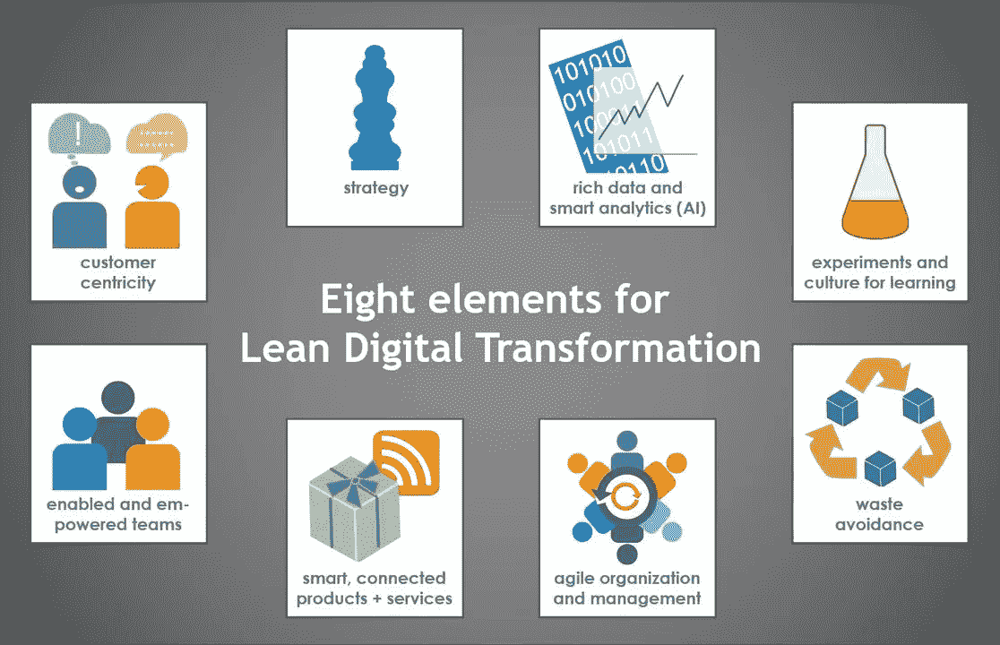
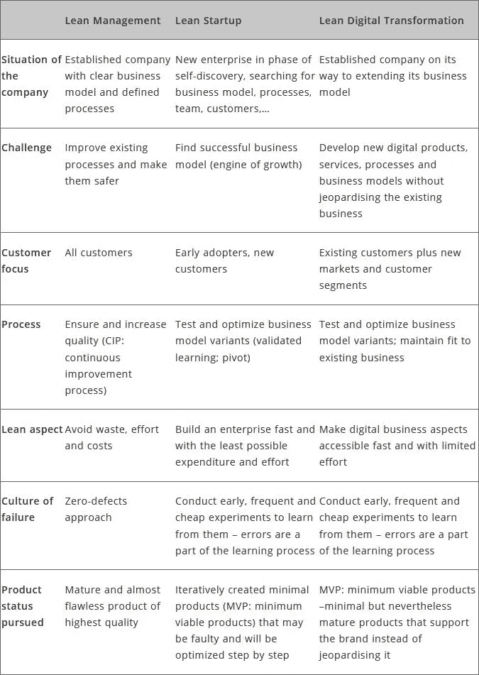

# 精益数字转换

> 原文：<https://medium.datadriveninvestor.com/lean-digitital-transformation-1f7175bf31c0?source=collection_archive---------13----------------------->

# 实现业务转型的精益安全的方法

Image: © [Uwe Weinreich](https://uwe-weinreich.medium.com/), License: [CC BY-SA 4.0](https://creativecommons.org/licenses/by-sa/4.0/)

精益管理的原则似乎可以应用到数字化项目中。唯一的问题是，他们不会孤立地工作。精益管理是在这样一种环境中发展起来的，在这种环境中，定义明确的流程被不断优化，以达到越来越高的标准。[精益六西格玛方法](https://en.wikipedia.org/wiki/Lean_Six_Sigma)将这一概念提升到了最高水平。统计方法有助于提高标准化，并将错误率降低到几乎为零。

数字化转型也是一个过程。但是相比之下，它的目标不是产生明确的结果。目的是转变商业模式。新的领域将被打破。所有这些都需要对不可预见的结果持开放态度，如果没有探索性的行动、错误和对失败的容忍，这是不可能的。这种探索性的程序可以由世界各地的初创公司开发和部署的方法来支持，无论是在加利福尼亚、伦敦、特拉维夫还是柏林。在这些方法中存在一种精益方法，即 [Eric Ries](https://medium.com/@ericries) 在 2011 年提出的[精益创业](https://en.wikipedia.org/wiki/Lean_startup)概念。它非常务实，基于初创公司寻找合适的商业模式和增长战略的经验。

精益创业提供了巨大的优势。除了避免浪费的精益管理原则之外，它最大的优势当然是创新过程是可以衡量的，因此也是可以控制的。

然而，精益创业并不总是符合努力实现数字化转型的公司的需求。精益创业要求在寻找商业模式、用测试产品和真实客户进行实验时，有充分的行动自由。如果用错了方法或用错了地方，这两者都会对一家成熟的公司不利。不完整和有缺陷的产品会很快损害一家以最高质量和可靠性著称的公司的形象。此外，不符合品牌整体本质的产品会削弱其形象。

经典精益管理和敏捷精益创业这两种方法的结合有助于使数字化成为一个安全、节约资源和成功的过程。精益数字化转型将更易于管理，并为探索提供足够的自由。下表显示了三种方法的本质区别和相似之处:精益管理、精益创业和精益数字化转型。

Image: © [Uwe Weinreich](https://uwe-weinreich.medium.com/), License: [CC BY-SA 4.0](https://creativecommons.org/licenses/by-sa/4.0/)

## 如何让企业实现精益数字化转型？

要想成功，至少需要实现 8 个要素。

**1。以用户和客户为中心**

旧的原则同样适用于新技术:任何不符合用户和客户需求的解决方案最终都会失败。幸运的是，像设计思维这样的方法提供了各种各样的工具来开发启发客户的解决方案。

**2。创建策略**

尝试像人工智能这样的新技术是好的，但公司迟早需要一个像样的战略来遵循，最好的情况是以用户和客户为中心。这导致了专注的活动和更高的成功概率。比以往任何时候都更需要对技术有深入的了解，以制定适当的策略。[阅读有关精益数字化转型战略的更多信息……](https://medium.com/coobeya/5-strategic-options-for-successful-lean-digital-transformation-of-business-dbdc50212c0d)

**3。关注丰富的数据和智能分析工具**

数据第一。许多公司已经拥有大量数据——通常是未使用的——或者收集相关数据并不复杂。数据科学家可以帮助建立一组丰富的相关数据(数据仓库、数据湖或类似数据)。不应该低估数据准备的努力。这可能是一个真正的挑战。

一旦数据可用，就可以应用分析。人工智能(AI)目前风靡一时，它可以产生惊人的见解，但它不是唯一有用的技术。数据分析师知道哪一个最适合数据质量和知识需求。

**4。建立一种学习和实验的文化**

不可能从一开始就有完美的产品、服务和战略。与其从头到尾规划数字化转型，不如循序渐进地铺平道路，这样更好、更便宜、风险更低。测试你最重要的假设。设计商业实验并从其结果中学习。[点击此处了解更多信息和免费工具……](https://coobeya.net/en/services/lean-startup/)

**5。避免浪费**

一个反复的过程导致浪费最小化。当公司不再坚持一个已经被证明是错误的项目计划时，他们可以轻松快速地调整他们的策略和产品。[在这里阅读如何建立这样的心态…](https://medium.com/coobeya/you-need-4-essential-mind-shifts-to-run-lean-and-avoid-waste-in-digitalization-projects-4561cd307082)

**6。向敏捷组织和管理转型**

我们谈论的是高度动态环境和市场中的复杂产品、服务和战略。事实证明，缺乏有效沟通的旧式层级组织不足以应对这一挑战。对于想要转变文化的公司来说，这可能是一个漫长而艰难的过程。然而，这不是不开始的好理由。

7 .**。创造智能、互联的产品和服务**

现在，我们已经到了许多公司起步的时候，有时会考虑其他公司。了解用户和客户需求、能够分析相关数据并转型为具有深厚学习文化的敏捷组织的公司，已经准备好创建数字化增强的产品和服务以及全新的数字化商业模式。[案例研究……](https://medium.com/datadriveninvestor/the-machine-tool-case-higher-efficiency-through-lean-digital-transformation-a90b60bd0976)

**8。为团队提供支持和授权**

如何开始？迈向敏捷组织的第一步是支持和授权团队。开始时，可能需要一个或多个主持人，这可能会大大降低工作效率，但最终会有回报。结果是高效、跨职能的自组织团队。目前，当企业不得不面对高度动态环境中的高度复杂性时，这是最佳的组织方式。