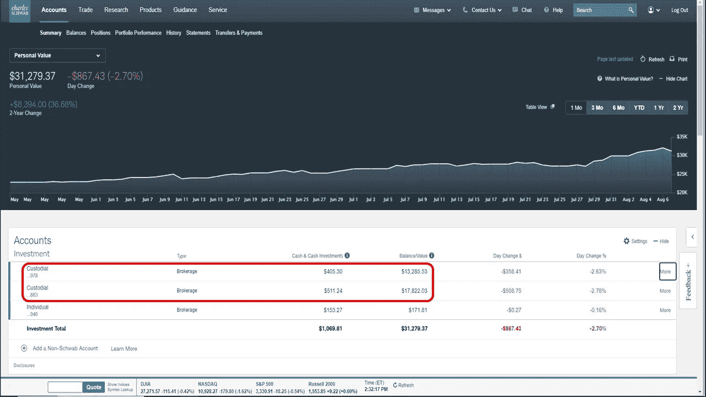

# 了解两个孩子的投资如何超过数百万美国人

> 原文：<https://medium.datadriveninvestor.com/learn-how-2-kids-have-more-invested-than-millions-of-americans-a49d31ff0733?source=collection_archive---------8----------------------->

## 遵循这些步骤，你也能做到

Image by Florentine Buckingham on Pixabay

几年前，我决定为我的两个孩子开一个经纪账户。如今，他们每个人的账户都超过了 10，000 美元，而他们甚至还没有开始上高中。

我不是在吹牛或自夸，而是向你展示什么是可能的，以及我是如何做到的。没有什么魔术。没人给我的孩子遗产。没有人中彩票。我没有因为宠坏他们而破产。我并不富有，但我仍然努力工作来维持生计。

十多年前，我的儿子，两个孩子中最大的一个，非常喜欢海绵宝宝，一种生活在海底的会说话的小海绵。这个电视节目在尼克国际频道播出。我儿子那时大约两岁或三岁。实际上，我妻子不得不给他买一张海绵宝宝的 DVD，因为每次节目结束，他都会哭。

 [## 现在去哪里投资？数据驱动的投资者

### 当今时代充满了不确定性。这也适用于投资领域。大部分份额…

www.datadriveninvestor.com](https://www.datadriveninvestor.com/2020/08/18/where-to-invest-right-now/) 

然后我就在想，海绵宝宝是谁做的？我知道这个节目已经在电视上播出了，但是 Nickelodeon 没有股票代码。所以我搜索了海绵宝宝是谁做的。我发现维亚康姆拥有播放《海绵宝宝》的 Nickelodeon。

我儿子有一点生日礼物，所以我想我应该投资股票。我买的时候，这只股票的价格在 29 美元左右，后来涨到了 80 美元。股票价格最终暴跌，我以低于我支付的价格卖出，以避免缴税。我还看到新闻说，维亚康姆在与其他渠道竞争时遇到了困难，所以认为这是出售的好时机。

当我第一次购买股票时，它存在我在 USAA 的个人股票经纪账户中。我在 USAA 呆了一段时间，不确定是否要在其他平台开设经纪账户，因为它们太新了。

# 开立托管账户

过了一段时间，我不想让我儿子的股票和我的股票混在一起，所以我打电话给银行，问他们是否有儿童股票账户。他们有托管账户，我是账户的主要所有人，但会代表我的儿子进行交易。所以我给他开了个账户。

几年后，我为女儿开了第二个账户。她也收到了我存进经纪账户的生日礼物。

## 买入更多股票

我的儿子继续收到生日礼物，我买了更多的股票。当时他还年轻，我买了他熟悉的股票。我儿子目前有 11 只股票。去年，他实际上要求两只股票作为他的圣诞礼物，这是他第一次选择的股票，特斯拉和福特。

如果你一直关注特斯拉，埃隆·马斯克的股票在过去几个月里大幅上涨。我的儿子做了一个很好的选择，因为他在正确的时间要求这样做，并看到了 400%的回报。

这是他账户中股票的快照:

> 美国航空公司(AAL)
> 
> 苹果公司(AAPL)
> 
> 英国石油公司
> 
> 福特汽车公司
> 
> 希尔顿大假期(HGV)
> 
> 希尔顿全球酒店
> 
> 公园酒店和度假村(PK)
> 
> 罗库
> 
> 特斯拉(TSLA)
> 
> 安德玛公司
> 
> 翼子板止动块(翼子板)

Image from Charles Schwab

## 第二个托管账户

我女儿的经纪账户有一些类似的股票，但有一些不同。

> 苹果公司(AAPL)
> 
> 希尔顿大假期(HGV)
> 
> 希尔顿酒店
> 
> 美泰(Mattel)
> 
> 微软(MSFT)
> 
> 公园酒店(PK)
> 
> 迪士尼
> 
> 翼子板止动块(翼子板)

我的孩子们所熟悉的大多数股票。他们坐过飞机，用过苹果产品，住过希尔顿酒店，吃过 Wingstop。

他们还拥有一些其他股票，但被其他公司收购了。当这种情况发生时，股票被卖出，然后他们的账户里就有现金了。他们之前持有的一些股票是沃伦·巴菲特购买的亨氏公司和出售给阿拉斯加航空公司的维珍美国航空公司。

## 在正确的时间购买股票

在这两个账户中，与账户中的投资额相比，它们都有了相当大的增长。这些投资都不是投机性或廉价股票。这些都是知名公司，有些你过去可能用过。

我知道我的孩子可能还要过几年才会动用这些账户，所以我有意识地做出了购买优质股票的决定。我不想冒险看着他们的投资在我买下后崩盘。当然，也有股票下跌的时候，比如今年许多股票下跌的时候。总体而言，投资组合表现良好。

唯一表现不佳的股票是马特尔和安德玛。两家公司都做得很差，但我很有耐心，等待这些公司出现转机，这样他们至少可以收支平衡。我不包括美国航空公司，希尔顿和公园酒店的股票，因为整个旅游和酒店业今年由于病毒而下跌。

# 尽早开始你的遗产

小时候没人教我股票或投资。我直到 23 岁才做了第一笔投资。

现在我有了孩子，我想给他们留下一份遗产，给他们一些东西，这样他们就可以在正确的轨道上开始他们的生活。

正如我在开始提到的，有许多美国人没有太多的投资。如今，人们的寿命越来越长，一想到他们将如何依靠社会保障生存下去就令人害怕。社保不是一份可以维持生活的工资。

如果可以，我鼓励你为你的孩子开一个经纪账户。这将是你留给孩子的一份伟大的礼物。留给你的孩子一些东西总比什么都没有好。

你想过给你的孩子留下一份礼物来记住你吗？

 [## 你需要知道如何蔻驰你的孩子，使数百万

### 我儿子想成为下一只山羊。

medium.com](https://medium.com/the-ascent/you-need-to-know-how-to-coach-your-kid-to-make-millions-9a0fc886567e)  [## 创造百万美元遗产:你需要知道的一切

### 它比你想象的要便宜。

medium.com](https://medium.com/2-minute-madness/creating-a-million-dollar-legacy-everything-you-need-to-know-4ddfedf6bd82) 

[**汤姆·汉迪**](https://medium.com/@tomhandy1) 是一位顶尖的写作、金融、投资和比特币作家，也是两个孩子的父亲。他从军队退役，并在几个非营利委员会任职。你可以在推特 [@tomhandy1](http://www.twitter.com/tomhandy1) 上找到他。

**访问专家视图—** [**订阅 DDI 英特尔**](https://datadriveninvestor.com/ddi-intel)