# 了解阿里云高性能计算如何帮助新冠肺炎开发药物治疗

> 原文：<https://medium.datadriveninvestor.com/learn-how-alibaba-cloud-hpc-is-helping-the-race-towards-developing-a-drug-treatment-for-covid-19-62df6753b360?source=collection_archive---------22----------------------->

为了赢得这场不可避免的战斗，抗击新冠肺炎，我们必须携手合作，并在世界各地分享我们的经验。通过全球医疗交易所抗击新冠肺炎(GMCC)计划，加入我们抗击疫情的行列。现在申请[*【https://covid-19.alibabacloud.com/】*](https://covid-19.alibabacloud.com/?spm=a2c41.14244617.0.0)

*作者:孙，在阿里巴巴的昵称是。*

作为全球抗击新型冠状病毒疾病(新冠肺炎)努力的一部分，阿里云在全球健康药物发现研究所开放共享平台的建设中提供了相关技术，用于研究生产将拯救无数生命的药物和治疗方法。这些技术包括高性能计算(HPC)——我们今天将讨论的技术——以及超级计算集群、CPU 和 GPU 主机、云超级计算和人工智能(AI)。

研究机构和大学可以将其与药物和治疗开发相关的计算系统迁移到阿里云的[弹性高性能计算](https://www.alibabacloud.com/product/ehpc?spm=a2c41.14244617.0.0) (E-HPC)解决方案。为此，阿里云的相关团队夜以继日地为这些机构提供技术支持和帮助以及后续服务。

在本文中，我们将了解 E-HPC 如何帮助研究人员在研究的候选药物筛选阶段快速处理大规模小分子文库。我们还将了解阿里云为[全球健康药物发现研究所](https://www.gatesfoundation.org/Where-We-Work/China-Office/Promoting-Chinese-Innovation/Global-Health-Drug-Discovery-Institute?spm=a2c41.14244617.0.0) (GHDDI)提供的计算解决方案及其开放的结果共享平台，该平台旨在帮助加快研究速度，以便一线医疗团队可以挽救更多生命。

 [## 冠状病毒；惊慌失措；字里行间的 z |数据驱动的投资者

### 围绕冠状病毒的话题；更准确地说，新冠肺炎几乎占据了整个新闻预报的头条…

www.datadriveninvestor.com](https://www.datadriveninvestor.com/2020/03/23/coronavirus-a-to-panic-z-between-the-lines/) 

# 病毒和治疗研究及其与 HPC 的关系

药物开发周期非常长，通常从研究的初始阶段到药物上市并提供给公众至少需要 10 年时间。

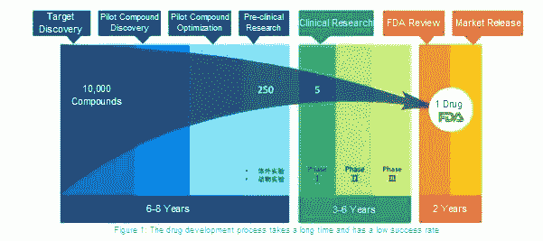

然而，在应对流行病时，时间至关重要，因为世界的健康和安全面临风险。因此，科学家需要迅速发现药物疗法，以拯救生命。做到这一点的一个方法是回顾现有的有希望治疗流行病的药物。通过使用现有的药物疗法，科学家可以省略开发新药通常涉及的几个步骤。

在过去，为了发现有前景的化合物，研究人员需要进行大量的实验。然而，通过使用机器来模拟分子化合物和目标之间的相互作用，科学家可以快速确定潜在的有效化合物，加快寻找有希望的线索的过程。

高性能计算(HPC)通常也称为超级计算，是这类研究的重要工具。此外，云计算和高性能计算的兴起，以及其他技术和进步，在许多方面从根本上改变了科学家获得计算能力和使用超级计算服务的方式。例如，阿里云的 E-HPC 云超级计算产品允许科学家在云中构建自己的高性能集群系统，使他们能够快速轻松地构建自己想要的计算平台。

云中有大量的计算能力，并且可以灵活地分配这些计算能力。科学家可以按需购买计算资源，因此他们不再需要担心有限的计算能力可能会成为他们研究新药物疗法的障碍。

然而，您可能仍然想知道，HPC 与病毒和药物研究到底有什么关系？为了回答这个问题，我们将简要了解病毒如何在宿主中复制和传播，如何使用药物来抑制病毒的复制能力，最后我们将讨论 HPC 在药物研发中的作用。

# 病毒及相关药物研究简介

病毒由无功能的核酸分子组成，特别是 DNA 或 RNA，它们被蛋白质包被。为了说明这一点，考虑下面的烟草花叶病毒的图表，这是一种通常感染烟草植物的病毒。

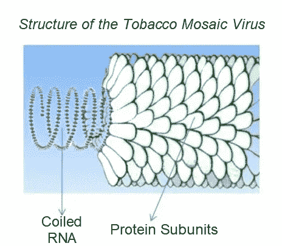

病毒种群不能通过细胞分裂生长，因为它们是非细胞化合物。相反，它们利用宿主细胞的机制和新陈代谢进行复制。

特别是冠状病毒，它是一个正义单链 RNA 病毒家族，具有布满棒状突起的脂质包膜。该病毒家族可在呼吸道、肠道、肝脏和神经系统中引起不同严重程度的疾病。在发现这种新的冠状病毒(正式名称为新型冠状病毒)之前，在过去的 12 年里，人们发现了另外两种冠状病毒，即严重急性呼吸综合征(SARS-CoV)和中东呼吸综合征(MERS-CoV)。下面是新型冠状病毒的插图。

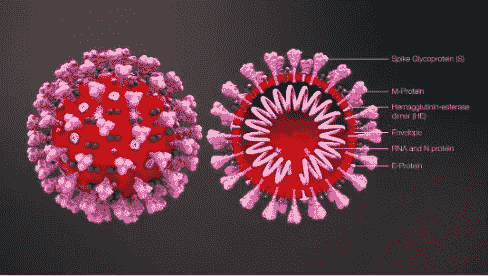

现在，我们来详细讨论一下病毒的复制过程。在病毒颗粒或病毒粒子从病毒进入宿主细胞后，病毒 RNA 被复制，病毒蛋白被合成。然后，RNA 和蛋白质组装成多个新的病毒体。下图是病毒蛋白质分子结构的图解。

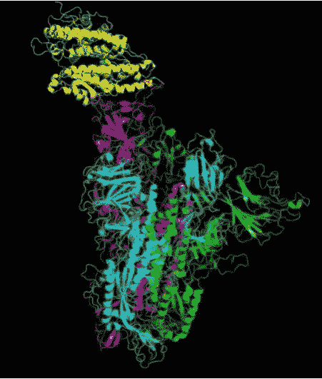

病毒复制过程的简图也如下所示。

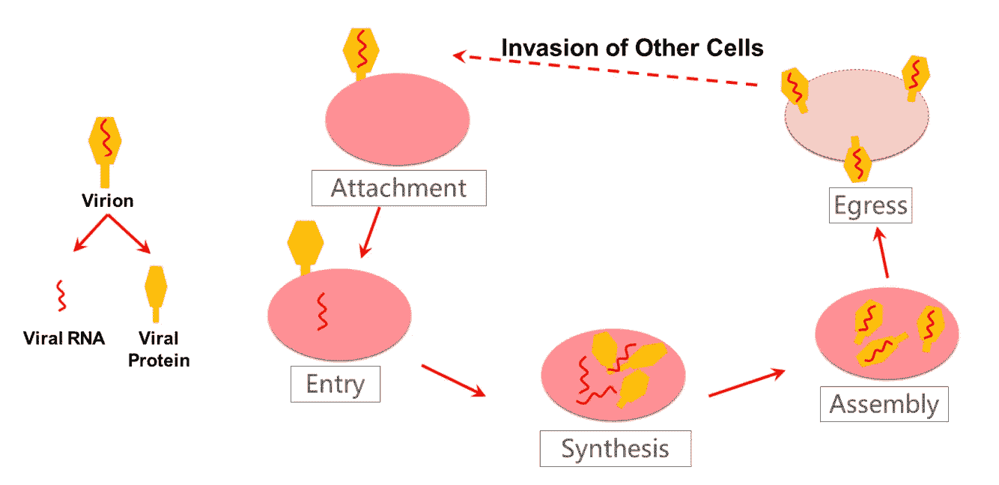

药物可以用来干扰或抑制病毒的复制过程，从而有效地防止对身体的损害。例如，在病毒蛋白质的合成过程中，蛋白酶的干预，如 3CL 蛋白酶和 ProPL 蛋白酶，可以抑制蛋白酶的功能。这是抑制病毒的一种方法。其他物质，如配体或药物治疗，可以识别或结合蛋白酶。这个过程被称为生物靶向。配体是一种小分子药物，可以与病毒蛋白酶的靶标结合，进而改变蛋白酶的三维结构，改变其功能，抑制病毒蛋白合成，从而阻止病毒复制。

# 药物开发及其与 HPC 的关系

药物开发是一个非常复杂和耗时的过程，候选药物筛选只是这个漫长过程中的早期阶段之一。在寻找能够与病毒蛋白酶结构结合的小分子的过程中，有大量由不同研究机构创建的配体库，这些配体库包含了海量的数据。每个文库包含数千个配体。不可能及时地逐一测试它们。然而，通过计算机数值模拟，我们可以对不同配体的结合性能进行评分，并测试最有希望作为候选药物的配体，有效加速药物开发进程。

由于配体库的大量数据，在有限的时间内筛选有希望的配体是极其困难的。例如，如果配体库有 10，000 个候选配体，每个候选配体的平均处理时间为 1.5 小时，则处理整个库需要大约 15，000 小时(或 625 天，差不多 2 年的时间)。因此，要在指定时间内完成计算，必须满足以下条件:

*   具有强大计算能力的计算平台是可用的。
*   大容量存储可用于存储处理数据和计算结果。

为了确保有效和顺利的候选人筛选，还需要一些计算服务，例如:

*   群集软件运行时环境，以确保多主机环境中的软件运行和数据访问。
*   一种在多主机环境中支持多任务并发处理的并发计算解决方案。

除了计算平台，候选药物筛选还需要相对高性能的应用软件。模拟候选药物筛选计算包括对接和分子动力学计算。停靠需要相对较少的时间，并且通常用于大量配体的初步筛选。流行的对接软件包括 DOCK6、Autodock Vina 和 Glide。分子动力学模拟计算非常耗时，并且测试所需的时间可能会有所不同。该过程用于进一步分析对接过程中选择的潜在候选者。流行的分子动力学软件程序包括 Gromacs、Namd 和 Amber。在这个过程中，通用 GPU(gpcgpu)可以提供显著的加速水平。

# E-HPC 高通量药物筛选解决方案

云计算可以作为药物研究机构获得构建强大的高性能集群所需的计算资源和服务的手段。作为 tis 解决方案的一部分，阿里云提供了几个产品和服务，是药物研发的有力工具。除了弹性高性能计算(E-HPC)，阿里云还提供基于集群的文件共享系统，如[附网存储](https://www.alibabacloud.com/product/nas?spm=a2c41.14244617.0.0) (NAS)和[云并行文件系统](https://www.alibabacloud.com/help/doc-detail/111755.html?spm=a2c41.14244617.0.0) (CPFS)，以及几个数据库管理系统，可以与 E-HPC 结合使用。阿里云 E-HPC 本身可以让用户在云端快速开发自己的高性能集群系统。然后，可以使用其他产品来配置要连接到这些系统的高性能服务器和大容量存储。该产品还提供多节点软件运行时和高吞吐量任务处理解决方案。换句话说，E-HPC 可以满足全球药物研究人员和开发人员的计算平台需求。

# E-HPC 云超级计算

阿里云 E-HPC 云超级计算产品是云原生高性能计算集群解决方案。E-HPC 集成了多个阿里云产品，包括:

*   阿里云[弹性计算服务](https://www.alibabacloud.com/product/ecs?spm=a2c41.14244617.0.0) (ECS)、[弹性 GPU 服务](https://www.alibabacloud.com/product/gpu?spm=a2c41.14244617.0.0) (EGS)、 [ECS 裸机实例](https://www.alibabacloud.com/product/ebm?spm=a2c41.14244617.0.0)、[超级计算集群](https://www.alibabacloud.com/product/scc?spm=a2c41.14244617.0.0) (SCC)等计算产品。
*   网络产品，如[虚拟私有云](https://www.alibabacloud.com/product/vpc?spm=a2c41.14244617.0.0) (VPC)和融合以太网 RDMA(RoCE)。
*   NAS、[对象存储服务](https://www.alibabacloud.com/product/oss?spm=a2c41.14244617.0.0) (OSS)、CPFS 等存储产品。

E-HPC 配置 HPC 作业管理和帐户管理，并集成常见的 HPC 应用程序，为用户提供基于网页的操作界面。这允许用户获得他们自己的 HPC 群集，拥有 root 权限，并管理和配置他们的群集。

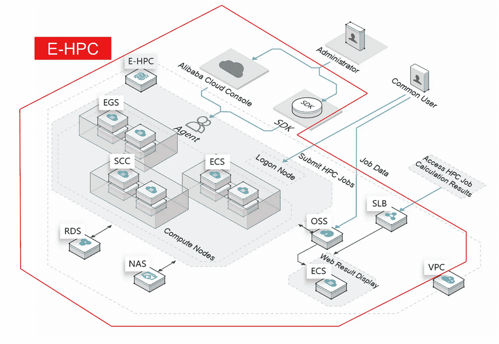

除了这些功能，阿里云还提供了多种计算实例类型，具有多样化的计算能力(包括 1vCPU、2vCPU、4vCPU、高达 104vCPU)、不同的内存比例(包括 1vCPU:2 GB、1vCPU:4 GB、1vCPU:8 GB)，以及可选的 GPU 或 FPGA 加速卡。我们的大多数 CPU 型号都使用英特尔最新的 CPU 架构。ECS 裸机实例完全由阿里云开发，是一种基于下一代虚拟化技术的新型计算服务器产品。ECS 裸机实例提供了虚拟机的灵活性以及物理机的性能和功能，让整个机器的计算性能为用户服务。ECS 裸机实例配备了支持远程直接内存访问(RMDA)的 RoCE 高速网络。这使其成为超级计算集群产品，可用于大规模、高并发场景。

# E-HPC 高吞吐量任务解决方案

HPC 环境为研究人员提供了药物研究所需的计算平台。然而，为了实现高效的候选药物筛选，还需要高通量的任务解决方案。

例如，在我们使用 DOCK6 处理配体库的情况下，一个文件夹，如 mol2，存储了大量的小分子文件。每个小分子文件的处理程序都是相同的，所有的文件都需要用相同的受体进行计算，例如病毒蛋白酶。

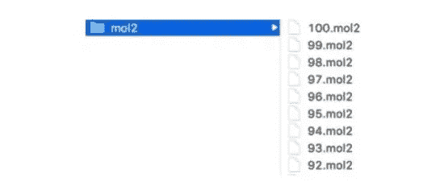

下图显示了串行处理方法的代码。这里，`dock.in`是使用 DOCK6 命令输入的文件，需要根据小分子文件名修改相应的参数值。这个代码片段遍历 mol2 文件夹中的每个分子文件，为每个文件生成一个名为 dock.in 的输入文件，然后运行 DOCK6 命令。

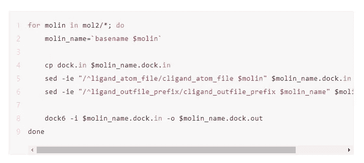

串行执行需要很长时间，并且不能利用高性能集群的计算能力。因此，我们需要找到一种方法，通过使用一个集群的多个节点和 CPU 核心来加快这个过程。这可以通过多种方式实现。比如，我们可以手动将`mol2`文件夹分成几个子文件夹，每个子文件夹包含几个小分子文件。然后，我们可以依次执行每个子文件夹中的文件。这种方法需要大量的人工干预。特别是，如果任务遇到错误并需要重新提交，这很容易导致重复或省略计算。

## 步骤 1:定义和启动 E-HPC 高吞吐量任务

E-HPC 提供了一个高吞吐量的任务解决方案。在这个例子中，大量的小分子文件可以在三个步骤中同时处理。

1.将`mol2`文件夹下的分子文件名保存到文本文件中，比如莫林。

2.开发一个名为 task.sh 的脚本，用于处理单个小分子文件，并将小分子文件名替换为$莫林。与串行逻辑不同，您可以看到处理代码是直接从 for 循环中复制的。

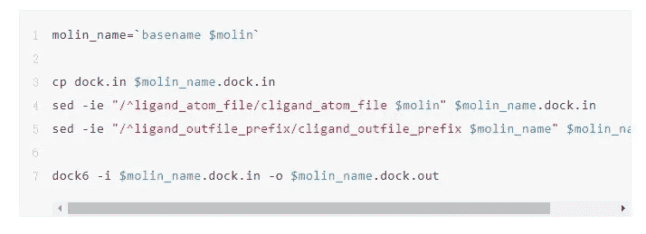

3.运行 E-HPC 高吞吐量任务处理命令`ehpcarr`执行`task.sh`。返回作业编号`2[].manager`。现在，这些任务通过使用 96 个 CPU 内核来同时处理。如果节点包含的 CPU 内核少于 96 个，任务会自动分配给多个节点。例如，当您使用具有 12 个 CPU 内核的实例时，所有分子处理任务都在 8 个节点上运行。

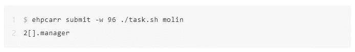

## 步骤 2:查询 E-HPC 高吞吐量任务的状态

运行`ehpcarr`命令，按作业号查询任务的并发执行状态。从查询结果中，您可以获得每个任务的当前处理状态及其开始和结束时间。可能的任务状态是队列中的`DONE`、`RUNNING`、`FAILED`和`INIT`。您可以根据任务执行持续时间来估计下一次任务执行将使用的计算资源。查询结果显示:

*   E-HPC 作业调度程序启动了八个候选药物筛选节点。
*   不同的任务被分配给不同的计算节点，例如，任务 0 被分配给 compute001，任务 10520 被分配给 compute008。
*   单个节点同时处理不同的任务，例如，任务 0 到 111 在 compute001 上同时处理。

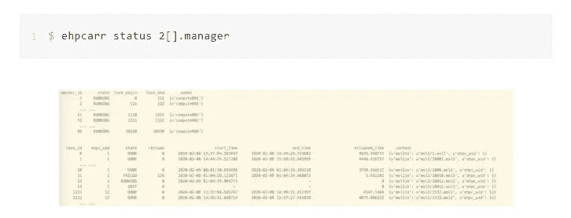

E-HPC 解决方案是基于高性能集群作业调度程序的阵列作业解决方案。它提供了以下增强功能:

*   它限制并发任务的数量，以避免一个任务或一个作业在集群作业队列中造成备份，从而影响其他集群用户作业的运行。
*   它支持动态任务调度，并充分利用可用的计算资源。

# 全球健康药物发现研究所开放共享平台

面对当前的疫情，共享资源和研究成果是必要的，因为这可以大大加快研究进度，避免重复工作。认识到这一点，我们帮助建立了全球健康药物研发机构。

[比尔及梅林达盖茨基金会](https://www.gatesfoundation.org/?spm=a2c41.14244617.0.0)与清华大学和北京市政府共同建立了 GHDDI，作为一个独立的非营利性药物研发机构，是药物研发的开放共享平台。GHDDI 的开放共享平台建立在阿里云上，使用 E-HPC 开发，为药物开发中的模拟计算构建高性能计算集群。此外，它为合作伙伴创建不同的超级计算子帐户，以允许共享研究成果和计算资源。

同时，为了便于在 E-HPC 超级计算集群上共享和发布计算结果，使用阿里云对象存储服务(OSS)的存储直接附着在 E-HPC 超级计算集群上。这意味着结果存储在云中的 OSS 实例中。此外，在云中创建 ECS 计算实例以构建 web 服务器，并且在 web 服务器上列出 OSS 访问链接，允许用户轻松浏览和下载存储的结果。

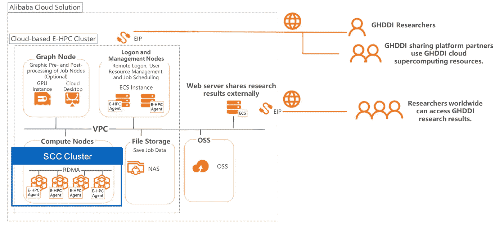

# 摘要

为了加快药物研究和开发，高性能计算集群可以作为一种重要的工具，因为它们可以提供强大的计算能力来加快研究过程。研究人员可以使用阿里云的 E-HPC 云超级计算产品在云中快速构建高性能集群，使他们能够访问能够满足其计算能力要求的高性能计算实例。

与此同时，E-HPC 提供了一种高吞吐量的任务处理解决方案，能够在多个计算节点和多个 CPU 内核上同时执行候选药物筛选，从而减少总的任务执行时间。此外，E-HPC 是云原生超级计算产品。因此，它可以与其他云产品(如 OSS)集成，允许您快速方便地构建计算和信息发布平台。

在继续与全球爆发的疾病进行斗争的同时，阿里云将发挥自己的作用，并尽其所能帮助其他人与冠状病毒进行斗争。点击[*https://www . Alibaba cloud . com/campaign/supports-your-business-anytime*](https://www.alibabacloud.com/campaign/supports-your-business-anytime?spm=a2c41.14244617.0.0)，了解我们如何支持您的业务连续性

# 原始来源:

 [## 了解阿里云高性能计算如何帮助新冠肺炎开发药物治疗

### 阿里云 2020 年 3 月 24 日 814 为了赢得这场不可避免的战斗，对抗新冠肺炎，我们必须努力…

www.alibabacloud.com](https://www.alibabacloud.com/blog/596020?spm=a2c41.14244617.0.0)