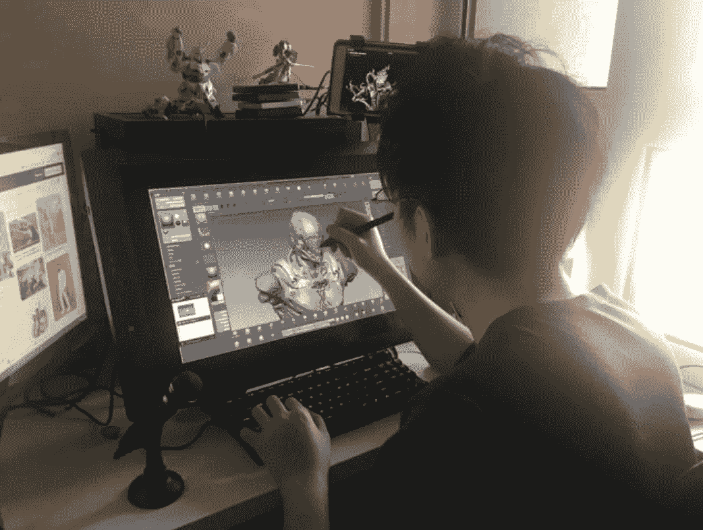

# 了解流浪地球的 VFX 艺术家如何使用阿里云重返工作岗位？

> 原文：<https://medium.datadriveninvestor.com/learn-how-the-vfx-artists-of-the-wandering-earth-using-alibaba-cloud-to-get-back-to-work-11065c5139d5?source=collection_archive---------10----------------------->

*通过* [*反新冠肺炎中小企业支持计划*](https://www.alibabacloud.com/campaign/anti-covid-19-sme-enablement-program?spm=a2c41.14458530.0.0) *，在爆发中支持您企业的增长和数字化转型。为所有新的中小企业客户提供 300 美元的优惠券，为付费客户提供 500 美元的优惠券。*

*陆晓明，在阿里巴巴的昵称是小明。*

你喜欢电影里看到的惊艳特效吗？这些是天才视觉特效(VFX)艺术家的作品。你可能会想象他们像梵高一样古怪，或者像海明威一样自由。没有。VFX 的艺术家就像你我一样:他们朝九晚五地工作，担心房租。

由于目前的疫情，我们许多人不得不在家工作，一些线下行业，如制造业，餐饮业，零售业和电影院甚至不得不关闭他们的业务。影视后期制作是“复工”面临巨大挑战的行业之一。

当你想到工作中的 VFX 艺术家时，你会想到什么？男男女女坐在巨大的显示器前，用酷酷的软件制作出令人印象深刻、栩栩如生的特效。所以他们在家工作应该没问题，对吧？

不对。本文将讨论阿里云如何与 2019 年科幻电影《流浪地球》视觉效果背后的团队莫尔·VFX 以及中国顶级视觉效果公司合作，开发一种为行业开辟道路的解决方案。

# 障碍

莫尔·VFX 遇到的障碍代表了整个视觉特效行业面临的问题。艺术家在家有效工作有三大技术障碍:

首先是设备。建模和特效渲染对 CPU、GPU 之类的计算机部件要求极高。VFX 公司为他们的艺术家购买用于计算和实时图像处理的工作站，或者更简单地说，高度专业化的计算机。普通的个人电脑远远不能处理 VFX 的工作负载。

 [## 云让犹豫不决的职业生涯规划者变得简单:基础|数据驱动的投资者

### 尽管 IT 在当今的商业中扮演着重要的角色，但许多 IT 求职者都不愿意从事云计算职业…

www.datadriveninvestor.com](https://www.datadriveninvestor.com/2020/03/11/cloud-made-simple-for-undecided-career-change-planners-the-fundamentals/) 

这就是为什么许多艺术家不得不在办公室和公司的猫一起加班，而不是在家里舒适地工作。你可能会问，为什么不把工作站带回家呢？艺术家可能会发现自己整天都在等待一个剪辑完成下载。

这是第二个障碍，网络连接。电影和电视后期制作行业严重依赖数据，并且涉及非常大的文件。单个项目的数据文件的总大小很容易超过 100。使用家庭网络连接下载如此大量的数据是非常不现实的。

第三个障碍是数据安全。剪辑材料是 VFX 公司的核心资产之一。这些存储在公司的内部网上。当艺术家们在办公室工作时，他们实际上是在一个有良好防护的企业内部网中工作。甚至他们电脑上的 USB 接口都被禁用了。VFX 公司的安全措施比你想象的还要严格。制作室真的是“授权人员专用”

如果一个艺术家想在家工作，他必须从公共网络连接到企业内部网，重新加载他们未完成的工作，并搜索内部网以找到项目的材料。如果材料泄露，后果很严重。如果泄密涉及一部即将上映的电影，电影投资可能会损失。

在当前疫情如火如荼的情况下，就地避难是保证员工健康的必要手段。然而，我们刚刚讨论的障碍阻止了 VFX 艺术家在家工作。

VFX 制作公司要求艺术家合作。如果项目因为人们无法工作而被推迟，这意味着收入将会减少，工资和租金等运营成本将很难获得。所有这些都很容易导致一家公司破产。

# 让更多 VFX 员工在两天内做好在家工作的准备

尽管有这些障碍，更多的 VFX 公司能够在两天内让所有员工做好在家工作的准备。他们是怎么做到的？据他们的首席执行官徐坚称，员工们于 2 月 3 日复工。到目前为止，他们已经能够达到正常生产率的 70%至 80%，有些部门达到 90%。对于他们的系统，数据安全也是如火如荼。

更多的 VFX 在春节期间立即成立了疫情应对小组，以保护其人员的健康，并决定防护措施。与此同时，“IT 部门开始评估我们与阿里云合作开发的远程工作解决方案。当这个解决方案通过了我们的测试并被接受时，我们的 CG 主管马上开始测试这个解决方案。渐渐地，每个部门都会安排测试，以确定远程工作解决方案是否符合他们的正常生产标准。”徐健说。

这里所说的远程生产解决方案是基于阿里云桌面和[弹性 GPU 服务](https://www.alibabacloud.com/product/gpu?spm=a2c41.14458530.0.0) (EGS)。云桌面是基于桌面虚拟化的云服务。简单地说，桌面虚拟化使用云服务器来模拟本地桌面，用户通过他们的显示器来控制云服务器。

一条专线连接着更多 VFX 和阿里云的数据中心。艺术家通过公共网络从家里访问阿里云云桌面实例，然后通过使用 RDP、VNC 或 DCV 远程连接到他们的办公室工作站。这样，艺术家们实际上仍然在他们的办公室里使用他们的日常工作站，这些工作站在公司的内部网上。家用电脑的规格并不重要。典型的宽带连接就可以了，因为不需要下载大文件。

至于数据安全，云桌面实例充当跳转服务器，并提供典型远程桌面软件(如 VNC 和 RDP)所不具备的数据管理和控制功能，如可追踪的水印、可定制的设备访问策略以及禁止文件上传和下载。这降低了材料泄漏的风险，并帮助更多的 VFX 实施数据隔离。

第一天实现，第二天测试，第三天使用。只用了两天时间，MORE VFX 就重新开始生产，每个人都在家工作。他们回到工作岗位，同时保护员工健康。

经过一轮全面的测试后，MORE VFX 首席执行官徐坚立即与业内 20 多家公司举行了一次技术讲座，分享技术，希望这可以帮助业内同行应对即将面临的挑战。

在疫情期间，更多的 VFX 能够这么快恢复工作的原因是云的弹性。VFX 之前在云计算和技术优势方面的投资为他们敏捷适应变化打下了坚实的基础。

# 云渲染是行业领先的技术升级

在所有闪光灯和光鲜亮丽的背后，影视特效行业有相当多的做法似乎来自黑暗时代。

你可能想不到在互联网时代还在这样做，但电影渲染存储在硬盘上，然后由人工传送到渲染农场。据业内专家称，一部电影通常需要至少 100 块这样的硬盘。

被视为未来的云计算尚未被电影和电视行业普遍采用。幸运的是，一些顶级公司已经采取措施向云迁移。

更多 VFX 是这些公司之一。自去年以来，阿里云一直在各个方面与更多的 VFX 合作，包括渲染，这是所有生产步骤中最需要计算能力的。

更多的 VFX 处理大量的后期制作，他们对计算能力的需求随着项目的变化而变化。他们的本地渲染场由数百台服务器组成。当没有太多工作时，它就没有被充分利用。在高峰期，队列太长，他们不得不使用外部渲染场来处理负载。农场服务器越来越旧，它们的性能不够理想。使用硬盘交付公司财产是不安全的。整个过程缺乏弹性。

这些问题继续困扰着更多的 VFX，直到他们决定向阿里云租赁一条专线，并使用 E-HPC 在云中渲染材料。

在了解了更多 VFX 的工作流程后，阿里云提出了混合云渲染解决方案，使用专线将渲染任务转移到云上。该解决方案还提供了一个定制的异步文件缓存机制，用于更多的 VFX，以减少在有超大规模渲染任务时对专线带宽的压力。

此外，阿里云 E-HPC 的纵向和横向扩展能力对于帮助缓解缓存层上渲染节点的吞吐量和 I/O 压力至关重要。这提供了强大的资源弹性。

借助集成的通用截止日期、计费和报告功能，阿里云 E-HPC 能够根据任务队列自动扩展渲染集群。这使得 O&M 变得简单，大大减少了 VFX IT 部门的工作量。

# VFX 工业具有未开发的技术升级潜力

2019 年下半年向云的迁移帮助 MORE VFX 提高了渲染性能和弹性，并让它体验到了云服务的强大功能。在这艰难的时刻，我们中有能力这样做的人都在家工作。这就产生了对远程工作技术的巨大需求。更多的 VFX 现在不仅是云生产的先驱，也是许多 VFX 公司密切关注云计算的原因。

徐坚曾在接受娱乐媒体三生的采访时说:“好莱坞的视觉特效工作室仍然领先我们几十年。”坦率地说，他说外国公司设计软件和研究算法，而国内公司购买产品，使用它们，并可能稍微扩展它们的功能。

更有 VFX 制作或参演了《流浪地球》、《孤岛惊魂》、《悟空》等多部获奖电影。

作为中国领先的视觉特效公司，莫尔 VFX 一直致力于引领行业发展并帮助其转型。徐坚希望国内业界积极寻找新技术，创新基础设施和核心算法。他认为云计算是鼓励和加速变革的完美平台。

徐坚还认为，无论是从市场需求还是从整体发展来看，中国 VFX 产业仍有望在未来 10 年快速增长。

云计算有助于降低创办新公司的成本，提高创新效率。我们相信，它将通过帮助更多行业升级，为行业互联网做同样的事情。

国内 VFX 行业潜力巨大，阿里云可以帮助将这一潜力变为现实。随着更多像 VFX 这样的公司迁移到云，电影和电视行业采用云计算的深度和广度将迅速扩大，帮助中国视觉效果行业建立自己的技术优势。

在继续与全球爆发的疾病进行斗争的同时，阿里云将发挥自己的作用，并尽其所能帮助其他人与冠状病毒进行斗争。在 [*了解我们如何支持您的业务连续性 https://www . Alibaba cloud . com/campaign/fight-coronavirus-新冠肺炎*](https://www.alibabacloud.com/campaign/fight-coronavirus-covid-19?spm=a2c41.14458530.0.0)

# 原始来源:

 [## 了解流浪地球的 VFX 艺术家如何使用阿里云重返工作岗位？

### 阿里巴巴云 2020 年 4 月 24 日 84 在爆发中支持您业务的增长和数字化转型…

www.alibabacloud.com](https://www.alibabacloud.com/blog/596158?spm=a2c41.14458530.0.0)