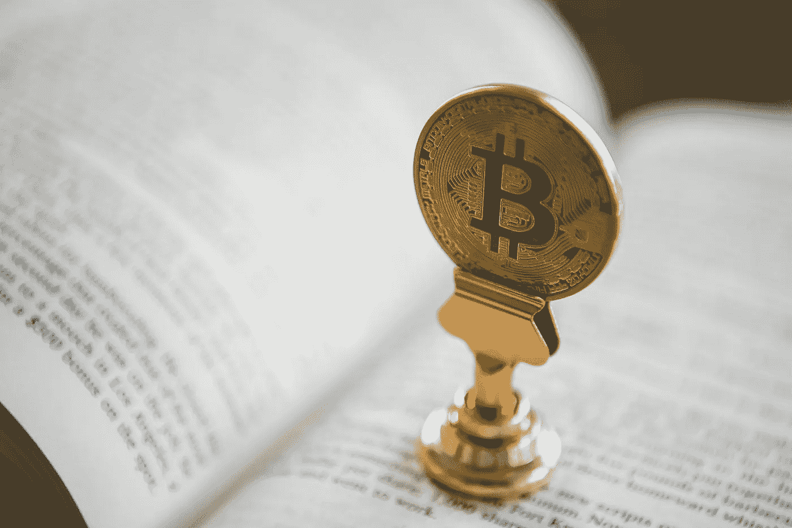
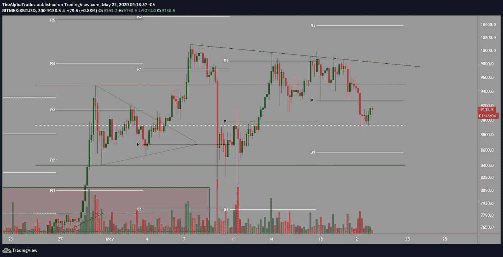
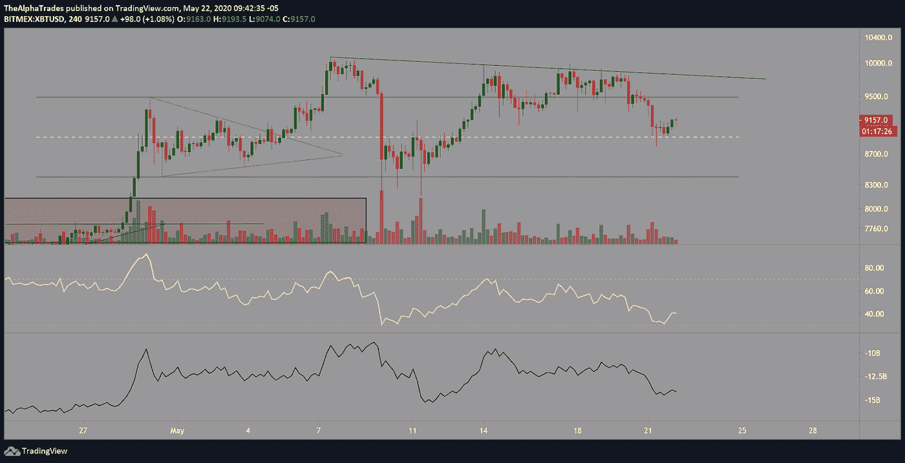
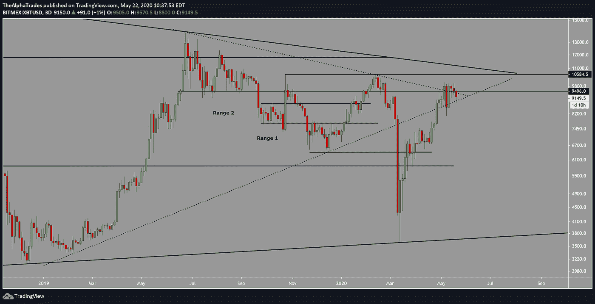

# 了解如何在比特币交易中获胜！

> 原文：<https://medium.datadriveninvestor.com/learn-how-to-win-at-trading-bitcoin-8c5be214dc55?source=collection_archive---------16----------------------->

## 为什么当别人渴望时，我们在 1 万美元做空。

Bitcoin, Photo by [André François McKenzie](https://unsplash.com/@silverhousehd?utm_source=unsplash&utm_medium=referral&utm_content=creditCopyText) on [Unsplash](https://unsplash.com/@bradleystone/likes?utm_source=unsplash&utm_medium=referral&utm_content=creditCopyText)

周五快乐，伙计们。

在过去的几天里，我们有几个会员加入，他们说“我在另一个付费的小组里，损失了很多钱”，或者“我以为我知道技术，结果真的把我的账户搞砸了。”

他们可能会来到我们的社区，认为“这将是一次轻松的旅程，我只需发出买卖信号。”事实并非如此——当你加入我的社区时，你必须付出努力才能成功。在我们的社区中，我们做的最好的事情就是清楚地概述一切，所以如果你清楚地了解我的团队的整体游戏计划是什么，根据止损定义风险，目标利润在哪里，潜在的进入在哪里。

例如，5 月 12 日，我开始建立比特币空头头寸，止损点在 9500 点。随着价格不断上涨，我认为这是继续建立我的空头仓位的好机会。我与我的社区分享了一份深入的分析，内容是关于我为什么根据整体市场的走势增加我的头寸，以及为什么我认为比特币已经见顶。

许多付费团体的可悲现实是，他们不承担自己的责任，当人们加入这些团体的目的只是跟随买卖信号时，这些人往往会被欺骗。集团领导人可能会做假账以显示更大的利润，而他们的追随者最终会受到伤害。在阿尔法交易，我们分享我们的收益和损失，我们的社区总是知道我们为什么进入或退出交易。

我们相信透明和责任，分享真实的利润和损失。例如，我在当前比特币波动交易中的 10%获利区域是 8725。

Advantage 社区之外的受众可能会认为，当他们获得如此多的免费信息时，没有必要加入。有时我们确实会在自由端发布一些最好的交易，比如四天前我分享了为什么我在 9979 高点附近做空比特币。此后，比特币曾陷入 8800 的低点。当 Crypto Twitter 上的每个人都在想这个资产将要崩溃的时候，跟随我的分析会给你提供潜在的空头交易设置。[我向我的社区详细解释了](https://medium.com/datadriveninvestor/bitcoin-cme-futures-data-shows-hedge-funds-and-institutions-are-increasing-shorts-9b20c1723936?source=---------4------------------)为什么我认为突破不太可能，而是看起来像是专业人士在散户的支持下卖出或做空，同时引导价格进入需求。

此外，前几天当价格在 9059 左右时，我让付费会员知道从那里的所有反弹都可能被视为做空机会。或者，从 8900 点至 9099 点有一些快速的头皮多头机会。

同样，*这些都不是交易建议*。这是我的团队的思考过程，基于我们的意见和对空间的深入了解。我们在这里为您提供教育优势。

# 下一个比特币机会

如果价格回到四个小时的支点，并被拒绝，我可能会提醒我的付费会员潜在的空头设置。这是一个看跌信号，表明价格最近确实跌破了支点，而且价格已经好几天没有跌破支点了。拒绝支点的空头头寸的一个可能目标是 8565 附近的 S1。从一个支点到另一个支点的交易是一个有价值的交易策略。

Bitcoin Pivots, Source: Alpha Trades, LLC

我坚持我的比特币空头头寸，即使这个头寸继续亏损，因为我相信我的分析，我的无效水平从未达到。虽然 Twitter 上的蛇油销售人员只报告了他们的损失，但我让我的社区知道，是的，头寸处于亏损状态，但我有合理的理由持有甚至增加头寸。

大约 24 小时前，[我告诉我的听众，我的近期做空目标是 9100 点，然后是 8925 点](https://youtu.be/79L4utIIE8E)。从那以后，我们突破了这两个水平，在前面提供的图表中的通道上，我们又回到了情商之上。我认为我们将到达 9275 至 9300 点，然后再跌回来。

比特币延期的另一个好迹象是电子迷你 S&P (ES1！)也在向下突破，一夜之间直逼 2902。周一是美国的假日，所以很难说股市或 BTC 会发生什么，因为这两个市场的大部分交易量都来自美国。正如我的社区所熟知的，小心周末的恶作剧是有好处的。

在三天的时间框架内，BTC 继续从 2019 年 2 月的关键高点低点和 2019 年 12 月的 6410 点低点打击较低的趋势线。我预计 BTC 将在两天内再次触及趋势线作为支撑。跌破该支撑线将形成向 8100 点甚至 7470 点的动能。

OBV 仍在持续走低，这意味着资金流入不足以推高价格。我在昨天的视频中说过，随着价格下降，未平仓合约不断增加，这意味着有更多的空头进入系统，多头平仓。个人投资者和散户投资者等非报告类投资者实际上在做多，而对冲基金和机构等非商业投资者实际上在做空。我的问题是:你是应该追随那些没有对冲基金或机构那么多钱的普通人，还是应该追随那些赚大钱的“鲸鱼”，对吗？

Bitcoin Channel, Source: Alpha Trades, LLC

Bitcoin SR levels, Source: Alpha Trades, LLC

Bitcoin volume, Source: Alpha Trades, LLC

# 间谍期权交易保持强劲

我在 5 月 20 日进入了一个价格为 3.05 美元的间谍期权。在不到一天的时间里，我在那笔交易中上涨了 20%,并告诉我的社区，这是一个很好的获利区域，并说明了我打算多持有一段时间。

# 处于优势

感谢您成为这个社区的一员。如果你对这篇文章有共鸣，请[订阅 Discord 服务器](https://bit.ly/2KJ1oor)。你可以访问公共频道，在那里我们每天发布大量有用的内容。更多细节请看下面的视频。

Learn how to trade Bitcoin, Source: Alpha Trades, LLC

# 放弃

Alpha Trades，LLC 提供的信息不用于制定任何财务决策，也不是购买、持有和/或销售特定产品、数字资产或 ICO 的请求或建议。

访问我们的完整服务条款:【https://bit.ly/3faVeeV 