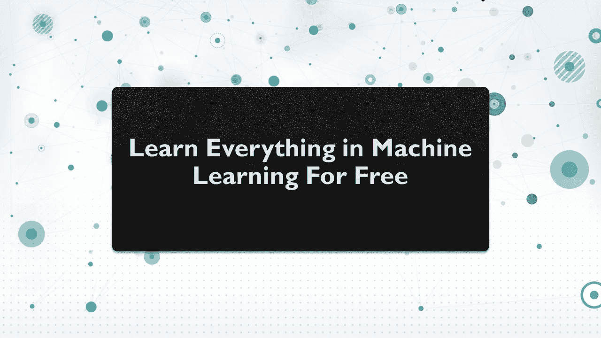

# 免费学习机器学习

> 原文：<https://medium.datadriveninvestor.com/learn-machine-learning-for-free-a047b77c9beb?source=collection_archive---------10----------------------->

## 免费学习机器学习中的一切。

机器学习有没有可能什么都免费学？是的，它是！在本文中，我将带您浏览互联网上可用的最佳资源，免费学习机器学习。

机器学习是一个不断发展的领域。如此多的技术已经从机器学习中受益，但仍有如此多的技术有待探索，以至于没有人知道我们将来会从机器学习中获得什么好处。

由于机器学习是未来派的，所以今天有如此多的离线和在线课程。但是如果你不想花呢？是的，你仍然可以免费学习 ML 中的所有内容。

# 如何免费学习机器学习？

要免费学习机器学习，我将带你一步一步地浏览所有资源。你只需要像上课一样按顺序做好每一件事。在进入下面的参考资料之前，请确保您了解 Python。如果你不太了解 Python，那么你可以从[这里](https://github.com/amankharwal/Website-data/blob/master/PythonNotesForProfessionals.pdf)下载一本非常好的 Python 电子书。

> [**第一步:机器学习全程免费**](https://thecleverprogrammer.com/2020/09/24/machine-learning-course/)
> 
> [**第二步:100+个机器学习项目解决并讲解**](https://thecleverprogrammer.com/2020/11/15/machine-learning-projects/)
> 
> [**第三步:继续探索所有文章**](https://thecleverprogrammer.com/machine-learning/)

以上三个资源，可以免费学习 ML 的每一个题目。第一步将带你通过一个完整的机器学习课程，向你介绍所有的主题和你需要知道的最重要的算法。

第二步将带你通过 100 多个机器学习项目解决和解释，这将帮助你在学习和探索该领域的同时获得实践经验。这些项目每个月都会更新，所以你每个月都会看到新的项目。

第三步是继续探索我们为你写的所有文章。我们不断发布关于新算法、新项目、新技术以及更多的内容。

只要不断尝试在新的数据集上实际实现所有算法，这样做将有助于你成为机器学习和人工智能领域的佼佼者。

希望你喜欢这篇关于如何免费学习机器学习的文章。欢迎在下面的评论区提出你有价值的问题。