# 几分钟内学会面向对象编程(OOP)

> 原文：<https://medium.datadriveninvestor.com/learn-object-oriented-programming-oop-in-minutes-18d9f957b387?source=collection_archive---------3----------------------->

> 理解最自然和实用的方法。一旦掌握了窍门，就可以通过深入钻研 Python 编程来实现现实世界的问题。

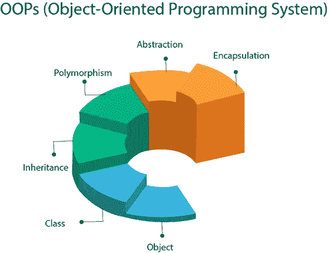

大多数时候，你的编码步骤都是围绕着数据分析、预处理、可视化、建模，所有这些都是日常思考的一部分。

为了理解这背后的直觉，让我们以尼日利亚的教育系统为例。我们有一个顺序*学前> >小学> >中学> >中学。*如果我们单独将尼日利亚作为一个国家来讨论，这种顺序观点是可行的。然而，如果这是关于各大洲和地区的，你就不得不考虑全世界成千上万个国家的教育系统。为每个国家制定一系列行动可能会变得不可持续，不管怎样，你必须开始考虑所有大陆的模式。

这种思想与代码密切相关，更多的数据保证了更多的步骤和更多的功能。

简而言之，面向对象编程(OOP)是对象(数据)及其交互模式的集合。OOP 关注于思考过程，实现开发者想要操作的东西，而不是操作它们所需的逻辑。代码可伸缩性、效率、可重用性、信息保护、易于调试都是 OOP 的好处。

## 面向对象的编程语言包括:

*   Java 语言(一种计算机语言，尤用于创建网站)
*   C++
*   计算机编程语言
*   C#
*   Java Script 语言
*   r，PHP，Ruby，Swift，Dart，Scala，Kotlin，Matlab，e.t.c

在本文中，我们将精力集中在 Python 中的 OOP 上。

## Python 中的对象

Python 中的几乎所有东西都是对象，它的属性和方法构成了类。

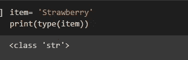

class in python

您可以在任何 Python 对象上调用 **type()** 来获取它的类。 **dir** 函数帮助我们了解附加到 **str** 类的方法和属性。

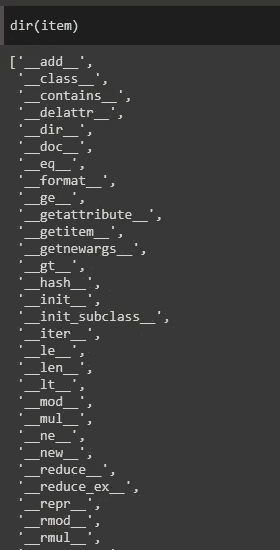

methods and attributes in python

其他一些类的例子可以在下面看到。

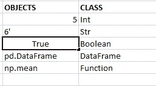

object with classes

## OOP 的优势

*   班级
*   目标
*   属性
*   方法

## 班级

类是利用被称为用户定义数据类型的 OOP 的真正优势。它是对象的蓝图，描述了某种类型的每个对象可能具有的状态和行为。如果我告诉一个朋友，说，

> “我的每一个用户都将拥有一个名字，一个电子邮件，并将能够登录到该网站”，哟！我刚刚创建了一个类！

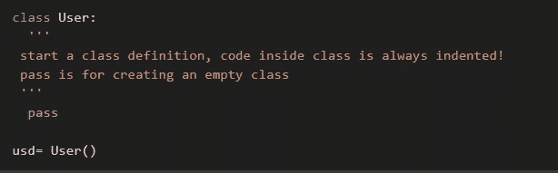

creating your first class

这是我们的第一节课。这个类的主体现在是空的。

new instance

这里，我们创建了一个**用户**类的新实例。换句话说，我们实例化了**用户**类。**美元**是对我们新对象的引用。意思是， *usd* 是我们的*用户*类的一个实例对象。

## 对象作为数据结构

对象是具有唯一状态和行为的数据字段。它可以是变量、函数、数据结构的组合。

> 对象=状态+行为

陈述，在某种意义上，姓名和电子邮件。行为，如单击页面的登录选项。

## 属性

通俗地说，属性是附加在类型上的性质或特征。类似地，在 Python 中，它们是通过赋值创建的，并在类模板中定义为存储的信息。单个对象包含存储在属性字段中的数据。例如，网站的每个用户可以根据在进行*登录*之前提供的*姓名*和*电子邮件地址*进行不同的识别。

> 属性=变量> > > Obj.my_attributes

Python 中的属性通常表示为变量，如数字、字符串、列表、元组、字典。

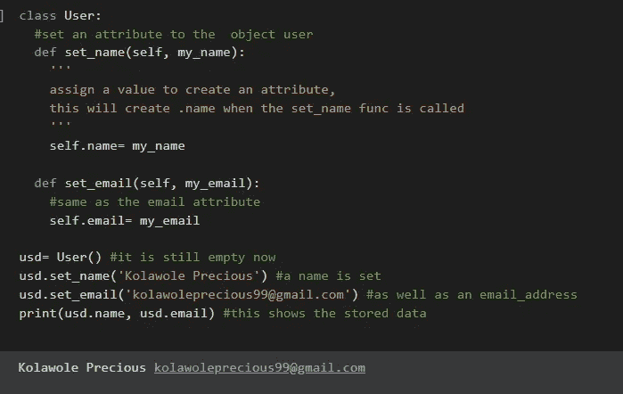

class with attributes

## 方法

方法执行操作；方法返回关于对象的信息或更新对象的数据。方法的代码总是在类定义中定义为由函数表示的行为。在*用户*示例中，在*用户*类中定义了*登录*方法，并在对象 **usd** 上调用了*登录()* 以获得输出。

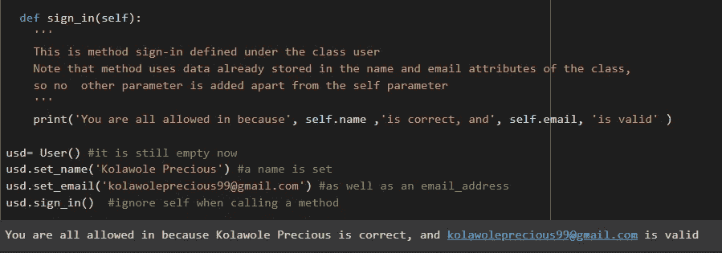

example of method

按照上面的代码片段，你应该注意到 **self** 这个词被分别调用。别搞混了，解释一下！

## 什么是自我？

> Self 代表未来物体。

定义类时，类的对象还不存在。但是我们经常需要一种方法来引用类定义中特定对象的数据。它是类定义中特定对象的替身，也是对该类当前实例的引用，它用于访问属于该类的变量。

尽管如此，它既不是**关键字**也不是**特殊**名称，而是**常规**名称，可以根据程序员的意图用任何其他词替换，如“ **kitty** ”、“ **iris** ”等，只要它们被一致地使用而不被替换。

**注意**:自身*参数*应该是常规**实例**方法的第一个参数。尽管如此，始终保持*自身*为*自身*。

下面的片段是一个参考，以防你仍然不熟悉如何区分 OOP 的所有四个优点。这里有一张指向它们的草图。

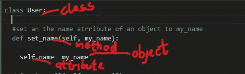

check each directed arrows

## Python 对象初始化器

在查看其他开发人员的代码或库文档时，您一定遇到过 **__init__** 构造函数，其中许多初学者对它的用途和使用方式感到困惑。 **__init__()** 被称为**一个类**的 **构造器。在创建对象后，它会被自动调用。**

如果您的类包含大量数据，这是一种非常可持续的方法。它允许您在创建对象时向其添加数据。

在*属性*副标题的代码片段中，我们在类 **User** 的 **set_name** 方法中定义了 **my_name** 属性，然后调用 set_name 方法会将 **Kolawole Precious** 属性添加到 **usd** 对象中，与 **set_email** 方法相同。或者，一切都可以在构造函数下定义。

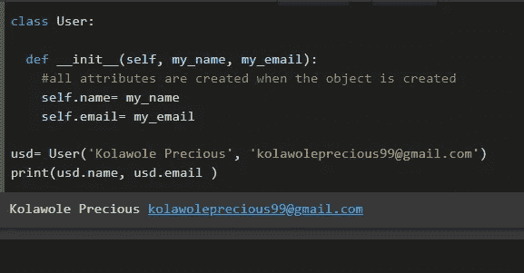

init constructor

使用 **__init__** 构造函数，我们在此确定我们的代码更易维护、可读性更好、组织更好。

## 面向对象的四个基本原则

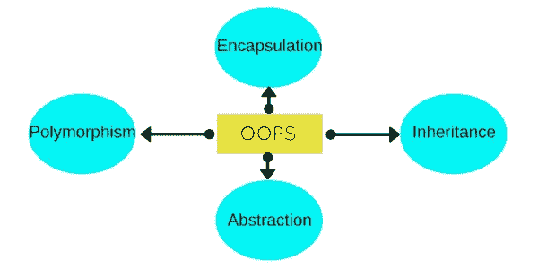

principles of OOP

*   遗产
*   包装
*   多态性
*   抽象

## 遗产

它指的是定义一个新的类，对现有的类做很少的修改或不做修改。继承从另一个类继承所有方法和属性。它允许代码重用，允许类继承其他类的特性。

> 新类别功能=旧类别功能+额外功能

例如，*癌症*分别将属性和功能扩展到*乳腺癌、宫颈癌、肺癌、皮肤癌*癌症。也就是说，所有的*乳腺癌*都是*癌*但所有的*癌*都不是*乳腺癌*。继承代表“是”的关系。

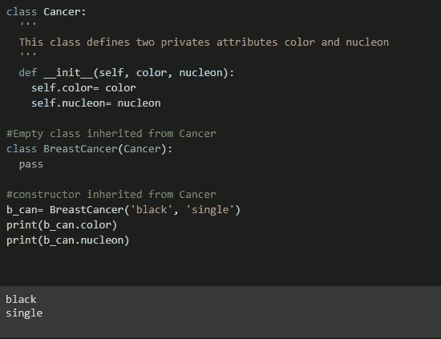

example code of inheritance

这里我们把**癌(父)**类放在**乳腺癌(子)**类名称后面的圆括号里。定义了*癌症类*，然后从它继承了一个看似空的*乳腺癌*类。*乳腺癌*被视为具有一般*癌症类别*的所有属性和功能。

我们创建了一个对象 **b_can** ，尽管我们没有定义构造函数。令人惊讶的是，我们可以从*乳腺癌*类中访问***_ _ 颜色****和**_ 核子**属性，尽管这些特性在新类中没有定义。*

*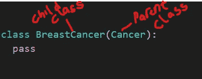*

*parent and child differentiation*

> *父类也称为超类、祖先类或基类。子类也可以称为派生类、后代类或扩展类。*

## *封装 _ _ 向继承中添加功能*

*现在，我们可以看到我们创建的类和子类拥有相同的功能。下面是如何给我们的子类添加更多的功能，通过添加一个专门针对*乳腺癌*的构造函数，使它不同于*癌症类*。*

*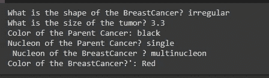*

*outputs after adding more functionalities*

*从上面的代码中，我们得到了 OOP 中的封装。我们已经创建了具有一些属性和方法的*癌症类*，以及具有其属性和方法的*乳腺癌*子类。然而，如果我们仅仅通过对象的引用就可以简单地改变 *Cancer 类*的属性，那么这些属性就失去了最初初始化它的信息。*

*假设我们已经初步创建了一个*癌症类*，其属性为*黑色*。任何拥有*乳腺癌*对象实例的用户都可以通过简单地引用属性将该颜色更改为橙色或蓝色。为了避免这种情况，我们在 **getters** ， **setters** 方法中包含了这些属性。我们可以从**输出**片段中看到，每个类都保留了自己的属性。*

*子类函数下的 super 有助于从子类中专门调用已经在子类中被覆盖的父类方法。如果您需要从特定的父类调用方法或属性，请使用 *super()* 。*

*我们还应该注意到，在每个属性前面都有双下划线(__) 。它们用于私有变量。根据 Python 文档——如果您的类打算有子类，并且有您不希望子类使用的属性，考虑用双前导和不超过一个尾随下划线来命名它们。*

*Python 解释器重写了属性名以避免子类中的命名冲突，并更改了变量的名称，使得以后扩展类时更难产生冲突。*

## *封装的好处*

*   *它帮助我们将属性的初始化和检索包含在方法中。*
*   *它有助于抑制不必要的变化。*
*   *getters 和 setters 让我们可以完全控制属性值的获取和设置。*

## ****多态性****

*从字面意义上来说，多态性是假设不同形状和形式的能力。在 Python 中，这意味着变量、函数或对象可以采用多种形式。而在 OOP 中，多态性允许我们在子类和父类中定义同名的方法。多态的工作可以用两种不同的方式来处理；*

*   *方法覆盖*
*   *方法重载*

## *方法覆盖*

*这在子类从父类继承的方法不适合子类的情况下使用。也就是说，我们必须在子类中重新实现这个方法。*

*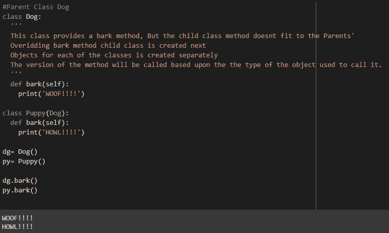*

*method overriding example*

*在这里，父类**狗**拥有独特的能力**用更大的声音吠叫**。儿童类**小狗**也能发出声音，但是声音小一些。值得注意的是，从父类继承的方法不适合子类，所以为子类提供了不同的实现。*

*同时，每个方法都是基于调用它时使用的对象类型来调用的。当 *Puppy* 类对象 **py** 被用来调用一个被覆盖的方法 *bark()* 时，那么 *Puppy* 类版本的方法 **HOWL** 就会被打印出来。但是如果用方法 *bark()* 调用 *Dog* 类对象 **dg** ，则 **WOOF** 被打印出来。*

## *方法重载*

*在编程中，重载指的是一个方法根据传递给它的参数以不同方式运行的能力。在这里，我们将看到如何在 Python 中执行方法重载。*

*方法或函数可能具有相同的名称，但传递给方法的参数数量不同。根据传入的参数数量，将得到不同的输出。*

**

*method with parameters*

*上面我们看到了 *bark()* 是如何设置给对象带参数或者不带参数来得到不同的输出的。*

*不管怎样，真正的方法重载是在其他编程语言中使用的，而不是在 Python 中。*

## *抽象*

*抽象意味着对用户隐藏复杂性或内部实现。*

*   *简单的代码用来表示复杂性。*
*   *对用户隐藏复杂的细节。*

*一个真实的例子是一辆*汽车*的发动机传动和制动系统如何工作的细节，其执行和自动化对于驾驶汽车的人来说是未知的。一辆*汽车*并不被视为不同的独立部件，而是一个定义明确的物体，具有其独特的行为。OOP 中的抽象是通过使用抽象类和方法来实现的。*

*抽象类提供不完整的功能，并且包含一个或多个抽象方法。抽象方法没有任何实现，但是子类为抽象方法提供实现。*

*要声明一个抽象类，我们首先需要从 **ABC** 模块导入 **abc** 类。*

**

*import ABC*

*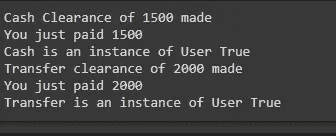*

*abstraction.py output*

***User** 是一个抽象类，继承自 *abc* 模块的 *ABC* 类， **Cash** 和 **Transfer** 子类继承自 *User* 类，它们都有自己的 **clearance()** 加上**receive()**方法，这些方法是用户唯一可见的东西。但是，当在每个子类的对象中调用 *clearance()* 并传入 **amount** 参数时，将显示子类的打印语句。这些定义对用户是隐藏的。*

> *在我们告别之前，让我们快速浏览一下。*

## *为 OOP 代码推荐的设计技术*

*   *类名以大写字母开头。如果一个类名包含多个单词，每个单词都应该以大写字母开头，例如 **ClassName** 。它们被视为名词。*
*   *函数和循环的模式是预期的。在类后面的代码行中适当缩进。*
*   *方法的定义必须以关键字 **def** 开始。*
*   *方法名必须以小写字母开头。如果不止一个单词，那么单词之间应该有一个**连字符(_)** ，例如 **method_name** ，或者第一个单词之后的每个单词都以大写字母开头，例如 **methodName()** 。*
*   *参数应该尽可能清楚地表明其目的和存在。*
*   *名称不得以特殊字符开头，如**、&、%、_、等。***
*   *一个字符串文字**(“”)**而不是其他类型的表达式出现在任何其他语句之前的类或函数之后。这有助于用户理解类、方法和属性背后的直觉。通过调用特定类或方法上的 python 内置 **help** 函数，可以将其视为输出。在许多开发人员参与某个项目的场景中，这是传递有关类和方法的信息的一种方式，创建这些类和方法是为了帮助其他人理解他们编写的每个代码，并确保代码的可重用性。*

*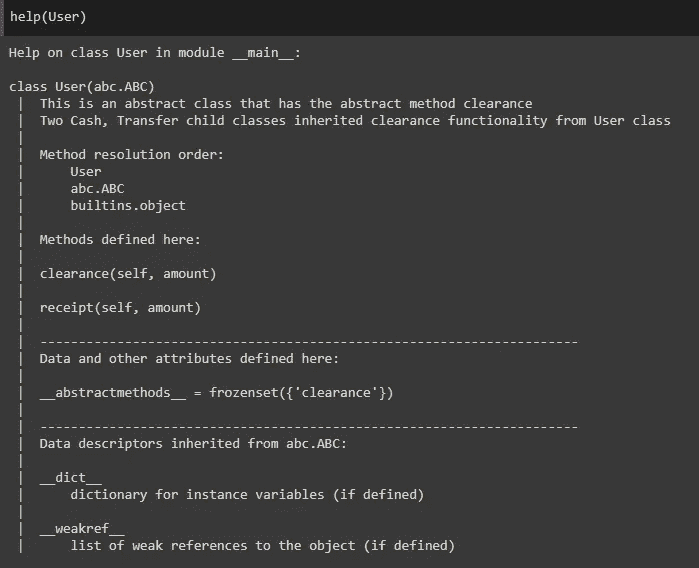*

*docstrings and help function*

*   *最后，写好代码。可移植性、可维护性、可读性很重要！！！*

*作为一名开发人员，采用广泛的面向对象编程来构建非刚性的软件，编写每一个逻辑，将复杂的问题作为对象分成小的工作单元。本教程一定已经让你对 OOP 的风格、执行和实现有了一个简明的概念。但是我们通过实践学习得最好。*

*胡拉拉。！！你刚刚看了一篇很长的，内容丰富的文章。感谢沉迷阅读到最后的后劲。点击下面的拍手图标，与朋友、编码伙伴、导师以及尽可能多的需要它的人分享。更重要的是，如果有问题和更多想法，你可以在 Twitter 和 T2 LinkedIn 上与我联系。快乐阅读！*

## *参考*

* [## 签到

### 登录 DataCamp 帐户

learn.datacamp.com](https://learn.datacamp.com/courses/object-oriented-programming-in-python)  [## 什么是面向对象编程(OOP)？

### 面向对象编程(OOP)是一种围绕数据组织软件设计的计算机编程模型

searchapparchitecture.techtarget.com](https://searchapparchitecture.techtarget.com/definition/object-oriented-programming-OOP)*