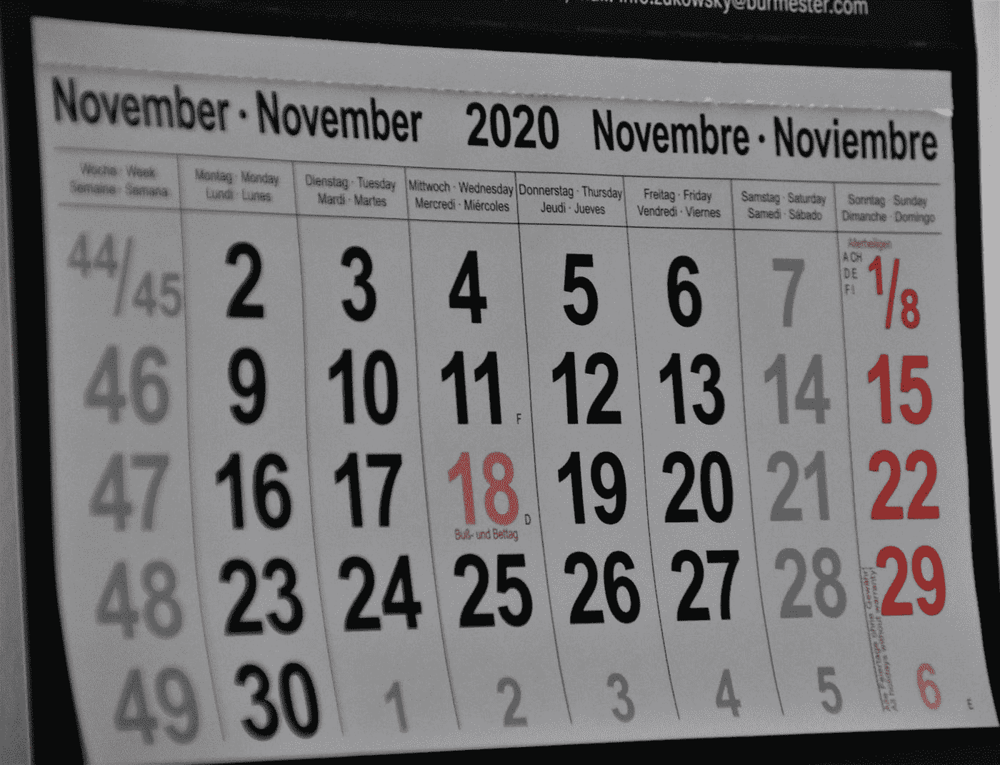

# 学习这个惊人的技巧来计算任何日期的星期几

> 原文：<https://medium.datadriveninvestor.com/learn-this-amazing-trick-to-calculate-the-weekday-of-any-date-e9890eef08ad?source=collection_archive---------1----------------------->

Photo by [Waldemar Brandt](https://unsplash.com/@waldemarbrandt67w?utm_source=medium&utm_medium=referral) on [Unsplash](https://unsplash.com?utm_source=medium&utm_medium=referral)

## 几秒内

这一招绝对会让你的朋友和家人大吃一惊。稍加练习和一点心算，你就会成为一个活日历。

在底部有一些例子，如果你想看实际的计算，你可以检查一下，但是我强烈建议你阅读剩下的部分，这样你就不会依赖部分信息，在一些边缘情况下会导致错误。

在显示和解释从日期中寻找日期的公式之前，我需要介绍您真正需要的唯一工具和一点符号。这个工具叫做*模运算*，它并不比除法复杂，事实上，它更简单。

# 预赛

让我们同意将模运算 *x (mod y)* 定义如下:

用 *r < y.* 写出 *x = n ⋅ y + r* 那么 *x (mod y) = r.* 换句话说，模运算的结果就是我们用 *x* 除以 *y* 的余数。

例如

*   5(模 3) = 2
*   34 (mod 7) = 6
*   15 (mod 5) = 0。
*   73 (mod 7) = 3。

请注意，在编程语言中，通常会看到数字之间带有百分比符号的操作，例如 *5 % 3 = 2* 。在数学中，我们经常写 *5 ≡ 2 (mod 3)，*但是我们总是有选择自己符号的自由，所以我们选择了两种符号的融合。

下面是你在做模运算时的一个小技巧:假设你在计算 *x (mod y)* ，你可以从 x 中减去 y 的任意倍数，而不改变结果。因此，如果你要计算 7000000003(mod 7)，你马上就会知道答案是 *3* ，因为 *700000000* 是 7 的倍数。不用分大数。

现在我们知道了这一点，是时候通过一个抽象的例子来定义一些值了。在文章的最后，我们将一起浏览一些真实的例子。

我们需要定义以下值，这些值都依赖于您试图查找的星期几的给定日期:

*   cc ( *世纪码*)
*   yc ( *年份代码*)
*   mc ( *月份代码*)
*   dc ( *日代码*)
*   lc ( *闰年代码*)
*   x ( *日期代码*)

一旦我们有了这些值，实际的计算就非常容易了。

首先，我会把规则给你，以便你能立即应用它们。

让我们从计算工作日的 5 个步骤开始。

# 百年

我们将数字 *x* 的*整数部分*写成[x]例如

*   [2.3] = 2
*   [8.99] = 8

我们定义世纪号 *cn* 为

*cn =[年/ 100]。*

所以 822 年是 8，1789 年是 17，等等。

假设我们有一个给定的日期，我们称之为 *D* 作为参考。首先要做的是找出 *D* 是否在 18 世纪之前，因为在 1752 年有一个日历转换。

要计算之后日期的 cc，您需要记住以下映射:

*   18 世纪→ 4 世纪
*   19 世纪→ 2
*   1900 年代→ 0
*   2000 年代→ 6
*   2100s → 4
*   2200 秒→ 2
*   2300 秒→ 0

如果 *D* 在 1900 年代，那么你可以跳过这一步，因为在这种情况下 cc 值不会影响最终结果。

如果你想让你的一天按照儒略历，你需要做以下事情，否则只需按照上面的地图。大多数计算器都是用公历计算的。

如果 *D* 在 1752 年 9 月 14 日之前，那么公式就是取世纪数，然后从 18 中减去，得到的数应该是取(mod 7)。

## 例子

*   如果年份是 1492，那么世纪数就是 14。现在我们有*cc = 18–14(mod 7)= 4。*
*   如果年份是 650 CE，那么世纪数是 6，因此*cc = 18–6(mod 7)= 12(mod 7)= 5。*
*   如果年份是 1864 年，那么你只需使用你的表得到 *cc = 2。*

# 年

我们用 yn 表示年份。求 *yc* 的公式为

yc = yn + [yn / 4] (mod 7)。

## 例子

*   如果这一年是 1987 年，那么年号是 *yn = 87* ，因此 YC = 87+[87/4](mod 7)= 3+21(mod 7)= 3

注意，我们得到 3，因为 87 (mod 7) = 3，21 (mod 7) = 0。

# 月

你需要记住这个映射:

*   一月→ 0
*   2 月→ 3 日
*   3 月→3 日
*   4 月→6 日
*   5 月→1 日
*   6 月→4 日
*   7 月→6 日
*   8 月→2 日
*   9 月→5 日
*   十月→0
*   11 月→3 日
*   12 月→5 日

我记得是这样的:

我将一年中的月份分成 4 组，每组 3 个，然后第一组和最后一组非常相似:0，3，3 和 0，3，5。只有最后一个改变了。

中间两个组也差不多:6，1，4 和 6，2，5。只需记住 6，然后在其他数字上加一。

# 一天

日期代码就是日期的数字。即

dc = dn

# 闰年

这很简单。

如果 D 在闰年的一月或二月， *lc = 1* 否则 lc = 0。

如何确定日期是否是闰年？

如果 D 在 1752 年 9 月 14 日之后，那么如果这一年能被 4 整除，那么它就是闰年，除非它能被 100 整除。但是如果它能被 400 整除，那么它就是闰年。

如果 D 在 1752 年 9 月 14 日之前，那么如果它能被 4 整除，那么它就是闰年。

## 例子

*   1796 年是闰年，因为它能被 4 整除。
*   1800 不是闰年，因为它能被 100 整除。
*   2000 年是闰年，因为它能被 400 整除。
*   1400 是闰年，因为它能被 4 整除，并且在 1752 年(儒略历)之前。

# 公式

最后，我们准备陈述寻找日期代码 *x* 的大公式:

*x = cc + yc + mc + dc - lc*

现在您只需要记住映射:

*   0 →周日
*   1→星期一
*   2→星期二
*   3→周三
*   4→周四
*   5→星期五
*   6→周六

但是这很容易，因为这只是一周的第 n 天:星期一是第一天，星期二是第二天，以此类推。

# 我们来算一些日期吧！

你可以在这里查看你的结果，但是我鼓励你先自己试一试。

## 示例 1

例如，我的生日是 1987 年 10 月 6 日。

好的，让我们来计算所需的值。

*   cc = 0
*   yc = 87 + [87 / 4] (mod 7) = 3
*   mc = 0
*   dc = 6
*   lc = 0
*   x = 3 + 6 (mod 7) = 2

所以根据日期映射，我们得到我出生在星期二！

你呢？

## 示例 2

好吧。怎么样……..伟大数学家莱昂哈德·欧拉的生日。他出生于 1707 年 4 月 15 日。

*   cc = 4
*   yc = 7+ [7 / 4] (mod 7) = 1
*   mc = 6
*   dc = 15
*   lc = 0
*   x = 4+ 1+ 6 + 15 (mod 7) = 5

莱昂哈德·欧拉出生在星期五。

## 示例 3

还有一个例子:我妻子的生日是 1981 年 4 月 30 日。

让我们看看:

*   cc = 0
*   yc = 81 + [81 / 4] (mod 7) = 3
*   mc = 6
*   dc = 30
*   lc = 0
*   x = 3 + 6 + 30 (mod 7) = 4

她出生在星期四。

## 实例 4

最后一个例子。2001 年 9 月 11 日。

*   cc = 6
*   yc = 1 + [1 / 4] (mod 7) = 1
*   mc = 5
*   dc = 11
*   lc = 0
*   x = 6 + 1 + 5 + 11 (mod 7) = 2

这是一个星期二。

如你所见，这很容易。稍加练习，你会变得很快。