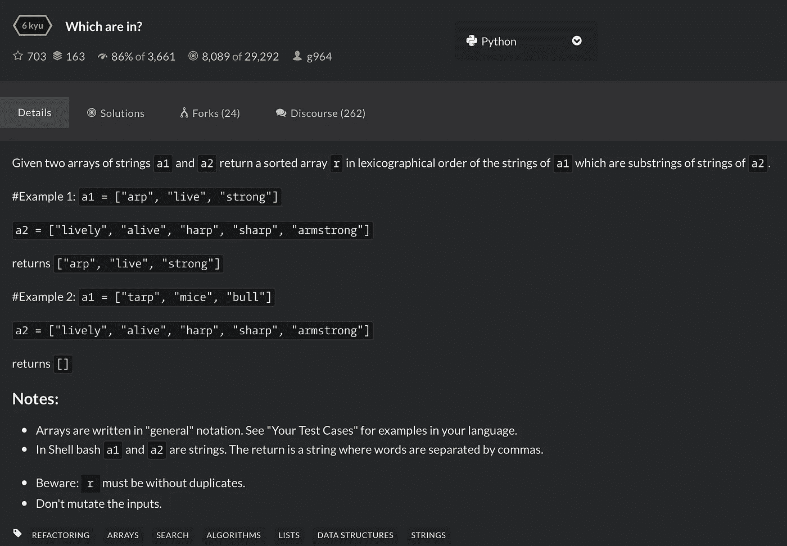

# 学习 Python: Codewars 6kyu 问题

> 原文：<https://medium.datadriveninvestor.com/learn-to-python-codewars-6kyu-question-cff75a33b518?source=collection_archive---------2----------------------->

解决编码挑战是提高编程语言的一个很好的方法。在本文中，我们将使用 Python 解决一个 6kyu Codewars 问题。我还会在底部放一个我反复解决这个问题的 YouTube 视频的链接。

我们开始吧！

这是个问题:



给我们两个字符串数组， *a1* 和 *a2* ，要求我们找出 *a1* 中的哪些字符串是 *a2* 中的字符串的子字符串。我们将把这些字符串存储在一个数组中，对它们进行排序，并返回数组作为结果。我们将定义该函数:

```
def in_array(array1, array2):
```

要查找 a1 中的所有字符串，我们必须遍历 a1 中的字符串:

```
def in_array(array1, array2):
    for item in array1:
```

在这个 for 循环的每次迭代中，我们将检查 array1 中的一个项目，我们希望检查它们是否是 array2 中任何字符串的子串。因此，我们必须在第一个 for 循环中启动另一个循环来检查 array2 中的每一项:

```
def in_array(array1, array2):
    for item in array1:
        for item2 in array2:
```

使用 Python *in* 关键字检查第一项是否包含在第二项中(或者说，第二项的子串):

```
def in_array(array1, array2):
    for item in array1:
        for item2 in array2:
            if item in item2:
```

在这个阶段，我们知道*项*满足我们的要求，并希望将*项*存储在一个数组中以便稍后返回。所以我们将在 for 循环之外定义一个名为 *result* 的数组——我们不想在每次迭代中重新定义 *result* 数组。我们还想确保我们不会在*结果*数组中存储重复的数据。如例 1 所示，array1 中的“arp”是 array2 中“harp”和“sharp”的子串，但在返回的数组中，我们只需要它的一个实例。因此，在 if 语句中，我们将放入另一个条件，以确保在将*项*追加到*结果*数组之前，它还不在*结果*中:

```
def in_array(array1, array2): 
    result = []
    for item in array1:
        for item2 in array2:
            if item in item2 and item not in result:
                result.append(item)
```

最后，为了获得一个按字典顺序排列的数组，我们将使用内置的 Python 方法。排序()并返回结果:

```
def in_array(array1, array2): 
    result = []
    for item in array1:
        for item2 in array2:
            if item in item2 and item not in result:
                result.append(item)
                continue
    result.sort()
    return result
```

为了节省计算时间，我在将*项*添加到*结果*后添加了关键字*继续*。当 if 条件满足时，它将基本上停止执行第二个循环，并继续第一个循环中的下一次迭代。如果没有*继续*，第二个循环将迭代数组 2 的全长，即使我们已经追加了*项*。这是不必要的，并且随着 array2 变大，计算量会很大。

[](https://www.datadriveninvestor.com/2019/03/25/a-programmers-guide-to-creating-an-eclectic-bookshelf/) [## 创建折衷书架的程序员指南|数据驱动的投资者

### 每个开发者都应该有一个书架。他的内阁中可能的文本集合是无数的，但不是每一个集合…

www.datadriveninvestor.com](https://www.datadriveninvestor.com/2019/03/25/a-programmers-guide-to-creating-an-eclectic-bookshelf/) 

下面是我挣扎的视频: