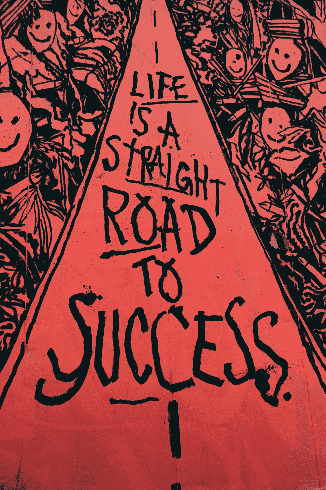
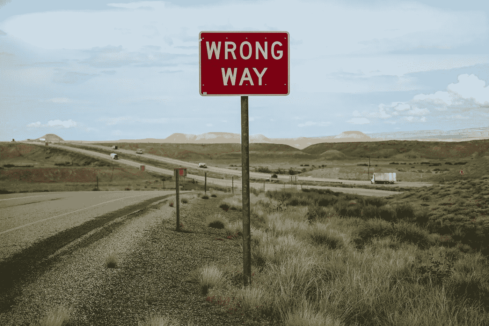

# 学会接受残酷的事实

> 原文：<https://medium.datadriveninvestor.com/learn-to-swallow-hard-truths-1aa9c4c7b4dd?source=collection_archive---------21----------------------->

否则你会被它们噎住。
(二手灵感项目)

Photo by [Malcolm Lightbody](https://unsplash.com/@mlightbody?utm_source=unsplash&utm_medium=referral&utm_content=creditCopyText) on [Unsplash](https://unsplash.com/s/photos/success?utm_source=unsplash&utm_medium=referral&utm_content=creditCopyText)

**二手灵感项目从一句励志名言开始，在创意之路蜿蜒的任何地方冒险。**

> “你认识到真相，因为有时它很难吞咽，但如果你把它含在嘴里，拒绝吃它，你就会窒息。”—莫妮卡·约翰逊

如果你正在读这篇文章，你可能是一个成功者。你想对这个世界产生积极的影响。但是，任何努力致富或克服失败的人都知道，成功伴随着一些残酷的现实。

也许你应该检查那些令人不快的事实，以理解你是否阻碍了你实现目标。也许需要的是花时间重新考虑、检查和调整你的方法，这样你就有最好的机会有效地前进。

 [## 良好的生活是习惯的形成|数据驱动的投资者

### 过度思考是过度紧张。仅仅几个简单的习惯就会在一天中产生巨大的影响。那是…

www.datadriveninvestor.com](https://www.datadriveninvestor.com/2020/01/17/a-good-life-is-habit-forming/) 

有些事实是苦药——你不会喜欢它的味道，但接受并吞下它会让你变得更好。这里有一些精选的严酷事实——它们可能想起来并不愉快，但是理解它们会改善你的生活。

# 完成任何事情都需要时间和精力。

成就不会偶然降临到你头上。

不要等到完美的计划或星星排成一行，才开始一点点地实现目标。朝着正确方向迈出的一步就是进步。但是要愿意付出努力，做脏活累活。

永远不要疲惫不堪。不要无所事事地等待或者只是简单地希望成功。争取吧。

# 你不需要赢得每一场争论。

把你的自负排除在外。同意不同意没关系。

在“赢得”一些小分歧的过程中，你可能会推开信任的朋友、亲戚或盟友，他们能给你的生活带来积极的影响。一时的小胜利可能会变成重大的长期损失。

# **吹牛是蹩脚的。**

没有人喜欢炫耀。

寻求关注会让你显得绝望和业余。正如华特·培顿所说，“当你擅长某事时，你会告诉所有人。当你擅长某件事时，他们会告诉你。”

不要追逐影响力，不要吹嘘自己有多了不起。只要你出类拔萃，别人就会不可避免地被你的优秀所吸引。

Photo by [Free To Use Sounds](https://unsplash.com/@freetousesoundscom?utm_source=unsplash&utm_medium=referral&utm_content=creditCopyText) on [Unsplash](https://unsplash.com/s/photos/wrong-way?utm_source=unsplash&utm_medium=referral&utm_content=creditCopyText)

# 如果你走错了路，就不容易回头。

扭转你的生活就像扭转一个物理对象。牛顿第一运动定律适用:匀速运动的物体将保持直线运动，除非受到外力作用。

如果你的进化以一定的速度沿着一条道路前进，没有外力帮助改变你的方向，你很难改变方向和速度。

这种外部力量可能是一个有影响力的人或团体，一种有害的习惯或成瘾，或者像宗教或冥想这样的精神影响。无论如何，在没有外力的情况下，要在生活中来个 180 度大转弯是很有挑战性的——光靠意志力是远远不够的。

# 你是可以牺牲的。

人们高估了他们在工作中的重要性。

当然，如果你辞职，换部门，或者去另一家公司，你以前的同事可能会感到不舒服。但是在大多数情况下，他们会处理好的，有人会以类似或更好的方式做你所做的。

没有人愿意承认这一点，但是除了在极少数情况下……大多数人是完全可以替代的。

# **说到人的忠告，买者自负。**

意见和建议通常是免费的。嗯，你会得到你所付出的。

所以要意识到，好心的友好人士最终可能会给你蹩脚的建议。这每天都在发生。

# **打破规则可能会触发你想要的结果。**

领导者有足够的信心去违反其他人都遵守的协议。

偏离公认的规范并不容易。我们一生都在遵守父母、老师、导师、教练和主管为我们制定的规则。挑战现状需要你有意识地转变心态。

在你的职业生涯中，你认为哪些准则是事实？你为什么继续跟踪他们？

成功人士会问这些问题，然后分析答案。如果回应是*的微弱变化，这就是一贯的做法*，那么他们会考虑反其道而行之，尝试不同的东西。

# **在网上斗嘴是愚蠢的。**

说真的。毫无意义。被引诱到社交媒体上的来回争论就像走过某人的院子，尽管清楚地看到了一堆狗屎，却故意踩在狗屎上。

在推特上发火的人，一定需要在网上释放一些现实生活中无法释放的紧张情绪。努力超越所有这些琐碎的，人为的戏剧。

Photo by [James Coleman](https://unsplash.com/@jhc?utm_source=unsplash&utm_medium=referral&utm_content=creditCopyText) on [Unsplash](https://unsplash.com/s/photos/fear?utm_source=unsplash&utm_medium=referral&utm_content=creditCopyText)

# 恐惧是你的指南针。

为了得到你想要的，追逐你的恐惧，而不是逃避它们。

如果你急于做某件事，或者认为自己做不好，这是一个信号，表明你应该去做，或者至少去尝试。我通过公开演讲、[写书](https://www.amazon.com/Everything-Wrong-Feels-Adrian-Potter/dp/109519061X/ref=sr_1_4?qid=1560264651&refinements=p_27%3AAdrian+S.+Potter&s=books&sr=1-4&text=Adrian+S.+Potter&fbclid=IwAR1sK42MI2drdSI1VWJB-9pSq-lbUkoYBCWvSIKlmotVTllQ2hJ46DzqCn0)，跑 5k，修改我的育儿方式，学会了这一点。

抛弃你的舒适区，走向未知是获得新体验和实现自我的最佳方式。

严酷的事实很难接受。许多人，冒着危险，根本不会承认或学习这些和其他类似的概念。

但是适应是生存和发展的关键。如果你抛弃了生活中的坏想法，这不是示弱。这是关于进化成一个更好的你——认识到你足够强大和自信去放下那些可能阻碍你的事情。

**阿德里安·s·波特**是一名作家、工程师、顾问和演说家。他写诗歌、短篇小说和各种主题的文章，包括创造力和个人成长。他是诗集《T4》和散文集《自我手册》的作者。在[http://adrianspotter.com/](http://adrianspotter.com/)在线拜访他。

# 附加文字

[有些事情就是不值得](http://Additional Writing)

[控制叙述](https://medium.com/datadriveninvestor/controlling-the-narrative-4b15b06f9dfa?source=friends_link&sk=bb151decdd5094b738b1c4e0d5051e39)

[成为别人的学生](https://medium.com/@adrianpotter/become-a-student-of-others-df547f728b7e?source=friends_link&sk=87f55476227ba9edf6a6ab3205ceabfa)