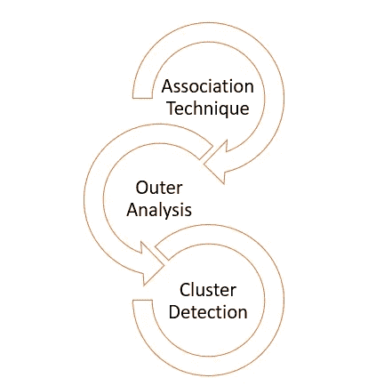
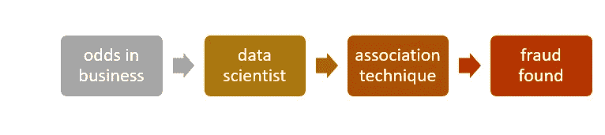
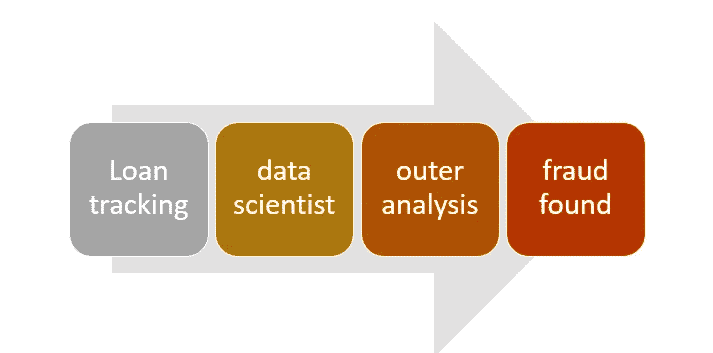
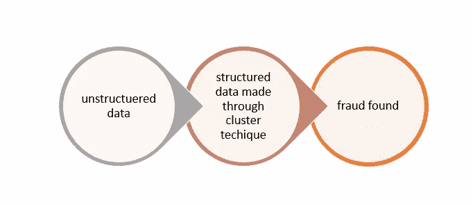
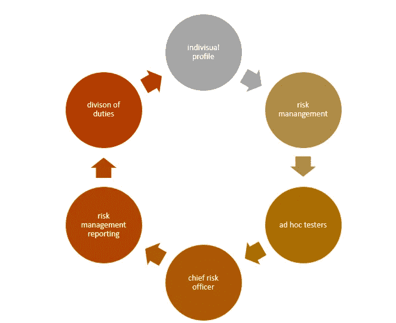

# 数据科学中的欺诈检测分析

> 原文：<https://medium.datadriveninvestor.com/learn-what-is-fraud-detection-analysis-in-data-science-99b762660122?source=collection_archive---------7----------------------->

Photo by [Markus Spiske](https://unsplash.com/@markusspiske?utm_source=medium&utm_medium=referral) on [Unsplash](https://unsplash.com?utm_source=medium&utm_medium=referral)

数据科学家的工作是获取公司的非结构化数据，并使其结构化。一旦做到这一点，企业所有者就可以做出以数据为中心的决策，这将提高公司的生产力，并使公司免遭欺诈。数据科学家用来检测企业中欺诈的流程称为欺诈检测分析。在本文中，我们将讨论:

1.了解欺诈检测。

2.欺诈检测技术。

3.欺诈检测流程。

4.数据科学是 2020 年的热门职业吗？

5.学习数据科学的资源。

# 了解欺诈检测

Photo by [Stephen Phillips — Hostreviews.co.uk](https://unsplash.com/@hostreviews?utm_source=medium&utm_medium=referral) on [Unsplash](https://unsplash.com?utm_source=medium&utm_medium=referral)

谷歌、亚马逊和网飞等技术巨头利用欺诈检测技术。他们雇佣了一名数据科学家来调查公司的数据，寻找其中的漏洞。

例如，有数百万个谷歌 Gmail 账户。在这些帐户中，一些 Gmail 帐户处于非活动状态，一些帐户发送垃圾邮件。不活动的帐户和垃圾邮件可用于实施欺诈。数据科学家的工作就是找到这些账户并消除它们。

 [## 重新人性化数据和分析|数据驱动的投资者

### 我对社交媒体有点又爱又恨。我读了别人不得不说的足以让我生气的话…

www.datadriveninvestor.com](https://www.datadriveninvestor.com/2020/03/09/rehumanizing-data-and-analytics/) 

类似的概念也出现在网飞。有些帐户已经到期，表明帐户持有人不再使用网飞。数据科学家将执行欺诈检测分析来找到这些帐户。然后，一封电子邮件将被发送到帐户，让他们知道他们已经达到了他们的到期日期，他们需要再次订阅才能使用它们。

# 欺诈检测技术

过去，检查大量数据极其困难。随着欺诈检测分析的推出，业务正在改变其发展方向。了解客户的观点可以帮助创造前所未有的销售业绩。

数据科学家执行三种类型的欺诈检测分析。下面将逐一解释，以便您对它们有更好的理解:

## 1.联想技术

这是一种用来发现商业运作中任何异常的技术。例如，我有一个朋友经营一家数字营销公司。每年，他都会看到年度销售报告，并发现他没有产生足够的投资回报(ROI)，尽管他的业务是盈利的。起初，他认为这可能是一个技术错误，但一旦事情变得重复，他的担忧就开始了。

后来，他聘请了一位 [**的数据科学家**](https://medium.com/datadriveninvestor/3-must-have-communication-tips-for-a-data-scientist-4a01626b8217) 来分析这个问题。他利用联想技术发现有一名心怀不满的员工正在从公司窃取资金。这名员工立即被解雇了，这使公司避免了未来的损失。

## 2.外部分析技术

外部分析主要由金融机构用来检测欺诈。假设银行 A 向其员工提供了 4000 美元的初级贷款。同样，这个人又借了 5000 美元。一段时间后，贷款金额为 10，000 美元。

那么，为什么银行会借这么多钱给一个还没有偿还前一笔贷款的人呢？这是因为银行员工修改了财务报表，并向银行表明之前的贷款已及时偿还，而事实并非如此。一种被称为**外部分析**的数据科学欺诈检测方法可以检测到这种欺诈。

## 3.聚类检测

为了进行**聚类检测**，数据科学家需要执行三项操作，即决策树、假设测试和干扰统计。

在这种技术中，首先将非结构化数据转换成结构化数据。然后，结构化数据被划分以形成相似的集合。彼此相似的数据点被保存在一个集合中，而不同的数据点被分成另一个集合。现在检查欺诈检测的差异和相似性。

# 欺诈检测流程

[**数据科学家**](https://medium.com/datadriveninvestor/3-must-have-communication-tips-for-a-data-scientist-4a01626b8217) 用六步法检测数据造假。让我解释一下每一个细节，这样你就可以在脑海中描绘出它的样子。

> 步骤 1:数据科学家创建一个他们认为可能发生欺诈的个人档案。
> 
> 第二步:现在数据科学家创建一个 [**风险管理**](https://medium.com/datadriveninvestor/enterprise-risk-management-what-is-it-and-why-you-need-it-fe98f53fd007) 图表，并呈现在管理层面前。
> 
> 步骤 3:现在，在临时测试人员的帮助下，数据科学家找到了欺诈区域。
> 
> 步骤 4:数据科学家任命首席风险官，他可以在组织的所有部门之间建立清晰的沟通。
> 
> 步骤 5:为了减少管理人员的焦虑和沮丧，数据科学家以一种让他们放松的方式呈现报告。表示报告是以正式的语气呈现的。
> 
> 步骤 6:一旦提交，数据科学家在他们的同事之间分配职责，并重复这个过程。

# 数据科学是 2020 年的热门职业吗？

答案是响亮的是。几家公司正在寻找能够识别、整合和利用他们的数据的数据科学家**。这表明他们需要数据科学家来识别欺诈领域，整合可能带来未来机会的数据，并利用非结构化数据。**

# **学习数据科学的资源**

**为了学习数据科学，你需要掌握 [**数据分析课程**](https://www.upgrad.com/) ，这些课程将教你如何讲决策故事。这些 [**机构**](https://www.simplilearn.com/) 中教授的数据科学课程将教会你数据科学的重要性，这将有助于你以后获得一份好的有薪工作。**

**总而言之，数据科学对欺诈检测非常有用，绝对是 2020 年的一份好工作。**

## **访问专家视图— [订阅 DDI 英特尔](https://datadriveninvestor.com/ddi-intel)**