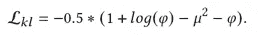

# 从异质混杂环境中学习稳定图

> 原文：<https://medium.datadriveninvestor.com/learning-stable-graphs-from-heterogeneous-confounded-environments-99710e1bd36e?source=collection_archive---------20----------------------->

*下载“*[*【KDD 论文云知识发现】*](https://resource.alibabacloud.com/whitepaper/cloud-knowledge-discovery-on-kdd-papers_2592) *”白皮书，探索 12 篇 KDD 论文和 12 位阿里巴巴专家的知识发现。*

*作者:何越，，马建新，，，，俞宗怡*

# 背景

图可以用来描述事物之间的普遍关系，这些关系可以编码成参数化的图结构，例如邻接矩阵。基于专家的图形合成方法需要昂贵的手动收集的信息。很难在广泛的生产和日常生活环境中部署合成图。这推动了数据驱动的图形生成算法的研究。数据驱动的图形生成算法旨在构建一个能够最好地描述输入数据生成过程的图形。例如，在推荐场景中，输入数据可以是买家的购物记录，产品网络图表达了项目之间的关系强度。数据驱动算法严重依赖于数据的条件独立性假设。这个假设规定训练场景和测试场景具有相同的数据分布。如果不满足这一假设，图形性能会显著下降。事实上，独立性假设是非常脆弱的。数据采样过程受到时间和空间的限制。比如网购人群中，女性通常比男性占比更大，年轻人比老年人占比更大。基于这一事实得出的图表显示，年轻女性比其他群体更受青睐。因此，提高图结构的泛化性能是有意义的。

# 挑战

通过学习因果图，我们可以直接捕捉到事物之间不变的因果关系，以保证稳定性。然而，因果图的学习需要高度复杂的计算，并且很难将学习过程应用于大型网络。此外，因果图是一种有向无环图(DAG ),不能描述广泛的、基于场景的循环结构。图结构包含复杂的高阶非线性关系。这使得很难直接在原始图结构空间(如邻接矩阵)中纠正偏差。另外，用于生成图结构的输入数据是高维稀疏的，比如 set 数据类型。本文介绍了 SGL，一种用于在异构混杂环境中学习稳定的通用图结构的方法。

# 模型

为了适应更一般的场景，我们假设输入数据是集合类型的，它是高维稀疏的。集合数据记录的生成可以看作是向一个空集逐个添加元素直到该集合饱和的过程。对于第 m 个数据环境，将每个元素 IkIk 添加到给定集合 s 的概率等于该集合的条件生成概率 p(m)(Ik|s)p(m)(Ik|s)。显然，pm (I_k│s) pm (I_k│s)与图结构 G(m)G(m)中包含的元素关系有关，可以表示为:

在各种异构环境中，由于采样偏差，条件生成概率是有偏差的。假设环境选择是随机的。每个环境的概率空间平均起来就是一个无偏环境的估计。

图结构充满了高阶的非线性关系。这使得很难在图结构的参数空间(邻接矩阵)中直接消除偏差。但是，如果我们可以建立从图结构到条件生成概率的映射，并在生成概率空间中平衡这些偏差，我们就可以间接地纠正这些偏差。

# 基于图的稀疏集生成

按照前面的思路，首先要做的是建立从图结构到条件生成概率的映射。假设存在不同的有偏数据环境，我们可以首先使用基于联合出现频率的方法在每个环境中创建初始图，每个点代表一个集合中的一个元素。SGL 框架由两个模块组成。第一个模块是图形卷积神经网络，它将初始图形的结构特征嵌入到输出元素表示中。通过汇集一个集合的所有元素表示，我们可以获得这个集合的特征向量。特征向量被传递到第二模块，元素级变分自动编码器(E-VAE)。该模块重构真实数据并学习集合生成概率。我们可以通过用编码器处理集合的特征向量来获得隐藏空间分布。我们还可以从编码向量中抽取一个隐藏向量，并结合每个元素的表示对该隐藏向量进行解码。这导致每个元素的强度被包括在集合中。然后，我们将所有元素的强度投影到概率空间，以输出集合生成概率。假设输入集是饱和的。我们可以重建原始数据来学习环境中的条件生成概率空间。换句话说，我们要对真实样本的输出概率应用条件。在我们添加新的采样元素后，我们保持集合不变，以最大化真实样本的出现概率。

考虑到数据集的稀疏性，我们使用负对数似然函数作为优化模型学习的目标函数。

我们还优化了 E-VAE 中隐藏分布和预定义正态分布之间的 Kullback-Leibler (KL)散度，如下所示:

# 学习稳定的图形结构

通过训练在每个环境中共享相同参数的图卷积网络和 E-VAEs，我们可以获得在不同环境中相同输入集的条件生成概率。假设我们正在初始化一个无偏数据环境的图形结构。我们可以优化这个图的结构，使得这个图输出的无偏环境的生成概率是所有有偏环境的生成概率的平均值。这可以产生稳定的图形结构。

考虑到各部分之间的相互作用，我们联合优化了 GCNs、E-VAEs 和稳定图结构的邻接矩阵。经过 SGD 框架的优化，该模型适用于更大尺寸的图形。

# 实验

为了验证模型的有效性，我们分别在模拟数据和真实数据上进行了实验。在模拟数据实验中，我们使用有偏随机行走来生成在两种环境中具有不同数据分布的行走路径。随机漫步使用 p_0(零阶相关性，如用户的优先偏好)、p_1(元素的一阶相关性)和 p_2(元素的二阶相关性)来控制两个环境之间的差异程度。分布差异与 P0、P1 和 p2 的值成正比。然后，我们使用每个环境中的训练数据来创建基于联合出现频率的图表。这样，我们获得了两个具有不同隐含关系的图。

分别为这两种环境创建了频率图 G1 和 G2。我们的基线模型应用了等式 GA=(G1+G2)/2，并将两种环境的数据均匀且成比例地混合，以构成频率图 GC。基于 G1、G2 和训练数据，我们学习了稳定的图结构 GS。

为了测试不同图结构的稳定性，我们设计了一个集合预测任务。首先，我们将测试集分为目标元素和剩余的已知元素。给定从图结构学习的元素表示和测试集的已知元素，我们的目标是从所有候选节点中选择目标元素，也就是说，选择与该集的剩余元素最接近的元素。然后，我们以 0:10、1:9、…、10:0 的比例混合两种环境的测试数据，得到 11 个测试组。我们收集了从不同图结构中学习到的元素表示的统计数据。我们使用元素表示之间的平均 COS 距离来测量具有不同数据分布的多个测试组中的预测准确性。为了保证实验的公平性，我们使用相同的 GCN 来学习不同图形的元素表示。

根据以下结果，图内关系在单个环境中的适用性随着另一个环境中数据的增加而降低。当计算每个环境中的图的线性平均值时，不考虑图内非线性关系。通过混合各种环境中的数据来进行图形合成的方法不能避免传统图形合成方法中固有的模型偏差。这种方法也不能解决零阶相关性问题，例如用户先前偏好之间的差异。可以使用稳定的图形结构来实现具有最小标准偏差的最佳预测精度。原因是这个图可以平衡不同测试环境中高阶、非线性关系的偏差。

真实数据实验在两种场景下进行:用户人群之间的差异和各种产品之间的暴露差异。第一种情况涉及不同用户群的不同比例。第二种情况涉及主导产品在不同环境中的不同流行程度。针对用户人群的差异，我们将男性和女性用户分为两种环境。对于各种产品之间的曝光差异，我们首先确定了热门产品。然后，我们根据每条记录中受欢迎产品的比例是否超过 50%，将所有购物记录分为受欢迎-占主导地位的环境和不受欢迎-占主导地位的环境。用于验证基线模型和预测任务的实验与模拟数据实验相同。

实验结果表明，不同环境下的预测难度不同。女性的购物行为比男性更容易预测。这可能是因为女性比男性对高度相关的产品更感兴趣。此外，对于包含许多热门产品的购物记录，预测更容易。这可能是因为热门产品之间的相关性更高。SGL 可以从不同的环境中学习更多的通用信息，以达到最佳的预测率。

# 摘要

我们提出了 SGL 学习框架，从异质混杂环境中学习稳定的图结构。通过基于图生成稀疏数据，该框架建立了从图结构到生成概率空间的映射。然后平衡生成概率空间中的有偏信息，以纠正图的结构偏差。实验表明，该方法能够提高图结构的稳定性，为实际问题提供有效的解决方案。

# 参考

[1]拉达·阿达米克和埃坦·阿达。2003.网上的朋友和邻居。社会网络 25，3 (2003)，211–230。亚历山大·博伊切夫斯基、亚历山大·施库尔、丹尼尔·zügner 和斯蒂芬·günnemann.2018.Netgan:通过随机漫步生成图形。arXiv 预印本 arXiv:1803.00816 (2018)。
[3]彼得·bühlmann、乔纳斯·彼得斯、简·欧内斯特等人 2014。CAM:因果可加模型、高维序搜索和惩罚回归。统计年鉴 42，6 (2014)，2526–2556。[4]阿布舍克·古普塔、科林·德文、刘宇轩、彼得·阿比勒和谢尔盖·莱文。2017.用强化学习学习不变特征空间转移技能。arXiv 预印本 arXiv:1703.02949 (2017)。
[5]基洛·古普塔、穆昆德·耶拉汉卡·拉古普拉萨德和潘克胡里·库马尔。[未注明]。一种用于协同过滤的混合变分自动编码器。([未注明])。
[6]姜波、张紫妍、、、。2019.基于图学习的半监督学习-卷积网络。IEEE 计算机视觉和模式识别会议论文集。11313–11320.
[7]迪耶德里克·P·金玛和马克斯·韦林。2013.自动编码变分贝叶斯。arXiv 预印本 arXiv:1312.6114 (2013)。

*本文观点仅供参考，不一定代表阿里云官方观点。*

# 原始来源:

 [## 从异质混杂环境中学习稳定图

### Alibaba Clouder 年 10 月 15 日 142 下载《KDD 论文中的云知识发现》白皮书，探索 12…

www.alibabacloud.com](https://www.alibabacloud.com/blog/learning-stable-graphs-from-heterogeneous-confounded-environments_596746)