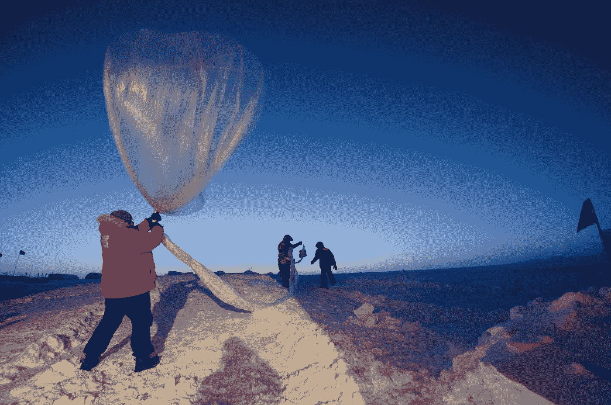

# 2021 年学会看

> 原文：<https://medium.datadriveninvestor.com/learning-to-see-in-2021-e3b19549300e?source=collection_archive---------24----------------------->

## 我们需要了解事情是如何变化的

Photo by [NOAA](https://unsplash.com/@noaa?utm_source=medium&utm_medium=referral) on [Unsplash](https://unsplash.com?utm_source=medium&utm_medium=referral)

*作者迈克·迈耶~檀香山~ 2021 年 1 月 4 日*

一系列奇怪的事件汇集在一起，让我对我们面临的未来有了新的认识。我们都知道，我们在 2020 年蹒跚地进入了未知的领域，回到我们所知的世界的大门不仅关闭了，而且消失了。

那扇门消失的原因很恰当地是我们的部分人口因失去过去而拼命反抗的行为。由于无法利用精神病患者和罪犯迫使我们回到过去，他们甚至成功地抹去了锁着的门的轮廓。这就是我们这个新世界的讽刺之处。

具有讽刺意味的是，完全失去了任何回到旧世界的痕迹，这是一个奇怪的事件。事实上，每个人都完全厌倦了看唐纳德·特朗普(Donald Trump)的精神崩溃从悲剧走向残酷危险，这是这种融合的一个重要因素。甚至[以前的法西斯罪犯](https://www.washingtonpost.com/opinions/10-former-defense-secretaries-military-peaceful-transfer-of-power/2021/01/03/2a23d52e-4c4d-11eb-a9f4-0e668b9772ba_story.html)也对川普陷入无休止的胡言乱语和所有自恋的愤怒症状感到震惊。这不会有好结果。

这些是展现艰难未来的奇怪合流中最明显和最大的组成部分。在新的一年的第一周，我们非常努力地与过去决裂，并建立一些新的开始，即使它在一月底崩溃。今年我不认为我们能熬过第一周。

看着特朗普党的大量国会议员宣布煽动叛乱是好的，而摧毁美国是他们的目标，除了另一个糟糕的结局，他们几乎没有任何余地。这是一个众所周知的事实，不足为奇，这使得公民们拯救国家的疯狂努力以失败告终。当特朗普在 2016 年的虚假选举中当选时，这一选择不再可能。

驱使人们在绝望的情况下挣扎的东西正是造成这种情况的原因。人们自欺欺人，违背一切逻辑和科学，相信自己想要的东西。对于那些决定相信致命谎言的人来说，后果对每个人都是致命的。在这个气候危机的时代，我们无法逃避出现在我们周围的科学后果，这些致命的后果是全球性的，而不仅仅是地方性的。

政治灾难到此为止。混杂在一起的还有其他因素。

很明显，我们的短期思维是我们文明濒临灭亡的一个主要因素。这一点在 20 世纪末就已经为人所知，但气候危机迫使我们为多个世纪做计划，这一事实使得这一点在 2021 年初变得显而易见。

五年是“长期”的想法需要消除。气候灾难已经不可阻挡，未来三十到五十年的问题是我们是否能减缓它。自 1996 年以来，Long Now 小组一直致力于实时重新关注我们的物种:

> 这就是 Long Now 基金会的使命。自 1996 年(他们称之为 01996 年)以来，他们一直致力于鼓励以各种创造性的方式进行长期思考。一个例子是建造一座[长时间的](http://longnow.org/clock/prototype1/)钟，它将在最少的人为干预下运行一万年。

对于现在活着的人来说，我们需要停止允许那些我们知道会扼杀人类文明的不可避免的事情出现。这个星球的目标需要非常迅速地转向后资本主义经济，以强有力的计划和公共所有权为基线。

如果你还没有这样做，读读[金·斯坦利·罗宾逊的*未来部*](https://smile.amazon.com/Ministry-Future-Kim-Stanley-Robinson-ebook/dp/B084FY1NXB/ref=pd_ybh_a_4?_encoding=UTF8&psc=1&refRID=Q41EFW05XC8DK1JPDERM) 。这是一部小说，但属于新的类型。我把它看作是未来的小说，作为一个计划装置，对我们主要的超客体的分析，以及对无论我们喜欢与否都会发生的事情的警告。在这方面有大量的研究，并且有几个好的故事在探索这将如何在未来的二十年中发生。很多事情是可以做的，但是现有的经济和政治制度不允许。必须对付那些阻碍重大变革的人，否则事情可能会失控。

所有关于事情如何不同的谈论通常很快就消失在所有日常问题中，这些问题没有改变，只是增加了。如果你想知道事情真的会发生怎样的变化，不是具体地，而是在可能性的范围内，请阅读西蒙·斯特伦哈格的《电力状态》。

这是一部图文并茂的小说，远远超出了我们现在处理的范围。我不知道这是什么意思，但它符合这里提到的所有奇怪的事情。

**访问专家视图—** [**订阅 DDI 英特尔**](https://datadriveninvestor.com/ddi-intel)