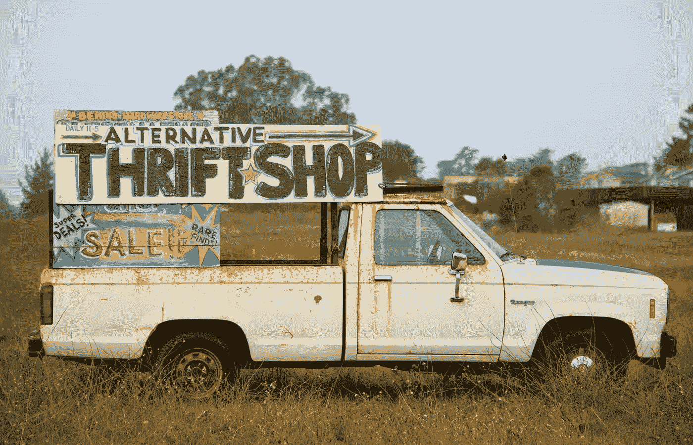

# 管理人工智能项目组织的经验

> 原文：<https://medium.datadriveninvestor.com/learnings-of-running-an-ai-project-organization-with-100-students-583625557449?source=collection_archive---------8----------------------->

这一切是如何开始的…以及技术管理和执行的一些亮点和不足。写在 covid 的中间，而我从我的期末考试学习拖延。

# **潜在动机**

去年 8 月，在香港一个雾蒙蒙、酷热的下午，在我往返于实验室的地铁上，我有很多时间思考 AI/ML 在我们当前本科教育中的状况。在该领域实习或研究的机会几乎不可能获得——大多数都需要至少几年的经验，相信我，与 MS/PhD 级别的申请人竞争并不好玩。

没有经验的学生怎么会有经验呢？这是一个**冷启动问题**。

One would never leaves a puppy in the cold

即使你设法获得了实习机会，预先确定的研究主题也可能不是 100%符合你的兴趣，我已经听到了不少关于在以研究生为中心的实验室中只进行数据收集的“疯狂”评论。相信我，我明白正确收集数据的重要性(另外，我的一个项目失败了，因为在这个过程中缺乏严格性，稍后会详细介绍)。但我要说的是，看到整个机器学习管道是如何运作的更有激励性。毕竟，人们很容易被人工智能涉及的知识(线性代数、概率、微积分、领域知识、编程，仅举几例)所淹没，我想优先培养那些初学者的好奇心和动机。

 [## 人工智能和监督资本主义|数据驱动的投资者

### 大科技，总是现在:人工智能推动的大科技，已经使购物，搜索，在你的…

www.datadriveninvestor.com](https://www.datadriveninvestor.com/2020/03/04/on-artificial-intelligence-and-surveillance-capitalism/) 

在计算机科学中，一直强调构建个人项目。他们说，这对你的投资组合有好处，还能让你把手弄脏。你知道，通常的建议。如果一个软件工程师独自从他们的地下室创造出一个改变世界的产品，那不是很棒吗？

但在人工智能领域，它不仅仅是精通编码。**一个完整的人工智能系统包括制定问题和估计适当的成本，获取，清理，预处理，标记和扩充数据集。培训中的故障排除和调试，然后部署一个可重现和可扩展的模型。**这需要一个跨学科的团队，而不是一个人的任务。

哲学家和政策制定者需要控制自动化系统的隐私和决策权。需要深层领域的专家来设计最好的特征，无论是神经科学家还是经济学家。对我来说，这一事实正是为什么使用人工智能解决问题如此有吸引力——它涉及**一个多元化的团队通过混合实验和直觉合作并凭经验解决问题**。一定会喜欢那些格子图案的。我想不出有什么*这么牛逼的*。

还有什么比强调创造力、广度和好奇心的文理学院联盟更好的地方呢？因此，在 Zoom 的呼吁下，我组建了一个斗志昂扬的团队，并在克莱尔蒙特学院创办了人工智能项目孵化器&社区 P-ai.org。有经验的项目经理会选择一个主题和领域，在一个学期内完成一个可交付成果。然后，他/她将着手招募项目成员。每个成员专注于他们选择的管道的一个部分。每周会议将促进整个项目的整合——这将是一个团队成员分享他们所做的工作并慢慢拼凑出最终产品的空间。**我们更感兴趣的是如何应用人工智能，而不是追逐 SOTA 的表演。**

现在是我们开始以来的一些想法和反思…

# **1。知道如何灵活地销售和推销是至关重要的。**

P-ai.org 的描述改变的次数太多了。秋季开始时，我固执地让人们理解组织的愿景，我认为没有比…逐字重复使命陈述更好的方法了。不要误会我；在某些时候清楚地传达这个*是很重要的。*

但是伙计们，说真的，你说话的内容和方式要迎合你的听众。一个在技术上非常有天赋的人可能想要深入研究框架的杂草，但这可能不会引起普通商业或英语专业学生的共鸣，他们在这样的团队中同样重要。语言是给予人们正确共鸣的一切。在 TURF dinner(一年一度的俱乐部交易会)上，我们坚持不懈的销售和适应性销售导致了 130+的注册！附注:我学会了不要一遍又一遍地重复同样的音调。我们在一周内从一个没有人知道的全新俱乐部变成了校园里最大的俱乐部之一，我无法感谢我的团队。

We made a sign similar to this for our table, except way less aesthetic

**花 30 秒钟了解与你交谈的人的背景和兴趣，然后给出信息，说明*增加了价值*是某人拒绝你和尴尬走开、得到热情回应之间的区别。**随着时间的推移，邀请教师、研究人员和风险投资家加入顾问委员会，为新生举办信息会议，鼓励有经验的高年级学生在论文季担任领导职务，这些都是如此不同，而且都是出于正确的原因。

# **2。明确责任和期望。**

在我们的发布会上，我们没有营销策略，这导致我在脸书群里忙不迭地发帖，并在前一天晚上发送了一些垃圾邮件。我还要求某人从附近的面包店购买一个馅饼，假设他们会在把它带进来之前烘焙它。然后，在我们发布的第二天 t-30 分钟，我发现自己被困在厨房里，没有工具，只有一个生的冷冻苹果派🥧。在那一刻，烤箱决定不合作，不加热到适当的温度。我压力很大，馅饼根本不可能做好。出于安全原因，我们别无选择，只能把半熟的面团作为装饰品带到我们的活动中，没有人吃。

但是别担心，我们没有浪费食物，有人在烘烤成功后将馅饼带回家与他的朋友分享:)。

我意识到这个计划失败了，因为负责的人太多了，所以没有人真正负责。所以今年春天，我实施了一个问责制，将由一个*人领导每个事件，而不是几个人负责。如果那个人想从我们的平面设计师那里得到一张海报，或者从我们的内容作者那里得到一个简短的帖子，这将由他们来决定。由他们来聚合所有移动的部分。也就是说，团队仍然 100%支持他们正在做的事情，并尽可能地支持他们。*

一旦我意识到我不能按照我想要的方式完成所有的任务，微观管理也不是办法，我就知道需要有效的授权，但我不知道怎么做。

第一学期，我们团队的每个人都参加了每个候选人的面试，并集体做出决定。我们将每个采访限制在 5 分钟以内；一个周六，我们被困在图书馆(采访的地方)五个多小时。通过两个问题和一段简短的问答时间来了解每个人似乎有些仓促，这个决定最终主要是基于他们的简历而不是谈话。由于这种仓促的招聘，一个项目在第一学期后因团队缺乏凝聚力而终止。

我知道如果我们进一步扩大规模，这种形式的招聘将是不切实际的。当切换到让每个项目经理选择他们认为自己与合作良好的人**，并在独立的基础上面试他们的形式时，一切都变了。我为这些一对一的面试制定了指导方针，列出了一系列建议的问题，以及一系列我们认为对我们很重要的不可协商的特征，例如，他们为什么有动力加入一个项目团队，如果学校的工作超过了他们，他们将如何做出贡献(这无疑会发生在大学的每个人身上)。**

我意识到，与我合作愉快的人不一定是那些与每个团队的领导者最合得来的人。我不得不接受放手，让项目经理控制，并承担选择的后果。尽管如此，我仍然要求项目经理每周检查一次，协助他们解决问题(例如团队动态或技术障碍)。我们设定了雄心勃勃的里程碑，但随着工作的进行，也可以进行调整和修改。

# **3。不要重新发明轮子，如果你真的想，就把它做好。**

在我亲自领导的项目团队中，我们的目标是围绕 2019 年的 IPO 进行情绪分析，具体来说，我们的数据由几个月来从 Twitter 上收集的 WeWork 意见组成。在我的实习中，我们在大约 5000 个训练样本上训练了一个非常相似的模型，用于三种分类(积极、消极或中性情绪)，它达到了 78%的准确率。考虑到*低得惊人的*数据量，这是相当惊人的。我想我们可以复制一个类似的结果，或者至少是一个有点接近的结果。但是哦，我错了。

在没有仔细分析大图分布的情况下，我没有意识到大多数推文要么是中性的(来自新闻来源或或多或少带有中性语气的记者)，要么是负面的(由于他们 IPO 失败和员工被解雇)。不平衡的分配导致了一个大问题。模型本质上猜测中性，最大的类标签，给定任何输入和所有时间。换句话说，它没有学到任何东西。

更糟糕的是，我非常不恰当地进行了数据收集和标记过程。由于没有对数据标签员(也就是我的团队)进行适当的培训，也没有统一的标准，我们花了两个周六的早上，吃爆米花🍿同时单调地点击 0，1，2 来逐个标记每条推文。**由于标签没有明确的标准，因此存在很大的分歧，评分者之间的可信度也很低。鲍勃认为这条推文传达了积极的语气，而爱丽丝则收集了消极的讽刺。因此，大多数艰苦的工作最终被丢弃，以确保我们提供给模型的是好的例子。**

当一位教授无意中听到我们团队在做什么时，我被批评为“残忍”😂。但她不知道的是，这是一个很好的结合期，这将有望让人们正确看待亚马逊 MechTurk 上的人全职做什么。当然，我们只做了两个周末。

a live picture taken when labelling data at 9am on a Saturday

重点是这样的:**使用迁移学习从一个预先训练好的最先进的模型中学习才是王道*，*除非你真的知道你在数据收集和标注方面在做什么。避免从头开始训练任何东西。**

最后，快速学习一些其他知识。

*   性格和文化契合度比天赋重要得多——后者可以获得，而前者很难塑造。
*   安排一系列对每个人都合适的会议。任何超过一个小时的时间都会变得无效。
*   主动向你的领导汇报，不要等到问题出现才解决它(当问题出现时，通常为时已晚)。
*   最重要的是，烤馅饼时要带上校友箔，因为它们受热时确实容易碎裂；)

我期待着 P-ai.org 的成长。在这个组织工作的节奏如此之快，有时退一步会很有帮助。我对我们奋斗和解决问题的时刻心存感激。感谢我所有的导师和朋友。**请结帐我们在 Zoom 上主持的** [**学期结束演示的时髦项目**](https://pomonacollege.zoom.us/rec/share/xuIvdYPb5HlJS4XV0RvhVL54PYqiT6a82ndI_vpYmUqMVzQchks_AaY-o8QVqyzl?startTime=1588535175000) **！我很想听听你的想法。**

毕竟，我们都只是本科生，试图在探索和理解 RL 中的 SARSA、Cohen 的 Kappa 等概念的同时获得一些乐趣，帮助我们的模型改进，一次一个训练示例。

**要联系，在 alex.ker@pomona.edu 给我发邮件，** [**推特**](https://twitter.com/alex_s_ker) **，还有**[**LinkedIn**](https://www.linkedin.com/in/alex-ker/)

这是我的第一篇文章，给它一些掌声+与你的网络分享:)