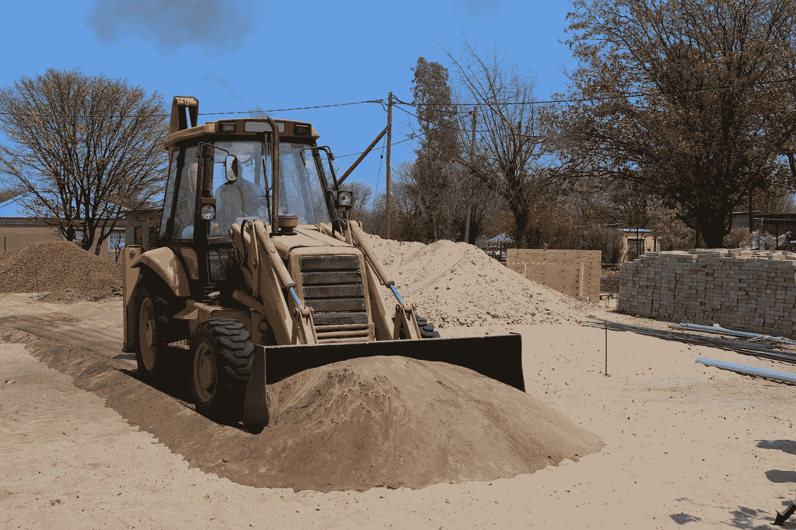

# 租赁设备:资本租赁与经营租赁

> 原文：<https://medium.datadriveninvestor.com/leasing-equipment-capital-lease-vs-operating-lease-56f81930f9f2?source=collection_archive---------8----------------------->

在寻求租赁设备时，有两种主要的租赁结构。让我们讨论一下两者的优点:

让我们从资本租赁开始。资本租赁是指公司或承租人希望设备作为一项资产出现在资产负债表上，但也希望在一个期限内分期付款。租赁的设备被视为公司资产的一部分(即“资本”，因此得名)。事实上，在纸面上，该公司得到了对待设备，好像他们在各方面都拥有它，包括要求折旧的好处。

在资本租赁结束时，通常会有远低于市场价值的买断(例如，1 美元的买断、5%的买断等。)公司/承租人支付最后一笔款项，设备正式归他们所有。

当公司相当确定他们将在租赁到期时保留设备时，可以使用资本租赁。你可以说资本租赁类似于贷款。

但是，如果这些设备是他们*不想让*保留或不想要在他们的资产负债表上的东西呢？这就是经营租赁的用武之地...

**经营租赁**是指公司或承租人实质上支付他们将使用的设备价值部分的租赁。换句话说，卖方或出租方根据期望的租赁期限计算出设备的未来价值(假设正常使用，该设备在三年、四年或五年后的价值)。一般来说，租赁付款是基于未来价值减去当前售价。

 [## 如何在不牺牲孩子或财务的情况下安全理智地离婚|数据驱动…

### 在美国，七月是以孩子为中心的离婚月。作为 cdfaⓡ的专业人士，我可以向你保证，从长远来看…

www.datadriveninvestor.com](https://www.datadriveninvestor.com/2020/07/28/how-to-divorce-safely-and-sanely-without-sacrificing-your-children-or-your-finances/) 

公司的优势在于，他们不直接拥有设备，但仍然可以立即使用。租赁付款被视为利润表上的营业费用(因此得名)，这是相对于较慢折旧的税收优势。此外，设备不会出现在资产负债表上(这是许多公司更喜欢的，尤其是初创企业)。你可以说，从广义上讲，经营租赁类似于长期租赁。

在经营租赁结束时，公司/承租人可以返还设备、再次租赁设备或以未来租赁结束时商定的价格购买设备。你会在车辆、重型建筑设备以及大多数寻求设备租赁的初创公司中看到这种类型的租赁。

*在为您的企业寻找安全设备时，这是两种最常见的租赁类型。要进一步探索您的租赁选择，请访问*[*www.starcadecapital.com*](http://www.starcadecapital.com)

## 访问专家视图— [订阅 DDI 英特尔](https://datadriveninvestor.com/ddi-intel)