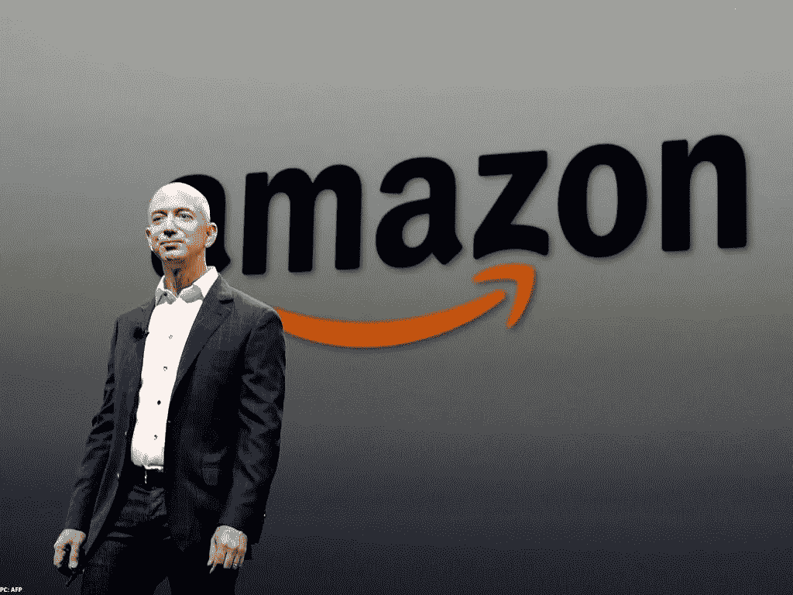

# 留下亚马逊遗产

> 原文：<https://medium.datadriveninvestor.com/leaving-behind-the-amazon-legacy-ba2225ff6cf0?source=collection_archive---------33----------------------->

## 一个时代的终结

亚马逊创始人杰夫·贝索斯宣布，在执掌亚马逊 27 年后，他将辞去首席执行官一职，转而担任执行董事长。他仍将是亚马逊的最大股东。他将把公司的日常控制权交给长期担任亚马逊网络服务主管的安迪·贾西(Andy Jassy ),亚马逊网络服务是一个快速发展的部门，几乎单枪匹马地改变了公司购买推动其业务发展的技术的方式。

随着这一新的发展，现代商业史上最大的一次挤兑部分结束了。在贝佐斯的管理下，亚马逊从一家新贵在线书商发展成为世界上最受欢迎的互联网市场之一，能够快速提供大量产品和服务。他开创了我们网上购物的方式，从顾客评论到 Prime 的疯狂快速发货。

**更上继任者**

安迪·杰西是亚马逊现金奶牛云计算部门的负责人，他在亚马逊存在的大部分时间里都在那里。贾西是贝佐斯最信任的副手之一。他于 1997 年从哈佛商学院毕业后加入该公司。当时，亚马逊只有几百名员工，刚刚上市。这位高管是该公司进军音乐销售的先锋，这是亚马逊在图书之外的首次尝试。

Jassy 在早期帮助推出 AWS 时扮演了一种参谋长的角色，AWS 颠覆了软件行业，因为它能够为客户租赁空间和软件编程，以便在亚马逊的大量服务器上运行他们的技术操作。

除了在亚马逊的工作之外，Jassy 还热爱运动，并且是西雅图国家曲棍球联盟北海巨妖的股东之一。

**贝佐斯现在在做什么？**

首先，杰夫·贝索斯哪儿也不会去。

“作为执行主席，我将继续参与重要的亚马逊计划，但也有时间和精力专注于第一天基金、贝佐斯地球基金、蓝色起源、华盛顿邮报和我的其他爱好，”贝佐斯在[给亚马逊员工的信](https://www.cnbc.com/2021/02/02/jeff-bezos-to-step-down-as-amazon-ceo-andy-jassy-to-take-over-in-q3.html)中写道。“我从来没有这么精力充沛过，这和退休无关。我对我认为这些组织能够产生的影响充满热情。”

**蓝色起源**

贝佐斯于 2000 年创建了这家私营航空航天公司，并向其投入了数十亿美元。在 2018 年接受 Business Insider 采访时，他声称蓝色起源是“我正在做的最重要的工作”，他每年清算 10 亿美元的亚马逊股票，以投资该公司。他工作的核心是坚信太阳能可以养活数万亿人，人类可以有无限的资源。蓝色起源公司计划最早于 4 月 3 日在 T2 将首批乘客送上太空。蓝色起源由贝佐斯于 2000 年创立，目前拥有 3500 多名员工，总部位于华盛顿州肯特市。迄今为止，蓝色起源已经成功发射了 14 次 New Shepard(一种用于太空旅游的运载火箭)，并连续 13 次着陆火箭的助推器。贝佐斯还在 2020 年 12 月声称[他的火箭将会把第一位女性送上月球](https://www.businessinsider.com/jeff-bezos-blue-origin-be-7-rocket-engine-test-artemis-2020-12)。

**第 1 天基金**

“第一天”这个名字来源于贝佐斯在亚马逊工作中采用的第一天心态。贝佐斯在 2018 年和他当时的妻子麦肯齐一起推出了慈善的第一天基金。这两个人开始投资 20 亿美元，目标是支持无家可归的家庭和资助教育机会。它还计划在低收入社区建立一个新的、非盈利的一级幼儿园网络。

**华盛顿邮报**

贝佐斯在 2013 年以仅 2.5 亿美元的价格收购了《邮报》。这一里程碑式的交易被视为广泛提升了贝佐斯的声誉；贝佐斯带领该报实现了业务转型，现在已经盈利，并增加了数百名记者。然而，他并没有参与其编辑愿景，只是专注于数字和技术方面的业务，因为媒体正在从印刷转向。这位大亨不仅用资源，还用从建设亚马逊中获得的技术诀窍，为该公司注入了生命线。他已经被置于特朗普和前妻麦肯齐的交叉火力之中。他甚至受到特朗普盟友的威胁，这些人想用他的裸照敲诈他，以换取他停止任何关于特朗普及其盟友的诽谤文章。

**贝索斯地球基金**

贝佐斯去年承诺投资 100 亿美元，资助科学家、活动家、非营利组织和其他致力于保护环境和应对气候变化影响的团体。“气候变化是我们星球面临的最大威胁，”贝佐斯说。可持续发展是贝佐斯公司的普遍趋势，包括亚马逊。在贝佐斯的领导下，这家科技公司在 2019 年[承诺到 2040 年](https://www.businessinsider.com/jeff-bezos-amazon-climate-change-pledge-2019-9)实现碳中和。

> 现在来谈谈主要问题，贝佐斯将在多大程度上参与亚马逊的新角色？

根据亚马逊总部的说法，贝佐斯将继续参与亚马逊所谓的“单向门”问题——即不可逆转的重大决定，如收购或进入杂货业务，一旦开始就不容易撤销。头衔的变化不会削弱贝佐斯在公司内部的影响力。

斯坦福大学管理学讲师西格尔说，有前 CEO 在身边帮助新的高管团队对公司来说是一个真正的好处。他表示:当新任首席执行官获得权力时，这种安排的效果最佳，员工会认为他控制着企业，并与执行董事长保持着良好的工作关系。安迪·贾西的时代已经到来，他肯定会得到贝佐斯的支持。