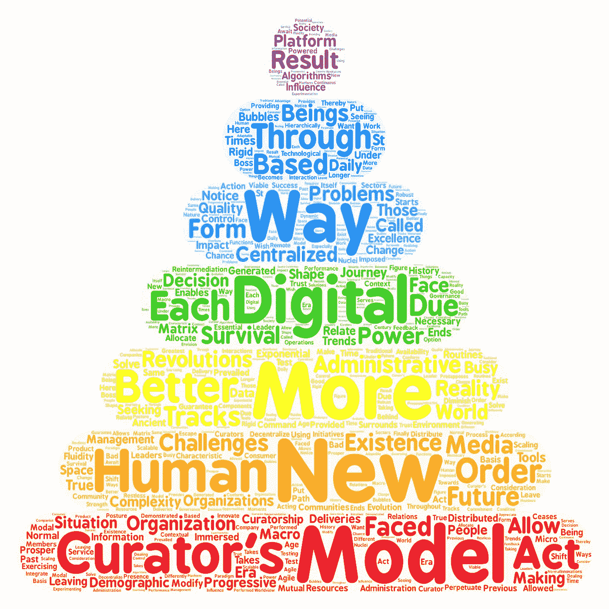

# “离开母体:馆长之路”

> 原文：<https://medium.datadriveninvestor.com/leaving-the-matrix-the-curators-way-4d68a4792bd7?source=collection_archive---------17----------------------->

人们忙于日常事务，沉浸在信息泡沫中，以至于没有注意到塑造未来的宏观趋势。此外，他们没有注意到媒体革命对社会的影响，这种影响影响了人类与周围环境的关系，并使他们能够通过新媒体提供的更好的生存工具来延续自己的存在。

因此，人类在历史上一直面临着技术革命，这些革命使他们能够繁荣并改变自己的现实。因此，命令和控制是一种中央集权的权力行使形式，自古以来在人类组织的管理中普遍存在，以便分配资源来解决这些社区面临的问题。

随着不断增加的人口复杂性所带来的挑战的演变，每次都有更多的赋权举措将这种权力分配到组织的边缘，以便分散决策，从而允许更好地分配决策，考虑每种情况的背景，从而为社区提供更好的生存机会。

 [## 关于数字化转型的 8 个问题投资者应该从每位首席执行官那里得到答案|数据…

### 几乎没有什么比做生意更令人兴奋的了。最吸引人的方面之一当然是投资于年轻的…

www.datadriveninvestor.com](https://www.datadriveninvestor.com/2020/07/06/8-questions-about-the-digital-transformation-investors-should-get-answers-from-every-ceo/) 

因此，在这个数字时代的新世界中，中央集权和等级森严的组织看到它们的行动空间越来越小，在这个新世界中,“新常态”是由于关系的流动性，而不再是以前行政模式所特有的微观管理。

策展是一种基于再中介的新管理模式，组织开始充当由数据驱动的平台，这里称为数字轨道，是一种基于算法的指数级扩展操作方式。

策展人之路是一个旅程，它以领导者的存在为前提，这些领导者作为其部门的真正“策展人”，作为重要的组成部分，以便组织作为一个平台，可以保证向消费者交付的质量，同时，通过使用数字算法和数字轨道生成的每个交互的相互反馈，对其成员的表现进行分布式治理。

这样，传统“老板”的形象就不复存在了，尤其是在远程工作成为一种可行选择的世界里，在这个世界里，高质量的互动、承诺和卓越的交付是基于数字轨道的新型管理模式的基础，在这个世界里，信任是分布式的，“馆长”领导根据在产品和/或服务交付流程的每种情况下要执行的功能，以一种上下文相关的动态方式行事。

这种新的管理模式的最大优势还在于被称为“模式 2”的核心的存在，它允许公司在面临挑战时对自己进行测试，通过实验产生持续的创新。

因此，我们可以说，21 世纪的公司如果希望与这种更灵活、更可扩展、更强健的新管理模式(因为它具有适应性)相结合，就必须抛弃过去，将未来的道路想象为一段通往卓越的旅程，其中有好有坏的时刻，但它允许组织进行创新，并拥有必要的能力来面对不断增长的人口复杂性所带来的挑战。

最后，我们可以认为，策展人的方式服务于那些希望以不同的方式做事的人，那些不随波逐流的人，那些天性不安并寻求不同的人，那些欣赏实验和测试处理问题的新方法并寻求解决方案以改变现实的人。

它需要改变姿态和世界观，而范式转变是实现数字时代所提供的潜力和利用等待那些不会让它们逃脱的人的指数机会的必要条件。

**进入专家视图—** [**订阅 DDI 英特尔**](https://datadriveninvestor.com/ddi-intel)