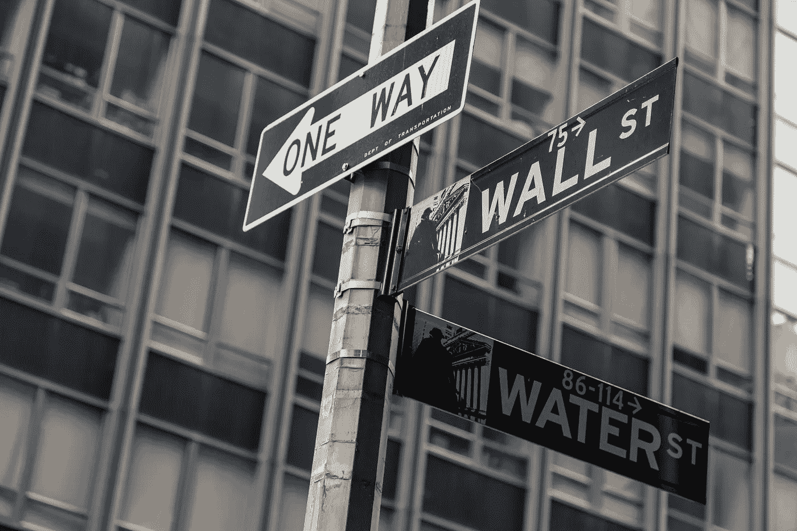

# 传奇对冲基金经理预测恶性通货膨胀即将到来

> 原文：<https://medium.datadriveninvestor.com/legendary-hedge-funder-predicts-coming-hyperflation-98034968b51?source=collection_archive---------0----------------------->

## 一位华尔街内部人士认为，大规模美元通胀即将到来。

Photo by [Uwe Conrad](https://unsplash.com/@uconrad?utm_source=unsplash&utm_medium=referral&utm_content=creditCopyText) on [Unsplash](https://unsplash.com/s/photos/wall-street?utm_source=unsplash&utm_medium=referral&utm_content=creditCopyText).

## 即将到来的风暴

一位因预测货币涨跌而发家的华尔街基金经理声称，美国及其货币将经历几十年未见的通货膨胀水平。

都铎投资公司(Tudor Investment Corporation)的创始人保罗·都铎·琼斯写了一封投资信，他在信中警告他的追随者，美国正在目睹一场“T2 式的大货币膨胀”，这将导致有史以来最大的货币扩张。

都铎说，这将带来一个恶性通货膨胀的时代，对整个美国社会产生深远的影响。他不是唯一一个警告这种现象正在发生的华尔街和金融界内部人士。绰号“末日博士”的努里埃尔·鲁比尼警告说，美国房地产市场可能在被证明是正确的之前崩溃，他还认为货币贬值是他对 2020 年代即将到来的“更大的萧条”的[定义趋势之一](https://www.theguardian.com/business/2020/apr/29/ten-reasons-why-greater-depression-for-the-2020s-is-inevitable-covid)

美国银行投资报告[涵盖了之前的](https://medium.com/geopolitics-in-focus/the-2020s-will-be-a-decade-of-revolutionary-change-e2553c90995)，明确警告说，由于中央银行不断印钞，我们可以预期通货膨胀率会上升。值得注意的是，这份报告是在新冠肺炎袭击之前，在世界各地的银行做出大规模反应，导致空前数量的资金注入世界各地的经济体之前撰写的。

 [## 美国银行:全球化正在终结

### 世界正进入“高峰期”的十年，全球化正在结束。

medium.com](https://medium.com/politics-fast-and-slow/bank-of-america-globalisation-is-ending-d652963d3ef1) 

要理解都铎的预测，我们需要了解现代美元的历史。

目前的美元形式是在 20 世纪 70 年代初所谓的“尼克松冲击”中创造的当时，尼克松总统为了应对日益加剧的经济波动，取消了美元的金本位制。

这意味着一美元的价值不再与黄金价格挂钩。通过这样做，他将美元变成了法定货币，一种没有任何有形资产支持的货币，其价格由政府指令和市场逻辑决定。

这一决定结束了美国在第二次世界大战后构建的国际金融体系，也使一些激进的政策成为可能。其中最重要的被称为量化宽松。

量化宽松，有时也被称为“印钞”，是指央行决定向流通领域引入更多货币。这样做有很多原因，但这是有代价的。当更多的货币被引入一个经济体时，该货币将违反供求规律，并发现自己正在贬值。这被称为“货币贬值”，是通货膨胀和商品成本增加的根本原因。

当美元仍然与金条价格挂钩时，这样的问题是不可能的，但现在它是一种“自由浮动”的法定货币，它见证了其价值的真正惊人的下降——自上世纪初以来价值下降了约 94%。

## **疫情印刷**

虽然逐渐贬值似乎是货币体系的主要特征之一，事实上每一种主要货币都经历了同样的故事，但保罗·都铎·琼斯显然担心贬值会很快加剧。

他担忧的根源可以从去年的变化中找到。疫情促使世界各国复制中国的社会封锁模式，以遏制病毒。事实证明，这种封锁对经济依赖消费的西方发达国家尤其有害。

美国是历史上最富裕的社会，其经济产出的 70%依赖于国内消费。举例来说，这使得它比像中国这样的国家更有弹性，更自力更生，但这也意味着当人们不能花钱时，将会出现大规模的经济冲击。

事情就是这样。在疫情的最初几个月，美国见证了其历史上从未见过的经济产出下降，经济收缩超过 30%，失业率达到大萧条水平。

这造成了痛苦和贫困的螺旋上升，看起来几乎引发了第二次大萧条，因为中产阶级的小企业作为就业的主要来源和税收基础的支撑，被迫集体关闭。

由于担心即将到来的灾难，美联储开始了一轮量化宽松政策，旨在保持货币在整个经济中的势头。这一轮 QE 远远超过了 2008 年危机后实施的那一轮。仅从今年 3 月开始，美联储的资产负债表上就增加了近 4 万亿美元。

在所有流通的美元中——[**18%是今年**](https://www.cityam.com/almost-a-fifth-of-all-us-dollars-were-created-this-year/) 印制的。事实上，美国政府在 2020 年的一个月里创造的美元比这个国家前两百年的总和还要多。

琼斯显然怀疑，这种进一步印钞是新一轮通货膨胀的催化剂，可能会对美国经济和社会造成毁灭性的影响。

在他的信中，他将当前的形势与 70 年代的时期进行了比较，当时美国经历了一段缓慢的低增长和高通胀时期，这一时期由于历史高位的油价而变得更加糟糕，这一时期被称为滞胀时期。'

## **新金？**

如果另一个滞胀期再次到来，这对普通美国人来说不是好兆头，对依赖美国经济增长的国家来说也不是好兆头，由于美国在全球经济中的主导地位，美国经济在地球上占了很大一部分。

都铎为那些阅读他的警告的人提供了一个解决方案。他认为，如果 21 世纪 20 年代将与 20 世纪 70 年代相似，那么通过投资他所说的现代黄金来保护他们的财富将是明智的。

在投资界，黄金被称为“对冲”或安全资产，通常保持稳定的价格。

金条是稀有的，开采和生产金条需要大量的过程和投资，这意味着它能够抵抗生产过剩，因此供求规律有助于它保值。

自文明出现以来，黄金就被用作财富的象征，这使它成为“[林迪效应](https://goldsilver.com/blog/author-of-the-black-swan-keeps-large-share-of-assets-in-gold/#:~:text=In%20case%20the%20global%20economy,will%20keep%20afloat%20and%20survive.&text=Taleb%20calls%20this%20the%20Lindy,for%20the%20next%204%2C000%20years.)”的一个例子，这意味着它已经通过其存在的时间证明了它的价值，可以肯定的是，它很可能会在未来很长一段时间内被使用。这就是为什么在经济不稳定时期，它对人们来说是一个有吸引力的选择。

然而，在他的报告中，琼斯推荐了另一种保护财富免受即将到来的通货膨胀影响的方式，比特币。琼斯认为，加密货币将被证明是最不受通胀上升和经济动荡影响的资产。

比特币最初诞生于 2008 年金融崩溃的深渊，属于梦想推翻 2000 年代初金融体系的自由主义者和技术专家的边缘领域。

多年来，它一直处于这种亚文化中，直到主流媒体的关注引发了 2016 年至 2017 年的投机牛市，成千上万的新采纳者涌入其中，创造了一场数字淘金热。

这个泡沫使新货币在泡沫破裂之前接近 20，000 美元的价格，资金涌出，导致价格暴跌。

几年来，加密货币似乎仍将是边缘的一部分，但它在全球经历巨大经济变革的背景下重新出现。这一次和上一次最显著的区别之一是媒体对人民币的关注完全缺失。

 [## 如何在不牺牲孩子或财务的情况下安全理智地离婚|数据驱动…

### 在美国，七月是以孩子为中心的离婚月。作为 cdfaⓡ的专业人士，我可以向你保证，从长远来看…

www.datadriveninvestor.com](https://www.datadriveninvestor.com/2020/07/28/how-to-divorce-safely-and-sanely-without-sacrificing-your-children-or-your-finances/) 

在一年中几乎连续的快速射击事件；一场疫情、一场股市崩盘和复苏、全球大国之间地缘政治紧张局势加剧，以及一场激烈而艰难的选举，人们可以理解为什么比特币的复活会被忽视。

然而它已经飞走了。在撰写本文时，比特币已经超越历史高点，成为今年(以及未来十年)T2 表现最佳的经济资产。

这次上涨与 2016 年淘金热的主要区别在于，现在它是由所谓的“聪明钱”和大型金融机构的涌入所驱动的。我们现在看到的是主流金融机构采用这种方式，而不是那些睁大眼睛的投机者或大学生，他们的目标是加入一个快速致富的计划。

这是这项新技术成熟的一个重要里程碑。正如许多革命力量被他们试图破坏的体系所拉拢一样，比特币现在正得到全球金融精英的认可和采纳。

这是怎么发生的？比特币崛起的故事实际上是法定货币衰落的故事。尽管央行可以继续印钞并让各国货币贬值，但比特币有一个内在功能，即每四年减少其生产数量。名为“[减半](https://www.investopedia.com/bitcoin-halving-4843769)，这意味着每四年，可以生产的比特币数量减少一半。

这与既定法定货币可能出现的量化宽松完全相反。与必须开采和提炼的黄金非常相似，比特币是一种“硬资产”，在很大程度上抵抗着不断扩大的货币供应。

## **纸城堡**

经历了灾难性通货膨胀的国家，如土耳其、阿根廷和委内瑞拉，都成为了比特币对冲不稳定风险的试验场。如果都铎·琼斯是正确的，美国可能会加入这些国家的行列。

经济学被称为“沉闷的科学”是有原因的，大多数人可能不理解都铎·琼斯警告的严重性。对于穷人和中产阶级来说，他们已经经历了越来越不稳定的经济形势，任何形式的通货膨胀都有侵蚀储蓄的危险。

这也意味着美国人可能会看到食品和基本必需品的价格上涨。数据显示，当食品和其他必需品的价格上涨时，暴力和政治极端主义的比率也会上升，这对一个最近经历了创纪录的国内不稳定水平的国家来说是个坏兆头。

最近一轮新的资金进入经济也是为了巩固广泛的不平等，这已经成为美国社会的一个特征。

政策制定者为 QE 的决定辩护称，它将在疫情危机期间保持经济运转，尽管它做到了这一点，但它也肯定了美国政府与金融精英之间的乱伦关系。

有证据表明，通过[抬高越来越少的超级富豪公司的股票，注入经济的资金绝大多数都进入了人口中较薄底层的口袋。](https://www.nasdaq.com/articles/four-causes-of-the-u.s.-stock-market-bubble-2020-09-10)

在封锁最严重的几个月里，我们看到了美国金融市场历史上最短的熊市之一，由科技巨头带领的证券继续超越先前的高点，这些科技巨头没有受到病毒的影响，甚至受益于迫使美国经济关闭的病毒。

 [## 为什么亿万富翁警告不平等

### 资本主义的国王们已经开始警告我们经济体系的不公平。

medium.com](https://medium.com/datadriveninvestor/why-billionaires-warn-about-inequality-dd6e3551f8c) 

类似的故事发生在 2008 年美联储干预经济之后。QE 的钱进入了那些引发危机的机构的账户。

虽然琼斯的预测可能显得危言耸听，但他是一个值得倾听的人，因为他对历史有着深刻的理解。

我们已经看到了失控的通货膨胀的有害影响，从魏玛德国到罗马帝国的覆灭，各种各样的例子告诉我们，经济规律，就像历史一样，对于忽视过去错误的人来说是无情的。

## 如果您喜欢这份报告并想阅读更多内容，您可以在下面找到相关工作:

 [## 病毒之后:席卷全球的革命

### 疫情将会结束，它的余波可能会给全球带来革命浪潮。

medium.com](https://medium.com/politics-fast-and-slow/after-the-virus-revolutions-across-the-world-912b2fd3016f)  [## 城市动物:人类在城市中的未来

### 本世纪标志着历史上第一次全球大部分人口将居住在城市。

medium.com](https://medium.com/swlh/the-urban-animal-humanitys-future-in-the-cities-2a4edcb041ff)  [## 五角大楼研究:气候变化将摧毁美军

### 不断变化的气候将使美国军队无能为力。

medium.com](https://medium.com/politics-fast-and-slow/pentagon-study-climate-change-will-destroy-us-military-1bae43140b6d) 

## 访问专家视图— [订阅 DDI 英特尔](https://datadriveninvestor.com/ddi-intel)