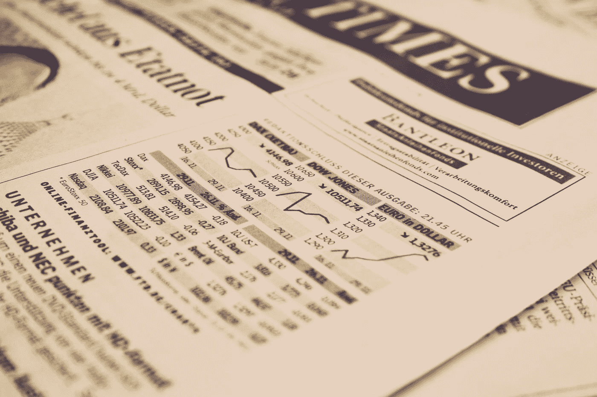

# 传奇投资者比尔·阿克曼在疫情开始的一个月内获得了 10000%的回报，他刚刚进行了相同的交易

> 原文：<https://medium.datadriveninvestor.com/legendary-investor-bill-ackman-who-made-10-000-return-in-a-month-at-the-beginning-of-the-pandemic-695d02111d58?source=collection_archive---------0----------------------->

## 今年早些时候，他仅投资 2700 万美元，就净赚了 26 亿美元。在辉瑞宣布其新的有前途的新冠肺炎疫苗的当天，他进行了类似的交易

Photo by [Markus Spiske](https://unsplash.com/@markusspiske?utm_source=medium&utm_medium=referral) on [Unsplash](https://unsplash.com?utm_source=medium&utm_medium=referral)

ill Ackman 对公司信用建立了新的头寸，押注公司将难以偿还债务。这距离他在一个月内凭借 2700 万美元的投资获得 26 亿美元的利润仅过去了 8 个月。在之前的一篇文章(链接[这里](https://medium.com/datadriveninvestor/the-big-short-version-2-0-217f8ee21677))中，我们提到比尔·阿克曼今年早些时候的交易将成为金融市场历史上最伟大的交易之一。他在一个月内实现了著名对冲基金经理迈克尔·伯里(Michael Burry)在电影《大空头》(The Big Short)中描绘的多年成就。

# 2020 年初的天才交易

随着冠状病毒疫情于 2020 年 2 月中旬开始在西方世界传播，对冲基金经理兼潘兴广场资本管理公司首席执行官比尔阿克曼(Bill Ackman)开始担心金融市场会发生什么。为了保护自己的投资组合，他通过购买信用违约互换(CDS)押注价值 710 亿美元的投资级债券。这是 2008 年迈克尔·伯里用来做空抵押贷款证券的类似工具。

CDS 本质上是针对债券违约的保险，CDS 的购买者将支付保险费。以比尔阿克曼的交易为例，保险费每月约为 2700 万美元，每年约为 3.24 亿美元。比尔阿克曼(Bill Ackman)交易的美妙之处在于，他对购买 CDS 的时机把握得如此之好，以至于他能够在短短一个月内将头寸转化为 26 亿美元的利润。相比之下，Michael Burry 的交易花了几年时间才产生利润，如果他的押注不成功，可能会让他的基金损失惨重。

故事并没有到此为止。随着阿克曼开始平仓 CDS 头寸，实现巨额利润，他开始将这些利润用于以折扣价购买蓝筹股公司的大量头寸，如星巴克(Starbucks)、希尔顿(Hilton)、汉堡王(Burger King)母公司餐饮品牌、劳氏(Lowe's)和伯克希尔哈撒韦(Berkshire Hathaway)。

# 一个几乎相同的交易把辉瑞疫苗新闻的日子

在最近接受英国《金融时报》采访时，比尔阿克曼透露，就在辉瑞宣布疫苗试验取得可喜成果的同一天，他的对冲基金潘兴资本(Pershing capital)购买了价值约 800 万美元的 CDS，如果企业开始拖欠债务，这些 CDS 将会得到偿付。这是他在疫情早期立场的三分之一。

CDS 价格已经基本回到了 Covid 之前的水平——比尔阿克曼(Bill Ackman)表示，“*同样的赌注可以在同样的条件下进行，就好像从来没有发生过火灾一样，并且基于世界将会变好的可能性*”。他觉得市场对新冠肺炎过于自满了。他认为，未来几个月对疫情来说将是“T2”丑陋的“T3”，对经济来说将是“T4”具有挑战性的“T5”，因为许多企业将被迫关闭。比尔认为，辉瑞的声明在短期内是一个负面消息，因为它将促使美国人对戴口罩感到自满，从而让病毒传播得更广。

虽然比尔·阿克曼认为短期内会有风险，但他预计 2021 年会出现强劲复苏。鉴于信贷息差定价过低，在我们看来，做空市场、同时对冲基金头寸是明智之举。