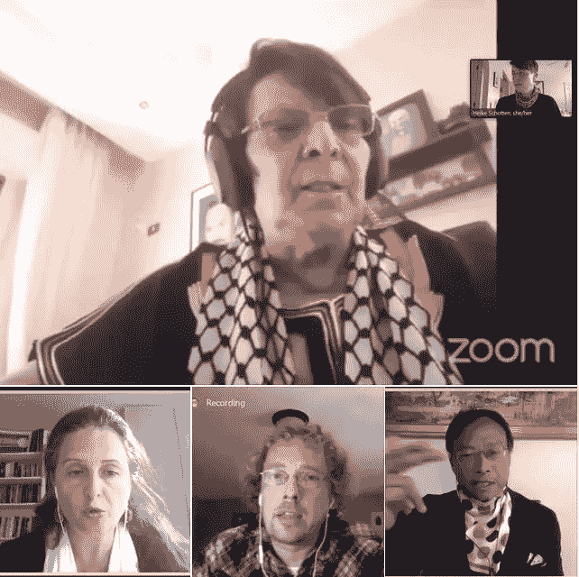
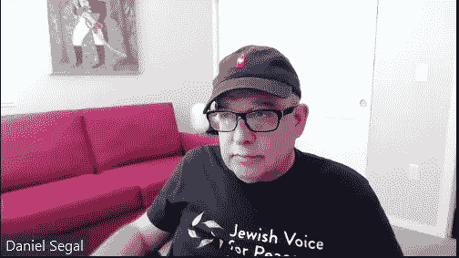
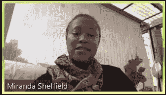
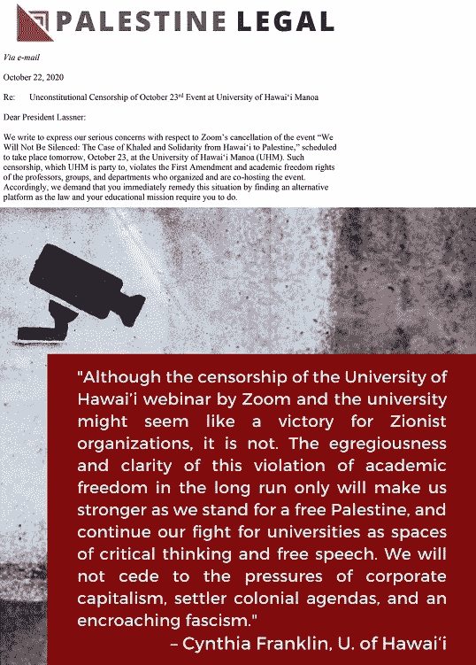
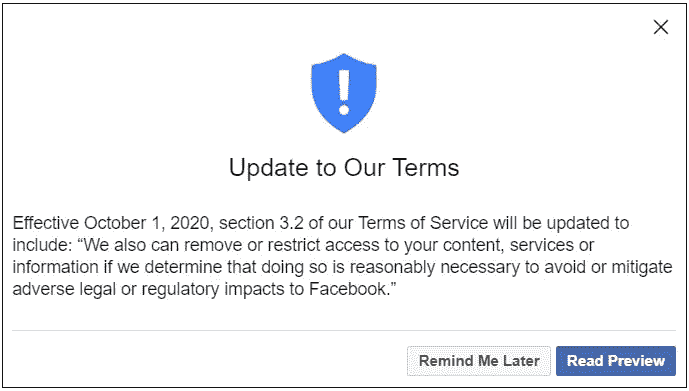

# 校园里的莱拉·哈立德:来自 Zoom、巴勒斯坦法律和 AAUP 的信

> 原文：<https://medium.datadriveninvestor.com/leila-khaled-on-campus-letters-from-zoom-palestine-legal-aaup-fec660c6d57b?source=collection_archive---------2----------------------->

这是最后一场总统辩论后的第二天早上，社交媒体的话题都集中在“静音按钮”和主持人克里斯汀·韦尔克的能力上。

Successful [Zoom event](https://m.youtube.com/watch?feature=youtu.be&v=L_WTKyQXVyA) with Leila Khaled at University of Massachusetts — Boston

由美国学术和文化抵制以色列运动(USACBI)组织的全国反对校园言论定罪和审查行动日(T0)随着当天第一个预定的 T2 活动(T3)在马萨诸塞大学波士顿分校成功开始。主题是:我们不会沉默:对学术自由的压制和抵抗，从莱拉·哈立德到马萨诸塞·波士顿。

网上研讨会的主持人 Heike Schotten 教授(政治学/USACBI)回避了前一天应用于[哈瓦第二大学](https://www.facebook.com/events/1879089668912466/)和当天晚些时候应用于[纽约大学](https://nyu.zoom.us/j/95045595136) (NYU)的变焦静音按钮。(利兹大学**的一场活动也遭到了审查，但[尽管受到审查的多重威胁，其中 9 场活动还是全部进行了](https://usacbi.org/email/sendy/l/EFkVSp9GqfMW3wDTGzZQgQ/BvrIRoZcoaepygWQDaLSfg/lSUJxbBRfqnH07pRz3LiSw)。)**

> **“在有组织的、有政治动机的团体的要求下，允许 Zoom 凌驾于这一基本原则之上，这是任何一所大学的管理当局都会犯的严重错误，它不应该逃脱教职员工和学生的指责。”—NYU-阿普**

**在以下题为“NYU 网络研讨会——我们不会沉默”的视频剪辑中，Andrew Ross 教授和他的小组成员 Nerdeen Kiswani(纽约市立大学/在我们的有生之年)、Fred Moten (NYU)和 Radhika Sainath(巴勒斯坦法律组织)谈到 Zoom 的干预和“巴勒斯坦言论表达受到威胁……自 1948 年以来禁止批评以色列的任何政策，以及将这种批评与反犹太主义的指控混为一谈”他敦促纽约大学管理部门对 Zoom 采取行动。**

**在网上研讨会的开始，Ross 教授播放了一段由 USACBI 整理的 Leila Khaled 关于巴勒斯坦抵抗运动的简短发言(分钟 6:00)，“以确保她的声音和形象得以呈现。”哈立德正在接受治疗，无法为这一场合提供语音信息。**

**NYU-全美大学经济学人协会关于 NYU 网络研讨会变焦审查的声明如下:**

> *****NYU-AAUP 执委会声明(10/23/2020)*****
> 
> ***今天，Zoom 单方面关闭了一场由 AAUP NYU 分会主办，NYU 多个部门和机构协办的* [*网络研讨会*](https://as.nyu.edu/neareaststudies/events/spring-20201/we-will-not-be-silenced--against-the-censorship-and-criminalizat.html) *。该网络研讨会原定讨论 Zoom 和其他大型技术平台上个月在 SFSU 举行的一次公开课堂会议的审查问题，巴勒斯坦权利倡导者 Leila Khaled 出席了会议。***
> 
> ***当然，我们认识到审查一个关于审查的事件是一种病态的喜剧行为，但它提出了一个严重的问题，即企业、第三方供应商是否有能力决定什么是可接受的学术言论，什么是不可接受的。***
> 
> **校园活动的停止显然违反了大学有义务遵守的学术自由原则。在有组织的、有政治动机的团体的要求下，允许 Zoom 凌驾于这一基本原则之上，是任何大学管理当局都会犯的严重错误，它不应该逃脱教师和学生的指责。**
> 
> **NYU 政府告诉我们，他们对 Zoom 的决定一无所知，他们已经向该公司的代表提出了这个问题。我们敦促政府发表强烈声明，谴责这一行为，并重新审查其与 Zoom 的合同条款。**
> 
> **如果 Zoom 不收回取消以巴勒斯坦言论和宣传为主题的网络研讨会的政策，大学校长们应该取消与该公司的协议。**
> 
> **全美大学教授联合会致力于为 NYU 社区组织一次活动来讨论这一骇人听闻的违反学术规范的行为。**

******

Daniel Segal and Miranda Sheffield at the Claremont Colleges event** 

> **“以色列游说组织基于一个虚假的主张，即接待哈立德女士进行学术讨论将构成犯罪活动，发出了轻率的威胁。”—巴勒斯坦法律**

**以下是两封信，进一步揭示了 Zoom 对 Leila Khaled 的巴勒斯坦言论进行审查的问题。第一个是 Zoom 的一名代表发给克莱尔蒙特学院行政部门的关于该事件(我们不会沉默:抵制对 Leila Khaled、巴勒斯坦之声……和在线学院教室的审查)的一封信，该信后来在平台上成功播出:**

> **亲爱的汤普森先生**
> 
> **Zoom 致力于支持开放的思想交流和对话。但是，我们的服务条款中包含一些限制，包括与美国制裁和反恐法律相关的限制，以及我们的 [*社区标准*](https://zoom.us/community-standards) *，这些标准禁止美化暴力。***
> 
> ***Zoom 收到通知，克莱尔蒙特学院计划于 2020 年 10 月 23 日举办一项活动，“我们不会沉默:抵制对莱拉·哈立德、巴勒斯坦之声……和在线大学课堂的审查”。这一事件被列入以莱拉·哈立德为主角的事件清单***中，她隶属于被认定为外国恐怖组织的解放巴勒斯坦人民阵线。****
> 
> ****鉴于这种联系，以及 Khaled 女士最近在旧金山州立大学的一次活动中美化暴力的报道，我们决定明确宣传 Khaled 形象的活动违反了 Zoom 的服务条款和社区标准，因此 Zoom 不得用于举办这些活动。****
> 
> ****如上所述，虽然您的活动在此列表中，但因为没有明确说明 Khaled 女士将参加，我们目前允许活动在我们的平台上进行。但是，如果我们得知 Khaled 女士将参加该活动，我们将采取措施，可能包括但不限于暂停或终止违规会议或用户。****
> 
> ****根据 Zoom 的* [*服务条款*](https://zoom.us/terms) *，用户对自己及其最终用户使用 Zoom 服务全权负责，用户同意不会以任何违反法律(包括制裁和反恐怖主义法)的方式使用——也不会允许其最终用户使用——Zoom 服务。我们的服务条款还要求用户声明并保证他们及其最终用户未被列入美国政府的禁止方名单。****
> 
> ***如果你对我们的使用条款有任何问题，请告诉我们。我们感谢与克莱尔蒙特学院的长期合作关系，我们希望我们能继续富有成效的合作关系，为您的教师、管理人员和学生服务。***
> 
> ****最诚挚的问候，
> 乔希****
> 
> ******乔希·帕雷基*** *高级法律顾问、
> 信任&安全与执法小组组长、
> 变焦视频通讯****

***第二封[信](https://static1.squarespace.com/static/548748b1e4b083fc03ebf70e/t/5f932253bd0f230e4f627e90/1603478100407/Civil+Rights+Orgs+Letter+to+Zoom-post+final.pdf)是巴勒斯坦法律组织与其他十个民权组织一起，针对哈威大学[的 Zoom 关闭事件，发给大学管理者的一封信](https://www.facebook.com/events/1879089668912466/):“在审查了旧金山州立大学的一个巴勒斯坦网络研讨会整整一个月后， **Zoom 又审查了另外两个校园巴勒斯坦活动**——这次是在哈威大学(UHM)和纽约大学(NYU)。”***

******

***Censorship at *University of Hawai‘i Manoa****

> ****通过电子邮件
> 2020 年 10 月 22 日
> 回复:夏威夷马诺阿大学 10 月 23 日事件违宪审查****
> 
> ****亲爱的拉斯纳总统:****
> 
> ****我们写信表达我们对 Zoom 取消原定于明天(10 月 23 日)在夏威夷马诺阿大学(UHM)举行的“我们不会沉默:Khaled 与从夏威夷到巴勒斯坦的团结”活动的严重关切。这种审查，UHM 是其中一方，违反了第一修正案和组织和共同主办这次活动的教授，团体和部门的学术自由权利。因此，我们要求你立即补救这种情况，按照法律和教育使命的要求，找到一个替代平台。****
> 
> ****您一定知道，明天的活动由 UH、KOA Futures、UHM 民族研究系、UHM 政治科学系和 Hawaiʻi 和平与正义大学的学生和教师赞助，计划在 Zoom 上举行，因为由于新冠肺炎病毒，面对面的课程和活动会带来严重的健康风险。10 月 20 日，Zoom 公开宣布该活动将不被允许举行，声称 Leila Khaled 预定的特别露面将违反 Zoom 的使用条款和社区标准。10 月 21 日，Zoom 取消了这次活动，给组织这次活动的 UHM 教授 Cynthia Franklin 发了一封电子邮件，谎称是她自己取消了这次活动。****
> 
> ****在 Zoom 给 UHM 的一封信中，Zoom 表示将取消 10 月 23 日的活动，因为 Khaled 女士“最近被报道在 9 月 23 日旧金山州立大学的另一所学校的活动中美化暴力”。哈立德从未在这次活动中发言，因为 Zoom 在活动开始前取消了活动，YouTube 在哈立德发言前屏蔽了活动。Zoom 含糊地声称，10 月 23 日的活动将违反法律，因为哈立德女士“隶属于或属于解放巴勒斯坦人民阵线”，这同样是毫无根据的。****
> 
> ***以色列游说组织基于一项虚假的主张，即接待哈立德女士参加学术讨论将构成犯罪活动，发出了轻率的威胁。游说团体声称，邀请哈立德女士作为演讲人将构成“对恐怖主义的物质支持”，因为她公开隶属于解放巴勒斯坦人民阵线(巴勒斯坦人民解放阵线)，美国已将该组织列为恐怖组织，还因为现年 76 岁的哈立德女士在 50 年前参与了两次劫机事件，作为巴勒斯坦抵抗以色列占领的一部分。***
> 
> ****声称美国的教授不能邀请哈立德女士演讲没有法律和事实依据。哈立德女士没有因为这些事件得到补偿，她也不打算在任何一个事件中代表巴勒斯坦人民解放阵线，而且从根本上说，在大学环境中交流思想是受宪法保护的言论自由。同样，这些活动是学术讨论:9 月 23 日的课堂活动是为了检查反抗、性别和性正义的批判性叙事，10 月 23 日的网络研讨会的重点是解放、审查和学术自由。****
> 
> ****将反恐法律延伸到纯粹的言论和学术讨论将严重损害我们所有的第一修正案的言论和结社权利。****
> 
> ***对你来说，相信这样一个违宪的论点会让你自己从事学术和批判性讨论的教授面临特殊的风险，更不用说严重毒害 UHM 的学术自由氛围了。***
> 
> ***如果 Zoom 的合同允许该公司审查大学活动，那么该大学违反了宪法，放弃了对活动组织者、教职员工和学生团体的责任。众所周知，几十年来的第一修正案保护公立大学的思想自由交流，包括有争议的演讲者。根据第一修正案和多项合同承诺，夏威夷大学有义务保护校园言论自由和学术自由。***
> 
> ****该大学已将 Zoom out 作为“夏威夷大学的系统范围会议和网络研讨会提供商”，并声明 Zoom 可用于“使用交互式网络研讨会功能向大量观众进行实时流讲座或特邀嘉宾”1 UHM 将 Zoom 描述为“虚拟演讲厅或礼堂”2****
> 
> ***建立了这样一个论坛，UHM 必须遵守其第一修正案的责任，提供内容中立和观点中立的访问。正如最高法院所承认的，当一个公共实体与一家私营公司进行国家行为时，该公共实体可以将遵守其宪法责任纳入其合同中，而不能“通过忽视这些责任或仅仅是不履行这些责任而实际上放弃其责任，无论动机如何。对于一个被剥夺了法律平等保护的人来说，善意地这样做是没有任何安慰的。”3
> 
> 作为一所培养近 5 万名学生的公立大学系统，UHM 在与 Zoom 的交易中拥有财务杠杆。然而，UHM 的管理人员声称，该大学不愿意在这一事件上拿自己的执照冒险。通过继续与 Zoom 签约，而不确保“我们不会沉默:Khaled 的案例和从夏威夷到巴勒斯坦的团结”活动将被允许继续进行，您已经危及了 UHM 允许自由交流思想的使命——即使是那些挑战现状的思想。UHM 正在批准 Zoom 的审查制度，并创建一个不平等的访问系统，这不仅违反了法律和大学对学术自由的合同保证，也违背了大学自己的教育使命。
> 
> 如果大学无法确保 Zoom 允许活动继续进行，大学必须安排一个具有相同功能的合适的替代场地，并且必须取消或修改与 Zoom 的合同，以确保 UHM 能够履行其章程和教育责任。务必立即安排缩放平台或替代平台，以便组织者有时间准备并通知参与者和注册参加网上研讨会的人。我们期待您的立即回复。***
> 
> ****1 信息技术服务，Zoom Transition，* [*https://www . Hawaii . edu/its/video conferencing/Zoom Transition/*](https://l.facebook.com/l.php?u=https%3A%2F%2Fwww.hawaii.edu%2Fits%2Fvideoconferencing%2Fzoomtransition%2F%3Ffbclid%3DIwAR1OMilrMyymPZ8U4uyoOkf5gCyNESsKoArQkOCjZqiAf6U2RyB1fV9Gz9U&h=AT14CFCR74kAyvs8oW0W_WjfNE43ImhsMAAfJ_uWxFhqdVpzTMk9xSptLDNXHIs-8qRz6mCYL-SDPNXEsFNTVgmX5fAaKYs8KFoyGuSe0yr2mxWyckB4w33kljcU6MNjd9uCCNyhy0J6uXwOSBbN3nLQ90-KTunEkeGKa0XAjeA3hjNzE8fI6nSaTh-nXqaiLLsloxrZ5fPN_mhStmW6DWljBLsazLSUmEgcAFYTAIfLxFOCv0Sy0Brxuj7MwklneWv2ktl8FzJ4deSeHRSQ6AGLawrfM2Eu7KnObfS1yudZ0czpmBkrO1PMptDXqr5bzhfOOgvAs5JDlT_XtKi86RjusBx8b3M1ecQZG_Br4gJArRyQnY4vuKymKN7KjZi1SUI7Dp9COmioJklfaBG2DbuuviJQUYnF3e1gDSG5LglfUi9dBbWmSeb1PP6UTRRmNq7FW_Mvw8xu-hUHOVyg6TDobg)*(最后访问时间 2020 年 10 月 21 日)。
> 2 信息技术服务，Zoom 网上研讨会服务，*[*【https://www.hawaii.edu/its/videoconferencing/webinar/】*](https://l.facebook.com/l.php?u=https%3A%2F%2Fwww.hawaii.edu%2Fits%2Fvideoconferencing%2Fwebinar%2F%3Ffbclid%3DIwAR1J_JOzYLMgzmV_vmWRk7Axf9Haratag9fTRgo9pMgs4hwTDqbweuSU2MI&h=AT2uJfFE7paqV2lg3-jmLx4MYwMFerflrGeCtocwQUe3OJJOZhCWEp0c_PuMLm6zD9HZ6_68x_-mc8bHcpqvSjs2YS3tfGLIHLH9KvEuUwBjlFeNg5pmWGuX6Z7vGP2LOtHLJE8GvTbJ6fz1BxLek-03Q-WFDCNnUsIuf5KF0fmpYv8SXs2LP7NuTMKHDpwAeJPXZQqzS40sRBgogZhISrd2rbEBPZy2EUTDiv165O9gHGHiH1_ZWnUEPyYj4Dx7LvRH9CZhS4Aa_jlqpTptwckjW72iaqLRWUrfP4BH53ayA_dae2WjiaAP1OYAy4uLntDm2G4nUnqa0x7L4mRROD_NXU57KGXHmpoZI5p23iPx6FMa3Ai4VeiMOcoC2Ou48r7w57cvRZ9zOlgWuX4vCq-YLqhMVwMREyiB9QvYJF5ct-MfICA4UBGtufFP9I1ahaZy8fWRtpR4d8ToV2AcWgwF2w)*(最后访问时间:2020 年 10 月 21 日)。
> 3 伯顿诉威尔明顿停车管理局，载于《美国最高法院判例汇编》第 365 卷第 715 页(1961 年)。
> 
> 真诚地，****
> 
> ****佐哈·哈利利
> 工作人员律师
> 巴勒斯坦法律
> 代表:
> 美国-阿拉伯反歧视委员会
> 亚裔美国人推进正义——亚裔法律核心小组
> 宪法权利中心
> 公民自由保护中心
> 气候保护项目
> 捍卫权利和异议
> 全国律师协会国际委员会
> 民事司法基金伙伴关系
> 南方项目
> 水保护者法律集体****

***巴勒斯坦法律上述标志变焦的行为是“违宪”。但大型科技公司正采取行动，通过在服务条款中增加语言来合法保护自己，就像脸书做的那样:***

***更新我们的条款***

***自 2020 年 10 月 1 日起，我们的服务条款第 3.2 节将更新为包括:“如果我们认为删除或限制对您的内容、服务或信息的访问是合理必要的，以避免或减轻对脸书的不利法律或监管影响，我们也可以这样做。”***

******

***Update to Facebook’s terms of service***

***对 10 月 23 日行动一天的波折和曲折的详细描述发布在 USACBI 网站上:[我们不会沉默:继续反对巴勒斯坦公司和大学审查制度的斗争——报告和视频](https://usacbi.org/email/sendy/l/EFkVSp9GqfMW3wDTGzZQgQ/oGDRKNYrbtiM6BRQTC23zw/lSUJxbBRfqnH07pRz3LiSw)。该报告以下面的号召结束:***

> ******让我们明确一点:这不会随着一天的网络研讨会而结束，特别是当我们的同事继续面临来自犹太复国主义组织、大型科技公司和串通一气的大学行政当局的压制、歧视、审查和新的攻击。即使大型科技公司正在拔掉插头；大学正在将保护学术自由的责任和义务外包给硅谷。******
> 
> ***这是企图压制和抹去巴勒斯坦人的叙述和巴勒斯坦人的解放斗争。我们邀请所有支持巴勒斯坦正义的人加入我们的运动，反对在校园里对巴勒斯坦人的言论进行定罪和审查，并建立对以色列的学术抵制，包括通过:***
> 
> ****发布 AAUP 分会、学生和教师团体、社会正义组织和其他关注巴勒斯坦正义的团体的组织声明——对抗最初对 Profs 的攻击。SFSU 的 Abdulhadi 和 Kinukawa，以及在夏威夷大学、NYU 和其他地方针对巴勒斯坦叙事的持续大技术沉默；****
> 
> ****组织更多这样的活动！USACBI 将很乐意为您提供视频资料、课程和其他资源，以帮助您策划和宣传您的活动。****
> 
> ****发起学术抵制以色列运动。* [*在此链接认可 USACBI 调用。*](https://usacbi.org/email/sendy/l/EFkVSp9GqfMW3wDTGzZQgQ/8xcFA892m6UH0Iyd6FaH40tA/lSUJxbBRfqnH07pRz3LiSw)***
> 
> ****在 usacbidayofaction@gmail.com**T21*[与我们联系，共同制定战略，建立我们的活动和网络，在巴勒斯坦打击压迫和争取正义。 ***我们不会沉默。***](mailto:usacbidayofaction@gmail.com)***

***也可阅读:[学者拒绝贴上“恐怖主义”的标签来审查巴勒斯坦的政治言论](https://medium.com/datadriveninvestor/academics-refuse-the-label-terrorism-to-censor-palestinian-political-speech-29d752c356bf)***

***_ _ _ _ _ _ _ _ _ _ _ _ _ _ _ _ _ _
*Rima Najjar 是一名巴勒斯坦人，他的父亲来自耶路撒冷西郊人口被迫减少的 Lifta 村，母亲来自海法以南的 Ijzim 村。她是一名活动家、研究员和被占领西岸圣城大学英国文学退休教授。****