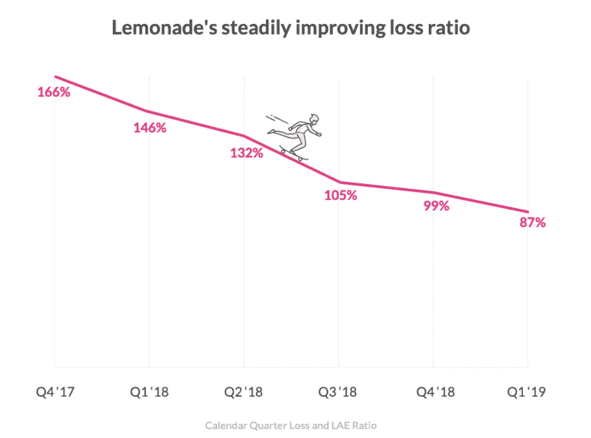

# 柠檬水的 IPO:生存与成功的故事

> 原文：<https://medium.datadriveninvestor.com/lemonades-ipo-story-of-survival-and-success-ba07de2bcf53?source=collection_archive---------29----------------------->

在新冠肺炎危机中，2020 年给我们所有人上了很多人生课。在这个充满挑战的时期，许多企业关闭了他们的业务，而其他企业找到了渡过难关的方法。柠檬水的故事是关于生存和以客户为中心的需要的故事。

2020 年 7 月 2 日，柠檬汽水公司的投资者吸引了所有的聚光灯。

你想知道为什么吗？

其股票在首次公开发行上市日涨幅高达 139%。该股在一级市场以 29 美元开盘，在盘中触及 70.80 美元的高点后，收于 69.4 美元。

该公司成为纽约证券交易所 2020 年最佳首次公开募股。保险业已经成为最有价值的行业之一，占美国 GDP 的 11%。保险业代表了全球高达 5 万亿美元的资产。

# 柠檬水的故事

这家总部位于纽约的公司成立于 2015 年 4 月，是一家超现代的科技型保险公司。该公司控制一个人工智能系统，以可能三秒的速度处理索赔。

该公司也是名为“即时一切”的新浪潮的一部分，在这种浪潮中，你可以在 90 秒内获得保险，而只需 3 分钟就可以获得索赔。

难道不是革命性的吗？

随着保险行业新兴技术的出现，他们为客户提供了更快、更全面的在线体验。

该公司为美国人提供房主和租户保险，以及荷兰和德国的财产和责任保险。这家以科技为基础的新时代保险公司正在寻求拓展其他保险产品，如人寿保险、汽车保险和伞式保单。

# 柠檬水策略

他们的业务经营策略很简单:“取悦顾客”。

> *“客服不应该只是一个部门，应该是整个公司。”*
> 
> *——捷步达康首席执行官谢家华*

Lemonade 的商业模式是以客户为中心的，与传统保险公司不同。该公司使用**人工智能和算法**来简化购买保险和提交索赔的过程，同时最小化波动性，最大化信任和社会影响。

柠檬水使用聊天机器人来处理索赔和提供保险单。2016 年，当一名消费者就一件被盗外套提出索赔时，该公司在应用程序上仅用了三秒钟就支付了索赔，创下了一项世界纪录。**是的！你没看错，只用了三秒钟。**

该公司的保费结构是独特的。柠檬水收取顾客保险费的 25%的固定费用，其余的钱是你的。客户保费的剩余 75%用于购买再保险和支付理赔。

一年一次，在全额赔付后，未使用的保费将捐给用户选择的名为“回馈”的慈善机构。这种安排的结果是建立信任和理解，公司不会从拒绝你的索赔中受益，并将尽一切努力解决它。通过将客户放在第一位并专注于建立信任，柠檬水已经向成功迈出了正确的一步。

> *正如亚马逊 CEO 杰夫·贝索斯所说*
> 
> *“如果你专注于竞争对手，你必须等到有竞争对手在做什么。以客户为中心让你更具开拓精神。”*

这家家庭保险初创公司认为，其战略将吸引从未购买过保险的年轻客户，但他们的保险需求可能会扩大。

# 柠檬水的财务状况

软银支持的柠檬水在 2019 年披露了 6380 万美元的总收入，高于 2018 年的 2120 万美元。其 2019 年的总收入为 6730 万美元，运营费用在 2019 年飙升至 133%，达到 1.752 亿美元。

它的大部分支出来自销售和营销，由于创新的人工智能系统，该公司可以轻松减少支出。尽管顾客增长正在放缓，但去年柠檬水的溢价翻了三番，达到 7600 万美元。毛利超过总销售额，公司有巨大的毛利机会。从长期来看，减少资本支出以显示一定的运营利润也很重要。该公司的债务较少，这导致几乎没有任何利息支出。

2019 年，柠檬水报告亏损接近 1.08 亿美元，运营利润率为-169%。公司财务稳步改善，同时增长率超过 500%。该公司披露，随着销量和数量的增加，亏损率连续第八个季度有所改善。

该公司上个季度增长了 12%，这一趋势正在改善，过去一年平均季度环比增长 15%。

# 柠檬水 IPO

这家总部位于纽约的公司开始交易，股票代码为 LMND，在首次公开募股中售出了 1100 万股。该股在一级市场以 29 美元开盘，在盘中触及 70.80 美元的高点后，收于 69.4 美元。该公司成为纽约证券交易所 2020 年最佳首次公开募股。

这家房屋租赁保险初创公司筹集了近 3.2 亿美元的总收入，该公司将把这些收入用于日常企业用途，但也可能用于资助收购。在 IPO 中，这些股票的价格为每股 29 美元，但到下午已经超过 60 美元，使该公司的估值超过 30 亿美元。

尽管分析师认为股价不太可能超过 69 美元。下一个触发点将是公司的盈利细节，这将决定股价的命运。在此之前，任何高于 69 美元的价格看起来都会给买家带来高风险。

# 社交柠檬水

柠檬水注册为公益公司，每年向慈善机构捐赠保费和无人认领的资金。根据柠檬水政策，用户选择他们关心的非营利或慈善机构。公司清点未使用的资金，将高达 40%的资金返还给你选择的非营利组织。

Lemonade 是少数几家现在拥有福利公司地位的保险公司之一，这种地位一般不会影响其财务状况或提供任何特殊的税收优惠。

2019 年，柠檬水捐赠了超过 60 万美元，而 2018 年为 16 万美元。自 2017 年启动该计划以来，该公司已捐赠了近 85 万美元。

上市首日股价就翻了一番的公司在文件中称，其 70%的客户年龄在 35 岁以下，约 90%的客户没有转投其他保险公司

柠檬水已经证明，以客户为中心，不仅有利于客户，还能与他们建立长期的关系，这最终成为任何组织成功的基础。

我将用伯克希尔哈撒韦公司首席执行官**沃伦巴菲特**的名言来结束这篇文章。

> *“关注你的客户，领导你的员工，因为他们的生活取决于你的成功。”*

*原载于*[*https://www.linkedin.com*](https://www.linkedin.com/pulse/lemonades-ipo-story-survival-success-pratibha-yadav)*。*

 [## 收盘，但没有雪茄-股票市场目标在停滞的 COVID 救济中创新高|数据驱动…

### 专家聊天程序:一个协作市场，在这里人们可以和能够解决他们问题的专家聊天。是……

www.datadriveninvestor.com](https://www.datadriveninvestor.com/2020/08/18/close-but-no-cigar-stock-market-targets-record-highs-amidst-stalled-covid-relief/) 

**访问专家视图—** [**订阅 DDI 英特尔**](https://datadriveninvestor.com/ddi-intel)