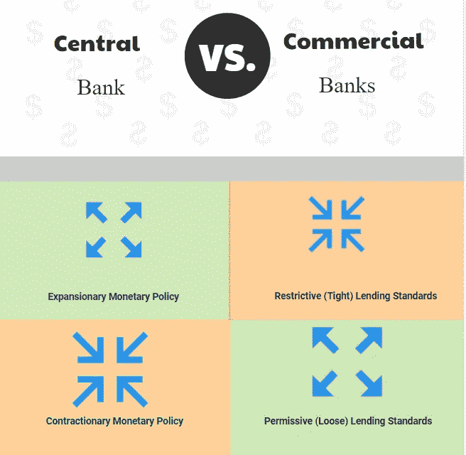

# 贷款标准:商业银行如何对抗货币政策

> 原文：<https://medium.datadriveninvestor.com/lending-standards-how-commercial-banks-fight-against-the-monetary-policy-30207369674a?source=collection_archive---------7----------------------->

中央银行是中央计划。这是指令性银行业务。一个叫做中央银行的机构使用各种工具控制货币供应。最受欢迎的工具是利率。商业银行正在用一种被称为贷款标准的野蛮人来对抗指令性银行业务。

这是一场拉锯战。这是经济学教科书一直回避的领域。它没有被详细地探索或解释。

# **央行是中央计划**

当经济过热且状况不佳时，央行会提高利率，让经济冷却下来，回到正常的增长水平。提高利率会增加借贷成本，并阻止冒险者承担不必要的风险。经济活动的减少使经济能够正常呼吸，避免由过热的金融部门引起的衰退。这就像你的车过热了，你减速，停在路上，倒些水，让引擎冷却后再开走。

当经济处于低增长水平，没有达到预期水平时，央行会降低利率，以此来刺激贷款和经济活动。由此导致的借贷和经济活动的上升缩小了产出缺口，并使经济以更快的速度增长，避免严重的萧条。

提高和降低利率的行为不是一门精确的科学，但也不是一门艺术。这是现实生活中的平衡行为。中央银行试图引导经济度过由表现不佳的经济或过热的经济造成的衰退和萧条的危险。央行的存在在很大程度上是基于需要有一个老大哥在这方面照顾国家经济。这是一项崇高的努力。这是传统的观点。

 [## 数字货币、区块链和货币的未来|数据驱动的投资者

### “区块链”、“加密货币”、“令牌化”，以及现在的“央行数字货币”已经成为…

www.datadriveninvestor.com](https://www.datadriveninvestor.com/2020/02/18/digital-currencies-blockchain-and-the-future-of-money/) 

非传统观点认为，央行是一种共产主义现象，被打上了资本主义经济核心信条的烙印。这种品牌行为是一种欺诈和骗局。一个谎言被重复了一遍又一遍，随着时间的推移，它越来越接近真相。我们已经接受它为真理。正如许多共产主义现象一样，背后的意识形态被宣传为追求更大的利益。集体主义的需要被误认为是共产主义的需要。个人主义被误认为是自私。

然而，最终个人主义总是战胜共产主义。这就是为什么在前共产主义国家，资本主义取代了共产主义。资本主义的中央银行方面是一个骗局。一个真正的资本主义社会不会像我们今天这样利用央行。

目前的表现在控制利率和货币供应方面有一个错误的方面。法定货币是一种骗局。金本位是真正的基于中央银行的货币体系。对利率和货币供应的控制应该是分散的。对银行、中央清算系统和其他行政事务的管理和监督应由中央银行负责。这些是行政职责。经济决策应该留在个人层面(人或法人)。个人层面的总体决策应该决定经济的命运。不需要大哥。

大多数共产主义政策总是以失败告终。央行正在失败。有些人看不到失败，因为它还没有到令人沮丧的失败阶段，但它会到达那里。在一些国家，如津巴布韦，中央银行已经完全失败，一些政治家呼吁完全取消中央银行。

在正常国家，银行在单个实体层面做出决策，不利于中央银行对货币供应的控制。作为对冠状病毒引发的经济衰退的回应，中央银行降低了利率。作为回应，银行收紧了贷款标准，这样它们就不会轻率地向任何想要贷款的人放贷。

# **作为货币政策工具的贷款标准**

Interest Rates vs Lending Standards as Monetary Policy Tools

贷款标准的提高是对利率下降的反作用。银行实际上投票反对降低利率。当利率提高到高于银行偏好的水平时，就会观察到这种抵消行为。当利率对大多数银行客户来说太高时，银行就放松贷款标准，以便他们想要的客户能够获得信贷。

这种抵消行为降低了货币政策的有效性。银行主要根据自己的偏好和需求来做出投资组合决策。利率水平是次要决定因素，而不是主要决定因素。这是一个早晨之后。

单个银行的行动正在汇聚成一种货币政策工具。银行的平均贷款标准成为债务水平的主要决定因素。

利率是一种价格。金钱的代价。这是附在借贷上的价格。这个市场的主要供应商是银行。公司和个人通常是买方。与资本主义体系中的任何市场类似，价格由市场力量决定。货币买卖双方的互动决定了价格。

中央银行试图控制借贷价格，扭曲了市场机制。在个人层面，银行 A 可能愿意以每年 y%的平均利率提供 x 亿美元。如果利率超过 y%，A 银行可以放松其贷款标准，这样它就可以继续贷出 x 亿美元，否则就会有多余的资金，这会拖累投资组合。

同样，如果利率降至 y%以下，更多的人会想从银行贷款，而银行无力支付贷款。尽管银行可以从中央银行获得更多的美元，但银行不一定需要满足所有前来寻求资金的客户的借款需求。

随着时间的推移，通过玩火自焚不良贷款(NPL)的经历，银行已经痛苦地认识到，并非所有来自央行的轻松资金都应该被用于向客户放贷。这个问题总是会回来困扰银行，银行最终必须向央行偿还低成本资金，而不能从利率低时进入市场的新借款人浪潮中获得任何东西。因此，当利率低于自然市场利率时，奇怪的是，不增加贷款组合符合银行的最佳利益。因此，如果银行 A 希望将其投资组合保持在 x 亿美元，它会调用贷款标准作为抑制额外需求的工具。

# 这对经济意味着什么？

这个悲伤故事的寓意是，利率不应该被老大哥人为控制。宁愿把它留给银行。

由于缺乏信贷扩张，指令利率低于自然市场利率的时间越长，经济状况就越糟糕。没有信贷扩张，经济增长就会受到抑制。

如果指令利率保持在由市场决定的利率之上，经济不会受到太大影响，因为银行会迅速放松贷款标准。然而，放松贷款标准只能在提高贷款利息和保持经济运行方面发挥作用。

央行不需要被完全废除。央行的经济指令元素需要被去除。如果做到了这一点，经济将在对信贷扩张和货币供应的内在控制下增长。

# **利率完全自由化会带来什么？**

如果利率自由化，你可能首先会遇到一些试图操纵市场的玩家，就像他们操纵 LIBOR 一样。随着更多的参与者进入借贷市场，价格建立机制将完美运行。银行获得贷款许可的特权将不得不取消。

银行和贷款是两回事。银行业务是一种信任关系，贷款是一种基于信任的交易。贷款谁都可以做，但银行业务应该由银行来做。

贷款标准反映了市场的信用风险水平。信用风险水平决定利率。事情本该如此。

# **向反抗者复仇**

如果银行继续通过违背某一政策方向的精神和意图来破坏货币政策，央行最终可能会试图通过严格监管商业银行的贷款标准或与政府合作开展准贷款活动(如发放贷款、赠款和刺激付款)来迫使其政策付诸行动。

此举将是倒退的。它将比苏联更加共产主义。央行不仅将决定利率和货币供应量，还将决定银行向谁放贷以及放贷多少。

# **借贷标准和股票市场**

有轶事证据表明，当货币政策体制不利时，商业银行习惯性地通过提高贷款标准来冲击股票市场。

随之而来的是股票市场的崩溃。很难在贷款标准和股市崩盘之间建立无可争议的因果关系。有太多的变量会导致股市崩盘。借入资金不可用只是因素之一。

# **总结**

银行坐拥资金不是一件好事，尤其是在全球疫情的情况下。我们必须找出银行坐拥资金而不放贷的原因。具体来说，是银行体系，总体来说是货币体系，已经崩溃。

指令性银行创造了市场扭曲。银行坐拥资金是市场扭曲如何显现的一个例子。这是一种症状。根本原因是功能失调的央行。

是时候做出改变了。

再见。

**访问专家视图—** [**订阅 DDI 英特尔**](https://datadriveninvestor.com/ddi-intel)