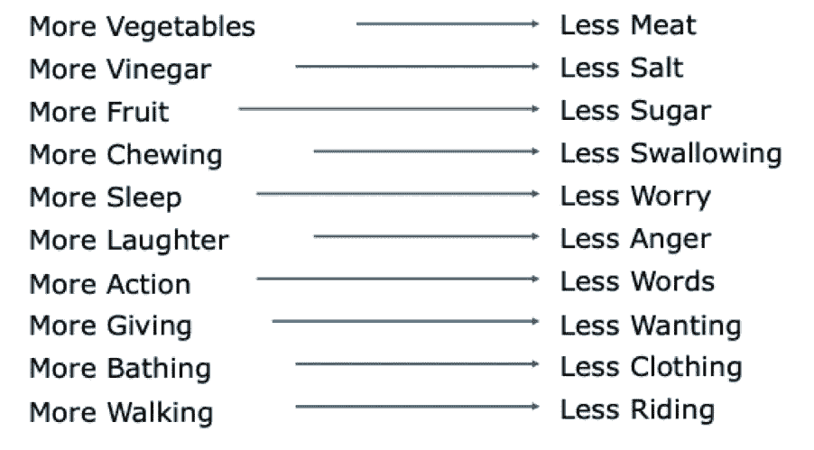

# 金融服务业长寿的经验教训

> 原文：<https://medium.datadriveninvestor.com/lessons-for-long-life-in-financial-services-f69bec886a16?source=collection_archive---------5----------------------->

Ten Lessons for Long Life

在日本众多佛教寺庙中的一座寺庙里，有一卷写于五百多年前的卷轴，里面包含了长寿的十大秘诀，以及在你的个人生活中关于长寿的十个教训。如果你还没有阅读中文，这是一个翻译。我个人最喜欢的是“多洗澡，少穿衣”。我想僧侣们必须做些娱乐的事情。

Ten Lessons for Long Life in English

我最近被邀请参加一个名为 *DevOps、数据和分布式劳动力:FinServ 公司如何利用颠覆来实现创新*的网络研讨会。正如你们中的一些人所知，我的职业生涯始于凯鹏华盈最初的创业公司之一，Tandem Computers。我们的许多关键客户都是全球金融服务公司。与此同时，在你获得计算机科学学士学位之前，我也开始在斯坦福大学教授聪明的年轻人。因此，在为这次活动做准备时，我想我应该教些什么，对金融服务业的长期发展有什么启示？

**第一课。更多计算&存储，更低成本**

长期以来，计算和存储硬件的性能一直在提高，成本却在降低。几年前，我做了一项分析，显示世界上最大的银行之一的所有计算机都可以放入 11，000 平方英尺的一个中等大小的硅谷家庭，j。虽然著名的摩尔定律看起来似乎已经过时，但随着计算和存储云计算的出现，管理该基础架构的性能、可用性、安全性和变化的成本已经显著降低。今天，100 美元可以购买 4000 台计算机一小时，1000 美元可以存储 50tb 一年，这是 200 台 MRI 扫描仪一年产生的所有数据。因此，计算和存储基本上是免费的。但是我们该怎么处理这个呢？

**第二课。水暖工程多，水利工程少**

大约五年前，我帮助一些斯坦福计算机系的学生开始了第一次黑客马拉松，TreeHacks。来自世界各地的 2500 多名学生提出了申请。最终有 600 多名黑客，大约一半是斯坦福的学生，另一半由来自加州其他地方的 250 人和来自其他州的 100 人组成。我遇到了来自西北大学、加州大学、麻省理工学院、弗吉尼亚大学、德克萨斯大学奥斯汀分校的学生和一名来自东京的学生。组织者希望确保黑客马拉松不仅仅是一个年轻的男孩俱乐部，最终在前三名团队的八名成员中，有三名是女性。

虽然我没有喝红牛和 24 小时不睡觉，但这个事件让我大开眼界。我意识到的第一件事是，如果你把这件事推迟十年，那将是无法承受的。黑客可以使用弹性计算、几乎免费的存储和大量开源软件，而不是在校园的计算机房中使用数百台服务器、系统管理员和许可的内部软件。

我还看到，现在比以往任何时候都更真实的是，他们使用的构建块的大小有了巨大的不同。无论是开源的，还是各种服务的网络接口，包括为机顶盒提供 API 的 DirecTV。其中一个团队开发了一个应用程序，允许一群人一起看电影，并投票决定是否重启电影。我注意到亚马逊刚刚推出了手表派对功能。我想知道是否有团队成员参与其中。

所有这些的重点是开发看起来更像管道工程而不是水利工程的下一代应用程序。我看到的是，软件的构建方式与我们接受的传统培训完全不同。在我的类比中，它看起来更像是管道。学生们正在用数百个软件部件组装新的应用程序。在云计算、开源和网络服务的时代，这突然变得可能。

但是他们在计算机科学课程中学习过这些技能吗？**否。**如果我们拿管道做个类比，从一家大型机构获得计算机科学学位就像是被教授如何在管道领域建造一个 P 阱(水槽下面的弯曲管道)。为了构建更好的 P 阱，您需要了解流体动力学、材料科学和机械工程原理。

虽然 P 阱的设计者需要这些技能，但是管道工不需要理解物理或工程。相反，他们通过与一个熟练的管道工学徒来学习安装哪个 P-trap 以及何时安装。他们不需要理解它是如何工作的。现在拿这个比喻来比喻软件世界。四年制大学旨在教授计算机科学课程，重点是教你能够设计更好的 P 陷阱所需的基本原理。

虽然这些知识对一些软件工作来说是必要的，但对软件管道工的需求是前者的 10 到 100 倍。我们应该如何培训和装备未来的软件管道工。你如何成为新世界中的一个 P 陷阱？

你不需要看得比付款的世俗世界更远，就能明白为水管工建造一个 P-trap 是需要关注的地方。开发商喜欢 Stripe，风险投资家也是如此，他们继续向支付初创公司投入资金，估值达到 35 亿美元。在一个由谷歌和贝宝这样的现有公司主导的市场中，像支付公司这样不性感的东西怎么会得到如此多的喜爱、炒作和增长呢？专注于水管工。

**第三课。更多分析，更少交易**

我提到过我在 Tandem Computers 开始了我的职业生涯。在 80 年代，我们有游泳池、啤酒杯、6 周的休假，几乎每个员工都有股票期权。我们制造了专注于 OLTP(在线交易处理)工作负载的计算机，通过为全球 ATM(自动柜员机)的爆炸式增长提供基础设施，我们创建了一家价值$1B+的公司。时代变了，由于大量的工程设计，处理一笔交易的成本几乎为零。你可以在免费提供的现代交易平台上看到这种趋势，其中 RobinHood 最为明显。那么如果交易处理是免费的，下一步是什么？

你不用走多远就能明白接下来会发生什么。只要看看你的 Amazon.com 主页。事务处理/工作流应用程序位于右上角。这是一个小小的购物车。当然，它必须安全、可靠、规模化地运行，但这并不重要。相反，看看亚马逊在一个中心思想上花费的所有屏幕空间——向你提供个人和相关信息。像你这样的人买了这个。如果你买了第一项，你会考虑第二项吗？这都是关于分析，人工智能，机器学习。我能预测你需要什么或者你想要什么吗？

但登录你最喜欢的金融服务网站，你看到的只是一个大购物车——把钱从一个账户转移到另一个账户；买一只股票；出售债券。与我个人相关的信息在哪里？谷歌已经在互联网上索引了大约 200 兆字节的数据；世界上每个金融服务公司都有数百倍于此的数据量，那么为什么他们不能提供个人和相关信息呢？

第四课。更多的 GenZ，更少的婴儿潮

作为婴儿潮时期出生的人，我们接受的教育是，这一切都与我们有关，但如果你打算在金融服务业度过漫长的一生，你应该意识到，人和技术已经并将继续发生代际转变。

想想 1980 年至 1996 年出生的千禧一代，当互联网在 1994 年出现时，他们中年龄最大的还是青少年。网景公司成立于 1994 年。查尔斯·施瓦布于 1994 年提供在线交易，eTrade 于 1996 年上市，亚马逊成立于 1997 年。所以千禧一代不知道没有互联网的世界。下载软件是什么意思？什么是 Windows？什么是光盘？。

Gen Zers 出生于 1997 年至 2015 年之间，因此该群体中年龄最大的是 23 岁。2007 年推出 iPhone 时，年龄最大的 Z 一代才 10 岁，所以这一代人从未见过有线电话，显然必须解释内部软件的概念。毫不奇怪，他们认为 Venmo (2009)只是一项基本服务，手机是他们的个人电脑。

如果你对金融服务业的创新和长寿感兴趣，就跟随他们制定的规则。

**第五课。多分布，少 HQ**

去年，我让 Zoom 的创始人兼首席执行官埃里克·袁(Eric Yuan)在斯坦福大学的云计算课上做了一次客座演讲。他在结束演讲时说，如果他在 2019 年创业，他不会有总部。当然，你可能会认为这个评论是自私的，但六个月后，我们都没有总部了。

当然，拥有良好的网络会议技术是无总部运营的一部分，但显然还有更多。虽然 COVID 时代结束了，但我们不太可能都回到办公室。在旧金山湾区，我们都看到了不必花一个多小时通勤，然后花 40 美元停车几个小时的好处。此外，虽然来到硅谷有其优势(天气和食物都很棒)，但我们知道我们不能依靠重新选址来获得最好的人才。

那么未来真正的分布式公司是什么样子的呢？这里有 3r 供你思考:

*写(好吧，也许不是真正的 R)*

2012 年，GitLab 首席执行官 Sid Sijbrandij 帮助 GitLab 商业化，到 2015 年，他领导公司通过了 Y-Combinator 的 2015 年冬季批次。在他的领导下，该公司在过去 5 年中增长了 50 倍，从 9 名远程团队成员扩展到 1，200 多名，遍布 65 多个国家和地区，目前市值为 27.5 亿美元。如果你想了解更多，请查看他们的《如何建立远程团队》和 GitLab 手册。

他们的一个关键原则是:文档有助于透明度，这对远程工作至关重要。虽然围绕办公室饮水机做出的决定在传统工作场所可能很常见，但输入仅限于在场的人。那些不在场的人感觉被忽略了，你也失去了一个听取不同观点的机会。

GitLab 的工作方式更具包容性。通过记录一切，没有人被排除在对话之外，可以听到不同的观点，不仅来自 GitLab 团队成员，也来自客户和社区贡献者

通过用文字而不是图画进行头脑风暴，我们被迫清晰地表达建议、设计和想法，减少解释的差异。一张照片可能胜过千言万语，但它也可以有多种解释，就像有多少人在看它一样。

*角色*

几年前，我和一个团队花了六周时间分解 MMORPG 游戏《魔兽世界》。我们试图理解一群互不相识的人如何走到一起，完成一项任务，然后离开的基本机制。一些我们想了解的关于魔兽世界的事情。虽然有许多重要的想法，其中之一是个人有互补和明确的角色。简单来说，在魔兽世界中，你需要猎人和治疗师来杀死恶龙。猎人不能治疗，治疗者不能杀戮。因此，在未来的分布式公司中，为多个互补角色进行设计并明确这些角色是什么非常重要。

*佳期*

艾米·乔·金的《网络社区建设》一书是许多年前写的，她确实记录了建立社区的许多关键原则。她的建议之一是确保和创造仪式。所有社区都用仪式来认可他们的成员，并庆祝重要的社会转变。通过庆祝节日，标记季节变化，整合个人过渡和通过仪式，你将为一个真正的网络文化奠定基础

**第六课。多孵化，少转化**

虽然技术和市场很重要，但能够投资所有这些新想法是关键。我的老朋友杰夫·摩尔(Geoff Moore)的新书《T4:区域制胜》(Zone to Win)应该是每位高管的必读之作。这本书篇幅不多，但在你为新的一年做预算时，Geoff 的书会给你一个全新的思路来思考你的投资策略。

正如他在《跨越鸿沟》中所做的那样，Geoff 首先创建了一个简单的模型，将投资分为四个主要类别或区域:绩效、生产率、孵化和转化。前两个区域非常熟悉。绩效区代表将在未来 12 个月产生预订、收入和边际贡献的投资。生产力区有同样的 12 个月的时间范围，它专注于提供合规性、效率和有效性的计划。大多数成功的公司在这两个领域都做得很好。

然而，我们不断看到技术是如何颠覆商业的。特别是，五大巨头——云计算、移动、人工智能、社交网络和物联网技术——已经重塑了一些格局。那么，一家现有的公司如何管理这一点呢？杰夫的最后两个区域掌握着关键。孵化区代表时间跨度为 36-72 个月的投资，专注于提供可行的商业选择，以抓住新的技术浪潮。例如，许多制造建筑、农业、电力、石油、天然气、运输和医疗保健机器的公司投资了一些项目来连接现场的机器；然而，如果没有最后一个区域，这些只是科学公正的项目。

转型区是公司选择在 24-36 个月内将孵化区产生的颠覆性选择扩大到物质收入的地方。材料收入意味着大于企业总收入的 10%。一个我们都知道的例子是 iPhone，但也考虑一下亚马逊的 AWS 在同一个类别中。Geoff 非常清楚，一个产品要进入转化区，有三个必要条件。首先，它必须有潜力带来显著的收入增长。第二，在任何时候，转换区中只能有一种产品。第三，或许也是最重要的一点，它必须由首席执行官领导，因为这不仅需要对 R&D 的支出进行重大重组，还需要一个拥有不同销售薪酬计划的新销售团队。

没有管理层的关注和资金，为股东创造有意义的转型将只是一个白日梦。

因此，也许这些教训中的一些会使你在职业生涯中长寿，如果不是，考虑一下你个人生活中长寿的十个教训中的几个，也许多吃蔬菜，少吃肉；多睡一点，少一点担心，少一点生气，多一点欢笑。