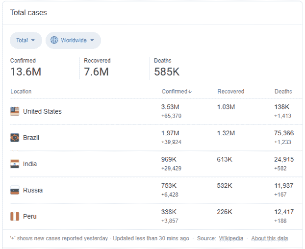
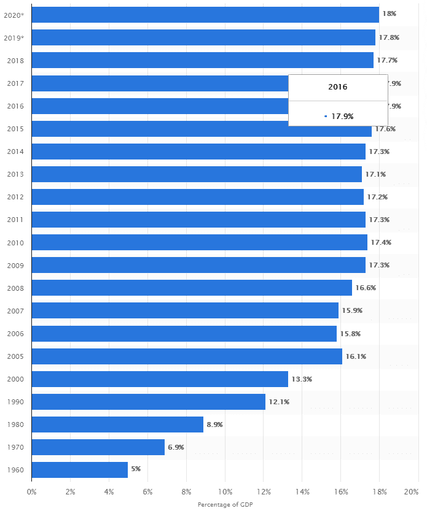

# 中风的教训——我们能选择更好的医疗保健方式吗？

> 原文：<https://medium.datadriveninvestor.com/lessons-from-a-stroke-can-we-choose-our-way-into-better-healthcare-9c4eea16fb29?source=collection_archive---------20----------------------->

2020 年 7 月 5 日星期天，我父亲患了出血性中风，严重瘫痪了他的右侧身体和语言。他今年 78 岁，饮食健康，定期锻炼，定期体检。他最大的风险因素是轻微的血压升高，多年来通过低剂量药物治疗，血压得到了很好的控制。所以你可以想象他和周围所有人的震惊。

 [## 医疗保健行业的精益项目管理|数据驱动的投资者

### 有一个分类的项目管理程序制定了许多业务，可以属于一个…

www.datadriveninvestor.com](https://www.datadriveninvestor.com/2020/07/02/lean-project-management-in-healthcare/) 

地理因素进一步加剧了这种冲击。我的父母在印度出生/长大，我是独生子，在巴西出生/长大。他们是住在巴西利亚的退休教授，我是住在硅谷的风险投资家。我们联系最紧密的三个国家通常相距一天的路程。在 covid 时代，情况要复杂得多——当时和现在，美国、巴西和印度是受影响最大的三个国家，航班和入境都极其有限——我很幸运能够在 32 小时内从旧金山到 BSB。

这不是一篇关于医疗急救的文章——这是一次深刻的个人经历。这篇文章是关于分享另一个医疗系统的经验教训。巴西是一个中等收入国家，人均 GDP 约为美国的 1/8。它可以说是与美国最相似的竞争对手，部分是设计上的，公共系统负责大约一半的医疗支出，私人系统包括 HMO、PPOs、共付额、免赔额等。不同的是一个社会所做的基本选择，这篇文章关注其中的三个以及他们提出的问题。

**1)分享** —没有千份表格，没有光盘，没有传真。所有的医疗结果(成像、测试、医生记录)都被立即上传到一个在线门户网站上。医疗团队并不反对我们与许多好心人分享用户名和密码。事实上，他们鼓励我们与其他医疗专业人员分享，他们可以向我们解释发生了什么，并迅速提供第二意见。

**开放**——我的妻子是其中一位祝福者，她是 UCSF 的放射学家。当当地团队了解到这些技能后，他们主动联系她，开始了对话。在我们看来，这毫无疑问——当地医生和我见过的任何世界级医生一样训练有素——这来自一个开放的地方。

**3)技术**——除了传统的电话和面对面的方式，医生和护士还使用 WhatsApp 与我们交流。在营业时间，问题会在一小时内得到答复。在工作时间之外，如果我们需要什么，我们仍然可以跟进，例如，我们在晚上很晚的时候沟通转诊，之后很快就准备好了。我父亲所有的关心都变成了一个不断更新的谷歌文档。这些技术已经在企业中使用了十多年，但在美国医疗保健行业仍然是一种诅咒。祝福者可以很容易地跟踪进展，出院后的专业人员(物理治疗师、语言治疗师、护理人员)可以很快理解并添加到病史中，主要医疗团队可以在没有长时间预约的情况下进行检查。

观察他人的选择会引发自我反思。HIPAA 保护了病人，但也妨碍了交流，我们为什么要做出这样的取舍呢？医疗事故也是如此，比如我们如何避免在医疗专业人员中创造一种抑制合作的恐惧文化？如果人们已经疯狂地使用像短信这样的技术，难道不是我们更新这些法律的时候了吗？我们真的需要把 [34%的医疗费用](https://time.com/5759972/health-care-administrative-costs/)花在行政管理上，让医生和护士背上沉重的文书工作负担吗？

在主要国家中，美国在医疗保健上的支出无论从绝对值还是相对值来看都比其他任何国家都多。举个例子， [18%的 GDP](https://www.statista.com/statistics/184968/us-health-expenditure-as-percent-of-gdp-since-1960/) 用于医疗保健，而经合组织(即其他发达国家)的平均水平是 10%。

是的，美国内部存在巨大的分歧，对任何事情都有反对意见和例外。但人们不禁要问，这种美国例外论是否真的更多地是资源配置不当、激励错位和错误选择，而不是经济限制(这是较贫穷国家的负担)。

我们能做得更好吗？父亲严重出血性中风一周后出院，恢复非常快。我不禁感到，其中一部分原因是因为这些选择允许医学在实现其真正目标——服务、保护和治愈——时更自由地运用。

*感谢***和* [*米希尔古普塔*](https://www.linkedin.com/in/mihir-gupta-108228133/) *对他们的思念。原载于“* [*”数据驱动投资人*](https://www.datadriveninvestor.com/2020/07/26/lessons-from-a-stroke-can-we-choose-our-way-into-better-healthcare/) *，“我很乐意在其他平台辛迪加。我是*[*Tau Ventures*](https://www.linkedin.com/pulse/announcing-tau-ventures-amit-garg/)*的管理合伙人和联合创始人，在硅谷有 20 年的从业经验，涉足企业、个人创业和风险投资基金。这些都是专注于实践见解的有目的的短文(我称之为 GL；dr —良好的长度；确实读过)。我的许多文章都在 https://www . LinkedIn . com/in/am garg/detail/recent-activity/posts**上，如果它们能让人们对某个话题产生足够的兴趣，从而进行更深入的探讨，我会感到非常兴奋。如果这篇文章有对你有用的见解，请对文章和 Tau Ventures 的 LinkedIn 页面* *上的* [*发表评论和/或给予赞，感谢你对我们工作的支持。这里表达的所有观点都是我自己的。*](https://www.linkedin.com/company/tauventures)*

***访问专家视图—** [**订阅 DDI 英特尔**](https://datadriveninvestor.com/ddi-intel)*