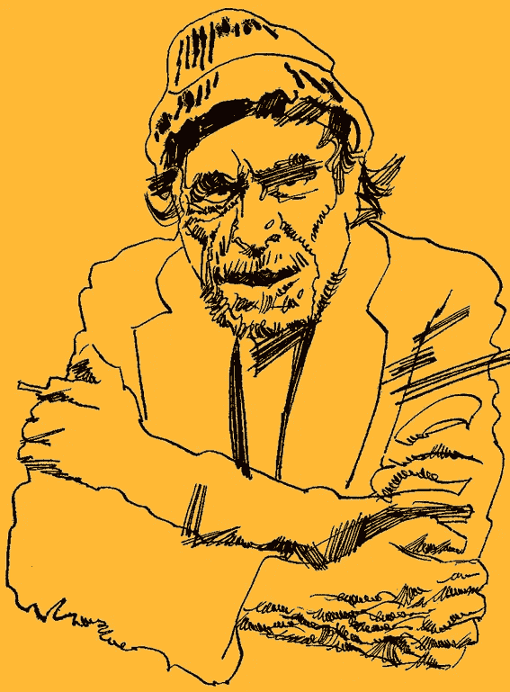
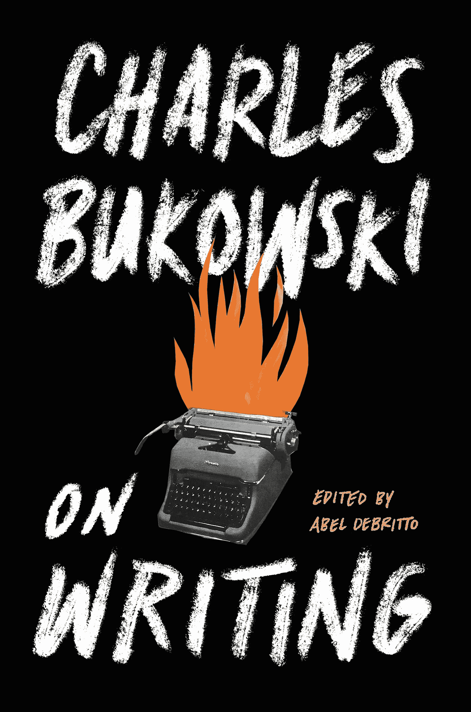

# 来自查尔斯·布可夫斯基的人生教训

> 原文：<https://medium.datadriveninvestor.com/lessons-from-charles-bukowski-fb420b1509e2?source=collection_archive---------2----------------------->

Bukowski-by-origa.jpg: Origafoundationderivative work: — MGuf (d) [CC BY-SA ([https://creativecommons.org/licenses/by-sa/3.0](https://creativecommons.org/licenses/by-sa/3.0))]

Credit: Ecco

是时候开始研究布考斯基了。

如果你从未读过查尔斯·布可夫斯基的作品，你应该读一读，尤其是如果你从事商业的话。

当我第一次遇到这位标志性的作者时，我怎么也看不够。对于那些不熟悉的人，他写了《黑麦火腿》，这是 JD·塞林格的《T2 麦田里的守望者》的蓝领解药。和大多数人一样，少年时看《守望者》就喜欢上了。但对我来说，黑麦火腿是个更好的创意。

这就是为什么几年前，当他死后出版的名为《T4 写作集》的书信集出版时，我总是迫不及待地想要得到它。

我没有失望。我读得越多，就越觉得布考斯基的作品充满了适用于各行各业的经验教训。

无论你是为像微软这样的大公司工作，还是为一个不起眼的初创公司工作，这些信都是极好的，很可能会有一些让你发痒的东西。这里有一些最好的。

# 失败是自由

考虑一下这个:

> “一旦你撑杆跳高了 17 英尺，他们想要 18 英尺，结果你可能会试着摔断腿。暴徒必须永远被视为像充满呕吐物的河流一样疯狂的东西。”

或者用我的话来说，如果人们对你没有期望，那么你有做你想做的事情的自由；这是一个附带项目还是一个开创性的想法。在开发新事物时，你不需要的是管理层的关注。如果真的很新颖，会吓到他们的。

# 不要让拒绝让你沮丧

通过这本书，布可夫斯基讨论了他的作品被拒绝的巨大规模。但他知道自己的使命，尽管可能会很艰难，他还是坚持了下来。你也应该。

# 接受反馈

显然，在收到一些负面反馈后，他写道:

> “你的批评是正确的[……]比起‘抱歉’或‘不’或‘库存过多’，我更欣赏批评。”"

全书一路有很多类似的评论。如果批评来自你信任和尊重的人，那么找出他们的想法并倾听。当你听的时候，试着去理解而不是回应。无论你在哪个领域，它都会帮助你，即使你得出了不同的结论。

# 有时候一个提议就是不合适

当这种情况发生时，甚至不要费心去谈判。布考斯基描述了一个场景，他被要求重新考虑一个角色的行为，他显然认为这个角色是故事的核心。他告诉他们算了，把作品寄回去。然后他挂断了电话。我们所有人在工作和生活中都会有这样的时候。当这种情况发生时，我们都应该有勇气后退。

# 继续

经过 40 年的努力，布可夫斯基才在《诗歌》杂志上发表。此后不久，他就去世了。如果你想要什么，就坚持去争取，不管要花多长时间。

# 成功往往是运气

> "许多出版都是通过政治、朋友和天生的愚蠢来完成的."

上面的引文是关于特定时期(1980 年)的特定行业的。)但是根据我的经验，大部分领域大部分时间大概都是这样。所以，如果你没有立即获得你渴望的成功，不要让它让你沮丧。

# 不要势利眼

布考斯基没有受过多少正规教育。尽管如此，他还是给这个领域增加了巨大的数量。这里的意思是，当你遇到“不具备必要条件”的人时，不要忽视他们做出贡献的能力。你可能会错过一个很好的机会。同样，如果你没有合适的纸质证书，不要让它阻止你。

# 有时候你不得不离开

50 岁时，他辞去了美国邮政局的工作，“以防止精神错乱。”不管这是不是真正的原因，他能够追求他的激情。对你来说，这可能是开始你梦想多年的事业。

这是一个故事的编辑版本，该故事于 2016 年 2 月 15 日首次出现在 Forbes.com 上。