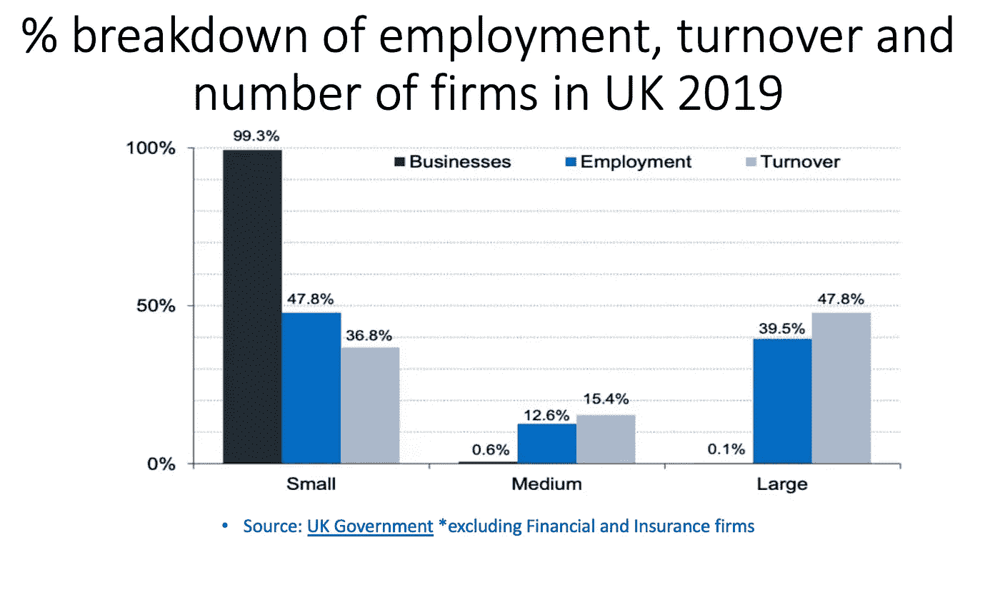

# 来自欧洲的经验帮助英国中小企业，以及区块链如何用于处理数据

> 原文：<https://medium.datadriveninvestor.com/lessons-from-europe-to-help-uk-smes-and-how-blockchain-can-used-to-handle-data-3623b5ba005f?source=collection_archive---------17----------------------->

 [## 数字货币、区块链和货币的未来|数据驱动的投资者

### “区块链”、“加密货币”、“令牌化”，以及现在的“央行数字货币”已经成为…

www.datadriveninvestor.com](https://www.datadriveninvestor.com/2020/02/18/digital-currencies-blockchain-and-the-future-of-money/) 

英国承诺 3300 亿英镑帮助企业，据《卫报》报道，迄今为止，只有 20%的公司申请成功并获得 11 亿英镑
。英国商会(可能更能反映中小企业的情况)表示，接受调查的公司中有 66%已经让员工休假，71%打算这么做。
59%接受调查的公司现金仅能维持 3 个月
其中 2%的公司成功地从政府计划中获得了资金
瑞士已经向超过 76，000 家公司提供了 120 亿欧元的贷款——一页文件一旦提交，资金将在 30 分钟内到达申请人的银行账户
德国的计划与英国相似，现在他们采用了瑞士模式
令人担忧 我们可能会看到第二波新冠肺炎，虽然可以理解的是，数十亿美元正投资于医疗解决方案以拯救生命，但我们需要获得数据，以便能够研究经济和商业影响。
如果所有的政府贷款和拨款信息都在一个区块链驱动的平台上，然后被加密，纳税人将更容易看到他们的钱被花在了哪里，成功申请的百分比，最终偿还的贷款百分比。分析师、金融机构的研究人员、大学和商业专家可以观察趋势、按行业划分的国家商业区域、按雇员人数划分的公司等，以确定如果这种情况再次出现，哪些公司需要帮助。
·使用区块链技术——在不影响 GDPR 的情况下提高透明度，从而获得更多信任！