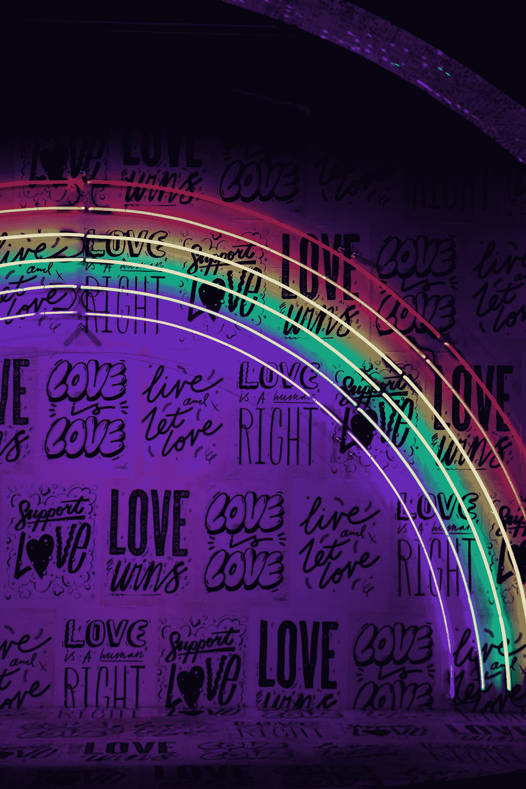

# 我在探索心流状态中学到的经验

> 原文：<https://medium.datadriveninvestor.com/lessons-i-learnt-exploring-flow-state-6b5dd344d71?source=collection_archive---------32----------------------->

## 流动状态就是爱——健康的爱

Photo by [Jason Leung](https://unsplash.com/@ninjason?utm_source=medium&utm_medium=referral) on [Unsplash](https://unsplash.com?utm_source=medium&utm_medium=referral)

F

我喜欢自我提升的书籍。随着 2020 年的到来，我轻松地度过了一段时间。他们都有一个共同点——**心流状态**。或者处于流动状态。

> 心流状态点亮了神经网络，并带来精神体验。

这让我深思。这让我很好奇，我是否以及何时享受到了处于焦点区域的特权。

**我整理了下面的列表，粗略地看了一下我喜欢的东西:
阅读|写作|冥想|对话|编码|跑步|跳舞|网飞|喝醉|运动**

我发现这种自我反省练习既有趣又有用。它使我能够更深入地挖掘“心流状态”的概念，以及它如何适用于我。

我用我学到的知识钻研我策划的清单。

# 我在探索心流状态中学到的经验

## 心流状态就像在恋爱。健康的爱情。

对某事物的强烈兴趣或快乐

当你在经历辉煌的爱情时，其他什么都不重要。和你爱的人在一起是一种幸福的感觉。幸福包裹着你的身体和灵魂。世界逐渐消逝。

当你离开你爱的人时，你在想他们。你迫不及待想和他们在一起。

这是幸福的。它充满了你的心。

处于心流状态就像处于青少年时期的恋爱。手头的任务才是最重要的。你在品味每一刻。

*但是，条件适用。*

爱情并不总是梦幻般的感觉。
爱是自省的。爱是尊重。健康的爱情让你心满意足。爱情需要努力。爱能促进成长。

> 当你和你爱的人在一起的时候，你从来没有像现在这样处于心流状态。

## 心流状态和压力状态有相似之处。

当务之急是要留心，不要混淆处于压力状态和心流状态。

这两种状态都需要关注。两种状态都把你拉进去。
两种状态都让你忘记周围的世界。

当你离开这个州时，主要的区别就很明显了。当你慢慢走出心流状态时，会有一种喜悦感、成就感、平和感。然而疲惫伴随着压力和恐惧而来。

这类似于从冥想中醒来和醉酒昏迷。

两者都让你兴奋。
两者都给你欢乐的感觉。两者都让你回来。

两者都有显著不同的长期副作用。

> 心流强化你的心智。压力会让它消失。

## 当前时刻和流动状态协同工作

你越关注当下，你就越有自我意识。这种自我意识使你能够欣赏瞥见心流状态的时光。这鼓励你花更多的时间在这些活动上。

从小到大，我从不认为自己喜欢任何运动。在我 30 多岁的时候，当我出于兴趣涉足体育运动时，我发现自己已经沉浸其中了。这让我在庆祝的时候转向体育。

当你处于心流状态时，你周围的一切都会减少。你享受激光般的专注，你的所有感官都与手头的任务协调一致。心流状态将你带入当下。

> 当你完全处于当下时，你会体验到心流状态。当你处于心流状态时，你会体验当下。

## 心流状态需要纪律

我们从购物、喝醉、网上冲浪等活动中获得快乐。愉快的活动可能会给人一种明显的心流状态的感觉，因为有身临其境的感觉。

这些有趣和嬉戏的活动是健康生活不可或缺的一部分。

然而，这些不需要努力或纪律。它们不会突破我们的界限，也不会带来增长。

另一方面，流状态活动，像写作，需要纪律和一致性来克服惰性和障碍。然而，结果是你的舒适区扩大了。

你越自律、越稳定，就越容易进入心流状态，结果也越好。

一种成长感和长期的成就感，而不是快乐活动中的多巴胺，才是心流状态。

> 心流状态是积极习惯的产物。

## 流动状态是创造性的

从我的自省中最大的收获是来自心流状态的创造。

在花时间做让你进入状态的活动时，你表现得越自律，你创造的就越多。

活在当下和专注让我们的创造力源源不断。我们引入的纪律越多，我们为自己创造的框架就越多。就越容易进入状态。

创造不一定是有形的，有时是成长，有时是突破你舒适区的界限，有时是顿悟的时刻。

有时候是你引以为豪的一件作品。

> 心流状态是创造力的温床。

## 最后

*   根据我的推断，我最初的清单被分为愉快状态和心流状态。

**愉悦状态:跑步|跳舞|网飞|喝醉|运动**

**心流状态:阅读|写作|深度对话|编码|冥想**

*   策划一系列能给你带来快乐、享受、愉悦、成长和创造力的活动。
*   开始引入更多的纪律和奉献精神，花时间在重点活动上。
*   在让你快乐的活动后花时间反省:它给我这种快乐的感觉是什么，是多巴胺的作用吗，它如何影响我，后效是积极的还是消极的？我在生活中创造了什么新的东西吗？
*   练习活在当下。冥想、专注于呼吸、融入自然有助于将你的注意力带到当下。

> “心流”是一种精神状态，在这种状态下，一个人完全沉浸在他或她正在做的事情中，在活动的过程中感到精力充沛、完全投入和成功。这是一种最高创造力的状态。—匿名