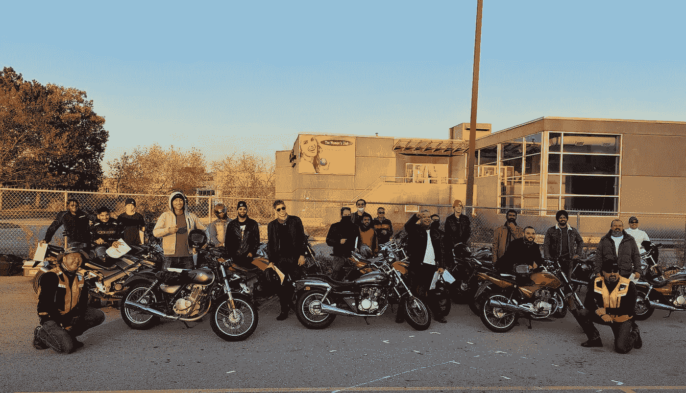
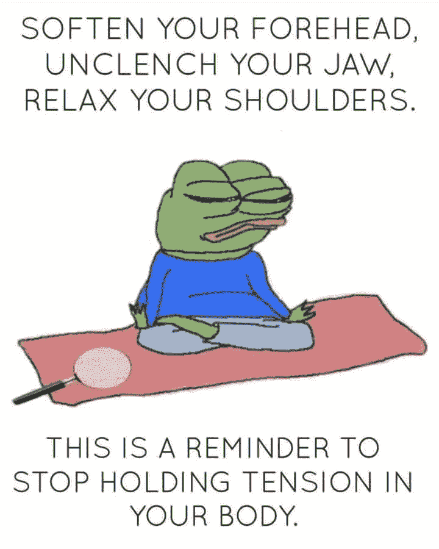
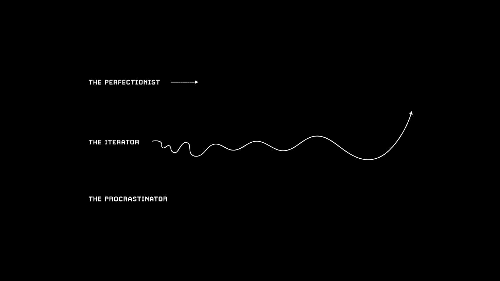

# 小行动、JFDI、雪球效应和数量偏好的教训

> 原文：<https://medium.datadriveninvestor.com/lessons-in-small-actions-jfdi-snowball-effects-and-biasing-for-quantity-99b9d60acb4?source=collection_archive---------20----------------------->

## 我 11 月的回顾展

> ***“Jizzing 是生产力的大敌。”***

显然，我已经把这句话记在了我 11 月份的日记中。这种说法是否真实，这取决于个人的争论。我不敢相信我刚刚与全世界分享了这一切。谢天谢地，这篇文章的重点不是关于射精。我保证这将是一部少了很多图像，多了很多…成果的电影。

在 2020 年 10 月初，我开始了一个严格的、有意识的早晨和就寝时间安排，包括坚持和执行一系列原子习惯。它由一个内置的清单捆绑在一起，我每天早上、晚上都仔细检查，然后再次清除，第二天重复同样的过程。这个程序的一部分包括记录我的意识流。这是我的疗法。我的说话盒。我的口头呕吐袋。

严格来说。言语呕吐袋是一个贴切的描述，因为其 98%的内容是无格式的；对我的一天和我的感受的语无伦次的谩骂。我从来没有打算将这些想法公之于众——我自己都没有读过它们！但很快我就发现，如果没有有意识地回顾其中的一些条目，我就错过了一个引出一些共同主题的好机会，或许还能获得一些关于我自己和这个世界的有用见解。

所以事不宜迟，我向你们介绍:

# 我 11 月的回顾展

## 惯性

> “除非有东西移动，否则什么都不会发生。”——阿尔伯特·爱因斯坦

这一课可以广泛地应用于我的一生。无论是冷漠(缺乏关爱)、拖延(缺乏作为)、迷失方向(混淆信号和优先事项)，还是其他一些看不见的力量；我总是不得不克服一些阻力来完成任何事情。惯性是物理学的一个原理，据此物质将保持稳定或运动，除非受到某种外力的作用。就我而言，一旦我习惯了无所事事，即使是一个慵懒的下午也会导致无数的摩擦，阻止我继续前进。相比之下，一旦我开始行动，动力就会迅速聚集，很难停下来。

在 11 月份的几个例子中，惰性是明显的。以我的日常工作为例:我有几次险些丧命💯我的清单。在那些大惯性的时刻，在我的头脑和身体中的一切都在与舒适和无所作为的现状作斗争的时候，我记得 [***总是走最容易的一步***](https://www.amazon.ca/Ethical-Slut-Second-Relationships-Adventures/dp/1587613379) 。如果我的清单上有“早上去小便”(确实如此)，那就是我要去做的事情。惯性原理解决了剩下的问题。这个概念也适用于我为出版《兰花的孩子》所付出的巨大努力。投入 32 小时的工作(7%的清醒时间！)在个人项目上并不是我所习惯的。很多次我考虑放弃我的写作常规“就为了这一天”。我的写作习惯是从简单的事情开始的，比如“喝水”、“打开雾化器”或“关闭笔记本电脑上的所有应用程序，除了我的想法”，这种惯性足以建立和维持动力。

## 将你看似高杠杆的活动削减成机械的例行公事

关于我的例行清单还有一件事要补充。可以认为，我们每天都有可以投入精力的高杠杆/低紧迫性活动:喝水、冥想、健身、准备健康早餐、阅读等等。它们在当下似乎从来都不重要——人类在基因上倾向于偏爱眼前的满足，而不是长期的远景活动——但长期的复合效应可能会显示出相反的结果。这就是为什么我迎合我的日常生活，让它感觉自动和无脑。我不必在我必须做的事情上浪费脑力，我必须花多少时间去做它，或者争论是否继续在 Instagram 上滚动或完成我的日常事务。一.**就。他妈的。做吧**。11 月份真正向我阐明了为什么这个惯例如此重要。💯几乎每天都在实现。

## 复合优先级导致压力，咄

“焦虑”和“压力”在我 11 月的日记中出现了 26 次。

除了我的日常事务，我在每晚结束时准备我的“优先事项”;我必须在第二天完成的事情清单(在我的日常事务之外)。这是一个非常有用的功能，可以捕捉我可能想要完成或勾掉的高杠杆和低杠杆活动。毫无疑问，优先级和积压总是在增长。复合是一个婊子。当事情得不到控制时，它们就像大海中的锚一样坐在我的脑后。不要让这个列表增长。如果它增长了，这些事情要么不是优先考虑的，要么你只需要建立一点惯性来让事情继续下去。 ***除了最容易的一步*** 什么都不要走。

## 数量超过质量，直到你得到质量

> “玩迭代游戏。”—海军拉维坎特

这是我从各种各样的人才那里听到和看到的一个教训:我的好朋友[阿梅尔·阿明](https://medium.com/@amerameen)和[斯蒂芬·帕卡利迪斯](https://www.instagram.com/world.trippin/)，天使哲学家纳瓦·拉维坎特，纽约 DJ 阿提什，Visualize Value 的杰克·布彻，以及“作家”大卫·佩雷尔。我把这个教训铭记在心。11 月份完成了至少一个小时的写作。单身。日。当然，一开始我的写作会很一般。与方佳阳常春藤联盟风格的文章相比，我的文章读起来真的像一个高中生。但 10 月和 11 月对数量的偏好导致了 5000 字和 8500 字文章的连续发布。我还有另一份(已完成的)区块链邮报，还有你正在阅读的这份(顺便谢谢)。你必须努力提高质量。如果这意味着要读 1000 篇平淡无奇、无人阅读、低吸引力的文章才能读到哪怕一篇杰作，那就这样吧。

> 除非你有一些工作证明的表象，表明你的参与，否则我保证你永远不会得到你需要改进的反馈。

*Jack Butcher’s* [*visualization*](https://twitter.com/visualizevalue/status/1285033213602131968?lang=en) *of the requisite need to iterate.*

# 11 月的主要里程碑:

*   🎂为了好朋友艾南的生日，我写了一首诗，叫《艾南波波侬》。这个里程碑与其说是一首诗，不如说是我构思了它，执行了它，然后毫不避讳地在聚会上当着人们的面抨击它。这很尴尬，很奇怪，但价值在于完成它。
*   🏍️:我完成了我的 M2 摩托车学习执照！很快就要在你的多伦多街道上被大米火箭或巡洋舰撕裂。
*   🌸发布了“[兰花之子](https://tim-hch.medium.com/children-of-orchid-2b2f900e6e9b)”。说真的，这是我的一项重大成就。
*   🚶‍♂️养成了和父亲一起散步的习惯。感谢链锁安全公司的斯图·彼得斯给我们带来的灵感。👊
*   🏂我们锁定了 2021 年第二次远程工作/滑雪旅行，和 6 个非常好的朋友一起去西部 6 周。Alssa 来自台湾是一个明显的可能性！！！

就这样了，伙计们。感谢您的阅读，下个月的复古版再见！

*嘿！如果你真的在我的故事中读到了这一步，那么从心底感谢你对我阅读这么多作品的考虑、耐心和热爱。言语无法表达我有多感激。*

*他们说‘写作=清晰的思维’，所以我在我自己的旅程中使我的思维具体化(从而使我的写作具体化)。如果你喜欢这个故事，你可以在这里找到更多我在媒体***上的作品。我偶尔也会在 Instagram* [*这里*](https://www.instagram.com/haochizzle) *发长文。你也可以在这里* *找到我在 Twitter 上喋喋不休的* [*。最后，一定要*](https://twitter.com/haochizzle) [*访问我的网站*](http://tim-hch.com) *。**

*你在 11 月学到了什么？请分享！:-)*

*

If you enjoy my content, please consider buying me a coffee! :)*