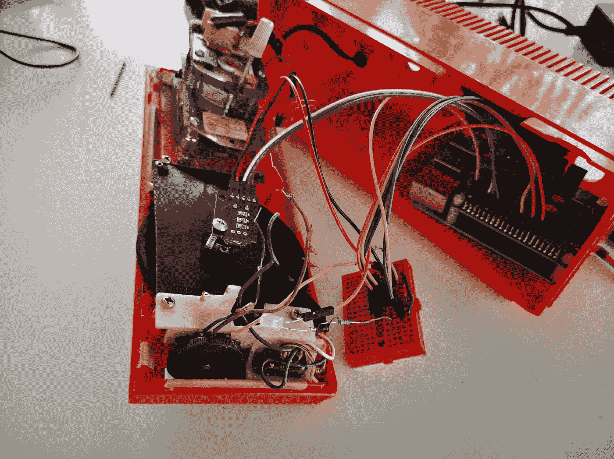
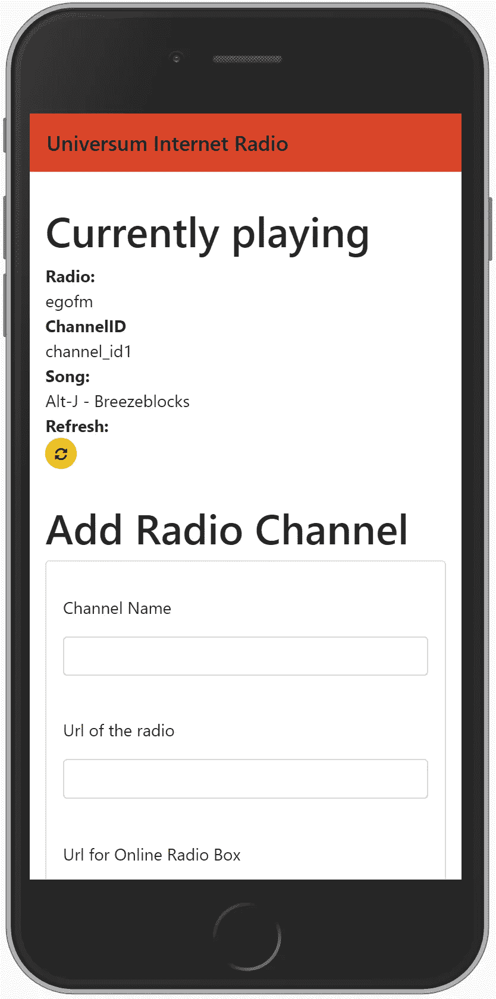
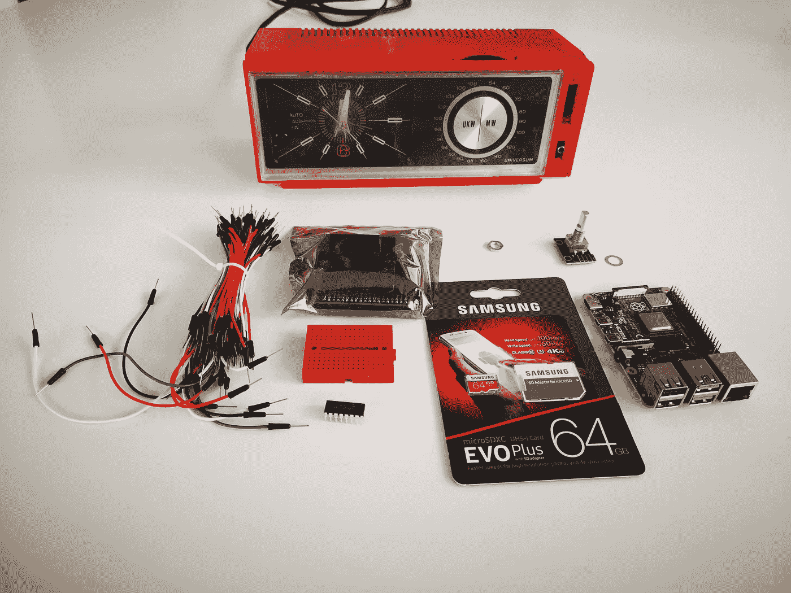

# 让老式收音机成为在线收音机

> 原文：<https://medium.datadriveninvestor.com/let-a-vintage-radio-become-an-online-radio-85168aaef288?source=collection_archive---------3----------------------->

你如何使用一个自由市场收音机+一个树莓派来构建一个功能齐全的在线收音机。

A video of my vintage online radio

我妻子一直希望我有一台收音机

1.  看起来不错
2.  易于控制
3.  音质很好
4.  播放来自互联网的频道

所以市场上有很多新奇的网络收音机。但所有这些都有触摸屏，花哨的液晶显示器或播放约 1000 个频道，你不需要 990 个。我妻子还有一台 70 年代的 Universum 收音机，是她在一个跳蚤市场花了不到 5 欧元买的。虽然声音很差，而且不太可靠。我坐下来发现，一个树莓派，一个 hifi-berry 和一些小芯片可以很容易地让这个成为一个在线收音机。我们开始吧！不仅我做到了，你也能做到！(看本文结尾)

# 如何开始？

## 硬件设置



vintage radio construction site

起初我打开收音机，向里面看了看。我想知道哪些零件可以重复使用。我发现巨大的频道转换轮，可以很容易地连接到 KY040 旋转开关，可以与树莓皮一起工作。此外，我想保留开/关开关和音量控制。由于音量控制只是一个简单的电位计，它可以用模拟数字转换器读取。一个 [hifi-berry](https://www.hifiberry.com/) 会发出声音。树莓派将是核心。我将添加一个 LED 来显示当前是否一切正常。这应该是硬件设置。

[](https://www.datadriveninvestor.com/2020/07/07/introduction-to-time-series-forecasting-of-stock-prices-with-python/) [## 用 Python |数据驱动投资者进行股票价格时间序列预测简介

### 在这个简单的教程中，我们将看看如何将时间序列模型应用于股票价格。更具体地说，一个…

www.datadriveninvestor.com](https://www.datadriveninvestor.com/2020/07/07/introduction-to-time-series-forecasting-of-stock-prices-with-python/) 

## 软件设置

作为一名数据科学家，我想用一种简单的编程语言来构建无线电软件。有很多关于如何与 raspberry pi 和 Python 的引脚进行交互的教程。所以我用了 Python。我需要什么样的软件。因此，我需要解释，我的妻子希望收音机如何工作。

1.  *转动频道轮*:将改变频道。它应该像一个旧的调频收音机一样工作，在频道之间有噪音。如果没有通道，LED 应闪烁，如果有通道，则保持静止。
2.  *转动音量控制:*改变音量

哇，听起来很简单。所有这些可以简单地在脚本中运行，该脚本对 KY040 被转动或音量控制被转动作出反应。这个脚本将需要运行一些并行进程，因为音量控制和 KY040 应该是独立的。但是仍然有一些问题留给我:

1.  *我们如何管理可用频道列表？*
2.  *我如何知道哪个频道正在播放？*
3.  *当前播放的是哪首歌？*

对于这两个问题，我决定写一个 Python 脚本。我之前为这样一个简单的用例写了一个 [FlaskApp，并认为这是一个很好的方法。](https://github.com/zappingseb/BBCafterScrobbler)

# 建造收音机

我坐在我的桌子旁，拿着一个焊接离子，首先将音量控制电位计与芯片连接起来。然后将频道开关粘到 KY040 上，最后但同样重要的是，将 LED 添加到树莓 pi 上。然后我开始从我所有的输入中读取信号。我花了一段时间才弄明白如何在 Python 中使用并行进程。但基本模式是这样的:

```
import threadingclass VolumeControl: def start(self):
    while self._running:
      #do sth e.g. read PIN
      sleep(0.05)
  def is_running(self):
     self._running
  def stop(self):
     self._running = False
  def set_running(self):
     self._running = True# Define and start the VolumeControl in a separate thread                               volume = VolumeControl()                               volume.set_running()
t_volume = threading.Thread(target=volume.start)                               t_volume.start()# Stop the thread
volume.stop()
t_volume.join()
```

这里你可以看到，我为 raspberry pi 的 GPIO 引脚的每个监听器创建了一个类。这个类将在一个`while`循环中运行它的所有代码。这意味着它将持续检查 GPIO 引脚。在循环中，将有代码检查 pin，然后超时，等待再次读取 pin。

在我发现如何让这些不同的过程相互作用之后，我有了下面的过程:

*检查频道滚轮是否转动:*

是:让 LED 进程闪烁，让播放器进程播放噪音

No/channel found:让 LED 进程保持开启，让 Player 进程在字典中查找频道并播放该频道。使用 [onlineradiobox](https://onlineradiobox.com/deu/) 查找当前播放的歌曲。

*检查音量控制是否打开*

检查它是上升还是下降，改变系统音量

我将当前播放的歌曲和频道作为一个`json`文件存储在 raspberry pi 的 SD 卡上。此外，我捕获了所有错误，并将它们写入 raspberry pi 上的日志文件中。

收音机这部分的所有代码都可以在 [Github](https://github.com/zappingseb/radioflask/blob/master/ky40.py) 上找到。如果你认为这些过程很简单，其实不然。我最终用了大约 900 行代码来运行这个收音机。

# 构建 WebApp

构建 WebApp 比摆弄收音机要容易得多。WebApp 应该具有以下功能:



1.  在顶部显示当前播放频道的内容`json`文件
2.  包含人们可以向列表中添加频道的表单。该表单应包含频道 url、名称和 onlineradiobox url。
3.  包含当前频道列表，用户可以使用“-”按钮来删除频道。
4.  包含一个按钮来存储当前显示的频道列表。
5.  包含一个按钮，用于恢复进入应用程序时显示的频道列表。
6.  将所有设置存储在一个`json`文件中，运行无线电的脚本可以访问该文件。

烧瓶的一个很好的特性是模板。在本例中，我为当前通道创建了一个模板，一个用于添加通道，一个用于删除通道。基本上就是这样。

对我来说，最难的部分是理解一个烧瓶一般是如何工作的。这些应用程序主要被认为是与 REST-API 交互的。所以通常 REST-API 处理很多逻辑。重要的一点是，当打开应用程序时，有一个`session`对象，其中包含应用程序内部显示的最后信息。所以只有在第一次启动时，我才需要从`json`加载我的频道列表。每当我告诉应用程序覆盖这个`json`时，我也需要通过使用`session.pop`来刷新`session`对象。

在我解决了`session`的问题后，使用 Flask 变得简单了。您创建包含特定值的对象。你把对象交给一个 HTML 模板，它会在某些占位符上显示值。

我的 app 的全部代码也在 Github 上:[https://Github . com/zapping SEB/radio flask/blob/master/views . py](https://github.com/zappingseb/radioflask/blob/master/views.py)

# Raspberry Pi 设置

最后但并非最不重要的是，有一些东西安装在树莓派。

*   将 Hifi-Berry 设为默认音频设备
*   添加一个共享文件夹，将代码添加到 pi 中
*   让覆盆子进入你的无线网络
*   添加所有必要的 Python 库，例如 flask 或 RPI。GPIO
*   将 python3 设为默认 python
*   让广播脚本在启动 raspberry pi 时运行

# **现在构建您自己的！**

这篇文章只是关于如何制造收音机的介绍。我把所有必要的代码放在 Github 上，然后把整个收音机作为 DIY 工具包放在易贝上。该工具包不仅包含所有你需要建造收音机的零件，还包含一份如何建造和修理收音机的详细计划。



Vintage Internet Radio Kit

你可以在易贝向我购买整套工具。

**访问专家视图—** [**订阅 DDI 英特尔**](https://datadriveninvestor.com/ddi-intel)