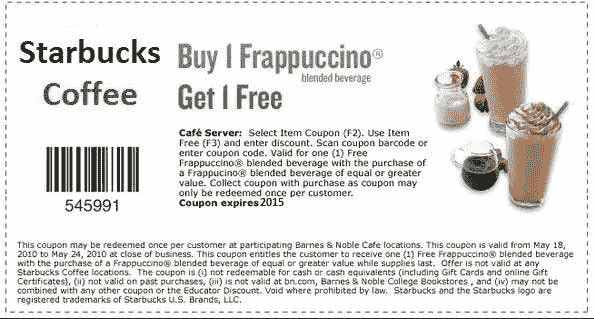
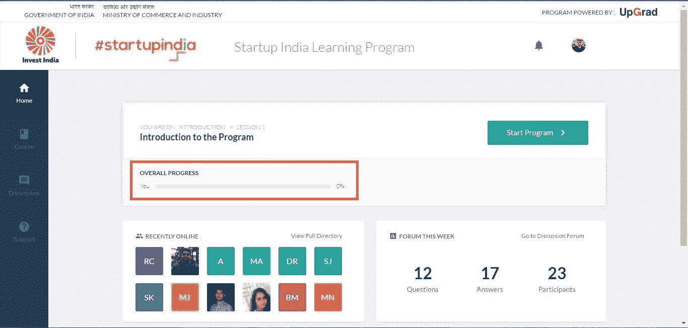
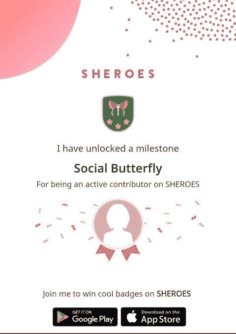
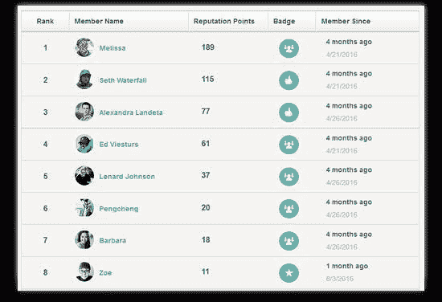
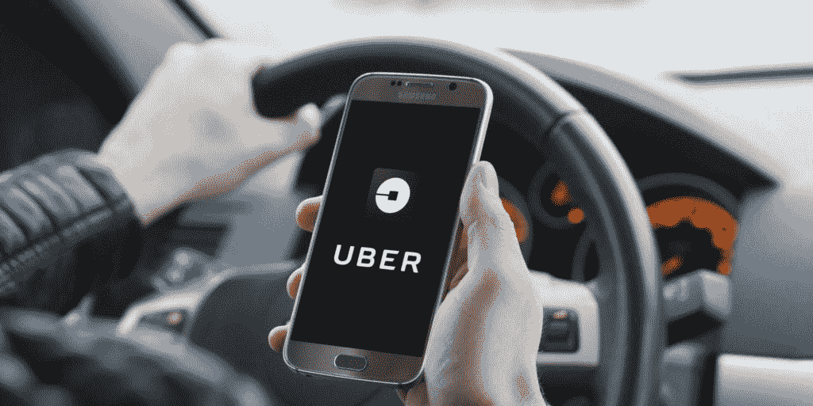

# 让游戏开始:游戏化的概念&在现实世界中的应用

> 原文：<https://medium.datadriveninvestor.com/let-the-games-begin-the-idea-of-gamification-applications-in-the-real-world-56b08d5983e5?source=collection_archive---------1----------------------->

Photo by [Adrien Olichon](https://unsplash.com/@adrienolichon?utm_source=unsplash&utm_medium=referral&utm_content=creditCopyText) on [Unsplash](https://unsplash.com/s/photos/game?utm_source=unsplash&utm_medium=referral&utm_content=creditCopyText)

“游戏化。”

你可能听说过这个名字在会议室里被随意提起。

或者你可能在一篇零散的文章中读到过这个术语。

早在 2002 年，Nick Pelling 创造了“游戏化”一词，2014 年，Gartner 试图重新定义它。根据 Gartner 2014 年的定义-

> 游戏化是指“使用游戏机制和体验设计来数字化地吸引和激励人们实现他们的目标”。

虽然这个定义涵盖了游戏机制的两个最重要的方面(结构方面)和体验设计(内容方面)，但它有一点限制性。

 [## 数据科学和软件工程哪个更有前途？数据驱动的投资者

### 大约一个月前，当我坐在咖啡馆里为一个客户开发网站时，我发现了这个女人…

www.datadriveninvestor.com](https://www.datadriveninvestor.com/2019/01/23/which-is-more-promising-data-science-or-software-engineering/) 

# 游戏化:模拟还是数字？

例如，Gartner 的定义适用于数字游戏化。而游戏化也可以是真实世界的场景。

例如:你在咖啡店收到的优惠券。实体邮票纸是现实生活中游戏化的一个例子。

模拟和数字之间没有真正的界限:游戏化对两者都适用。

# 游戏机制:什么是游戏元素？

既然我们已经谈到了游戏机制——理解游戏设计的元素对我们所有人都有帮助。游戏化体验背后的机制是什么？稍后，我们将通过一个真实的例子来理解这一点。

#1 进度条

进度条随处可见——你的社交媒体资料，你的银行对账单等等。这个视觉提示有两个作用:它向你展示你在一个特定的任务中已经走了多远，它增加了一个激励的元素。

这种游戏机制在应用于在线训练时特别有用。这激励他们完成更多的内容，赢得更多的积分和徽章，当然，达到排行榜的顶端！

#2 分

你能想到的任何游戏，从网球到俄罗斯方块，都会用积分来决定最佳玩家。这种游戏机制已经成为现实世界的一个重要组成部分，比如常客积分和商店奖励卡。在这两种情况下，参与度最高的人会获得更多的分数。

#3 徽章

还记得你在艺术比赛中获得徽章的学生时代吗？赢得一些东西的感觉很棒，但不止如此——拥有一个胜利的象征更令人满意。虚拟徽章柜已经成为大多数视频游戏的标准功能，甚至被 Zomato 和三星等非游戏企业用来吸引用户。

#4 成就

徽章是授予完成特定目标的用户的，而成就是通过与系统的交互来获得的。

排名第五的排行榜

擅长某件事和成为最优秀的人之间有很大的区别。我们可能不愿意承认，但我们都喜欢竞争。当你向每个人展示他们的排名时，奇怪的事情发生了——他们的参与度飙升！

看看任何像 UpGrad 的课程这样的 LMS 以及他们的排行榜。

既然我们已经在理论上涵盖了所有的游戏机制，是时候把它付诸实践了！

让我们来看看优步的案例，以及游戏化如何帮助优步吸引司机和顾客。

# 应用中的游戏化:优步案例研究

有没有想过，除了无缝 CX 能让用户找到到达目的地的最快路线这一明显优势之外，优步还有什么优势？这在很大程度上是客户方面的问题。

但是司机呢？

是什么让他继续使用这款应用程序——又是什么让他更有动力开车？

优步是工作中游戏化的一个很好的例子。理想情况下，将优步体验游戏化必须对顾客和司机都有效。通过使用所谓的“卢迪循环”，优步确保司机在工作。

现在，在所有这些术语开始变得令人困惑之前，让我解释一下我所说的“卢迪循环”是什么意思。卢迪克循环是一个游戏元素，它创造了一种完成目标的感觉，只是超出了玩家的掌握。在注销之前，司机会收到一个通知，表明他们将赚 X 元钱——产生预期，下一个目标，需要坚持下去。

听起来很熟悉？

卢迪奇循环让我们继续阅读这部紧凑的惊悚片，在书的结尾揭示凶手——我们继续阅读，浏览章节。另一个例子是我们从网飞那里得到的提示，指引我们看到我们一直在看的剧集的下一集。在优步，这可以被看作是对下一次旅行的召唤，在一次旅行已经完成之前。

优步例子中的另一个游戏元素是“徽章”。司机因“优质服务”、“礼貌”等获得评级和徽章。虽然这在表面上看起来不像是一个很好的激励因素，但想想你玩过的视频游戏和你获得的徽章对你的影响。

# 就这样，结束了！

重要的是要认识到使游戏化成功的相同的潜在心理和行为原则:自我肯定、竞争和同伴支持。

然而，真正的魔力在于动机是如何数字化的——以及游戏化如何应用于任何可能的产品领域。

我很想在下面的评论中知道你的想法！