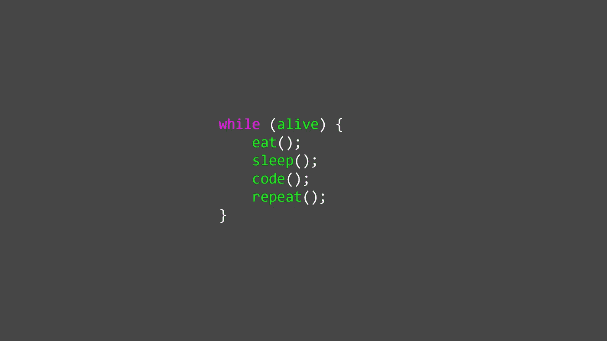
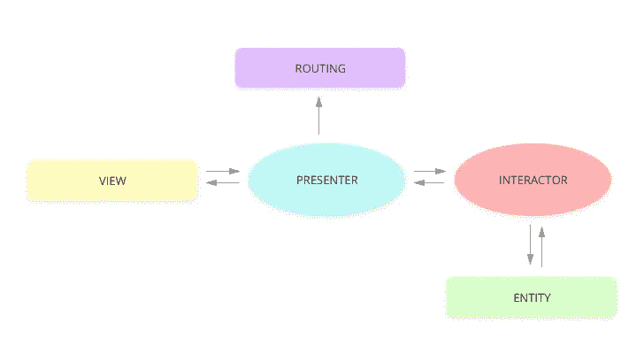
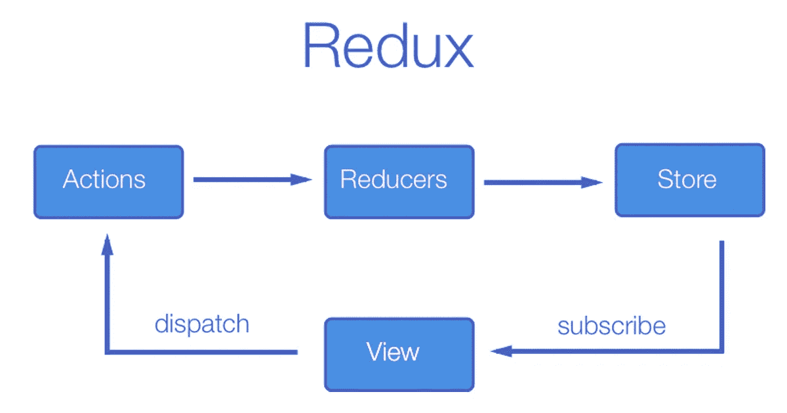
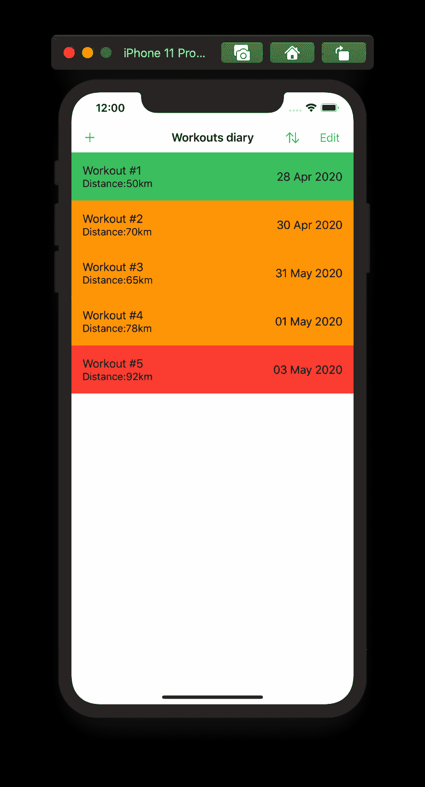
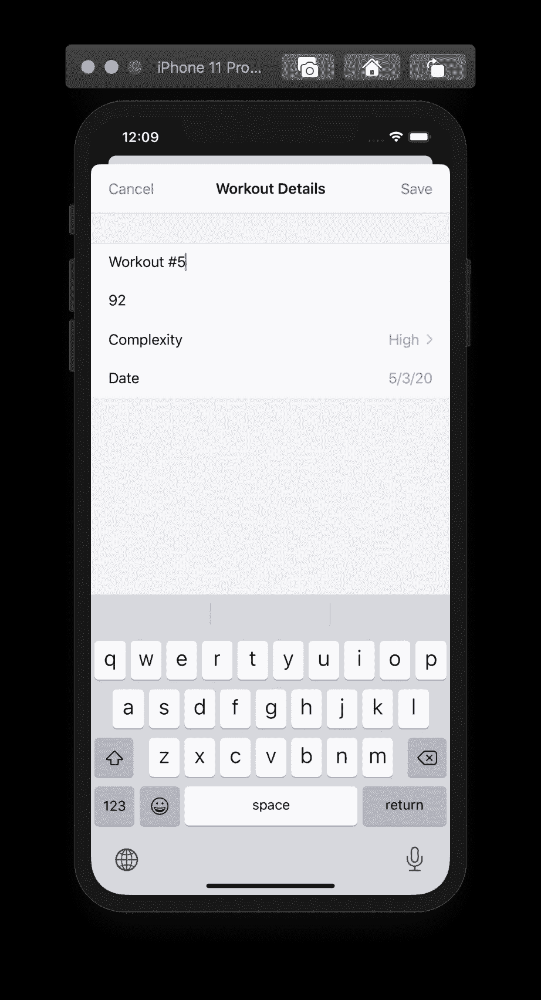
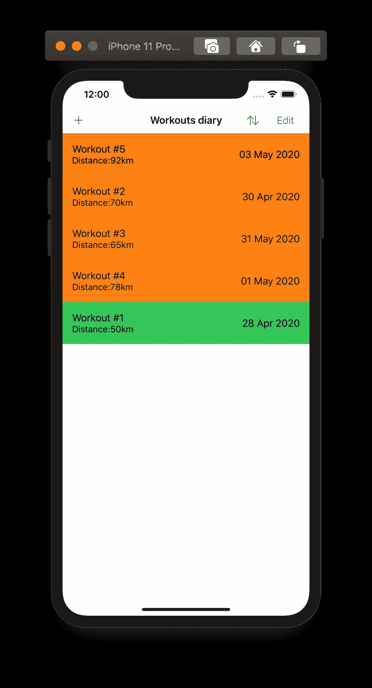

# 让我们使用 Redux 的 Swift UI 交互为 IOS 创建培训应用程序。

> 原文：<https://medium.datadriveninvestor.com/lets-create-training-app-for-ios-using-swift-ui-interaction-with-redux-f0314c731732?source=collection_archive---------1----------------------->



在本文中，我们将结合 Redux 讨论 SwiftUI 框架。这一对允许我们快速而容易地创建应用程序。与 UIKit 不同，SwiftUI 用于创建声明式用户界面。反过来，Redux 用来控制应用程序的状态。

**状态**是 SwiftUI 和 Redux 中的一个基本概念。在我们的情况下，这不仅是一个时髦的词，而且是一个连接它们的实体，并允许它们非常好地一起工作。在这篇文章中，我们将试图证明上述论点是正确的，所以让我们开始吧！

在我们深入编写代码之前，首先让我们了解 Redux 是什么，它由什么组成。

Redux 是一个用于管理应用程序状态的开源库。它通常与 React 或 Angular 结合使用来开发客户端。它包含许多工具，可以显著简化通过上下文传输存储数据。它的创造者是丹尼尔·阿布拉莫夫和安德鲁·克拉克。

对我们来说，Redux 不仅仅是一个库，它已经是更多的东西。我们将其归因于应用程序所基于的架构决策，主要是由于其单向数据流。

[](https://www.datadriveninvestor.com/2020/02/26/surviving-in-a-digital-age-of-instability/) [## 在不稳定的数字时代生存|数据驱动的投资者

### 如果你是一名计算机科学家，你可能已经注意到新的框架不断出现。编程…

www.datadriveninvestor.com](https://www.datadriveninvestor.com/2020/02/26/surviving-in-a-digital-age-of-instability/) 

## 多向或单向流动

为了解释我们所说的数据流，我们将给出下面的例子。使用 VIPER 创建的应用程序支持模块之间的多方向数据流:



反过来，Redux 是一个单向数据流，最容易根据其组成部分来解释。



让我们更详细地讨论一下每个 Redux 组件。

**状态**是包含我们应用程序所有必要信息的唯一真实来源。

**动作**是意图改变状态。在我们的例子中，这是一个枚举，包含我们想要在当前状态下添加或更改的新信息。

**Reducer** 是以动作和当前状态为参数，返回新状态的函数。这是创造它的唯一方法。另外值得注意的是，这个功能要干净。

**Store** 是一个包含状态的对象，提供了更新状态所需的所有工具。

理论上的第一次尝试可能就足够了，现在让我们继续实践吧。

## Redux 实现

了解一个工具最简单的方法之一就是开始使用它。大家都知道，想学一门编程语言，就要用它写一个应用。因此，让我们创建一个小应用程序，例如一个简单的训练日记。它只有四个选项，第一个是显示锻炼列表，第二个是添加已完成的锻炼，第三个是删除，第四个是对锻炼进行排序。一个非常简单的应用程序，但同时它将允许我们熟悉 Redux 和 SwiftUI。

在 Xcode 中创建一个干净的项目，将其命名为 WorkoutsDiary，最重要的是，为用户界面选择 SwiftUI。

创建项目后，创建一个健身结构，负责我们执行的健身。

```
import Foundation
struct Workout: Identifiable {
let id: UUID = .init()
let name: String
let distance: String
let date: Date
let complexity: Complexity
}
```

正如您所看到的，在这个结构中没有什么复杂的东西，id 字段需要遵守可识别的协议，而复杂性字段只是一个具有以下定义的枚举:

```
enum Complexity: Int {
case low
case medium
case high
}
```

现在我们已经拥有了开始实现 Redux 所需的一切。让我们从创建一个状态开始。

```
struct AppState {
var workouts: [Workout]
var sortType: SortType?
}
```

状态是一个简单的结构，包含两个字段:锻炼和排序类型。第一个是锻炼列表，第二个是可选字段，用于确定列表的排序方式。

SortType 是一种枚举，定义如下:

```
enum SortType {
case distance
case complexity
}
```

为简单起见，我们将按距离和难度降序排列。这意味着我们的训练越复杂，它在列表中显示的位置就越高。值得注意的是，sortType 是可选类型，可以是 nil，也就是说此时列表没有排序。

我们将继续实现我们的组件。让我们创建一个操作:

```
enum Action {
case addWorkout(_ workout: Workout)
case removeWorkout(at: IndexSet)
case sort(by: SortType)
}
```

正如我们所看到的，动作是一个列举，有三种情况给了我们操纵状态的能力。

*   addWorkout (_ workout: Workout)只是添加一个作为参数传递的锻炼。
*   removeWorkout (at: IndexSet)删除指定索引处的项目。
*   sort (by: SortType)按指定的排序类型对训练列表进行排序。

让我们创建一个最复杂的组件。它是**减速器**:

```
func reducer(state: AppState, action: Action) -> AppState {
var state = state
switch action {
case .addWorkout(let workout):
state.workouts.append(workout)
case .removeWorkout(let indexSet):
state.workouts.remove(atOffsets: indexSet)
switch type {
case .distance:
state.workouts.sort { $0.distance > $1.distance }
state.sortType = .distance
case .complexity:
state.workouts.sort { $0.complexity.rawValue > $1.complexity.rawValue }
state.sortType = .complexity
}
}
return state
}
```

我们编写的函数非常简单，工作方式如下:

1.  它复制当前状态来使用它。
2.  2.基于动作，我们更新我们的复制状态。

3.我们返回更新后的状态。

需要指出的是，上面的函数是纯函数，那也是我们想要实现的！一个函数必须满足两个条件才能被认为是“纯的”:

*   每次用相同的数据集调用该函数时，它都返回相同的结果。
*   没有副作用。

最后一个缺少的 Redux 元素是 Store，所以让我们为我们的应用程序实现它。

```
final class Store: ObservableObject {
@Published private(set) var state: AppState
init(state: AppState = .init(workouts: [Workout]())) {
self.state = statepublic func dispatch(action: Action) {
state = reducer(state: state, action: action)
}
}
```

在 Store 对象的实现中，我们利用了 ObservableObject 协议的所有优势，该协议允许我们排除大量模板代码的编写或第三方框架的使用。State 属性是只读的，并使用@Published 属性的包装器，这意味着无论何时它被更改，SwiftUI 都会收到通知。init 方法将初始状态作为一个参数，并以健身程序元素空数组的形式给出默认值。dispatch 函数是更新状态的唯一方法:它根据作为参数传递的动作，用 reducer 函数创建的新状态替换当前状态。

在我们实现了 Redux 的所有组件之后，我们可以开始为我们的应用程序创建一个用户界面。

## 应用程序实现

我们的应用程序的用户界面将非常简单。它将由两个小屏幕组成。第一个也是最主要的一个是显示锻炼列表的屏幕。第二个屏幕是“添加健身程序”屏幕。此外，每个要素将以某种颜色显示，颜色将反映健身程序的复杂程度。红色单元格表示锻炼的最高难度，橙色表示平均难度，绿色表示最容易的锻炼。

我们将使用苹果公司一个名为 SwiftUI 的新框架来实现这个接口。SwiftUI 来取代我们熟悉的 UIKit。SwiftUI 从根本上不同于 UIKit，主要在于它是一种用代码编写 UI 元素的声明性方法。在本文中，我们不会深入研究 SwiftUI 的所有错综复杂之处，我们假设您已经有了 SwiftUI 的使用经验。如果您不了解 SwiftUI，我们建议您关注 Apple 的文档，即查看他们的几个完整教程，其中包含逐步添加和结果的交互式显示。也有范例项目的链接。这些教程将让您快速进入 SwiftUI 的声明世界。

应该记住，SwiftUI 还没有为生产项目做好准备，它还太年轻，一年多以后才能以这种方式使用。还有，别忘了它只支持 iOS 13.0+版本。但同样值得注意的是，SwiftUI 将在所有苹果平台上工作，这是比 UIKit 大的优势！

让我们从应用程序的主屏幕开始实现。转到文件 ContentView.swift，将当前代码更改为以下代码:

```
struct ContentView: View {
@EnvironmentObject var store: Store
@State private var isAddingMode: Bool = falsevar body: some View {
NavigationView {
WorkoutListView()
.navigationBarTitle("Workouts diary", displayMode: .inline)
.navigationBarItems(
leading: AddButton(isAddingMode: self.$isAddingMode),
trailing: TrailingView()
)
}
.sheet(isPresented: $isAddingMode) {
AddWorkoutView(isAddingMode: self.$isAddingMode)
.environmentObject(self.store)
}
}
}
```

内容视图是 SwiftUI 中的标准视图。从我们的角度来看，最重要的部分是包含存储变量的代码行。我们将创建@EnvironmentObject。这将允许我们在任何需要的地方使用来自商店的数据，此外，如果数据发生变化，它将自动更新我们的视图。这有点像我们商店的 Singleton。

*@环境对象 var 商店:商店*

下面一行代码很重要:

*@ State private var is adding mode:Bool = false*

@State 是一个包装器，我们可以用它来指示视图的状态。SwiftUI 会将它存储在视图结构之外的一个特殊内存中。只有链接视图可以访问它。一旦 State 属性的值发生变化，SwiftUI 就会重新构建视图以考虑状态变化。



然后，我们将转到 SceneDelegate.swift 文件，并将代码添加到方法中:

```
func scene(
_ scene: UIScene,
willConnectTo session: UISceneSession,
options connectionOptions: UIScene.ConnectionOptions
) {
let contentView = ContentView().environmentObject(Store())if let windowScene = scene as? UIWindowScene {
let window = UIWindow(windowScene: windowScene)
window.rootViewController = UIHostingController(rootView: contentView)
self.window = window
window.makeKeyAndVisible()
}
}
```

同样，任何@EnvironmentObject 都可以传递给整个应用程序中的任何子表示，这一切都要感谢环境。变量 isAddingMode 被标记为 State，并指示是否显示辅助视图。store 变量由 WorkoutListView 自动继承，我们不需要显式地传递它，但我们需要为 AddWorkoutView 这样做，因为它以工作表的形式呈现，而不是 ContentView 的子视图。

现在创建一个将从视图继承的 WorkoutListView。创建名为 WorkoutListView 的新 swift 文件。

```
struct WorkoutListView: View {
@EnvironmentObject var store: Store
var body: some View {
List {
ForEach(store.state.workouts) {
WorkoutView(workout: $0)
}
.onDelete {
self.store.dispatch(action: .removeWorkout(at: $0))
}
.listRowInsets(EdgeInsets())
}
}
```

视图，该视图使用容器列表元素来显示健身程序列表。onDelete 功能用于删除健身程序，并使用 removeWorkout 操作，该操作通过商店提供的 dispatch 功能执行。要在列表中显示健身程序，请使用 WorkoutView。

创建另一个文件 WorkoutView.swift，它将负责在列表中显示我们的项目。

```
struct WorkoutView: View {
let workout: Workoutprivate var backgroundColor: Color {
switch workout.complexity {
case .low:
return .green
case .medium:
return .orange
case .high:
return .red
}
}var body: some View {
HStack {
VStack(alignment: .leading) {
Text(workout.name)
Text("Distance:" + workout.distance + "km")
.font(.subheadline)
}
Spacer()
VStack(alignment: .leading) {
Text(simpleFormat(workout.date))
}
}
.padding()
.background(backgroundColor)
}
}
private extension WorkoutView {
func simpleFormat(_ date: Date) -> String {
let dateFormatter = DateFormatter()
dateFormatter.dateFormat = "dd MMM yyyy"
dateFormatter.locale = .init(identifier: "en_GB")
return dateFormatter.string(from: date)
}
}
```

此视图将培训对象作为参数，并根据其属性进行配置。

若要向列表中添加新项，必须将 isAddingMode 参数更改为 true 以显示 AddWorkoutView。这是 AddButton 的责任。

```
struct AddButton: View {
@Binding var isAddingMode: Boolvar body: some View {
Button(action: { self.isAddingMode = true }) {
Image(systemName: "plus")
}
}
}
```

AddButton 也值得放到一个单独的文件中。

这个视图是一个简单的按钮，它是从主 ContentView 中提取出来的，用于更好的结构和代码分离。

创建视图以添加新的健身程序。创建新的 AddWorkoutView.swift 文件:

```
struct AddWorkoutView: View {
@EnvironmentObject private var store: Store@State private var nameText: String = ""
@State private var distanceText: String = ""
@State private var complexityField: Complexity = .medium
@State private var dateField: Date = Date()
@Binding var isAddingMode: Boolvar body: some View {
return .red
}
}
var body: some View {
NavigationView {
Form {
TextField("Name", text: $nameText)
TextField("Distance", text: $distanceText)
Picker(selection: $complexityField, label: Text("Complexity")) {
Text("Low").tag(Complexity.low)
Text("Medium").tag(Complexity.medium)
Text("High").tag(Complexity.high)
}
DatePicker(selection: $dateField, displayedComponents: .date) {
Text("Date")
}
}
.navigationBarTitle("Workout Details", displayMode: .inline)
.navigationBarItems(
leading: Button(action: { self.isAddingMode = false }) {
Text("Cancel")
},
trailing: Button(action: {
let workout = Workout(
name: self.nameText,
distance: self.distanceText,
date: self.dateField,
complexity: self.complexityField
)
self.store.dispatch(action: .addWorkout(workout))
self.isAddingMode = false
}) {
Text("Save")
}
.disabled(nameText.isEmpty)
)
}
}
```

这是一个相当大的控制器，像其他控制器一样，包含存储变量。它还包含变量 nameText、distanceText、complexityField 和 isAddingMode。前三个变量是链接 TextField、Picker、DatePicker 所必需的，可以在这个屏幕上看到。导航栏有两个元素。第一个按钮是关闭屏幕而不添加新锻炼的按钮，最后一个按钮是向列表中添加新锻炼，这是通过发送 addWorkout 动作来实现的。此操作还会关闭新的健身程序屏幕。



最后但并非最不重要的是 TrailingView。

```
struct TrailingView: View {
@EnvironmentObject var store: Storevar body: some View {
HStack(alignment: .center, spacing: 30) {
Button(action: {
switch self.store.state.sortType {
case .distance:
self.store.dispatch(action: .sort(by: .distance))
default:
self.store.dispatch(action: .sort(by: .complexity))
}
}) {
Image(systemName: "arrow.up.arrow.down")
}
EditButton()
}
}
}
```

该视图由两个按钮组成，分别负责对健身程序列表进行排序，以及激活或禁用健身程序列表的编辑模式。使用 dispatch 函数调用排序操作，我们可以通过 store 属性调用该函数。



# 结果

应用程序已经准备好，应该完全按照预期工作。让我们试着编译并运行它。

## 结论

Redux 和 SwiftUI 配合得非常好。使用这些工具编写的代码易于理解，并且可以很好地组织。这个解决方案的另一个优点是它出色的代码可测试性。然而，这种解决方案并非没有缺点。其中之一是当应用程序的状态非常复杂时，应用程序会使用大量内存，在某些特定场景下，应用程序性能可能不理想，因为 SwiftUI 中的所有视图都是在创建新状态时更新的。这些缺点可能会对应用程序和用户交互的质量产生很大的影响，但是如果我们记住它们并以合理的方式准备状态，负面影响可以很容易地最小化甚至避免。

我们希望你喜欢这篇文章，并学到一些新的东西。回头见。我们将要进一步谈论的主题将会更加有趣；)

**进入专家视图—** [**订阅 DDI 英特尔**](https://datadriveninvestor.com/ddi-intel)