# 让我们在人工智能的帮助下寻找太阳系外的行星&银河系。

> 原文：<https://medium.datadriveninvestor.com/lets-find-planets-beyond-our-solar-system-milky-way-galaxy-with-the-help-of-905dcfc95d3d?source=collection_archive---------12----------------------->

Source: Nasa

# **目录- -**

***1。概述问题，即我们正在解决的***

***2。人工智能如何帮助解决这个特殊的问题。***

***3。我们有哪些数据以及这些数据的来源***

***4。选择我们将尽量最大化或最小化的性能指标。***

***5。原始数据的探索性数据分析。***

***6。剔除异常值。***

**7*7。数据的最小-最大缩放。***

***8。一次可视化全部数据的降维。***

***9。不平衡数据建模。***

**10*。过采样。***

***11。用平衡数据建模。***

**12*。比较所有经过训练的模型，并为将来选择最佳模型。***

**13*。如何将训练好的模型保存在磁盘中？***

**14*。如何创建整个机器学习或数据科学管道，以便在一个“预测”函数中预测原始输入。***

**15*。在生产中部署模型*** 。

***16。未来的工作。***

> **1。概述我们正在解决的问题。**

因为人类已经足够发达，可以正常思考了。我们总是习惯于看着空旷的天空，开始思考那些数不清的小物体，它们在傍晚太阳一落山就开始发光。我们过去常常想那些物体是什么，为什么它们会发光，为什么它们会漂浮，为什么它们不会落到地球上，以及许多其他问题…等等..…

久而久之人开始用他们对当时科学的一点点知识来回答所有这些类型的问题&开始把这些问题和一些事实联系起来，比如—

*   这是上帝的眼睛，他们通过它监视着每一个人。
*   另一个流行的事实是“人死了，会变成天上的星星”。

当然，在这些回答中有一些宗教和情感的天使。我完全尊重他们对上帝荣耀的信仰&他们对自己所爱的人的爱，所以他们说:“人死了就会变成天上的星星”。但是现在让我们保持信仰和爱，只谈论科学。

与此同时，有一门科学也在随着时间的推移而发展。这开始改变人们的心态。

确实有一大批科学家、物理学家、数学家和占星家，像阿卜德·拉赫曼·苏菲(903-986)，尼古拉斯·哥白尼(1473-1543)，伽利略·伽利雷(1564-1642)，约翰尼斯·开普勒(1571-1630)，埃德温·哈勃(1899-1953)。如果想了解更多点击 [*这里*](https://www.space.com/16095-famous-astronomers.html) *阅读一篇关于 space.com 的文章。这很好地解释了人类对空间理解的演变，以及有很好研究或贡献的科学家。他开始研究太空，开始给我们提供坚实的理论，就像漂浮在空中的物体，它们的体积一点也不小。它们是恒星，体积真的真的很大，还有很多更深奥的理论…*

在 17-18-19 世纪，有一场伟大的科学革命。这开始改变一切。这也影响了对空间的理解，一旦我们开始得到这些问题的答案，比如天空中的那些小物体是什么，它们为什么会发光，等等。…我们带着巨大的好奇心开始探索太空。

一旦我们开始发现新的星系、恒星和行星，人们脑海中就会出现一个不为人知的问题，这个问题也成为现代世界最重要、最流行的问题，那就是“地球之外有生命吗”或者“外星人真的存在吗”或者“地球是不是唯一可能存在生命的星球”。等等。

要回答上述所有问题，我们必须先解决一个子问题。首先，我们必须在外层空间找到行星。一旦我们发现任何新的行星，那么我们可以做进一步的研究，以检查是否有生命在那个星球上。毫无疑问，研究一颗新行星上是否存在生命本身就是一项艰巨的任务。事情没那么简单，但是现在，让我们把自己限制在寻找深空新行星的问题上。

事实上，我们在深空中寻找新行星的问题是我们正在解决的一个大问题的另一个子问题。问题是在地球之外找到新的地方或星球，让人类尽可能容易地生存。这是因为地球毁灭的方式有无数种，或者帮助人们在这里生存的环境随时可能被严重破坏。在那种情况下，我们必须离开地球才能生存。为此，我们必须继续寻找适合人类居住的新行星。

现在我们有了问题的概观&现在我们理解了问题的重要性。我如何用人工智能解决这个问题，我将在博客的下一部分讨论。

> **2。人工智能如何帮助解决这个特殊的问题。**

在谈论人工智能如何帮助解决这个特殊问题之前，首先让我们谈谈在今天或人工智能出现之前，这个问题最初是如何解决的。所以我们这里的问题是在深空中寻找系外行星(太阳系以外的行星)。有一些很好的传统方法可以帮助寻找系外行星-

*   直接成像
*   微引力透镜
*   径向速度
*   凌日探测法或凌日测光法等等...
*   浏览下面美国宇航局和欧洲航天局的文章，了解更多的方法。

 [## 行星探测方法

### NASA.gov 为您带来来自美国航天局的最新图像、视频和新闻。获取 NASA 的最新动态…

www.nasa.gov](https://www.nasa.gov/kepler/overview/planetdetectionmethods)  [## 如何找到太阳系外的行星

### 有三种主要的探测技术可以用来寻找太阳系外的行星。它们都依赖于检测一个…

www.esa.int](https://www.esa.int/Science_Exploration/Space_Science/How_to_find_an_extrasolar_planet) 

现在问题来了，以上哪种方法有利于高效地找到系外行星。？

下面这张图表显示了截至 2017 年我们探测到的所有行星中，有多少是用哪种方法探测到的。

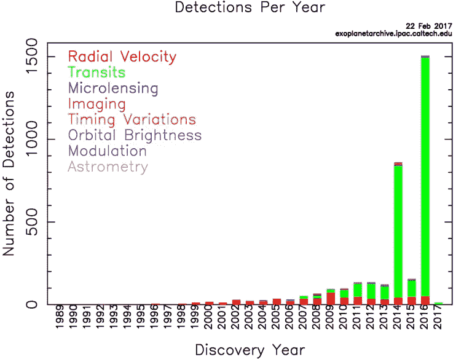

Source: NASA

从图中我们可以清楚地看到，公交检测(图中的绿色部分)是一种比任何其他方法贡献都大得多的方法。这也是我们今天用来寻找行星的方法。

现在让我们了解什么是凌日探测方法&然后人工智能如何通过使用凌日方法来帮助寻找新的行星。

***凌日探测法****——我们都知道在我们银河系或者银河系以外有数十亿、数万亿颗恒星，大部分行星都围绕这些恒星运行。行星的轨道取决于许多因素，如恒星的大小，行星的大小，恒星和行星形成的方式，以及许多其他因素等等。但共同的是，行星在其轨道上围绕恒星运行，恒星总是有自己的光，一直发光，直到它们死去。点击下面的链接可以看到哈佛大学的一篇文章，文章中他们很好地解释了交通问题。*

 [## 过境光曲线教程

### 我们很幸运生活在这样一个时代，不仅系外行星科学领域有重大发现和进步…

www.cfa.harvard.edu](https://www.cfa.harvard.edu/~avanderb/tutorial/tutorial.html) 

现在发生的事情是，如果有可能在任何恒星的轨道上发现任何行星，那么我们就开始通过注意从该恒星获得的光的亮度或强度值来监控该恒星。因此，如果有一颗行星在轨道上运行，那么在某个时间点，当这颗行星从这颗恒星前面经过时，我们获得的亮度将会下降。随着时间的推移&行星到达恒星后面，亮度会再次上升。这里有一个由美国宇航局制作的动画小视频，直观地解释了整个过程。

Credit: Nasa

在上面的动画中，我们可以清楚地看到，当行星来到恒星前面时，光线的亮度下降&当行星到达恒星后面时，亮度再次上升。因为一颗行星一直围绕着恒星旋转，所以这种亮度的起伏过程会反复发生。&如果没有任何行星在那颗恒星的轨道上，那么我们得到的亮度值将几乎总是保持不变，或者上下波动不大。

因此，这里有一个模式，如果光的亮度或强度值保持上下波动，那么可能有一颗行星在该恒星的轨道上。如果亮度值上下波动不大，那么就没有行星。这里，人工智能出现了。因为我们都知道，如果数据中有一个模式(*这里的数据是指亮度值*)，那么在人工智能(机器学习、深度学习、数据科学)的帮助下..)技术我们可以迫使程序从数据中学习这些模式，并可以创建这样的算法，这些算法将能够自动预测结果(在给出亮度值后，该恒星的轨道上是否有行星)。

现在我们知道人工智能如何帮助解决寻找系外行星的问题。但人工智能需要数据，程序将通过这些数据学习模式。所以我们进入下一部分，谈谈我们掌握的数据。

> ***3。我们有哪些数据以及这些数据的来源。***

以约翰尼斯·开普勒(*一位伟大的德国天文学家、数学家和占星家*)的名义，2009 年美国国家航空航天局发射了一架名为开普勒望远镜的望远镜，以发现银河系或银河系以外围绕其他恒星运行的新行星。它还使用了我们之前讨论过的“凌日探测法”来探测行星。它为他服务了 9 年，并于 2018 年退休。开普勒在其任期内发现了 2682 颗系外行星，还有 2900 多颗候选行星等待确认。这是一个非常非常大的成就。因为开普勒是这种类型的第一个任务，在开普勒之前，我们没有太多关于系外行星的信息。但是开普勒改变了一切。它给出了非常丰富的关于系外行星的数据。开普勒也很重要，因为它能够发现那些和地球一样大甚至比地球更小的系外行星。开普勒的巨大成功可以通过以下事实来理解:在他令人难以置信的服务之后，它获得了“系外行星猎人”的名字。由于时间限制，开普勒望远镜本身不会讨论太多。但是让我给你一些文章链接，给你看一个 Nasa 的视频，在视频中他们解释了开普勒的遗产。

 [## 开普勒太空望远镜:最初的系外行星猎人

### 美国国家航空航天局的开普勒太空望远镜是一个太空天文台，致力于寻找太阳系以外的行星

www.space.com](https://www.space.com/24903-kepler-space-telescope.html)  [## 任务概述

### NASA.gov 为您带来来自美国航天局的最新图像、视频和新闻。获取 NASA 的最新动态…

www.nasa.gov](https://www.nasa.gov/mission_pages/kepler/overview/index.html) 

Source: Nasa

所以开普勒一直在监测恒星，注意来自任何恒星的光的亮度或强度值。这些数据进入地球上的机构，他们做出决定，是否有行星在那颗恒星的轨道上。幸运的是，拥有这些数据的组织出于学习和研究的目的发布了其中的一部分。它完全免费，任何人都可以下载和使用。我在 Kaggle 上找到了这个数据集。以下是该页面的链接-

 [## 深空中的系外行星搜寻

### 开普勒标记的时间序列数据

www.kaggle.com](https://www.kaggle.com/keplersmachines/kepler-labelled-time-series-data) 

***数据集简介—***

这些数据描述了几千颗恒星的光通量(光强)变化。每颗恒星都有一个二进制标签`2`或`1`。2 表示确认该恒星至少有一颗系外行星在轨道上；一些观测事实上是多行星系统。

你可以想象，行星本身不发光，但它们所围绕的恒星发光。如果连续几个月或几年观察这颗恒星，光通量(光强度)可能会有规律的“变暗”。这是恒星周围可能存在轨道天体的证据；这样的恒星可以被认为是一个“候选”系统。对我们候选系统的进一步研究，例如通过一颗捕捉不同波长光的卫星，可以巩固候选事实上可以被“证实”的信念。

***描述—***

车列:

*   5087 行或观察值。
*   3198 列或特征。
*   列 1 是标签向量。列 2–3198 是一段时间内的通量值。
*   37 颗确认的系外行星恒星和 5050 颗非系外行星恒星。

测试集:

*   570 行或观察值。
*   3198 列或特征。
*   列 1 是标签向量。列 2–3198 是一段时间内的通量值。
*   5 颗确认的系外行星恒星和 565 颗非系外行星恒星。

既然现在我们已经了解了这个问题，以及人工智能将如何帮助解决一个特定的问题，以及一点点的数据意识。所以让我们更进一步，开始整个 Ml，DS 生命周期。

> 4.**绩效指标的选择，我们将尽量最大化或最小化。**

为任何 Ml、Dl、Ds 问题选择正确的性能指标是首要任务。这非常重要，如果我们不仔细选择我们的主要性能指标，那么解决问题的整个业务目标可能会受到影响。因为我们知道我们的问题是 2 类分类，所以有很多指标可以用来判断模型，我们稍后训练。选择正确的性能指标主要取决于您希望从模型中获得什么类型的结果。毫无疑问，我们希望我们的模型正确地预测每一个类，但是我们需要从所有类中选择哪个类需要比其他类更有效地预测。此外，我们不总是需要选择一个类而不是另一个类。这完全是问题对问题的依赖。例如，如果我们正在构建一个人脸识别系统，那么每个类都需要正确预测。不存在一个人的阶级需要比另一个人更有效地预测的事情。但是我们有一个不同的问题。构建人工智能模型的商业目标是不同的。这就是为什么我们在这里给一个类比另一个类更多的优先权。

我们在这里的目标是预测“在那颗恒星的轨道上有没有系外行星。?"因此，如果我们创造一个模型，可以告诉“是”..！！有一颗系外行星围绕恒星运行。”尽可能正确，那么我们的模型是好的。当然，那也需要告诉“不..没有任何系外行星围绕这颗恒星旋转。”尽可能正确。但是即使有一些数据点预测为“是”..！！有一颗系外行星绕着恒星运行,“而事实上，没有任何行星，那就好吧，好吧。稍后，我们可以手动丢弃该观察。但是如果有任何一点被我们的模型预测为“不”..没有任何系外行星围绕这颗恒星旋转。”事实上，有一颗系外行星。那么建立人工智能模型的整个目的就被扔进垃圾箱了。因为如果在任何恒星的轨道上有一颗系外行星，而模型的答案是否定的，那么就不存在任何行星。那这样的模式有什么用。我们为什么要用它？

所以现在如果我们用简单的建模术语来说，那么我们需要这样一个模型，能够尽可能正确地预测最大正点数。如果只有很少的消极点被预测为积极点，那也没关系。因为我们知道没有任何一种技术能百分之百保证你每次都能做出正确的预测。像宇宙中的其他事物一样，人工智能也有一些缺点。)但是不应该有任何点或者应该有最少这样的点实际上属于正类并且被预测为负类。

其中一个符合我们目标的指标是“回忆分数”。贝娄是计算回忆的公式——

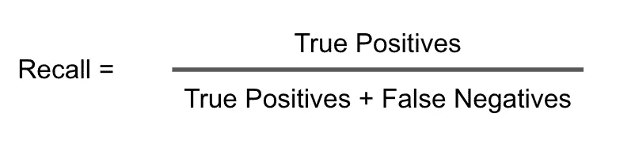

我假设你知道真阳性和假阴性。如果没有请点击 [*此处*](https://www.dataschool.io/simple-guide-to-confusion-matrix-terminology/) *了解这些术语。)*

因此，召回率是介于 0 和 1 之间的指标。并且如果存在属于正类并且也被预测为正点的所有点，则这将是最大值(1)。&如果所有点都属于正类，但被预测为负类，则最小值为(0)。因此，回忆是一个分数，随着正点数预测为正点数而相应增加。&如果预测为负点数的正点数相应减少。简而言之，回忆是关于“在所有那些实际上属于积极类的点中，有多少是你的模型预测的积极点”的分数

***混淆矩阵*** :混淆矩阵是我真的好喜欢的度量。这是我们将用来查看我们的模型表现如何的另一个指标。如果我们仔细观察，那么混淆矩阵不是任何度量。因为它只是简单地计算每个类正确和错误分类的点数，并打印出来。它不像(准确性、F1 分数、Auc 等..)这是一个数字指标，如果我们忘记了该指标如何计算的内部细节，或者如果我们没有给予适当的关注，或者构建模型的人经验不足，有时可能会产生误导。但是混淆矩阵只是简单地非常清楚地告诉实际的地面事实，因此理解模型性能变得容易。这就是我如此喜欢它的原因。贝娄是以这种方式创建一个混淆矩阵的:

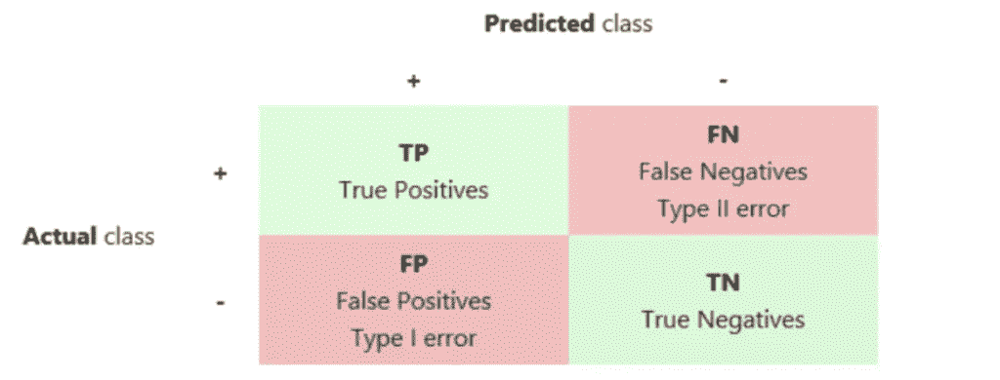

这就是关于选择性能指标的全部内容。我们将广泛使用回忆和混淆矩阵来查看我们训练过的模型的表现。但我们也将继续打印 F1_score、Auc & Accuracy，只是出于一般目的。但是我们不会太依赖这些指标。因为我们的数据非常不平衡。而这一数字指标会误导我们。为什么会这样，等我们看到真正的模特表演后再谈？既然我们已经选择了性能指标，那么现在让我们进入下一步，开始对原始数据进行 EDA。

> **5。原始数据的探索性数据分析。**

我不会讨论什么是 EDA，因为我们都知道 Eda 在构建良好模型中的重要性。所以让我们开始吧—

*   **让我们首先导入一些重要的必需库:**

*   **现在让我们加载训练数据:**

输出:

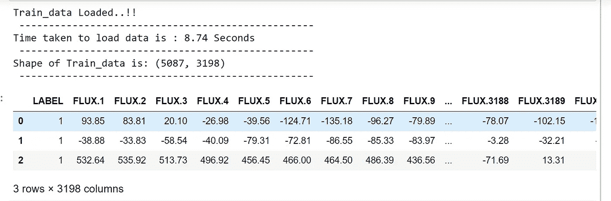

*   **加载测试数据:**

输出:

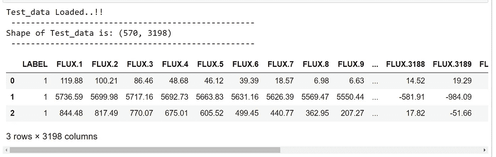

*外卖:*

*   在两个数据集的形状中，我们可以看到我们在训练数据集中只有 5087 个数据点。和 570 个数据点。通过在训练数据中只有 5k 个数据点，我们可以说我们实际上有非常少量的数据要处理，并且建立一个好的模型可能是具有挑战性的。此外，数据几乎是 3.2k 维，可以说是非常高维的数据集。所以我们有一个高维的小数据集。最后，我要说的是，在这个数据集的基础上建立一个好的模型可能很有挑战性，但从另一方面来说，这当然是一次很好的学习。
*   **让我们来了解一下我们所拥有的训练数据集的一些基本信息:**

输出:

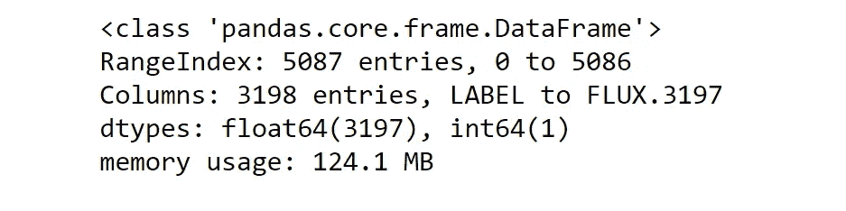

*外卖:*

*   我们在数据中有 5087 个条目(数据点的行)。这些数据点的索引从 0 到 5086。
*   我们有 3198 列，其中一列是整型，其余的都是浮点型。我们知道该标签是我们将用于教授和训练模型的类标签。因此，我们的数据集中实际上只有数字类型 3097 列。
*   当前训练数据变量在 ram 中。因此，使用定型数据集的内存(ram)为 124MB。
*   **在训练和测试数据集中查看类别标签的分布非常非常重要。如果我们想让我们的模型在未知的未来数据上工作，两者应该几乎相同。所以我们来看看:**

输出:

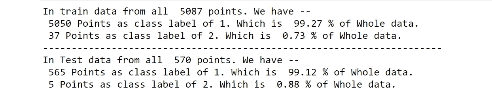

*   **绘制两个数据集中标签的分布:**

输出:

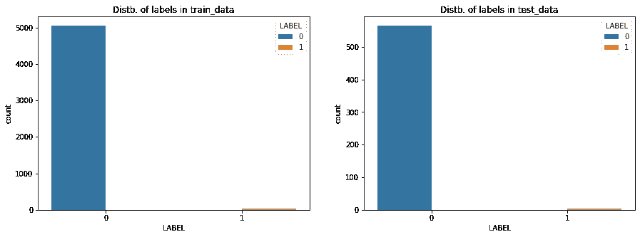

外卖:

*   在训练和测试数据集中，我们可以看到超过 99%的数据点属于负类(class_1)。并且少于 1%的数据点属于正类(class_2)。
*   这仅仅意味着我们拥有超过 99%的数据点。最终没有被宣布为系外行星。因此，只有不到 1%的观测是真正的系外行星。
*   如我们所见，我们的数据非常不平衡。这将是我们必须处理的另一个问题。
*   **现在，让我们绘制正类和负类的实际数据点。来理解这两个类的点的一点点行为。**

***从负类标绘点:***

输出:

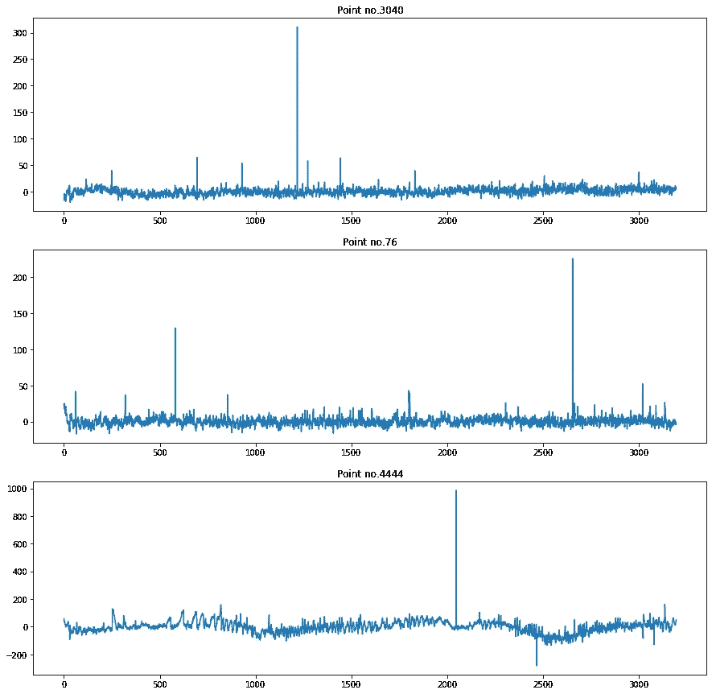

外卖:

*   正如我们在三个数据点的三张图中所看到的。通量值的范围并不大。这意味着我们从任何恒星获得的光的强度相差不大。因此不应该有任何系外行星。因为这些图是负数据点(那些不包含系外行星的点)。那就说得通了。

***从正类标绘点:***

输出:

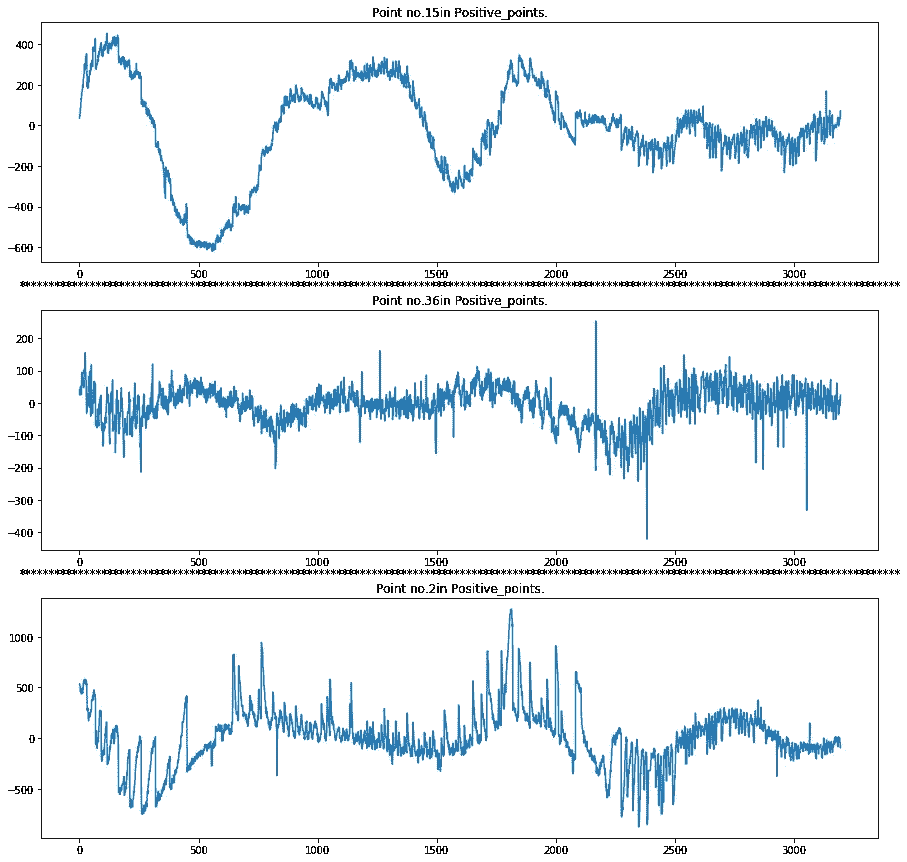

外卖:

*   在所有上述 3 个图中，与负点正相反的是，通量值的范围很大，具有一定的模式。这意味着来自恒星的光强度值变化很大。它们只是下降，然后再上升。因此，应该有一颗系外行星围绕这颗恒星运行。当外行星在恒星前面运行时，光的强度值就会下降。一段时间后，当那颗恒星到达恒星后面时，光的强度值再次上升。
*   现在，让我们绘制两个类的数据点的 PDF。

***绘制负类点的 PDF:***

输出:

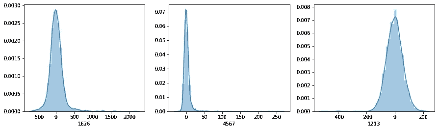

外卖:

*   这里我们还可以看到，与正类相比，负类点的通量值来自一个小范围。这意味着来自任何恒星的光的强度值几乎是相同的。因此不应该有任何系外行星。

***绘制正类点的 PDF:***

输出:

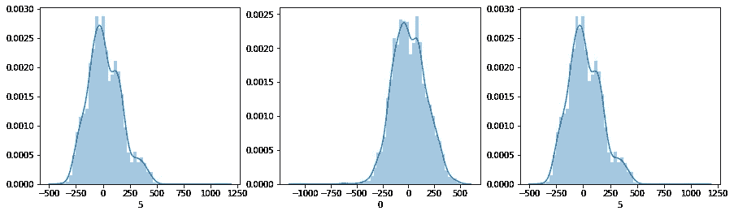

外卖:

*   这里，在正数据点，我们可以看到与负数据点相比，通量值来自一个较宽的范围。这意味着来自任何一颗恒星的光强度值都是明帝，并再次上升。因此有一颗系外行星围绕这颗恒星运行。这就是为什么由于系外行星的存在，光线强度又会时强时弱。

> **6。剔除异常值。**

***我是如何发现离群值的:***

我只是通过随机选择的列来了解数据及其行为。我在大多数特性中注意到的一件事是，有些值相对于其他值来说太大或太小。所以我得出结论，这些值一定是错误的，所以我应该删除它们。首先，让我向您展示其中一个特性，以便更好地理解。

***标图特征(" Flux.2876"):***

输出:

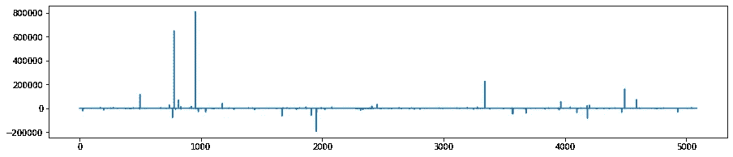

要点:正如我们在剧情中可以清楚看到的，高潮线很少。这意味着只有几个值不与其余的值一致，它们要么非常高，要么非常低。但在做出任何最终决定之前，我想非常非常确定，所以我打印了百分位值。

***打印百分位特征:***

输出:

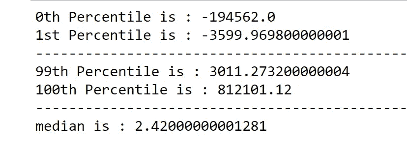

外卖:

*   我们可以清楚地看到，特征“Flux.2876”的第 99 百分位值是 3011，第 100 百分位值是 812101。这意味着 99 %的值小于或等于 3011，只有 1%的值介于 3011 和 812101 之间。因此，声明这些 1%的值是异常值是有意义的，因为它们非常高，不在其余 99%值的范围内。
*   第 0 和第 1 百分位值也是如此。这里，第 0 个百分位值是-194562，第 1 个百分位值是-3599。因此，声明这些 1%的值是异常值是有意义的，因为它们非常低，不在其余 99%值的范围内。
*   因此，我将检查每个特性的值，如果该特性的任何值低于第 1 百分位值或大于第 99 百分位值，那么我将用该特性的中值替换该值。

***去除列车数据的异常值，创建新的数据帧:***

输出:

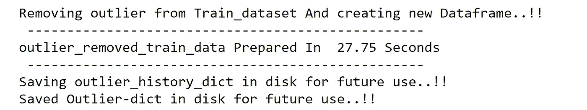

输出:

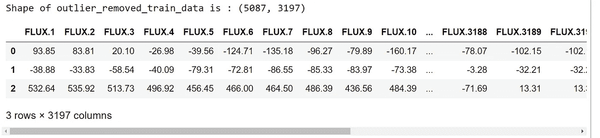

如果你注意到了，我在这里做了一个字典“outlier_history_dict ”,它包含了关于该特征的第 1 和第 99 个百分位数和中位数的信息。这是因为我们还需要从测试数据中剔除异常值。如果我们没有保存关于值何时需要声明异常值的信息，那么在从测试数据中删除异常值时，我们如何声明哪个值是异常值，哪个不是。当我们部署任何模型时，除了测试数据之外，我们还需要在单个函数中执行所有预处理步骤。那时，我们将需要关于我们在建模之前对数据所做的每个预处理步骤的信息。这就是为什么保存所有这些信息并在需要时重用非常非常重要。

***检查异常值是否真的从训练数据中去除:***

为了检查，让我们再次绘制并打印我们将在前面使用的该特性的百分位数，并与前面的结果进行比较。如果之前的第 0 和第 100 个百分点值被删除，那么我们的代码是正确的，我们成功地删除了异常值。

***标绘特征(" Flux.2876 ")来自离群点剔除后的列车数据:***

输出:

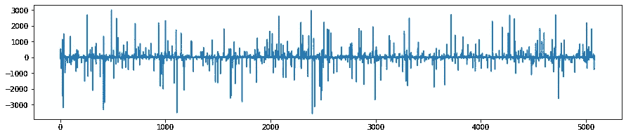

外卖:正如我们可以清楚地看到，没有任何非常高的孤独线。这意味着没有任何点不在其余所有值的范围内。为了更加确定，让我们再次打印百分位数。

***打印特征的百分位数:***

输出:

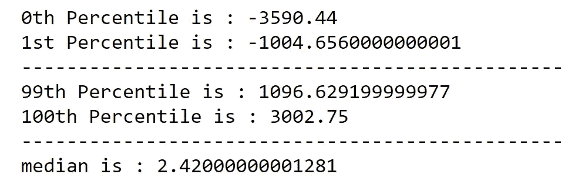

要点:我们可以清楚地看到，由于我们移除了极低和极高的值，因此特性的第 0 和第 100 百分位值发生了变化。第 0 和第 1 百分位值也有一些不同&第 99 和第 100 百分位值。但它会一直存在。它没有以前那么大，第 99 个百分位值是 3k，第 100 个百分位值是 81k。

***使用我们在从训练数据中移除异常值时创建的 Outlier_history_dict 移除测试数据的异常值，并创建新的测试数据帧:***

输出:

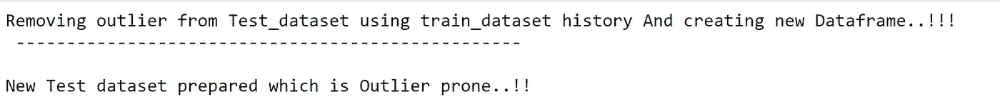

输出:

> 7。数据的最小-最大缩放比例

众所周知，在原始数值型数据中，特征值可能存在于很大的范围内，也可能存在于任何分布中。但是为了建立一个好的模型，总是建议特征值应该在一个特定的范围内或者来自一个正态分布。有很多方法可以做到这一点&最小-最大缩放只是我们可以对数字数据进行的一种转换。最小-最大缩放以这样一种方式转换要素，即要素的每个值都位于 0-1 范围内。如果您想了解更多关于最小-最大缩放的信息，请点击[此处](https://towardsdatascience.com/everything-you-need-to-know-about-min-max-normalization-in-python-b79592732b79)。最小-最大缩放的公式如下

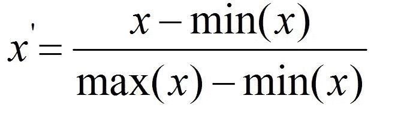

***缩放列车数据，创建新的列车数据帧“scalled _ Train _ Data”:***

输出:

如果你注意到这里，我还创建了一本名为“scalling_history_dict”的字典。其中包含关于每个要素的最小值和最大值的信息。原因和我们保存 outlier_history_dict 一样。因为我们还需要缩放测试数据，其中我们将需要来自训练数据的每个特征的最小值和最大值。除了部署模型后的测试数据，当我们预测给定的原始数据点时，我们将需要从训练数据中获得的信息。所以我们把它存到了磁盘上。

输出:

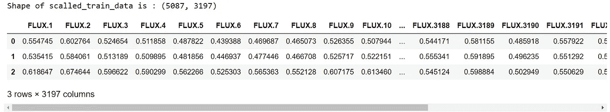

***用从列车数据中得到的“scalling _ history _ dict”we******缩放测试数据，并创建新的测试数据帧“scalled _ Test _ Data”::***

输出:

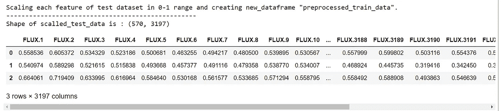

***将 train _labels 与 Scalled _ Train _ data 和 test_labels 与 Scalled _ Test _ data 连接起来，然后将两个数据集保存在磁盘中:***

输出:

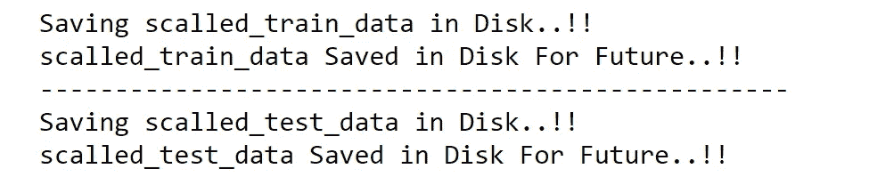

> **8。使用 T-sne 进行降维，一次可视化全部数据。**

在进行下一步之前，如果我们在一个单独的图中可视化所有的训练数据将会很好。那我们就能更好地理解这一点。但问题是我们有超过 3k 维的数据。而我们人类只能看到三维图。因此，我们需要将数据集的维度降低到 3 维或 2 维。所以我们可以画出来。

有许多方法可以降低数据集的维数。但是其中有 2 款推荐比较多。

*   主成分分析
*   分布式随机邻域嵌入

如果我们的目标是减少建模或任何其他任务的数据维数，PCA 是很好的。如果我们的任务是降低可视化数据的维度，那么 T-sne 是很好的选择。因为我们想降低数据集的维度，只是为了可视化，所以我们将使用 T-sne。如果你想了解更多关于 T-sne 的信息，请点击下面的链接，阅读目前在谷歌大脑和谷歌云工作的工程师写的文章。

 [## 如何有效地使用 t-SNE

### 一种流行的探索高维数据的方法叫做 t-SNE，是由范德马滕和辛顿提出的…

蒸馏. pub](https://distill.pub/2016/misread-tsne/) 

现在，让我们通过 T-sne 将降维后的数据可视化:

输出:

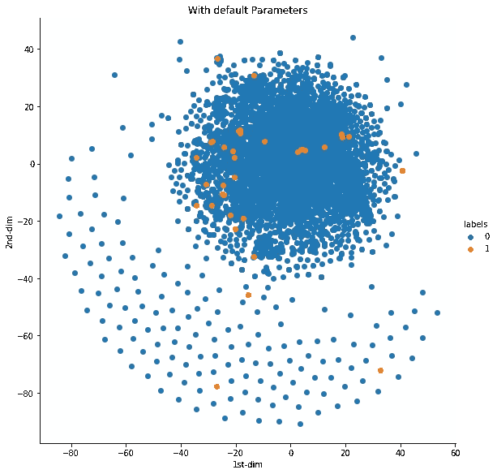

众所周知，最好不要只运行一次 T-sne 就下结论。我们应该总是带着不同的困惑值和不同的学习速度重新运行 T-sne。所以我用不同的参数一次又一次地应用 T-sne，下面是我得到的图。

***带困惑= 50 :***

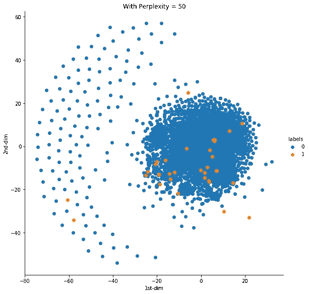

***带困惑= 100***

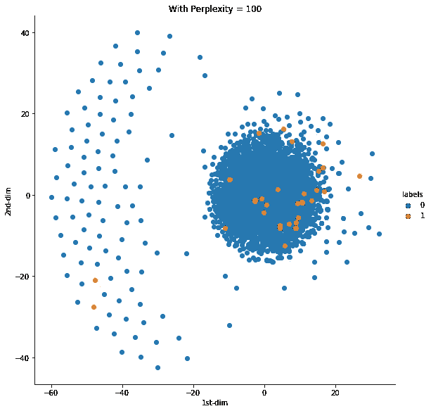

***带着困惑= 100 &小水。_of iterations = 3000***

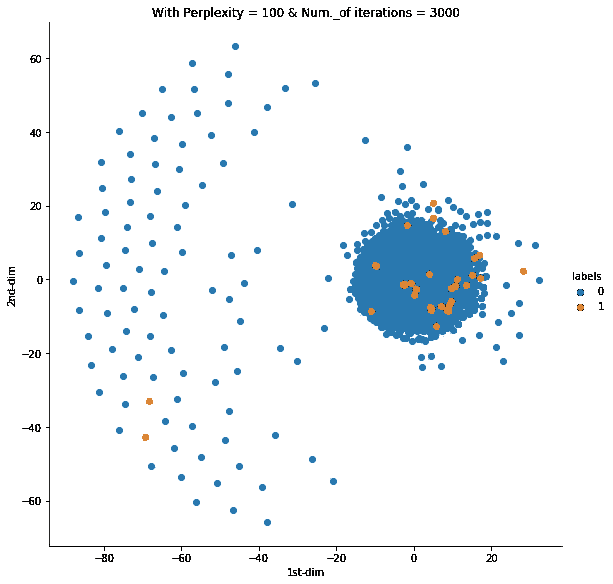

*要点:在上述所有图中，积极点与消极点明显重叠。这意味着很难建立一个模型来区分这两个类别。再说一次，这是可能的，因为我们正从 3k 维走向 2 维。但是，让我们不要太担心，去建模，因为模型是最后的真理。我们不能光看图表就做出草率的结论。*

> ***9。不平衡数据建模。***

我们已经完成了预处理部分，现在让我们进入下一部分，开始实验建模。我们的训练数据是不平衡的，这就是为什么我称之为不平衡数据建模。我广泛使用网格搜索 cv，而不是手动执行超参数调整。因为网格搜索使调优变得非常容易，也因为我们只有 5000 个数据点，这意味着要处理的数据太少。因此，我们不能分割外部 cv 数据进行交叉验证。而网格搜索内部用的是 k 倍 cv。这样就不用额外做简历数据了。它会在内部为我们处理好一切。

***造型与 KNN :***

输出:

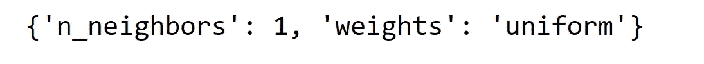

*现在让我们用网格搜索得到的最佳参数来训练模型:*

输出:

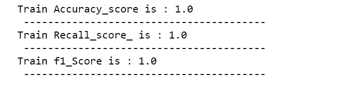

*用测试数据评估:*

输出:

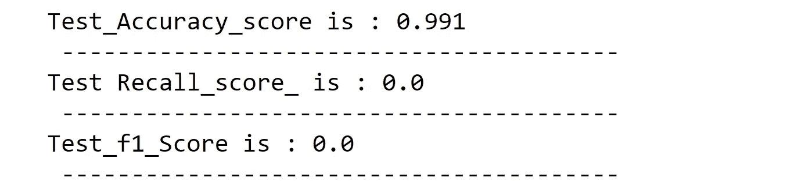

***用逻辑回归建模:***

输出:

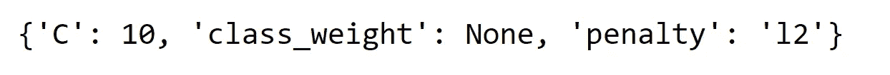

*现在让我们用网格搜索得到的最佳参数来训练模型:*

输出:

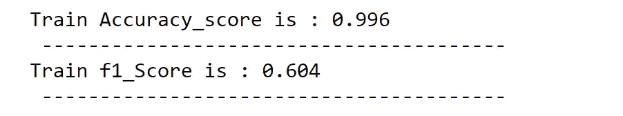

*用测试数据评估:*

输出:

***用决策树建模:***

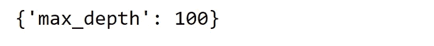

*现在让我们用网格搜索得到的最佳参数来训练模型:*

输出:

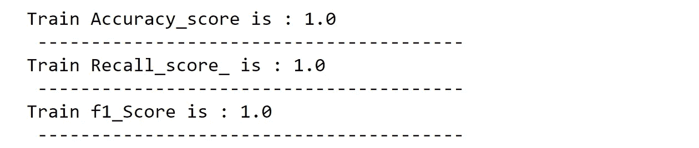

*用测试数据评估:*

输出:

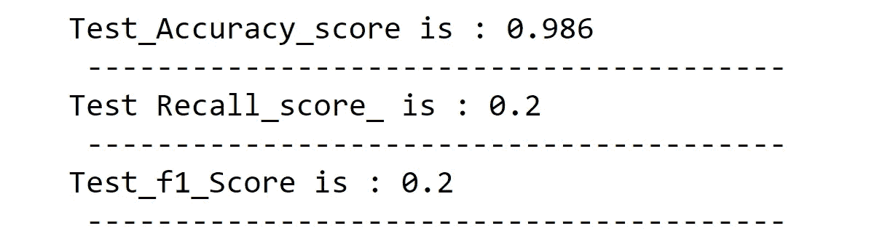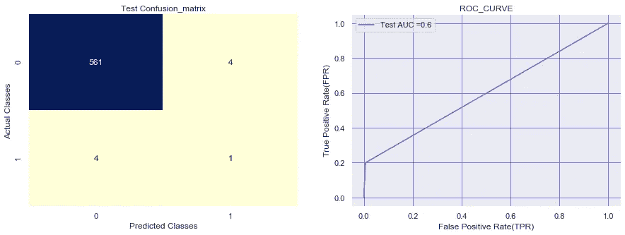

所有型号的要点:

*   所有模型在训练数据上都表现得非常好。但是在测试数据上很糟糕。准确度分数在测试数据中也很好，但忘记这一点，因为准确度内部计算的方式可能会误导我们，如果我们的数据是不平衡的。
*   同样在测试中，数据模型在负类点上表现良好。但在积极的阶级分上表现不佳。这可能有几个原因，但我在这里观察到的主要原因是“数据集的不平衡性质”，或者换句话说“缺少正的类点”。
*   在 5050 个负点模型前只有 37 个正点来了解正点。这就是为什么模型学习得足够好，可以在任何训练或测试数据集的负面点上表现良好。但另一方面，因为我们只有 37 个正点，模型学习得不够好，所以它们也可以在测试数据正点上表现良好。
*   众所周知，如果训练分数很高，而测试分数很低，那么我们就会导致过度适应。我们是不是也在这里过度适应了。？
*   是...我们这里太多了。基本上，过度适应意味着过度学习。这是正确的，因为上面我们看到模型过度学习消极点，而没有学习太多积极点。
*   纪念...当我为这个问题选择主要的性能指标时。在那里，我说我们需要善于预测积极的类点。但是上面我们看到了模型在预测消极点方面很好，而在预测积极点方面很差。这意味着事情正在相反的方向发生。我们得到了与目标相反的结果。
*   这是机器学习或人工智能的挑战，换句话说也是乐趣。我们可能不会每次都得到想要的结果。事情可能会出乎意料地朝着错误的方向发展。我们会得到完全不同的结果。
*   让我们不要在这里失去希望。我们应该总是努力找到解决问题的方法。因为我们了解我们的问题，那就是“数据集的不平衡性质”或“缺乏积极的学习点”。那么这个问题有没有解决的办法。？
*   当然有解决的办法。有几种方法可以解决不平衡的问题。广泛使用的方法有…
*   1-欠采样，2-过采样
*   我们的数据已经太少了(只有 5087 分)。因此，我们不能承受欠采样。所以让我们来过采样。我们将在下一部分看到。

> ***10。过采样和数据均衡:***

正如我们前面看到的，过采样是一种可以解决不平衡数据集问题的方法。在过采样中，我们在数据集中创建或添加一些少数类的额外合成点。所以少数民族的分数可能会增加。因此，我们可以解决不平衡的数据问题。因此，这里我将使用一种称为“合成少数过采样技术”或简称“SMOTE”的过采样技术。我不会在这里讨论太多 Smote，如果你想了解 SMOTE，那就去看看下面关于分析 Vidya 的文章。他们很好地解释了 Smote 及其许多变体。

 [## 使用 SMOTE 技术克服班级失衡

### 这篇文章作为数据科学博客的一部分发表。免责声明:在这篇文章中，我将涵盖一些…

www.analyticsvidhya.com](https://www.analyticsvidhya.com/blog/2020/10/overcoming-class-imbalance-using-smote-techniques/) 

在这里，我将使用简单的 smote，而不是它的任何变体。为此，需要借助一个名为“Imblearn”的库。所以让我们开始吧:

***加载最小-最大缩放后我们之前创建并保存的缩放后的训练数据，并打印过采样前我们每类的点数:***

输出:

***执行过采样并创建新的数据帧“train _ data _ over sampled”:***

输出:

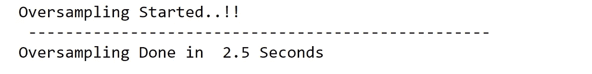

输出:

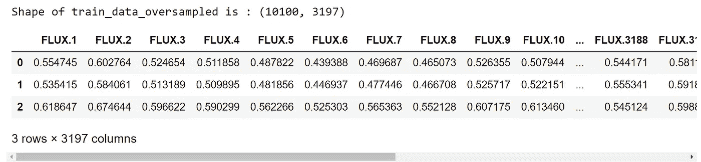

***检查过采样后两个类中的点数:***

输出:

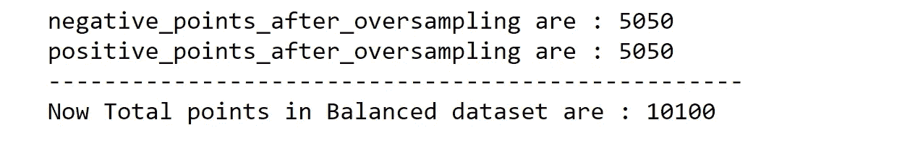

***绘制过采样后两个分类标签的计数图:***

输出:

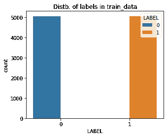

***现在我们的数据已经平衡，因此让我们将它保存在磁盘上，以备将来需要时使用。因此，当我们需要平衡数据时，我们不必一次又一次地执行过采样:***

输出:

*   既然现在我们的数据是平衡的，我们已经准备好进行建模，但首先，我们为什么不只是可视化数据，看看我们的数据看起来怎么样。因此，我再次使用不同参数的 T-sne，将数据的维度减少到 2 维，只是为了绘图和可视化。
*   下面是我在应用 T-sne 和绘图后得到的图。

***带着困惑= 50 :***

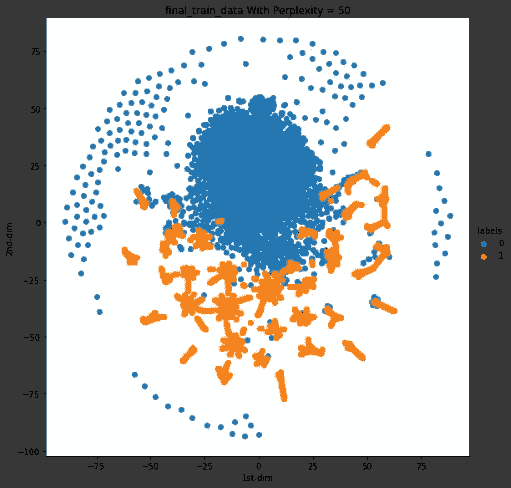

***带困惑= 100 :***

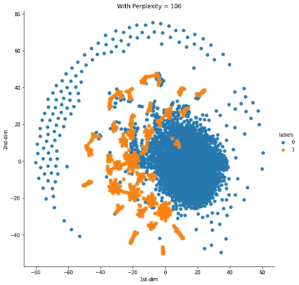

***带困惑= 100 & Num。_ 迭代次数= 3000 :***

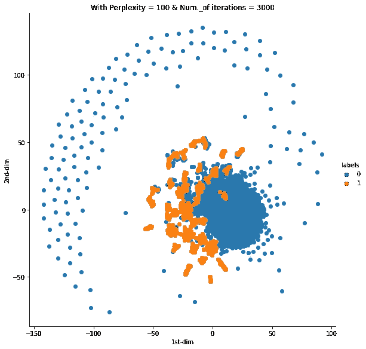

外卖:此后过采样我们也可以清楚地看到，积极点在图中的优势。现在我们已经从两个类中获得了大量的数据点。也许现在我们可以在建模上得到更好的结果。让我们进入下一部分，看看我们得到了什么。

> ***11。平衡数据建模:***

我再次使用网格搜索 cv 进行超参数调整等...一切都和我们之前做的一样，我们现在只有平衡的数据。所以让我们去直接看看不同训练模式的结果。

**KNN 建模结果:**

*关于列车数据:*

*关于测试数据:*

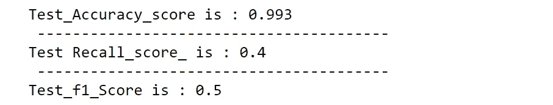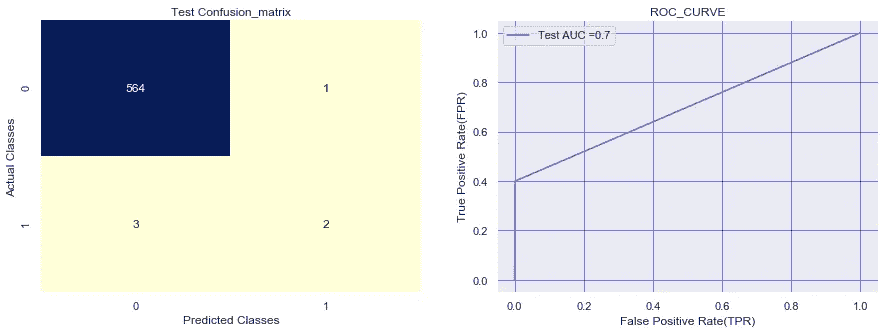

**线性 SVM 建模结果:**

*关于列车数据:*

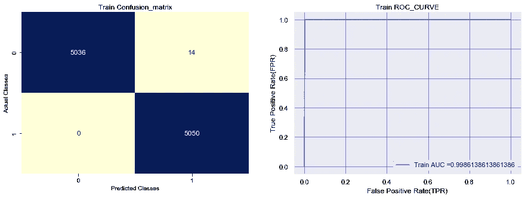

*关于测试数据:*

**逻辑回归建模结果:**

*关于列车数据:*

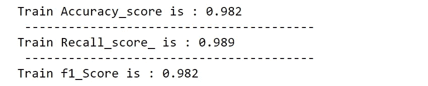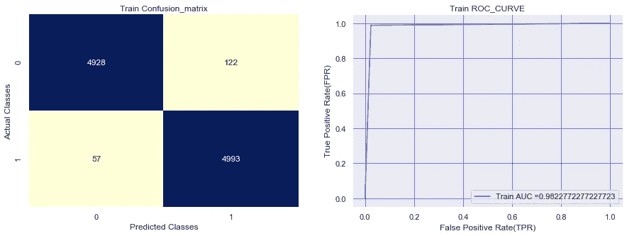

*关于测试数据:*

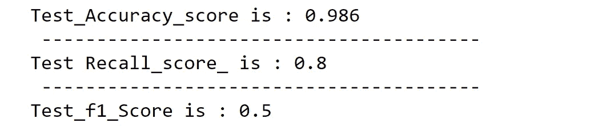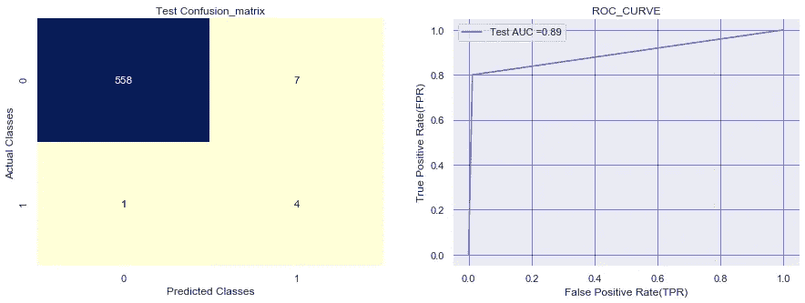

**决策树建模结果:**

*关于列车数据:*

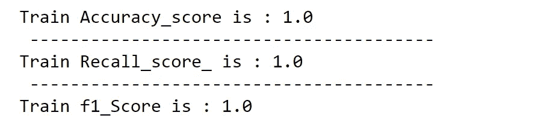

关于测试数据:

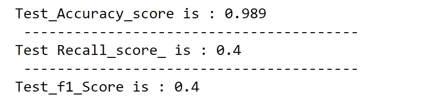

**随机森林建模结果:**

*关于列车数据:*

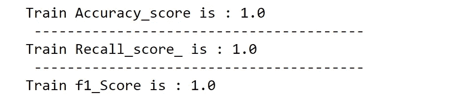

*关于测试数据:*

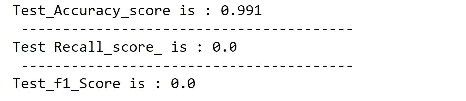

> **12。比较所有经过训练的模型，并为将来选择最佳模型。**

*   所有模型在训练数据上都表现得非常好。如果我们将在平衡数据上训练的新模式与我们之前在不平衡数据上训练的模型进行比较，它们在测试数据上的表现也更好。
*   正如我们在上面部分中可以清楚地看到的，除了随机森林不能正确地预测测试数据的任何正点之外，模型在测试数据的正点上的性能也略有提高。
*   以前，当我们在不平衡数据上训练 KNN 时，那是正确预测测试数据的 0 个正点。但是现在，如果我们看到，KNN 现在在测试数据的 5 个阳性点中，正确预测了 2 个阳性点。这就是为什么召回率是 40%。这比之前 0%的 KNN 召回要好。
*   以前，当我们训练决策树不平衡数据集时，召回率仅为 20%。但直到 40%才得到改善。
*   我们这里最好的模型是逻辑回归。当我们训练对数回归比它对测试数据的回忆更早的时候，实际上是 0%。这意味着没有正确预测测试数据的任何积极点。但是现在测试数据的召回率从 0%提高到 80%。超级好。现在对数回归正确地预测了测试数据的 5 个阳性点中的 4 个。除了 F1 分数(50%)之外，所有其他指标看起来都不错。测试数据的准确率为 98%，测试数据的 AUC 为 89%。我们的对数回归模型的唯一缺点是，可悲的是，它预测 7 个负点为正点。不过没关系。因为记住我们的目标是最大化正确分类的正点数。我们正在存档。
*   在真实世界的数据集中，如果我们没有得到完美的结果，就会发生这种情况。这完全没问题。特别是当我们有一个完全不同的空间数据集时，那么就变得非常非常难以存档最好的结果。永远记住在这个世界上没有什么是完美的。没有哪种技术能保证您总能获得 100%的预期结果。任何事物都有自己的缺点，所以机器学习也有。因此，机器学习或人工智能也有可能无法提供 100%稳健的结果。
*   我们的目标是，如果在恒星的轨道上存在系外行星，就能最大限度地正确预测系外行星的存在。换句话说，最大程度地正确预测正确的点。我们把它存档了。如果存在系外行星，我们的逻辑回归模型的预测是正确的。因此，让我们更进一步，看看对数回归训练的代码，以获得清晰的图像。

***用自己的最佳参数进行最佳逻辑回归训练的代码:***

*   我们之前讨论过的输出或结果。让我们转到另一部分，把这个最佳逻辑回归模型保存在磁盘上。

> ***13。如何将训练好的模型保存在磁盘中？***

在训练任何模型时，该模型保留在 Ram 存储器本身中。所以我们可以在那时做出任何数量的预测。但我想到的下一个问题是，一旦我们训练了一个模型，我们如何在以后使用它，也许是几天后，也许是几个月后，或者是未来的任何时候。？{作为人工智能的初学者，这个问题对我来说真的很难。；) }

显然，我们需要将模型保存在 Rom 存储器或其他地方，只要我们愿意，就可以保存。它就像写一行代码一样简单。在 python 的帮助下，我们只用一行代码就可以保存训练好的模型。并且当我们需要时，可以在一行代码中随时将模型加载到 ram 或任何变量中。就这么简单。

有上百种方法可以让你做到。我将向你展示其中一种方法。在 JOBLIB 的帮助下，我将把我们的模型保存为 pickle 文件。

输出:

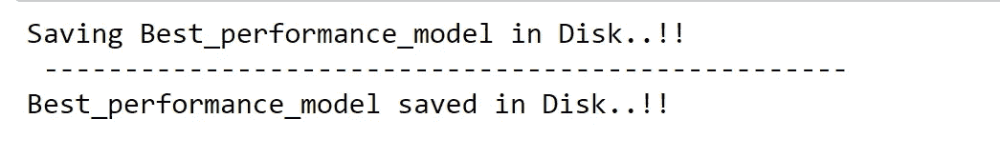

***现在让我们看看如何加载一个已保存的模型。***

> ***14。如何创建整个机器学习或数据科学管道，以便在一个“预测”函数中预测原始输入。***

在一个函数中创建一个完整的管道来预测原始输入是整个数据科学或机器学习生命周期的最后一个重要步骤。这最后一个预测函数是我们所做的所有事情的核心。因为在未来或在模型的生产中，我们将不会重复我们已经完成的每一个步骤。这个预测函数应该包含预测原始输入所需的一切。

在将数据交给模型之前，我们必须包含与我们对数据所做的完全相同的每一个预处理和转换。下面是为了预测原始点而在我的预测函数中执行的步骤。

*   最初，我们需要看看我们在预测函数中得到的输入是否正确。如果输入是正确的，那么我们将执行预测，否则不。
*   我之前对数据做的第一个更改是用该特征的中值替换异常值。因此，在我的预测函数中，首先会用该特征的平均值替换异常值。还记得我们之前从训练数据中移除离群值时，在磁盘中保存了离群值历史记录。在这里，那本词典派上了用场。现在想象一下，如果我们没有保存那本字典，什么都没有。那么现在我们如何决定哪个值是异常值，哪个不是呢？&我们如何知道要替换离群值的特征的中值是多少？
*   我对数据做的第二个改变是缩放。在那里，我把 scalling _ history _ dict 保存在磁盘上。所以我要借助那张磁盘。并将缩放每个特征或值。
*   这就是我在将数据提供给模型进行训练之前所做的所有关于数据转换和变化的工作。因此，在执行上述两个步骤后，我将加载我的最佳性能模型，并进行预测。
*   如果预测值为 0，那么将简单地返回“该恒星的轨道上没有系外行星。”，如果预测值为 1，那么将简单地返回“是的，至少有一颗系外行星在该恒星的轨道上。”
*   我把我的函数名从“预测”改为“那颗恒星的轨道上有没有系外行星”，只是为了把最终函数和问题陈述联系起来。

***那么我们来看看这里最后的函数代码:***

***让我们调用这个函数并进行预测:***

*输出:*

***现在让我们再次调用那个函数，这次是为了预测一个正的点:***

输出:

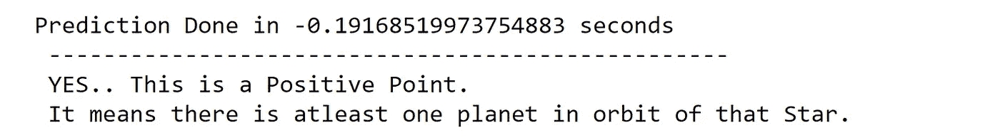

***不看输出截图，只播放下面给出的视频，观看 Ml 模型对原始输入进行实时预测的视频:***

> **15*。在生产中部署模型*** 。

我使用 StreamLit 围绕我的模型创建了一个 Web 应用程序。我在 Heroku 平台上部署了这个网络应用。请访问下面的链接查看我的 web 应用程序。

 [## 细流

### 编辑描述

exoplanet-finder.herokuapp.com](https://exoplanet-finder.herokuapp.com/) 

这是部署中的网络应用或模型的屏幕截图:

> 16 .未来工作:

当我最初研究这个问题时。然后我发现了一篇由“哈佛大学和史密森学会天体物理学中心”的天文学家发表的关于寻找系外行星的同样问题的非常好的研究论文。下面是那篇研究论文的链接。

[https://www.cfa.harvard.edu/~avanderb/kepler90i.pdf](https://www.cfa.harvard.edu/~avanderb/kepler90i.pdf)

他们在这个问题上使用了深度学习技术。这就是为什么我现在没有用这篇研究论文来建立一个好模型的原因。因为我想在这个项目中探索机器学习技术，以及它们如何解决这个问题。

但除此之外，这是一篇非常非常好的研究论文。他们通过使用神经网络取得了非常好的成绩。如果时间允许的话，我会采纳这篇研究论文的观点，并将它们应用到我们的特定问题中，以更好的性能结果来解决它。我不能实现整个研究论文本身，因为他们通过使用 15-16 层卷积神经网络实现了最高性能。但是我不能训练一个 15-16 层的卷积神经网络，因为我没有足够的数据来训练这个深度神经网络。我的训练数据里只有 5k 分。也许他们能够训练这样的深度神经网络，因为他们是世界上顶级的天文学家，并且在世界上最好的天文学实验室工作，所以他们可以访问更大的望远镜或空间天文台数据集。作为一名学生我没有。😀

因此，如果将来时间允许，我肯定会尝试使用他的想法，并尝试改进我的模型。目前，这就是所有的人...

> **如果你需要完整的代码，请点击下面的链接进入我的 GitHub 库:**

 [## uttu-para shar/用人工智能在深空中寻找系外行星

### 通过创建一个关于…的帐户，为 uttu-para shar/用人工智能在深空中搜索系外行星的开发做出贡献

github.com](https://github.com/uttu-parashar/Searching-For-Exoplanets-in-Deep-space-With-Ai) 

> **如果你也是人工智能爱好者，请点击下面的链接，在 LinkedIn 上与我联系。**

 [## 学生应用人工智能课程| LinkedIn

### 查看 Utkarsh Parashar 在世界最大的职业社区 LinkedIn 上的个人资料。Utkarsh 有一个工作列在…

www.linkedin.com](https://www.linkedin.com/in/utkarsh-parashar-8529641a0/) 

> * * * * * * * * * * * * * *感谢阅读。**************
> 
> ******再见了，伙计们..祝你未来好运。*****