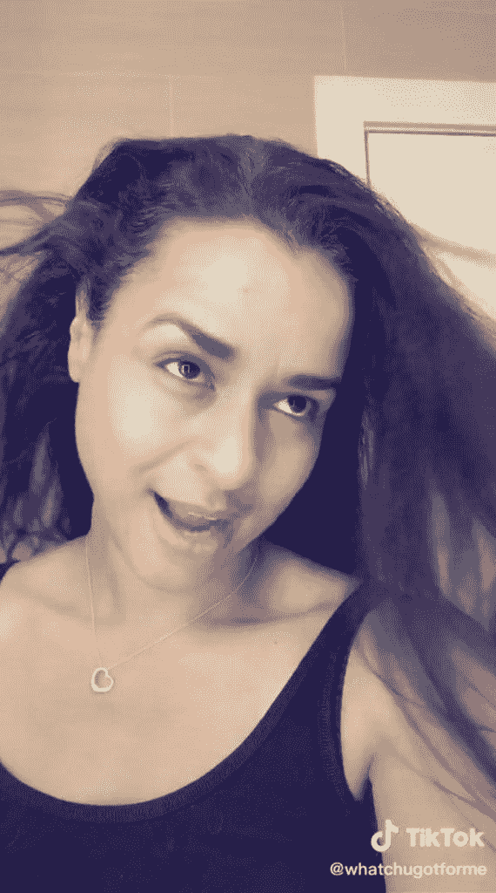
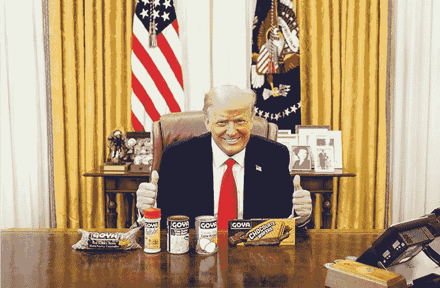

# 让我们把川普/微软/抖音的事情搞清楚

> 原文：<https://medium.datadriveninvestor.com/lets-get-the-trump-microsoft-tiktok-thing-straight-f96b9be366f4?source=collection_archive---------4----------------------->

Sarah Cooper on TikTok “How to”-ing Trump talking about banning TikTok (click photo to watch)

## 这和戈雅食品的关系比国家安全更密切。

以下是目前为止的进展情况:

1.  微软想收购抖音，该公司由一家中国公司所有。这两家公司已经密切合作了一段时间。例如，一月份，一名微软律师被任命为抖音的法律总顾问。
2.  但特朗普不想达成协议；他想在美国杀死抖音，因为这让那些在政治上伤害他的人有机可乘。
3.  微软对川普说(实际上):“如果你让我们收购抖音，我们会让你独享所有荣誉。这是一笔会让你看起来很好的交易，因为即使是左翼媒体也会写道，你试图限制中国政府对美国用户数据的潜在访问是正确的。”
4.  基于这个理由，特朗普开了绿灯。
5.  [微软发表了一份声明，基本上是说川普应该得到所有的荣誉](https://blogs.microsoft.com/blog/2020/08/02/microsoft-to-continue-discussions-on-potential-tiktok-purchase-in-the-united-states/),如果他们完成了购买。(他们只是想要这笔交易；他们为什么会在乎？)
6.  川普说他想要“[顶费](https://www.cnbc.com/amp/2020/08/03/president-trump-might-be-easier-if-microsoft-buys-all-of-tiktok.html)”，这是一种完全不正当的做法，在通常情况下，这种做法是贿赂房东以获得一套顶级公寓。因此，特朗普基本上是说，他希望贿赂继续阻止这笔交易的进行(正如我们已经说过的，微软也已经同意，特朗普将承担促成这笔交易的所有功劳)。
7.  川普声称这是公平的，因为他让抖音更加出名，因此通过威胁禁止它来增加它的价值。
8.  几乎所有关于潜在交易和特朗普参与的报道最终都聚焦于中国可能获得美国用户的所有数据，在这种情况下:“特朗普是对的。中国是真正的威胁。”

那没有错。

然而，这不是问题所在。这是关于特朗普压制他不喜欢的声音。不一定是中国的声音。使用特定平台的声音恰好与中国有关。那些讽刺他和让他难堪的声音是[搞砸了他不明智的疫情集会](https://medium.com/@ericjscholl/trump-works-some-new-material-but-mostly-old-out-of-town-in-front-of-small-crowd-ecd4bb1419f4)，让他的整个竞选团队看起来像傻瓜。

如果他认为这些声音不够灵活，无法转移到其他平台，并继续扰乱他的竞选，那他就太天真了。

此外，所有这些记者——包括一些[非常优秀的记者](https://www.nytimes.com/2020/08/02/opinion/02tik-tok-china-trump.html?)——如果他们认为川普正在追求这一点——完全是因为中国构成的广泛、持续的安全风险，那他们就太天真了。尽管这种威胁可能是真实的。

充其量，他是一箭双雕。然而，我们甚至不认为他值得这么多的信任。我们认为他只是想惩罚抖音，因为里面的内容已经深入他的内心。因此，出于愤怒和怨恨，他开始抨击这个应用程序。句号。因为他们很容易被欺负。因为现在没人喜欢中国。

中国对美国公民的潜在数据收集是一个合理的担忧(而且肯定正在发生，不仅仅是通过抖音)，这一事实赋予了川普不应有的深思熟虑和信誉。事实上，[微软希望这笔交易发生的主要原因之一](https://www.theverge.com/2020/8/3/21352309/microsoft-tiktok-acquisition-deal-why-us-countries-data)是他们想要访问这些完全相同的数据。然而，因为他们是美国人，这是可以接受的。

此外，微软已经为这种收购努力了多年。他们很早就进入了中国；当规则完全对他们不利的时候，他们还是遵守规则。他们试图从内部和外部改变事情。因此，微软在中国的表现远远好于其他许多美国科技公司。

虽然这个关于全球经济实力和安全的故事有一个巨大而令人担忧的覆盖层，但这不是今天这个故事的内容。总统特别选择的目标:抖音证明了这一点。这无疑对他的竞选和连任产生了重大影响。

实际上，偶尔会有特朗普值得称赞的事情，我们会毫不犹豫地指出来。例如，在冠状病毒疫苗上全速前进，到目前为止，他很少发出典型的混合信息(夹杂着阴谋论)。

但这笔交易不在其中。不要被迷惑，以为特朗普是在高尚的地方行事。

你知道，政府不应该在市场中挑选赢家和输家，这是保守派多年来的口头禅。然而，特朗普喜欢根据他们是否表达了对他的奉承(正如我们所说的，戈雅)，或取笑他(抖音的内容创作者)来挑选赢家和输家。忘掉自由市场吧。这一切都与对特朗普的忠诚有关。

Yes, this is *still* a real photo, after Goya’s Chief Executive said nice things

因为你可以打赌，如果抖音的孩子们一直在亲吻川普的屁股而不是踢它，他现在已经在白宫为他们举办了一个大型的快餐派对。