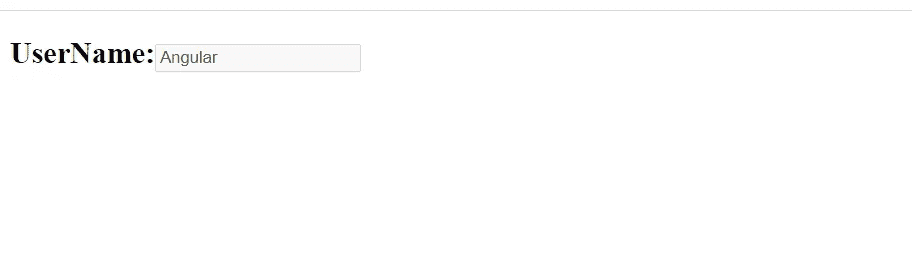

# 让我们从初级到高级学习角度

> 原文：<https://medium.datadriveninvestor.com/lets-learn-angular-beginner-level-to-advanced-level-part-02-9cf0a4723c2e?source=collection_archive---------19----------------------->

## 这里我将讨论定制组件、插值和属性绑定。


Photo by [Danial RiCaRoS](https://unsplash.com/@ricaros?utm_source=medium&utm_medium=referral) on [Unsplash](https://unsplash.com?utm_source=medium&utm_medium=referral)

**什么是数据绑定？**

数据绑定是一种技术，其中数据在组件和视图之间保持同步。每当用户更新视图中的数据时，Angular 都会更新组件。当组件获得新数据时，角度更新视图。

Angular 中的数据绑定可以大致分为两类。

*   单向数据绑定
*   双向数据绑定

**单向装订成角**

一方面，绑定数据从一个方向流动。从视图到组件或从组件到视图。

*   从组件到视图:为了将数据从组件绑定到视图，我们使用了插值和属性绑定。
*   从视图到组件:为了将数据从视图绑定到组件，我们使用了事件绑定

**插值(Sting 插值):**

插值允许我们将表达式作为任何字符串文字的一部分，我们在 HTML 中使用它。angular 将表达式计算为一个字符串，并将其替换为原始字符串，然后更新视图。只要在视图中使用字符串文字，就可以使用插值。

角度使用模板中的{{ }}(双花括号)来表示插值。语法如下所示

```
{{ templateExpression }}
```

大括号里面的内容叫做模板表达式。Angular 首先计算模板表达式，并将其转换为字符串。然后，它用 HTML 中原始字符串的结果替换模板表达式。每当模板表达式改变时，Angular 再次更新原始字符串。

实施例 01:


app.component.ts

这里，我在 app.component.ts 中创建了 title = "Welcome to angular"。我想向最终用户显示这个标题。


app.component.html


Web view

示例 02:显示当前日期


app.component.ts


app.component.html


Web View

> 重要提示:插值不适用于非字符串类型(例如:int、boolean)。插值中不能赋值，并且全局 java 对象在插值中不可见。

您可以使用插值来调用组件类上的任何方法或进行一些数学运算等


app.component.html


Web view

插值是将值从组件传递到模板的一种方式。当元件值改变时，角度会更新视图。但是如果视图组件中的值发生变化，则不会更新。

模板表达式不应该改变应用程序的状态。Angular 使用它从组件中读取值并填充视图。如果模板表达式更改了组件值，则渲染视图将与模型不一致。这意味着您不能使用以下内容

*   赋值(=，+=，-=，…)
*   关键字，如 new、typeof、instanceof 等
*   用链接表达式；或者，
*   递增和递减运算符++和—
*   按位运算符，如|和&

**语言中的属性绑定**

属性是由 DOM(文档对象模型)定义的。DOM 意味着每当我们的浏览器加载 HTML 页面时，它都会为加载的页面创建一个文档对象模型。每一个 HTML 元素都代表 DOM 的形式。

属性绑定允许我们将 HTML 元素属性绑定到组件中的一个属性。每当元件的值变更时，角度会更新视图中的元素性质。属性绑定是从组件到视图的一种方式

```
[binding-target]=”binding-source”
```

绑定目标(或目标属性)包含在方括号[]中。它应该与封闭元素的属性名称相匹配。Binding-source 用引号括起来，我们将它分配给 binding-target。绑定源必须是模板表达式。

在这个 input 元素中，我想使用一个名为 as disabled 的属性。由于属性被禁用，现在输入元素将被禁用。


app.component.html



Web View

如果我想重新启用，应该用方括号把 disabled 括起来，它应该等于 false。现在，在浏览器窗口中重新启用输入属性。


app.component.html


Web View

你可以使用 bind-"属性名"来代替方括号。


app.component.ts


app.component.html


Web view

在接下来的教程中，我希望谈论以下标准。

*   角度类绑定、样式绑定和事件绑定

请继续收听我的节目:-)

**进入专家视角—** [**订阅 DDI 英特尔**](https://datadriveninvestor.com/ddi-intel)