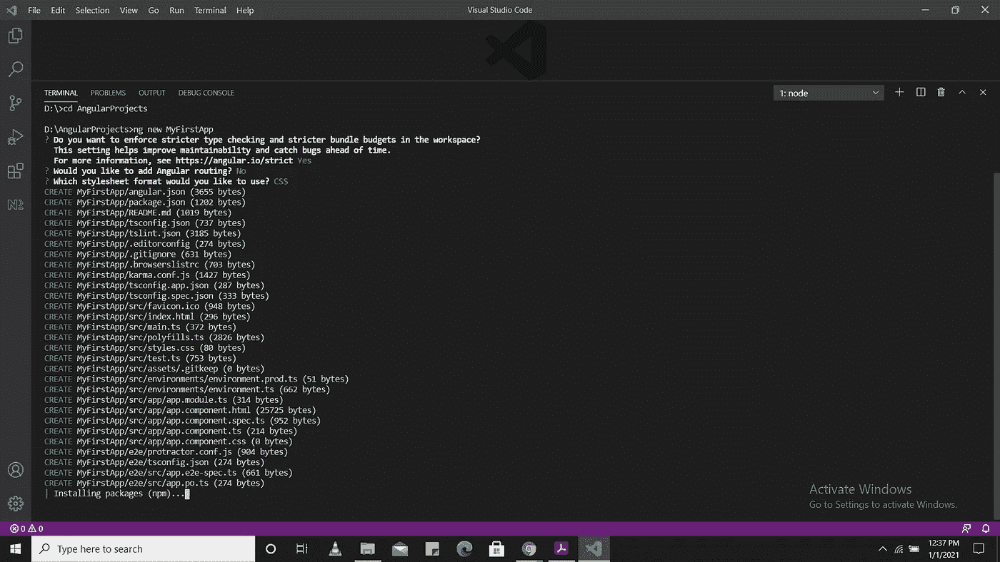
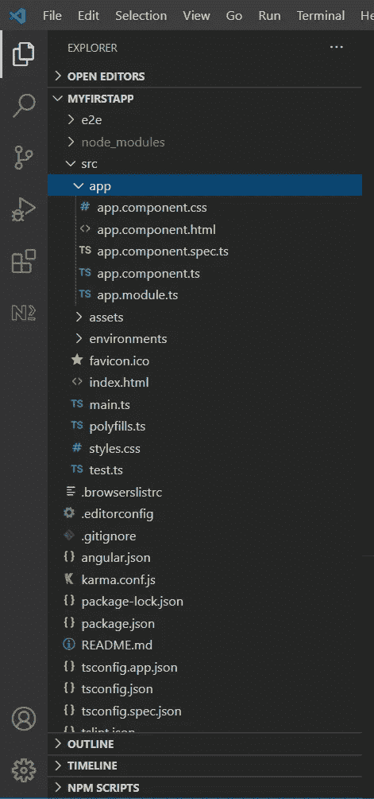
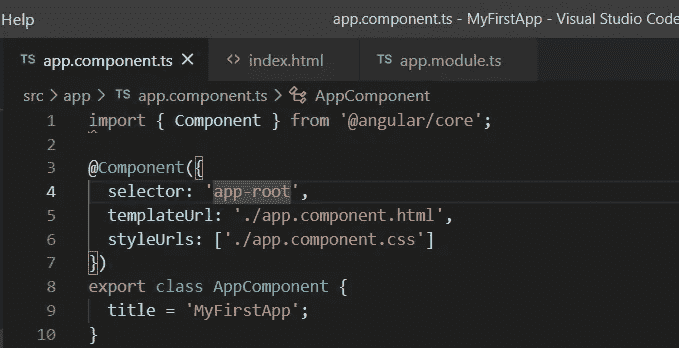
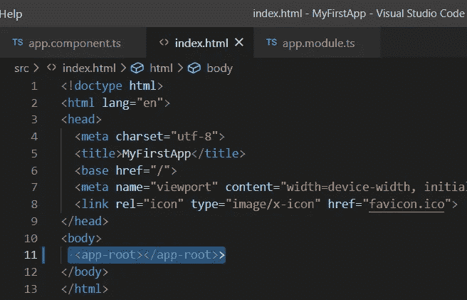
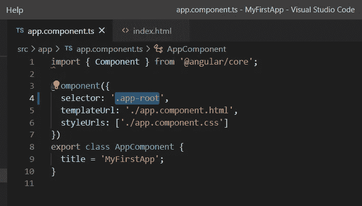
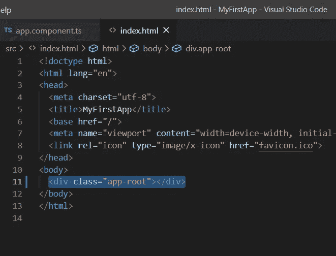
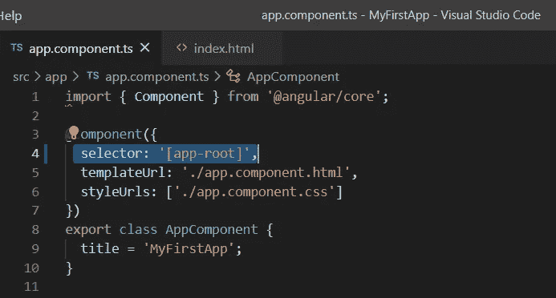
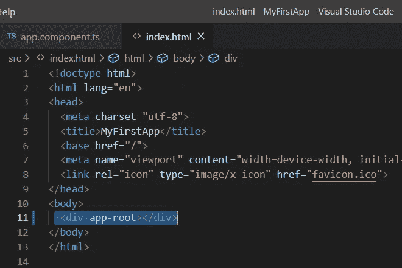
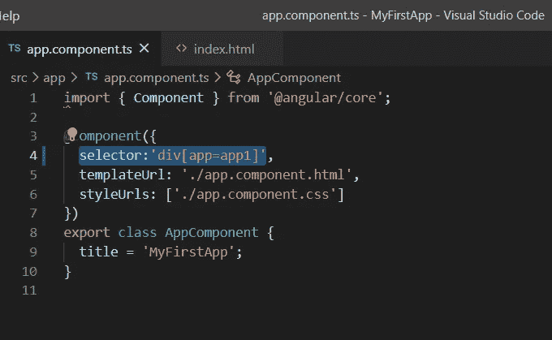
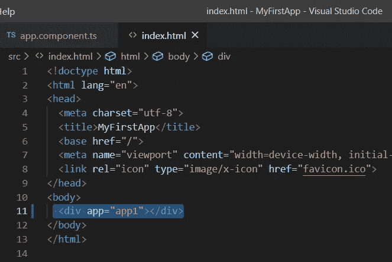

# 让我们从初级到高级学习角度

> 原文：<https://medium.datadriveninvestor.com/lets-learn-angular-beginner-level-to-complex-level-part-01-4b48947b51bc?source=collection_archive---------7----------------------->

## *这里我讲的是角度 CLI 安装和角度组件*


Photo by [Goran Ivos](https://unsplash.com/@goran_ivos?utm_source=medium&utm_medium=referral) on [Unsplash](https://unsplash.com?utm_source=medium&utm_medium=referral)

**角度 CLI 安装:**

Angular CLI 创建 Angular 应用程序，并使用 Typescript、webpack(用于模块捆绑)、karma(用于单元测试)、量角器(用于端到端测试)

```
npm install -g @angular/cli
```

**创建一个新的角度应用:**

```
ng new MyFirstApp
```



create a new angular app

它将创建一个文件夹 MyFirstApp，并复制所有必需的依赖项和配置设置。

Angular CLI 执行以下操作

*   创建一个新目录 MyFirstApp
*   为应用程序设置文件夹结构
*   下载并安装角度库和任何其他依赖项
*   安装和配置 Typescript
*   安装和配置 Karma &量角器进行测试

**运行你的新 angular 项目**

```
ng serve
```

你也可以使用

```
npm start
```

webpack 开发服务器监听 HTTP 端口 4200，因此打开浏览器并键入 [http://localhost:4200/](http://localhost:4200/) ，您将看到浏览器上显示 MyFirstApp 正在运行。

**角度项目文件夹结构**



Project file structure

*   **src 文件夹**:该文件夹包含与我们的 angular 应用程序相关的主要代码文件。
*   **app 文件夹**:包含我们为 app 组件创建的文件。
*   **app.component.css** :该文件包含我们的 app 组件中的 css(级联样式表)代码。
*   **app.component.html**:该文件包含与其 app 组件相关的 HTML 代码。它是 angular 专用于数据绑定的模板文件。
*   **app.component.spec.ts** :该文件是 app 组件的单元测试文件。我们可以从 angular CLI 通过命令 ***运行 ng test*** 。
*   **app.component.ts** :组件背后包含视图逻辑的基本类型脚本文件。
*   **app.module.ts** :也是一个类型脚本文件，包含网站的所有依赖关系。这些数据用于定义需要导入的模块、需要声明的组件和需要引导的主要元素。
*   **package . JSON**:NPM 配置文件。它包括我们的网站和软件包依赖关系的详细信息，以及关于我们的网站是一个软件包本身的更多信息。
*   **package-lock.json** :这是一个自动生成并转换的文件，当 npm 执行与 node_modules 或 package.json 文件相关的操作时，这些文件会得到更新。
*   **angular.json** :是我们 angular 应用相关的必要配置文件。它定义了我们的应用程序的结构，并包括应用程序要完成的任何设置。
*   **。gitignore** :记录与源代码 git 相关。
*   **。editorconfig** :这是一个标准文件，用于在代码编辑器中保持一致性，以组织一些基本内容。例如缩进和空白。
*   **Assets 文件夹**:该文件夹是应用程序中使用的资源文件的占位符，如图像、地区、翻译等。
*   **环境文件夹**:环境文件夹用于获取环境配置常量，这些常量在我们构建 angular 应用程序时会有所帮助。
*   **Index.html**:它是保存 angular 应用程序的高级容器的入口文件。
*   **karma.config.js** :指定 karma 测试运行器中的配置文件，karma 由 AngularJS 团队开发，可以运行 AngularJS 和 Angular 2+的测试。
*   **main.ts** :这是将要运行的主 ts 文件；首先，它主要用于定义全局配置。
*   **polyfills.ts** :记录是一组代码，可以用来为老版本的浏览器提供兼容性支持。Angular 8 代码是用 ES6+规范写的。
*   **test . ts**:Angular CLI 命令 ***ng test*** 将用于遍历应用内所有单元测试的主测试文件。
*   **styles.css** :角度应用的全局样式表
*   **tsconfig.json** :这是配置文件的 typescript 编译器。
*   **tsconfig.app.json** :用于用 app 特定的配置覆盖 tsconfig.json 文件。
*   tsconfig.spec.json :它用特定于 app 的单元测试用例覆盖 tsconfig.json 文件。

**角度组件**

组件是角度应用程序的主要构建块

该组件包含定义视图外观和行为的数据和用户交互逻辑。Angular 中的视图指的是模板(HTML)。

角度组件是普通的 javascript 类，使用@component Decorator 定义。这个装饰器为组件提供了显示关于类的元数据的视图

该组件负责向视图提供数据。Angular 通过使用数据绑定将数据从组件获取到视图来实现这一点。这是通过使用称为角度模板语法的特殊 HTML 标记来完成的。当视图改变时，组件也可以得到通知。

角度应用将有许多组件。每个组件处理 UI 的一小部分。这些组件一起工作来产生应用程序的完整用户界面

这些组件由三个主要构件组成

*   模板
*   班级
*   元数据

**模板(视图)**

模板定义了视图的布局，并定义了页面上呈现的内容。没有模板，Angular 就没有任何东西可以呈现给 DOM。

模板是用 HTML 创建的。您可以向模板添加角度指令和绑定。

有两种方法可以指定角度模板。

*   内联定义模板
*   提供外部模板

**级**

类是与模板(视图)关联的代码。该类是用 Typescript 创建的，但是您也可以直接在该类中使用 javascript。类包含属性和方法。可以使用数据绑定将类的属性绑定到视图。

```
export class AppComponent
{
  title : string = "Welcome to MyFirstApp"
}
```

**元数据**

元数据向角度提供关于组件的附加信息。Angular 使用这些信息来处理类。元数据是用装饰器定义的。

装饰器是一个向类、类的方法和类的属性添加元数据的函数。组件是用@component 类装饰器定义的。它是@component decorator，它将类定义为

**@组件装饰器**

当使用组件装饰器时，一个类变成了一个组件。装饰者总是以@为前缀。装饰器必须紧接在类定义之前。

**重要组件元数据属性**

**选择器:**指定了简单的 CSS 选择器，在这里，表示组件的视图由 Angular 放置。

**提供者:**提供者是我们的组件将要使用的服务。服务向组件或其他服务提供服务。

**风格/风格样式**

该组件需要的 CSS 样式或样式表。这里我们可以使用外部样式表(使用 styleUrls)或内联样式(使用 styles)。这里使用的样式是特定于组件的

**模板/模板 Url**

定义我们的视图的 HTML 模板。它告诉 Angular 如何渲染组件的视图。模板可以是内联的(使用模板)，或者我们可以使用外部模板(使用 templateUrl)。该组件只能有一个模板。您可以使用内联模板或外部模板，但不能同时使用两者

Angular 在 CSS 选择器内的 DOM 中呈现组件视图，这是我们在组件装饰器中定义的

```
@Component(
{
selector:'app-root'
})
```



app.component.ts

选择器 <app-root></app-root> 在 index.html 中(在 src 文件夹下)



index.html

当我们构建有角度的组件时，我们实际上是在构建新的 HTML 元素。我们在组件元数据的选择器属性中指定 HTML 元素的名称。然后我们在 HTML 中使用它。

当实例化组件时，Angular 在 HTML 文件中搜索选择器，并呈现与组件相关联的模板。

**使用 CSS 类名:**

```
@Component({ selector: '.app-root'})
```



app.component.ts

在 index.html 使用以下代码

```
<div class="app-root"></div>
```



index.html

**使用属性名**

```
@Component ({ selector: '[app-root]'})
```



app.component.ts

在 index.html 使用以下代码

```
<div app-root></div>
```



index.html

**使用属性名和值**

```
@Component({
 selector:'div[app=app1]'
})
```



app.component.ts

在 index.html 使用以下代码

```
<div app="app1"></div>
```



index.html

在接下来的教程中，我希望谈论以下标准

*   角度-定制组件、插值、属性绑定、类绑定、样式绑定和事件绑定

请继续收听我的节目:-)

**访问专家视图—** [**订阅 DDI 英特尔**](https://datadriveninvestor.com/ddi-intel)