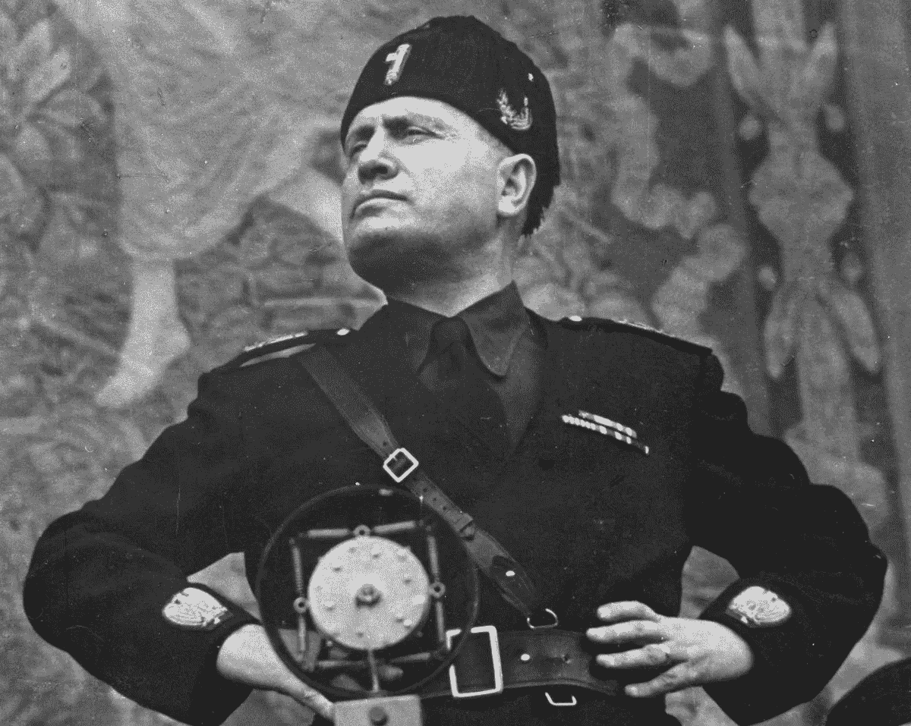

# 让我们接管一个国家

> 原文：<https://medium.datadriveninvestor.com/lets-take-over-a-country-3264d224c086?source=collection_archive---------22----------------------->

## 现代科技如何让成为最高领导者变得容易

Image credit: NY Daily News

智能手机。互联网。信息自由流动，人人皆可获取。有什么不喜欢的？

我的意思是，不久前，如果你想成为终身独裁者和你所调查的所有人的最高领导人，你需要得到大量全副武装的人的支持，购买或创办自己的报纸、广播节目和电视频道，坦率地说，要成为一个组织天才。你需要冷酷无情，有一个忠诚的核心圈子随时准备为你效劳。

难怪很少有人愿意接管他们的国家！真麻烦！

幸运的是，由于上面提到的那些可爱的技术，今天事情变得容易多了。现在几乎任何人都可以成为最高领导人，如果他们想的话！这是真正的民主行动！

让我们看看:我们应该选择哪个国家？

英国太沉闷，天气糟糕，人们穿着单调的衣服，没有人有一点积极性。美国太大了，而且，在 2024 年，它将选出它的最后一任总统和第一位终身最高领导人，所以它已经被预定了。没有人想统治俄罗斯，这就是为什么我们让普京来做。加拿大是一个选择，但坦率地说，这就像踢你最喜欢的老处女阿姨，所以我们会离开它。

让我们创造一些合理的标准:好天气，可爱的乡村，优雅地通向温水的沙滩，冬天可以滑雪的地方，美食文化，以及现有的政治结构混乱得令人绝望，甚至一个小孩子都可以夺取权力而没有人试图阻止他们。想到这些，一个国家不可抑制地跃入脑海:

意大利。

好，那么我们将成为意大利的最高领导人。为什么不呢？他们已经经历了不到一个世纪前的 alpha 版本，所以对于那些对历史书籍内容稍有了解的人来说，这将是非常熟悉的。我们可以把自己想象成领袖 2.0。

我们如何开始？

首先，我们需要制造*恐惧*和*怨恨*，这意味着我们必须创造一个敌人。意大利从其欧盟成员国身份中获益匪浅，因此欧盟自然是完美的目标。正如英国退出欧盟清楚表明的那样，你从某样东西中获益越多，你就越有可能被说服去讨厌它。因此，我们让意大利人反对他们最大的繁荣与和平的唯一来源，作为我们狡猾计划的第一步。

我们如何做到这一点？通过制造不满和威胁。我们宣布欧盟将根据宽度对意大利面征税。我们采访了一位悲伤的 nonny，她坐在一大碗意大利面前哭泣，周围是几十个哭泣的孩子和他们惊恐的父母，哀叹在邪恶的欧盟强加其破坏家庭的政策后，她不知道如何养活这个家庭。

当然，不存在这种政策的事实是完全不相关的。没有人——真的没有人——会费心去核实我们哭泣的芬迪奶奶的说法是否属实；重要的是她对着意大利面哭泣的照片，我们会在网上传播。这是人们会记住的，它会激起他们心中恐惧和仇恨的第一缕温暖的余烬。大众媒体会通过广泛传播这个故事来帮助和教唆我们，因为它有吸引眼球的潜力(别介意这是个谎言；看看那些可爱的广告收入！).

接下来，我们需要创造一个幻想，一旦意大利摆脱了德国主导的欧盟的束缚，它将会是什么样子。单独来看，意大利将能够与其前帝国(埃塞俄比亚)进行贸易，每个人都将拥有至少 15 份工作(其中没有一份需要实际工作)，每个人都将更年轻、更有吸引力，政府将为所有人提供免费的名牌服装。最好的是，那些可怕的外国人，他们的基本技能和他们的投资欧元将被踢出去。意大利，毕竟应该是意大利人的！我们被狡猾的外国人剥削太久了！我们需要开始把我们自己的人放在第一位！

为了支持我们的仇外信息，我们编造了一些故事，比如德国游客侮辱意大利冰淇淋，西班牙商人引诱未成年的意大利女孩回酒店参加疯狂的意大利通心粉性爱派对，以及瑞典情报人员密谋偷窃有益健康的意大利家具，并在半夜用宜家采购的物品取而代之。

大众媒体会再一次重复我们的捏造，因为它们是如此的耸人听闻，而互联网会做剩下的事情。当人们喝着早餐浓缩咖啡、嚼着午餐三明治、乘车回家、吃着晚餐、躺在床上盯着屏幕时，他们会傻傻地看着我们的宣传。我们的信息会渗入他们幼小的心灵，而他们却没有意识到发生了什么。我们的谎言会变成他们的真理，因为他们会在任何地方、每一天的每一分钟，在屏幕上看到我们的信息，命令他们看、多看、再看。

我们需要警察和军队的支持，所以我们承诺给每个警察配备镀铬的随身武器和名牌太阳镜。军方将承诺由兰博基尼和法拉利设计的个人机动车辆，空军将被告知他们将拥有世界上最时尚的飞机。为什么真正的飞行员会想驾驶一架没人会注意到的隐形飞机？驾驶你能想象到的最亮、最炫、最时尚的飞机要好得多！这就是生命的意义所在！当然，美国海军将会得到 12 艘航空母舰，全部装备可以搭载 1000 名船员和 3000 名女性后勤人员，但没有真正的飞机，因为储存和维护它们实在是太麻烦了，而且还会妨碍甲板上的派对。

我们还将承诺为每一个想工作的失业意大利人创造就业机会。(顺便说一句，这将是我们实际上唯一要遵守的承诺。两个新的职位将被创建，使罗马最终有一对专门的冰淇淋供应商在意大利议会大厦内。)

为了加大宣传力度，我们接下来发布了一段视频，据称是一名身材高大、看上去像斯堪的纳维亚人的男子抓着一名身材适中(但当然穿着考究)的意大利女子的臀部，这名女子手牵着她的两个小孩。这肯定会激起每个意大利人心中的愤怒，因为他们相信只有意大利男人才有权利抓住外国女人的臀部。我们这样直捣意大利*民风*的心脏，煽起怀疑、不信任、怨恨的火焰，最重要的是:仇恨。这个视频会在网上疯传，新闻频道会播放，这样每个人都能从我们的努力中受益。

我们确保我们发布的每一份声明，我们举办的每一场新闻发布会，我们制作的每一个视频剪辑，都有意大利国旗自豪地展示在背景中。我们毕竟是*爱国者！*

我们没完没了地提及我们过去所谓的伟大。我们制造了过去的怨恨:我们伟大而庄严的埃塞俄比亚帝国被邪恶的欧洲列强从我们这里偷走了，他们从第二次世界大战结束以来就一直阴谋压制我们(顺便说一句，我们并没有真正输掉这场战争)。他们在我们自己的国家奴役我们！我们需要重拾我们的伟大！没有一个真正的意大利人会否认这个显而易见的事实！

现在，我们在俄罗斯的朋友将会做出贡献，提供有帮助的分裂性迷因和 gif 来加强我们在互联网上的信息，并在意大利全国各地的屏幕上显示出来。来自美国、英国和整个欧洲大陆的极右团体将提供他们的支持和建议，告诉我们如何将局势升级到对我们有利的程度。我们将协商出租暴徒交易，以帮助在关键的示威游行期间扩大我们的支持者队伍，所有这些都将是高度值得媒体关注的，从而进一步造成我们无处不在、每个人都支持我们的假象。

现在，我们更进一步，利用媒体传播荷兰消费者焚烧意大利奶酪的故事，德国公司将自豪的意大利腊肠重新贴上德国香肠的标签，背信弃义的法国人策划秘密计划，声称多洛米蒂是法国领土。我们的支持者会自发地制作成千上万的假视频，展示越来越难以置信的事件，而大多数人会毫不犹豫地相信。

到现在为止，我们的专用网站和社交媒体小组将使我们能够形成一个遍布全国的愤怒的爱国白痴的广泛支持网络。我们组织广为宣传的游行以及同样组织良好的反抗议活动。我们把所有的暴力都归咎于反抗议者，同时展示我们自己一方痛打养老金领取者和小孩的视频。这在我们的追随者中创造了一种正义不可战胜的气氛，鼓励他们做出更大的暴力行为，我们小心翼翼地从未明确地煽动这些行为(尽管我们当然会尽一切必要的努力来确保我们的脑残追随者确实会在我们的隐喻帽子落下时诉诸暴力)。

警方的任何软弱回应都被谴责为对我们言论自由和集会自由权利的不可容忍的侵犯，也是欧盟正在扼杀我们伟大国家的确凿证据。

自然地，我们确保中立任何记者，甚至模糊地考虑试图纠正我们无休止的谎言。我们给他们寄去孩子或年迈父母的照片，并附上微妙的信息“如果他们出了什么事，那将是一种耻辱，不是吗？”同时，我们通过大喊*恐惧计划，谴责任何试图报道事实的行为！*和*假新闻！*

我们越来越多的支持者会非常感激我们所做的事情，因为这让他们不再需要尝试艰巨而危险的思考任务——大自然让他们完全没有能力完成这项任务。当你可以呆呆地看着屏幕，重复它提供给你的片段和迷因时，为什么还要思考？

现在，我们要求举行选举，或者更好的是，进行一次极具误导性的公投。这毕竟是*民主程序*。人民的意志必须得到尊重！尤其是当我们为了确保遗嘱完全符合我们的意愿而孜孜不倦地撒谎和捏造的时候。

只要我们坚定不移地坚持这些简单的原则，我们的成功是有保证的。我们可能软弱无能，但我们知道如何利用现代技术让普通人屈从于我们的意志。普通公民头脑太简单，完全无知，永远不会明白我们是多么容易地操纵他们；极少数聪明而见多识广的人实在是太少了，也太通情达理了，不足以对我们争取绝对权力的努力构成任何挑战。除此之外，几个月来，我们一直称任何有相当高智商的人为叛徒和人民公敌。我们的盲目追随者一直在恐吓每一个没有完全脑死亡的人，所以这个国家的少数聪明人要么已经离开，要么为了多活几天而保持沉默。

***这就是一切。***

对于任何认为这篇文章是讽刺或幽默夸张的人来说，我只能想知道你在过去的四年里去了哪里。本文提出的每一项(除了创造就业计划)都是在代议制民主中获得权力的可靠方法。极右团体成功地使用了每一种策略来迫使普通人服从他们的意愿。

尽管由于最近老态龙钟的乔的当选，美国可能会经历一个短暂的放缓其陷入暴政的过程，但严峻的事实是，未来属于全球各地随处可见的极右政客和煽动家，他们得到了如此愚蠢的人们的骄傲支持，他们简直看不到在他们眼皮底下显而易见的事情。

在英国，保守党是英国退出欧盟的产物，它是与美国极右翼团体联合策划的。英国保守党与美国各种极右翼组织、智库和政治团体有着深厚而持久的联系，尽管鲍里斯·约翰逊在 1 月 6 日之后试图与特朗普保持距离，但这些联系仍然牢固。法国的马林·勒·庞一直在观察英国退出欧盟的余波，并从中吸取教训，她重新起草了自己的极右信息，以避免受到英国退出欧盟灾难的影响，同时继续迎合法国沙文主义。即使在斯堪的纳维亚国家，极右团体也赢得了选票。一个有助于争取落后的种族主义者选票的口号:“*我们大声说出你只能私下里想的事情。”*

但是不要担心:你仍然有时间成为你喜欢的任何国家的最高领导人。通过遵循这里概述的简单步骤，你也可以加入强者的行列(女性不必申请)，他们将塑造本世纪，并带来爱国主义、民族主义、恐惧、仇恨、冲突和经济崩溃的所有不可估量的好处，这些好处是我们完全应该得到的，也是我们如此迫切地想要给我们的孩子的礼物。

趁你的邻居还没到，现在就行动吧。