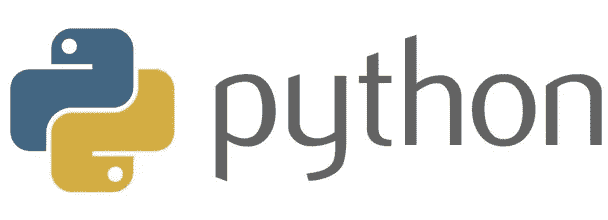
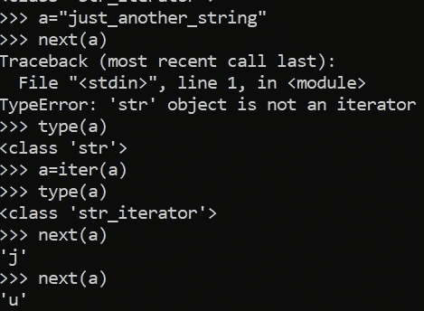
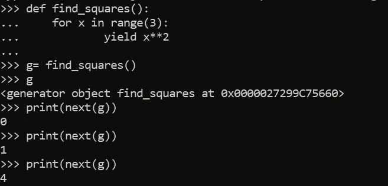
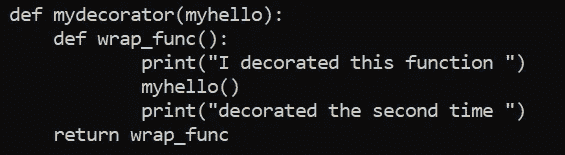
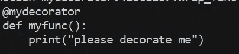
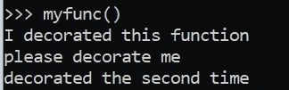
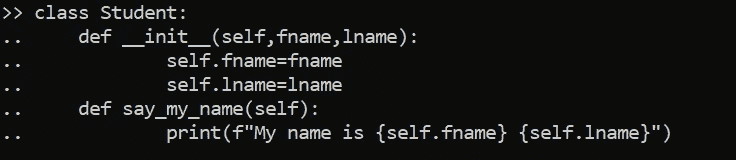
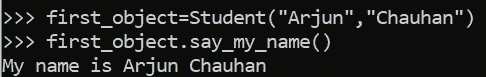

# 我们来谈谈 Python

> 原文：<https://medium.datadriveninvestor.com/lets-talk-about-python-d280bc7416ba?source=collection_archive---------36----------------------->

最近我发了很多关于自动化、AWS、机器学习、网络等的帖子。今天，我将回到基础来讨论一些核心的 python 话题。

在这篇博客中，我将讨论

*   类别和对象
*   列出理解
*   迭代器和生成器
*   功能和模块
*   装修工

有些主题是所有语言共有的，如类和函数，有些是 python 独有的，如列表理解。因此，这篇博客的先决条件是熟悉 python 概念。

我想从功能和模块开始

# 功能和模块

假设您有一个程序，它接受用户的输入并打印一条简单的 hello 消息。

为此，我们只需创建一个打印语句，任务就完成了。然而，这可能不是最好的方法。假设我们有一个 100 人的列表，而不是一个单独的输入。为 100 个不同的用户写一个 hello 语句是没有意义的。即使我们这样做，也是非常多余的，容易出错，也是一项累人的工作。为了解决这个问题，我们使用函数。

一个函数就像一个可以反复使用的模板代码。根据使用情况，函数可以接受多个参数。

一个简单的函数看起来像下面给出的例子

所以我们要做的就是在我们想用的时候调用这个函数。我们只需要定义一次。

如果我们不想打印值，我们可以返回它。**返回允许我们将函数的结果保存在一个局部变量中，该变量可用于进一步的任务。**

## 那么模块有什么用呢？

每当我们有一个大项目要做时，我们都会创建许多函数。所以管理这些功能也变得非常困难。**这样我们就可以将不同类型的函数归入不同的文件**。这些包含 python 变量、函数、定义的类的文件被称为**模块**。这些模块可以在我们的代码中导入并使用。

所以模块使得函数的管理更加容易。

# 迭代器和生成器

迭代器是所有语言都有的概念。

所以在理解生成器之前，让我们试着理解迭代器是什么意思。

在 python 中，任何在定义中定义了 next 方法的对象都被称为迭代器。

## 那么它实际上意味着什么呢？

字符串、列表、数组都是可迭代的。这意味着它们可以被迭代。

所以知道迭代器和 iterable 之间的区别可能会令人困惑。

所以这个例子说明了一切。

最初 a 是一个字符串。字符串是可迭代的，因为它有一个内部定义的 __iter__ 函数。

但是对它调用 next 会给出一个错误，说明 string 不是迭代器。

然后当我们调用“a”上的 iter 时，我们可以看到它变成了一个字符串迭代器，我们可以很容易地对它调用 next。

> iterable 定义了 __iter__ 函数，迭代器定义了 __next__

## 发电机:

假设您的任务是对前 100 万个数字执行某些操作。但是由于资源限制，您不希望在 RAM 中保存这么大的列表。为此，我们可以使用生成器的概念。

生成器是将迭代器返回到可迭代对象的函数。然而，生成器函数的重要性在于它们不会耗尽内存。

## 那么他们是如何实现的呢？

因此，我们使用 yield 关键字来代替 return。

在这种情况下，当我们调用 next 时，生成器函数调用该值的函数。这意味着列表没有存储在存储器中。这节省了很多空间。

然而，这里要知道的一点是，当使用生成器时，我们只能迭代一次。

# 列表理解

Python 是一种非常用户友好的语言，代码的可读性是它的一个重要方面。

在很多情况下，我们必须迭代一个 iterable 并执行某些任务。有时候这些是简单的任务，比如增加列表中数字的值或者检查某个条件。所以为这个创建一个 for 循环是**不是一个非常 pythonic 化的方式**。

为此，我们有列表理解，允许我们迭代一个 iterable 并返回一个列表。列表理解在后端使用了一个循环，但是允许我们在一行中执行它。

在这里你可以看到，对于**列表 a** ，我使用 for 循环给所有元素加 1，对于**列表 b** 中的类似任务，我使用列表理解。显然，列表的理解更加简洁，可读性更强。

所以列表理解的典型语法是这样的:

> <operation>为<iterable>中的<iterator></iterator></iterable></operation>

 [## 使用 Python |数据驱动投资者的名称匹配技术

### 我们确实面临很多情况，我们必须匹配一个有很多变体的单词。这可能是因为错别字…

www.datadriveninvestor.com](https://www.datadriveninvestor.com/2020/12/07/name-matching-techniques-with-python/) 

# 装饰者和描述符

让我们考虑另一种情况。您有一个像我们之前定义的那样打印 hello 用户的函数。但是现在我们有一个场景，我们想添加一些欢迎词。为此，我们有两个选择

*   根据所需用途创建新功能。
*   编辑当前功能

第一种选择的问题是，它会增加代码的大小，并且使管理变得困难。另一方面，编辑当前功能会使旧功能消失。

所以在这个场景中，我们可以使用装饰者。装饰器可以理解为在不改变代码结构的情况下向现有函数添加的功能。

现在让我们在实践中看到这一点。

这里我们创建了一个函数，函数作为参数。在这里我们创建了一个嵌套函数。所以这个嵌套函数实际上在传递的函数之上增加了功能。

所以要传递一个函数作为装饰，我们使用@符号。所以一个普通的 myfunc()只有一个 print 语句。

让我们看看当我们调用它时会发生什么。

所以在内部调用了 mydecorator 函数。

这就是 python 中装饰器的用途和功能。

# 类别和对象

类和对象是面向对象编程的构造块。

Python 是一种“面向对象的编程语言”这意味着几乎所有的代码都是使用一种叫做类的特殊结构来实现的。程序员使用类把相关的东西放在一起。

类是可用于创建对象的代码模板。一个类中可以有多个函数，这些函数被称为方法。

> 方法是类的函数

这是一个关于什么是阶级的简单例子。每当创建一个对象时，总是调用 __init__ 方法。这被称为构造函数。

我们可以在一个类中有多个方法。

需要注意的一点是，我们不能调用类。相反，我们必须调用名为 object 的类的实例。

所以一旦我们创建了一个类的对象，我们就可以访问它的方法和变量。需要注意的一点是，say_my_name()方法没有参数，但是它能够打印名称。

这意味着类变量在类中有作用域，方法可以毫无问题地访问它们。

# 结论

我在今天的文章中触及了从函数到类的各种概念。Python 是一种功能丰富的语言。它在网上有一个非常活跃的社区，由于它是开源的，许多开发者在不断增加新的功能。所以这种语言的浩瀚一开始可能会让人不知所措。然而，一旦你掌握了窍门，事情就变得容易多了。

谢谢:)

**进入专家视角—** [**订阅 DDI 英特尔**](https://datadriveninvestor.com/ddi-intel)