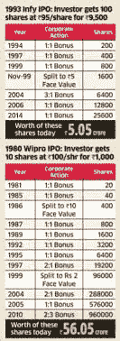
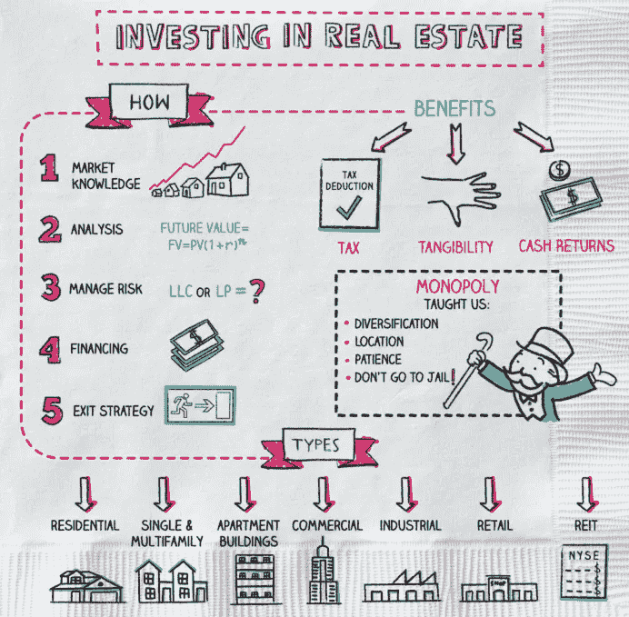
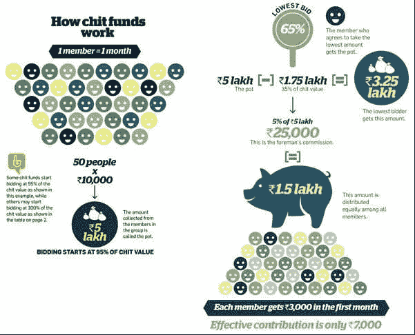
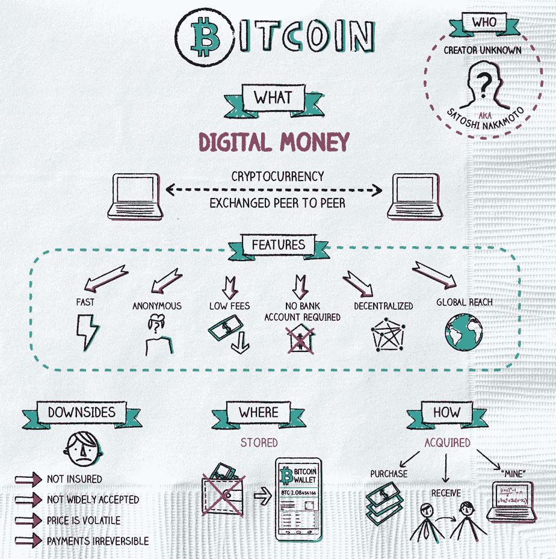

# 让我们谈谈钱——第一部分(哪里？)

> 原文：<https://medium.datadriveninvestor.com/lets-talk-money-part-1-where-ac6e677fea50?source=collection_archive---------6----------------------->

3 部分系列的第 2 部分解释了该国存在的各种金融工具。

## **链接上一部分:** [**我们来谈谈钱—第 0 部分(为什么！！？)**](https://medium.com/@namburisrinath/lets-talk-money-part-0-why-a1a153f4c445)

普通人可以投资的主要场所是(点击进入特定部分):

1.  [银行账户](#cd19)
2.  [股票](#1494)
3.  [共同基金](#54b8)
4.  [保险](#4b4f)
5.  [房地产和黄金](#0f5d)
6.  [债券基金](#fadd)
7.  [加密货币](#0eac)
8.  [网络平台的 P2P 借贷](#2edc)

# 1.银行账户

这不需要对其工具(储蓄账户、FDs 和 RDs)进行任何介绍或进一步解释。用一句话来说就是*“回报最少最安全”*从角度来看，这既是*赞成*又是*反对*。

# 2.股票

我们中的大多数人可能听说过“俏皮”、“敏感”、“公牛”、“熊”等术语；并且在童年时期就看到了听说要翻译的图表。避开技术细节，我举个简单的例子:(出于基本直觉，可能有技术上的瑕疵)

假设你观察了一家像 Infosys 这样的公司，并认为它是一家好公司，市场资本/范围不断扩大。现在，你想为这家公司做贡献，成为合伙人。一种方法是购买它的股份(该公司的部分)。印孚瑟斯拿走你的钱，改善它的业务，最终反映在它的股票价值的增加上，你可以通过出售你的股票来兑现。

Simplyfying stocks (**Source:** [NapkinFinance](https://napkinfinance.com/napkin/stocks/))

## 理解股票的基本术语:

1.  **交易 vs 投资:**

交易:买入某物，持有几周或几个月(短期)，然后卖出，从而获得短期利润。

投资:买一些东西，持有几年(长期)，然后卖掉，从而获得长期利润。

成为交易者或投资者取决于个人，因为两者各有利弊。

2.**大型股、中型股、小型股行业:**

**大盘股:**市值(拥有多少资本/资产)排名前 100 的公司。

**中盘:**101–250 家公司。

**小盘:** >第 251 公司。

**风险与回报:** *小盘>中盘>大盘(不一定)*

为什么？

因为小盘股资本较少→市场占有率较低→风险最大，因为它可能没有得到很好的解决。一般来说，随着风险的增加，回报也会增加。

3.**看跌和看涨:**

**牛市:**市场在增长，股价在上涨，经济状况良好。

**熊:**市场萎缩，股价下跌，经济不好。

一般来说，公牛后面跟着熊，反之亦然。

4. **BSE，NSE，SENSEX 和 NIFTY:**

孟买证券交易所(印度最古老的证券交易所)

**NSE:** 国家证券交易所(拥有印度最大的客户群)

这两个地方(就像教室)是人们(学生)买卖股票的地方，受 SEBI 监管(监管委员会，就像老师)。

**SENSEX:** 这是一个关于在 BSE 上市的前 30 家公司表现的数字。(类似于一个名为 BSE 的班级中前 30 名学生的表现)

**NIFTY:** 这个数字讲的是在 NSE 上市的前 50 家公司的业绩。(类似于前 50 名学生在一个名为 NSE 的班级中的表现)

**5。股息:大多数公司每年向投资者支付一定的股息。查看[此处](https://www.investopedia.com/terms/s/stockdividend.asp)了解更多信息。**

6.[面值、账面价值和市场价值](https://savart.in/blog/difference-between-face-value-market-value-and-book-value-of-a-share/)

**股票的一般优点:**

1.  高回报。
2.  资本收益税的减少。检查[这个](https://cleartax.in/s/taxation-on-income-earned-from-selling-shares)或者搜索长期资本收益(LTCG，如果你持有工具超过预定时间，比如 1 年，你从工具中获得的收益)&短期资本收益(STCG，如果你持有工具少于预定时间，你从工具中获得的收益)

Long story short, had you bought 100 shares of Infosys during IPO (Initial Public Offering →First time company raises funds from public), and left it untouched, it’s value will be appx 5 crore. Similar story with Wipro

**股票的一般坏处:**

1.  高风险。寻找下一个 Infosys 或 Wipro 并不是一件容易的事情，对于每一个这样的潜在公司来说，可能会有几个 Satyam，你可能最终也会失去初始资本。
2.  如果你是一个交易者，你需要了解和更新国家和市场的各种事件(投资者可以选择一个好的公司，投资并放松几年。)
3.  你需要有一个 DEMAT 账户(在线平台如 [Upstox](https://bv7np.app.goo.gl/14M8A7eHp8qtqhgk6) 、Zerodha 或私人银行提供)来开始投资股票，它收取象征性的费用(~ ₹400/yr) +还有很多其他费用，需要时间来理解。
4.  假设你想投资谷歌或苹果，即一家对外贸易上市公司。你不能从基本 DEMAT 账户购买他们的股票。一个简单的方法是通过共同基金投资。

# 3.共同基金

假设你没有深入的金融知识，不可能每天花那么多时间做研究，决定这家公司好还是那家公司好。但是你有兴趣投资股票。你怎么能这样做？欢迎来到“共同基金”。

它类似于股票，但你的大部分工作将由专业人士完成。它是这样工作的:

*你观察到印度消费模式的增长，并希望投资于相关公司。有像国际贸易中心，HUL，帕尔莱等公司吨；还有一个选择是——对每家公司做自己的研究，投资一两只(股票)。如果他们盈利，一切都很好。否则，你可能会失去你的资本。*

相反，在共同基金中，你把你的钱(假设是₹10,000/-)投入一个以投资消费型公司为目标的计划。假设有 1000 人投资于同一个方案。所以，资本将是 1000* ₹10,000 = ₹1Crore.现在，这笔钱将由一名*基金经理*(一名经验丰富的 MBA 毕业生)控制，他/她将与一个分析师团队一起预测市场的未来，将这笔钱分割开来，并按比例投资于许多基于消费的公司(如 ITC 的 10%，HUL 的 5%，Parle 的 2%)。因此，如果一家或两家公司在未来亏损，你的整体损失将被最小化，因为你的资本被分散到许多公司。*(这叫分散投资，选择共同基金的最大好处)*

## 理解共同基金的基本术语:

1.  资产管理公司，这些公司负责保管老百姓给的钱。他们有基金经理拿着这些钱投资股票、政府项目等；

**如:** [SBI](https://www.sbimf.com/en-us) ，[阿迪蒂亚·比拉](https://mutualfund.adityabirlacapital.com/)，[伊西](https://www.icicipruamc.com/our-funds)， [HDFC](https://www.hdfcfund.com/) ，[塔塔](https://www.tatamutualfund.com/)，[轴](https://www.axismf.com/)等；(只需浏览页面，了解它们到底是什么，很少有新术语，我会尝试解释重要的术语)

2. **NAV:** 净资产值，即该计划的一个项目的价格

3.**股票、混合和债务基金**

**股票基金:**高风险、高回报，非常适合打算呆上几年的人(大多数情况下，>三年)

**混合型基金:**中等风险，中等回报，非常适合打算投资几个月到几年的人(大多数情况下投资 3 年)

**债务基金:**低风险、低回报(大多数情况下，在回报方面与 FDs 类似)是计划呆几个月的人的理想选择

**SIP:** 系统性投资计划，每个月投资一些₹ X/-在一个方案里。

一次性投资:在一项计划中投资一些₹ X/- once。

投资共同基金还有其他方式，如 SWP(系统性撤回计划)、STP(系统性转移计划)，从[这里](https://www.valueresearchonline.com/stories/33469/the-systematic-methods-sip-stp-swp)可以理解。

还有其他一些概念，如

1.  **重要:** CAGR，绝对回报，XIRR(查看[此视频](https://www.youtube.com/watch?v=KMGN7HXWaYo)有算出的例子)。简而言之，如果有人说*“我可以给你 400%的回报，你需要暂停一下，问问他们说的是什么回报”。*
2.  **重要提示:** [增长与股息 vd 股息偿付](https://www.investopedia.com/ask/answers/which-option-better-mutual-fund-growth-option-dividend-reinvestment-option/)(新手可能希望选择增长选项)
3.  [价值投资与增长投资](https://www.investopedia.com/articles/professionals/072415/value-or-growth-stocks-which-best.asp)
4.  [开放式与封闭式投资](https://www.investopedia.com/ask/answers/042315/what-are-primary-differences-between-closed-end-investment-and-open-end-investment.asp)
5.  [锁定期](https://www.investopedia.com/terms/l/lockup-period.asp)(自投资之日起固定期限内不能赎回)[退出加载](https://groww.in/p/exit-load-in-mutual-funds/)(若提前赎回，收取少量费用)
6.  [比较各种共同基金的一些指标](https://www.youtube.com/watch?v=glaT-NJDyqw)(Bit advanced)

**共同基金的一般优点:**

1.  与股票相比风险更低(因为分散投资)
2.  [复合功率](https://www.youtube.com/watch?v=WF8DwjJ53Cw)如果长期停留
3.  不需要有太多的市场知识(因为会有专业人士负责管理资金)
4.  通过 LTCG、STCG 和指数化对收益征收较低的税率。
5.  *如果是小型投资项目，可以从小至₹100/month 开始投资*
6.  通过放置在特定的方案中可以节省税款，例如 ELSS(检查[下一部分](https://medium.com/@namburisrinath/lets-talk-money-part-2-saving-taxes-b5fdf40bd105))
7.  SIPs 具有额外的优势，如“ [*卢比平均成本*](https://cleartax.in/s/rupee-cost-averaging-works) ”，在许多情况下比一次总付更受青睐。

共同基金的一般缺点:

1.  与股票相比，回报率较低

提示:不要在不了解其含义的情况下直接投资股票。从共同基金开始，看看它是如何运作的，在变得足够舒适和自信后，开始投资股票。

# 4.保险

最重要的保险类型有:

1.  [定期保险](#76f7)
2.  [医疗保险](#3a0a)

**定期保险:**

*“您每月或每年支付一笔特定时期的保费(固定金额)，您去世后，您的家人(或您指定的人)将获得保单中提到的一笔总付款”*

就这么简单。没有重大漏洞或高术语附在这里。这个产品是每个人的必需品。通常人们在 30 岁出头的时候购买定期保险，因为婚姻、家庭和对未来的思考。但是要早点开始，因为每年的保费会随着年龄的增长而增加。

**医疗保险:**

如果你是那种认为，*“这些保险公司会有隐形条款，打劫我们的钱，我就是不信他们会报销”*的人，那你说的就是这个工具。虽然医疗保险对每个人来说都非常重要，但它有很多普通人无法清楚理解的术语、条款和条件(这其实很重要)。购买医疗保险时，最重要的检查项目是:

1.  **共付额和免赔额**

假设您的保险单规定共付额为 20%，免赔额为₹10,000/-。现在，您制作了一份₹50,000/-医院账单，您有责任支付₹10,000(免赔额)+ 20% (₹50,000-₹10,000)，即₹18,000/-，公司支付剩余的₹32,000/-

理想情况下，你需要选择一个*自付额少*和*免赔额少*的计划。大多数公司提供的计划都有自付额和共付额。因此，在完全依赖它们之前，要进行适当的检查。

上面的例子非常简单，实际上还有许多其他参数需要考虑，如自付费用限额、共同保险、年度保险限额，这些都在这里[进行了适当的解释](https://www.youtube.com/watch?v=A4-pklsDT_Q)(尽管这是在美国的背景下)。

2.**先存疾病状况**

假设你正在购买一款 2018 年的保险产品，已经患有一种疾病(该疾病在产品保障范围内)。如果你提出，他们可能会给你一个等待期(如 2 年)，在此期间，你没有资格向公司索赔与预先存在的疾病相关的费用。

假设，你在购买计划时没有提及此事，后来发生了一些事情。当你索赔时，公司会检查文件，如果发现有未提及的预先存在的情况，就不会报销。

查看[此](https://www.coverfox.com/health-insurance/articles/pre-existing-diseases-in-health-insurance/)以获得更多真实例子的细节。

3.**疾病等待期**

对于某些疾病/治疗，公司几个月都不会报销。

心脏治疗可能比牙科更重要。因此，它可能会为牙科治疗规定 2 个月的疾病等待期，为心脏病规定 5 天的疾病等待期，即如果您因心脏病住院，您将在 5 天后获得报销，您的牙科治疗将在 2 个月后获得报销。

4.**次限额**

你的保险单可能会注明“房租的₹5,000/-次限额”，如果你住的房间租金是₹6,000/-，₹1,000/-的差额需要从你的口袋里支付。

5.**理赔及理赔投诉率**

显然，我们需要一个理赔率更高、投诉率更低的政策。查看[这个](https://www.livemint.com/insurance/news/best-health-plans-for-a-sum-insured-of-20-lakh-for-30-and-45-year-olds-11578415702841.html)，它给出了更多的细节。

**注意:**每个医疗保险计划都是独一无二的，有些可能没有这些参数，而大多数都有附加参数。只要确保在购买医疗计划之前检查这些(和其他)，这样你就不会在入院后感到惊讶。*许多保单变成了无现金保单(保险公司将直接向医院付款，无需您的干预),这非常好，请检查此功能。*

# 5.房地产和黄金

我们大多数人对实物资产有强烈的感情(因为我们相信它是可以遗传的，或者我们可以看到/感觉到它等等；).实物资产中最著名的投资是房地产和黄金。但从纯金融的角度来看，投资这些产品是不可取的，因为在大多数情况下，与股票或(一些)共同基金相比，它们的回报率并不高。

**注:**也就是说，一个人应该在他们的财务规划中有各种各样的组成部分(因为几年后黄金可能会带来更多的回报，但平均而言*股票是赢家)。重要的是你计划投资的比例。检查[这些](#bf16)以了解更多详情。*

*一个流行的说法是，如果你在 1980 年将* ₹ *1L 投资于各种工具，回报可能是(截至 2018 年，数字来自《让我们谈谈钱》一书):*

***定期存款:****₹*19.35 l**

****黄金:****₹*16.10 l***

****t35】PPF:t37】₹*32.7 l*****

*****sensex:****t45】₹*2.3 Cr****

**

*Simplifying Realestate (**Source:** [NapkinFinance](https://napkinfinance.com/the-making-of-a-napkin/)). In India, the real-estate relevant stocks/mutual funds are yet to get listed in NSE, BSE.*

***实物资产的一般优点:***

1.  *让我们快乐的情感依恋(可能是理性的，也可能是非理性的，取决于个人)*
2.  *有形的，即有形的，可以体验的*
3.  *住房贷款的税收优惠*

***实物资产的一般弊端:***

1.  ***流动性非常低:**假设你在一周内想要大量现金(比如₹50L)。你不能简单地卖掉你的土地，然后在这么短的时间内获得现金。*
2.  *基于地理位置的差异:根据你购买房地产的地点，价格会有所不同，这是不可预测的，因为没有人能说哪些地方会过时，哪些地方会繁荣(至少没有固定的规则)*

# *6.Chit 基金*

*这是一种 ***非正式*** 的投资方式(在大多数情况下)，一群人凑钱，急需用钱的人会出价更低。这就像一场拍卖，风险很大，流动性适中。*

**

*Illustration of chit funds. (**Source:** [Economic Times](https://economictimes.indiatimes.com/analysis/are-chit-funds-for-you-tips-to-gain-from-them/articleshow/19879120.cms?from=mdr))*

# *7.加密货币*

*比特币、以太坊是互联网上的热门词汇，人们说如果你有几个比特币，你就是百万富翁。在印度，RBI 控制着购买商品的交易媒介，它不批准比特币或加密货币作为交易媒介。所以，除非你有兴趣探索，否则投资比特币毫无意义。*

**

*Simplifying Bitcoin (**Source:** [NapkinFinance](https://napkinfinance.com/))*

***拥有比特币的职业玩家很少:***

1.  *可能是下一个股市(谁知道呢！！)*
2.  *需要投入计算能力(在少数情况下甚至不需要钱)*

***比特币的几个缺点:***

1.  *更好地理解加密货币背后的技术/数学，这有助于获得清晰的图像*
2.  *没有集中的权力和很少探索的领域，因此许多人没有意识到与此相关的实际风险*

# *8.网络平台中的 P2P 借贷*

*如果你对借钱给某人(不认识的家伙)感兴趣，那么 p2p(点对点)借贷平台适合你。*

***优点:***

1.  *平均而言，与许多其他工具相比，这些工具的回报率很高。*
2.  *印度储备银行的规定是存在的，因此有一定的可信度。*

***缺点:***

1.  *选择合适的贷款人是你的责任(一种方法是通过检查他们的 CIBIL 分数，这是关于他们的可信度，他们是否能偿还你)。*

*示例平台包括 FairCent、i2ifunding 等；*

***更新:**感谢柴坦尼亚要求纳入 p2p 借贷*

*还有其他方式，如天使投资者(直接投资小型企业)，但它不是为初学者，需要大量资金。*

## ***下一部分:** [**让我们谈谈钱——第二部分(节税)**](https://medium.com/@namburisrinath/lets-talk-money-part-2-saving-taxes-b5fdf40bd105)*

## *各种仪器之间的比较:*

1.  *[https://www . bemoneyaware . com/blog/returns-of-stock-market-gold-real-estate-debt/](https://www.bemoneyaware.com/blog/returns-of-stock-market-gold-real-estate-debt/)*
2.  *[https://www.bemoneyaware.com/blog/fd-and-sensex-returns/](https://www.bemoneyaware.com/blog/fd-and-sensex-returns/)*
3.  *[https://www . India infoline . com/article/general-blog/investing-in-stocks-vs-real-estate-哪一个会让你更富有-118122800201_1.html](https://www.indiainfoline.com/article/general-blog/investing-in-stocks-vs-real-estate-which-one-will-make-you-richer-118122800201_1.html)*

## *其他资源:*

1.  *https://napkinfinance.com/——他们在餐巾纸大小的图形上解释各种金融话题*
2.  **共同基金基础的 Youtube 播放列表:*勾选[这个](https://www.youtube.com/playlist?list=PL3C11AFC8211EDE2D)和[这个](https://www.youtube.com/playlist?list=PLMRgW5Y9EKSkw1h8rXYVLOPpbSd4jj1wx)。*
3.  **股票基础的 Youtube 播放列表:*勾选[这个](https://www.youtube.com/playlist?list=PLMRgW5Y9EKSnZW5eQQgJdR7fQtQRKqflq)*
4.  **更多高级内容:*查看印度 Youtube 频道，如 [CA Rachana](https://www.youtube.com/c/rachanaphadke/playlists) 和 [Pranjal Kamra](https://www.youtube.com/c/pranjalkamra/playlists) (印度语)，讨论与印度市场相关的最新话题。如果要查外国空间(因为概念差不多)，查 [NateOBrien](https://www.youtube.com/c/NateOBrien/playlists) 或者[这个](https://www.youtube.com/c/AussieWealthCreation/playlists)。*

*如果你对此有进一步的疑问(就个人而言，我对共同基金感兴趣，但我会尽力回答),或者如果你想讨论科学、技术、书籍、金融，或者只是想打个招呼，你可以通过 LinkedIn 联系我。其他博客，查看我的[中简介](https://medium.com/@namburisrinath)。*

***个人网址:**[namburisrinath . github . io](https://namburisrinath.github.io)*

***中柄:**namburisrinath.medium.com*

***领英:**[https://www.linkedin.com/in/namburi-gnvv-satya-sai-srinath/](https://www.linkedin.com/in/namburi-gnvv-satya-sai-srinath/)*