# 让我们来理解 GameStop 的股市疯狂

> 原文：<https://medium.datadriveninvestor.com/lets-understand-gamestop-stocks-madness-easily-using-memes-d7127e9e98e5?source=collection_archive---------17----------------------->

## Gamestop 的股票怎么了？

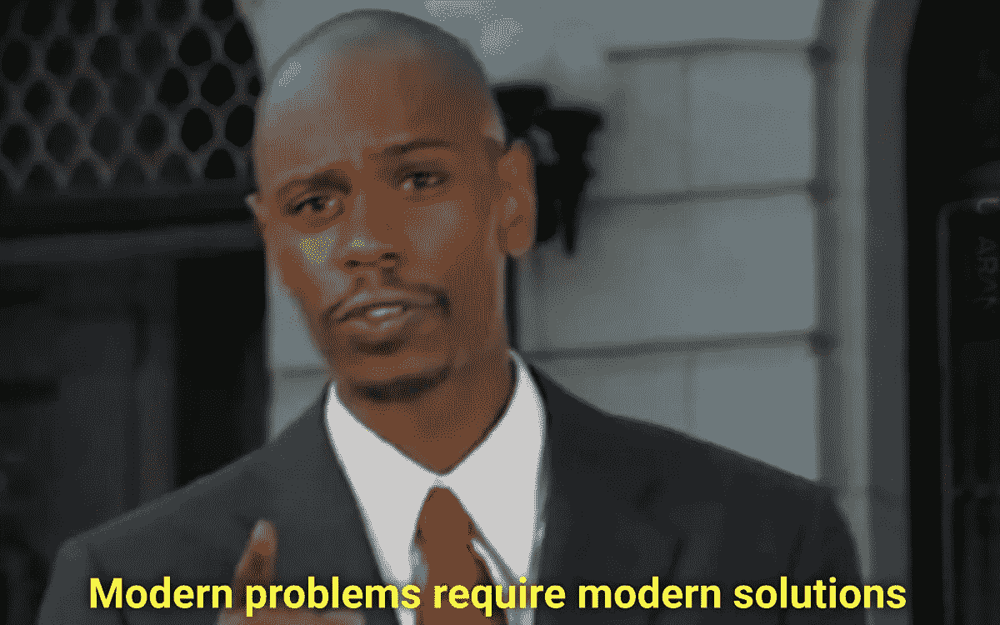

People used Reddit to manipulate Stock Market

> "当你可以用 Robinhood 上的 GameStop 股票玩游戏时，为什么还要玩 GameStop 的游戏？"

嗯，我写这个很困惑。我不知道有没有其他人尝试用 medium 写这样的东西！

Gamestop 股票的疯狂已经过去 3 周了。但是大多数人仍然对发生的事情感到困惑。所以在这里，我试图让每个人都讽刺地了解它！是的，讽刺！。

我给出一些迷因，让大家了解 Gamestop 的股市疯狂。我们开始吧。

# 迷因 1:

Meme 1

你需要理解三个术语来开始这个迷因主题。

# 迷因 2:

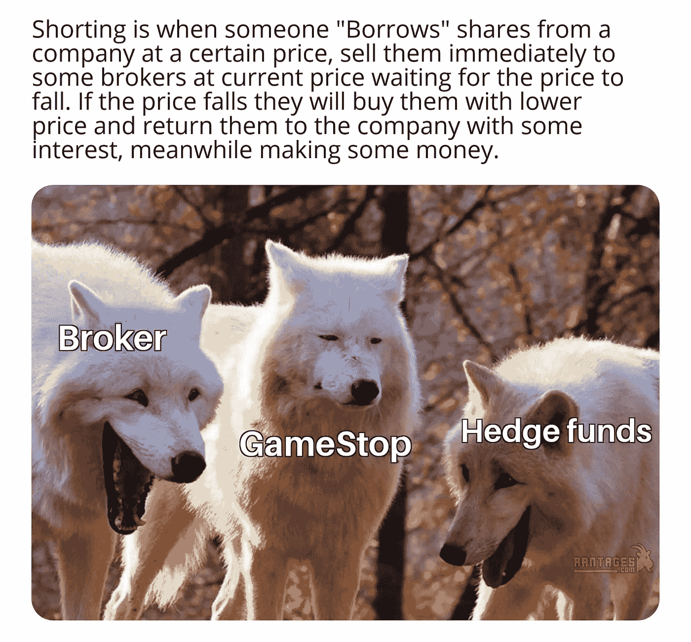

Meme 2

*做空*就是有人以某个价格从一家公司“借”股票，立即以当前价格卖给一些券商，等待价格下跌。如果股价下跌，他们会以更低的价格买入股票，然后返还给公司，同时赚一些钱。

# 迷因 3:

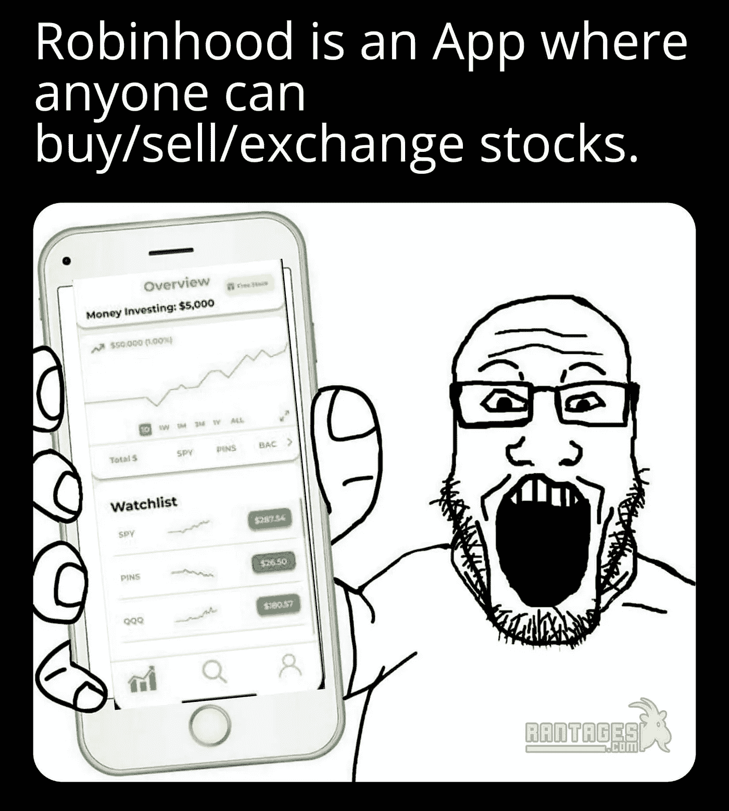

Meme 3

*Robinhood* 是一款任何人都可以买卖/交换股票的应用。

# 迷因 4:

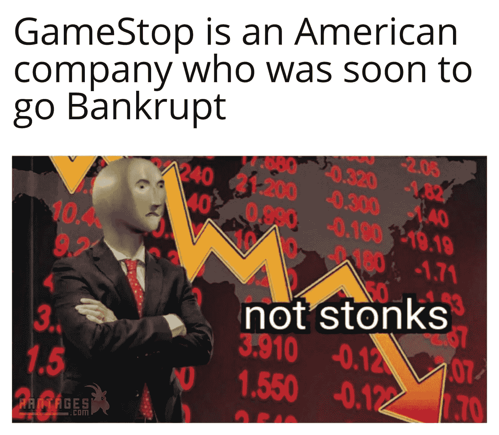

Meme 4

Gamestop 是一家即将破产的美国公司。

# 迷因 5:

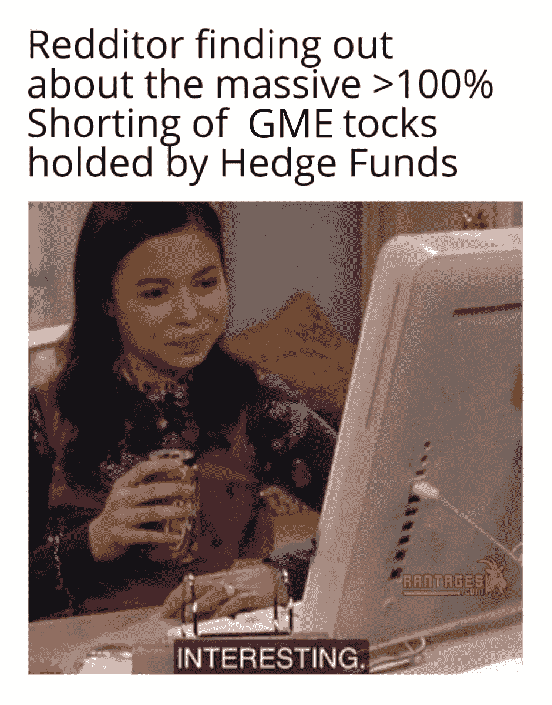

Meme 5

一些 Reddit 用户发现对冲基金做空 Gamestop 的股票。

# 迷因 6:

Meme 6

对冲基金在等待 GME 的破产。

# 迷因 7:

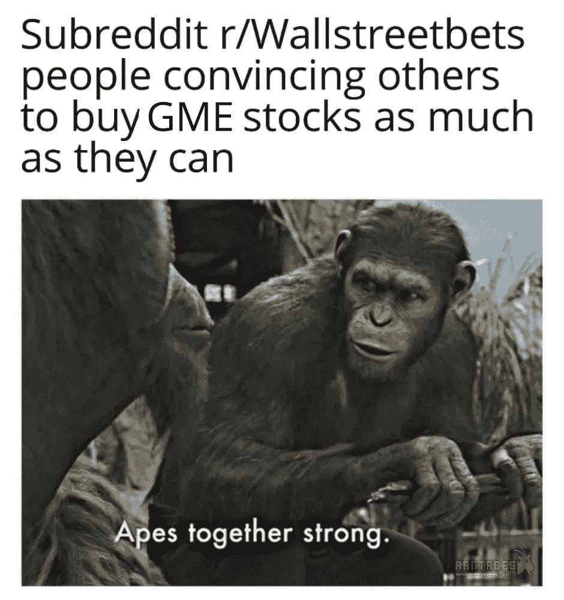

Meme 7

Reddit 用户开始互相说服购买 GME 的股票，以阻止 GME 的破产。

# 迷因 8:

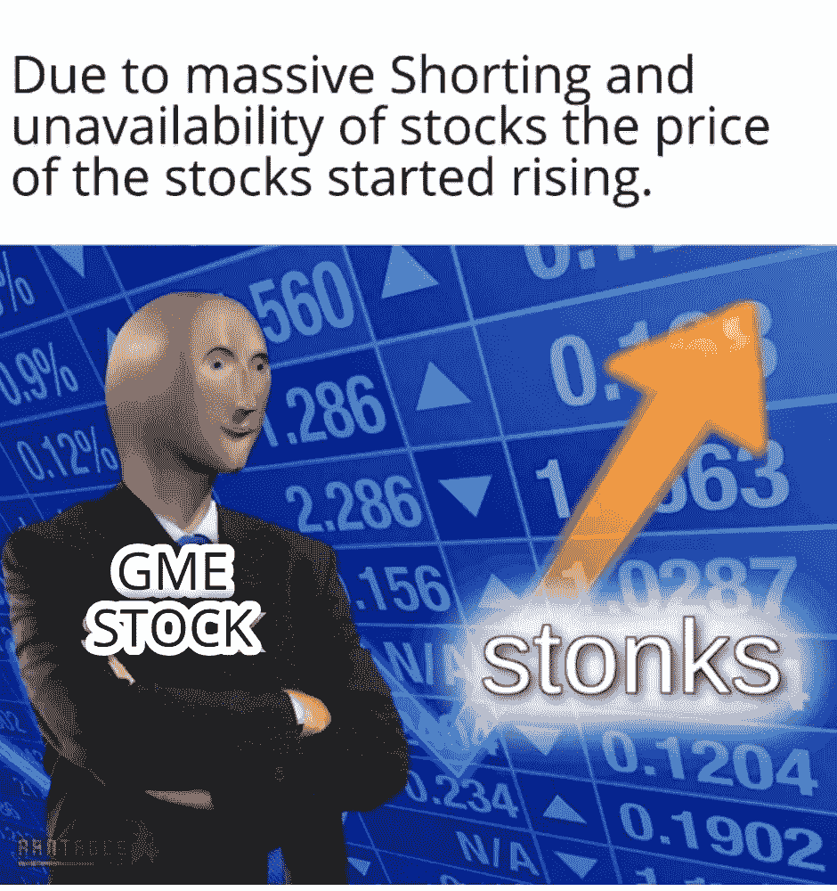

Meme 8

嘣！买家比卖家多。GME 的物价开始上涨。

# **迷因 9:**

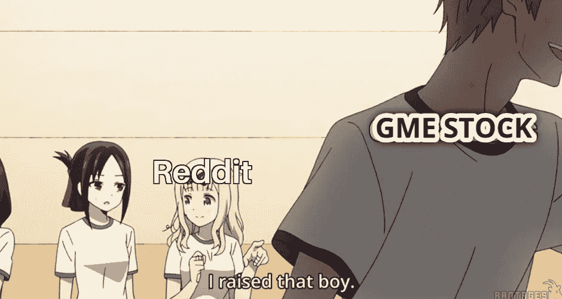

Meme 9

这些 Redditors 将 GME 的价格提高了 1400%

# 迷因 10:

Meme 10

价格上涨。对冲基金不能买价格低的股票来回报。

# 迷因 11:

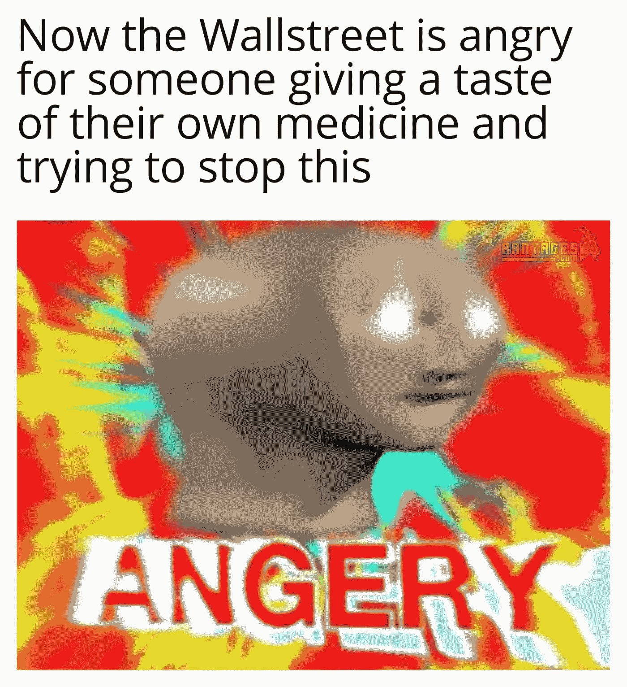

Meme 11

具有讽刺意味的是，华尔街人经常为了自己的利益做这类事情。但是现在他们是它的受害者。

# 迷因 12:

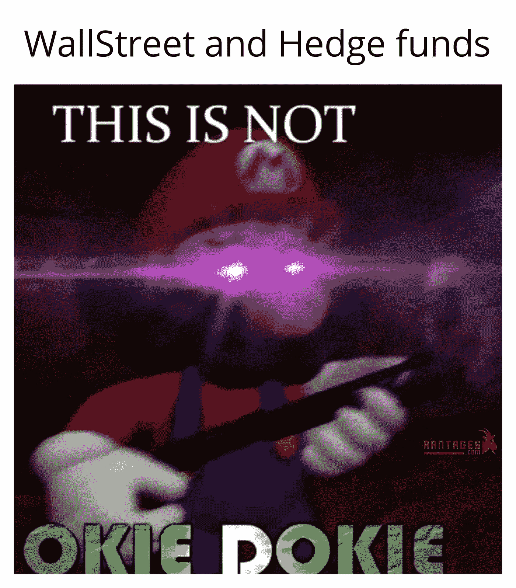

Meme 12

愤怒！愤怒！！愤怒！！！

# 迷因 13:

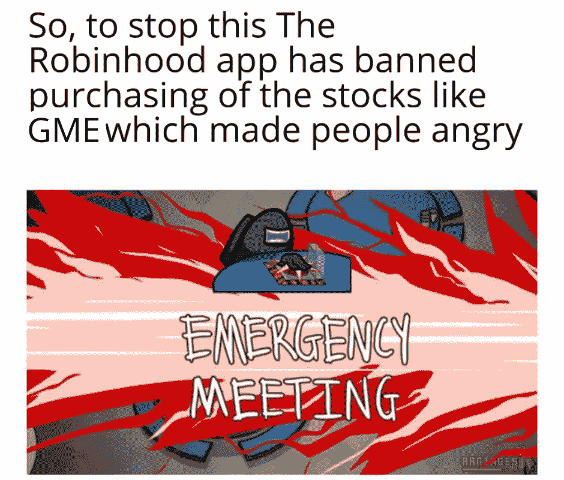

Meme 13

他们运用他们的政治/经济权力，禁止购买 GME 股票！

# 迷因 14:

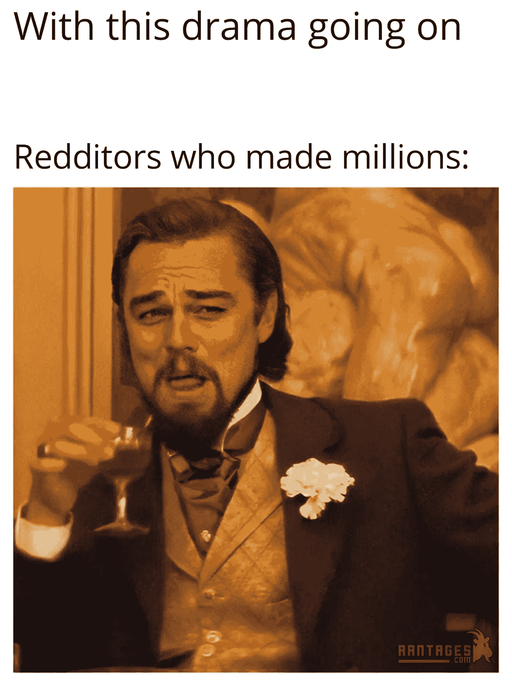

Meme 14

是啊！是啊！

# 迷因 15:

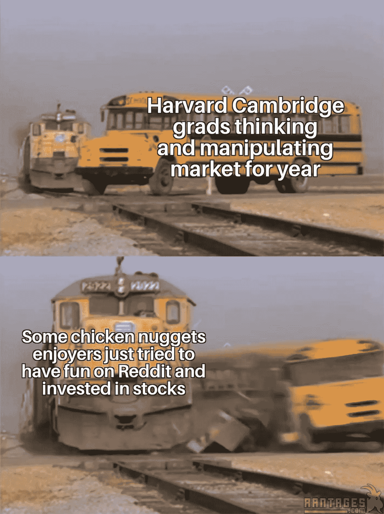

Meme 15

嗯，这是断章取义；-;

尽可能简单地解释 Gamestop 股票、对冲基金和华尔街的情况。

在某些方面我可能是错的。但事实就是如此。

**Memes 最初发布在** : [Rantages](https://facebook.com/Rantages)

**参考文献**(可以阅读这些帖子深入了解):

1.  [被 GameStop 革命搞糊涂了？观看约瑟夫·瑟沃奇](https://medium.com/the-partnered-pen/confused-by-gamestop-revolution-watch-trading-places-and-wall-street-15cf99e4478)的《交易场所》和《华尔街》
2.  GameStop 不仅仅是一个迷因股票。作者[梅根·荷尔斯泰因](https://medium.com/u/b0479bd1cc08?source=post_page-----d7127e9e98e5--------------------------------)
3.  [GameStop 的惨败证明我们正处于一个“迷因股”泡沫中](https://marker.medium.com/gamestop-proves-were-in-a-meme-stock-bubble-b3f39163a77f)