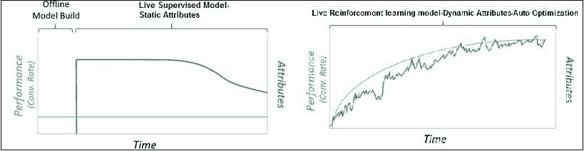
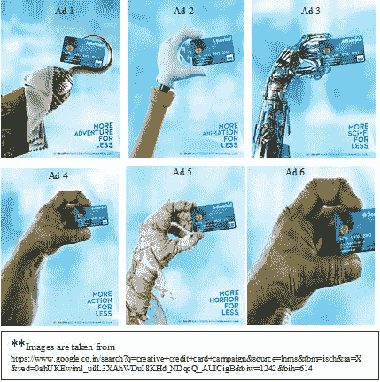
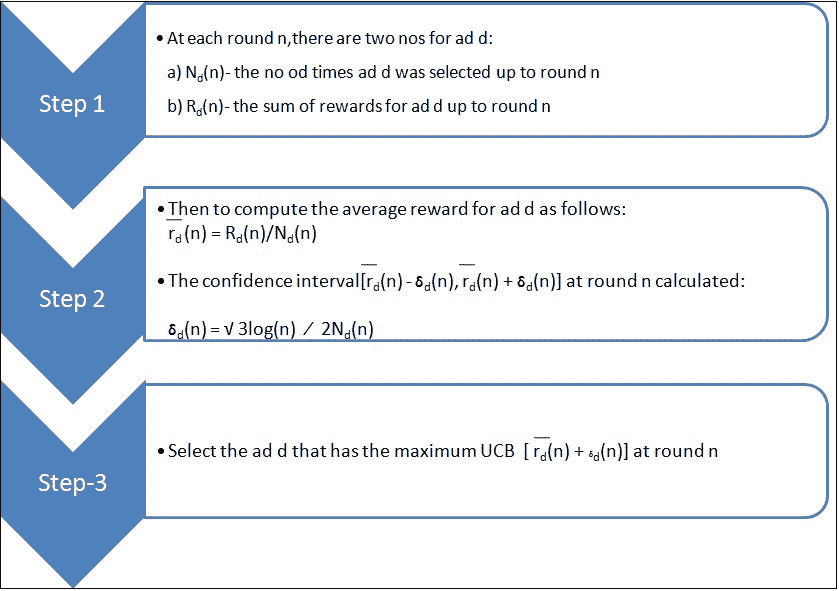
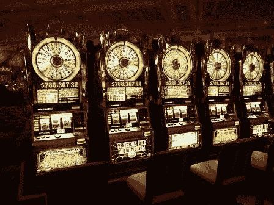
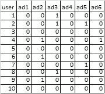
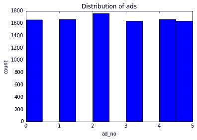
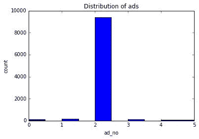
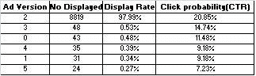

# 在数字营销中利用强化学习的力量

> 原文：<https://medium.datadriveninvestor.com/leveraging-power-of-reinforcement-learning-in-digital-marketing-b587b0f7fc97?source=collection_archive---------6----------------------->

在我的[上一篇文章](https://www.linkedin.com/pulse/maximizing-lead-conversion-marketing-effectiveness-through-dey/)中，我讨论了一种高级分析解决方案，通过倾向建模技术来提高营销活动的投资回报率*或营销投资回报率* (ROMI)。虽然监督学习是预测分析行业中最常用的(至少到目前为止)方法，但它有一些限制。r

首先，监督学习使用属性的静态列表，如果不定期刷新，随着时间的推移，这些列表将变得无关紧要。这意味着这些技术不易于自适应学习/自学习(发现除训练期间学习的规则之外的新智能)，即当新数据 IV(独立变量)或群体特征发生变化时，算法的性能会下降。我们倾向于认为，模型越接近学习阶段，预测能力越强。随着时间的推移，外部因素(如客户购买行为的变化)会降低模型的预测能力，导致需要离线重建过程。其次，很难用糟糕的数据让它变得伟大——“垃圾进，垃圾出”。

这里强化学习/在线学习(AI 的基石)来很大程度上解决这些问题。当监督学习预测一个类并在类上被训练时，强化算法从奖励/惩罚中学习并更新自己，这随着时间而继续。因此，虽然监督学习是无状态的，但 RL 具有时间维度，它不仅查看过去的状态，还查看现在的状态。因此，由于算法中总是存在实时更新，所以使用动态属性列表可以接近实时地进行优化，从而最小化外部因素的影响。因此，这里的模型性能特征正好与监督学习相反-最初，性能是次优的，当算法看到更多数据时，它从奖励/惩罚结构中学习，其预测能力随着更新的指导原则而增加。

一段时间内的性能特征



Supervised Model vs. Reinforcement Learning (source:Image by Author)

在本文中，我们将使用置信上限(UCB)——一种*强化学习家族——来解决数字营销领域的一个商业问题。*

业务场景和 RL 框架

由于信用卡公司和银行都渴望在有限的营销预算和最后期限内实现完全数字化，以实现切实的美元影响，因此从传统的测试和目标战略转变为下一代方法势在必行。到目前为止，在数字营销和网络分析中，A/B 测试是比较数字活动、选择获胜广告和决定目标定位策略的流行方法。

虽然它易于设计和实现，但是这种基于假设的经典方法有一些缺点。

1)无记忆:每次都是独立的测试，与之前活动的知识无关。先前的知识(先验概率)通常会加强后验概率的可信度，从而加强决策过程。

2)缓慢而昂贵:由于这是一个两步过程，首先它通过测试活动探索机会，然后基于比较分析，它利用获胜的数字广告或创意来获得美元收益。另一方面，强化学习算法充当自学习引擎，同时优化探索和利用。

3)没有指导原则:没有自我学习和反馈系统来不断更新结果。一年前 creative X 的表现优于 creative Y，并不意味着它现在的表现仍然会更好。

在文章的下一部分，我们将讨论业务案例和基于强化学习的解决方案，包括用 python 和 r。

数字活动案例研究:

一家跨国银行正计划通过在数字领域的新活动获得客户，为其新推出的信用卡产品之一提供电影票特别消费优惠。有详细的成本效益分析和关于报价结构的决策。然而，数字营销团队正在探索六种不同的创意，并根据测试活动中的奖励/回报(点击率(CTR))，获胜的广告将显示在主页、社交媒体和其他合作伙伴网站上。一种选择是用足够大的样本进行多次 A/B 测试，并选择最佳广告，这既费时又费钱，而且作为一种纯粹的探索方法，没有(同时)对最佳广告的有效利用。

让我们看看更接近人工智能(AI)领域的强化学习技术——UCB(Upper Confidence Bound)算法如何帮助我们同时进行探索和开发，以实现回报的最大化。



Fig-数字活动的创意版本

所以简而言之我们的问题有以下步骤:

I)我们有六个数字活动的创意版本(d ),每次用户/访问者连接到网页时，我们都会显示该广告的一个版本。

ii)每次用户连接到该网页时，计为一轮(n)。

iii)在每一轮 n，创意 d 获得奖励 rd (n) ϵ {0，1}:如果用户点击了添加，rd (n) = 1，如果用户没有点击，则为 0。

iv)我们的目标是最大化我们在多个回合(I)中获得的总奖励

UCB 算法和多武装匪徒问题；

UCB 算法的直觉来自赌场吃角子老虎机的工作原理，与著名的[多臂强盗问题](https://en.wikipedia.org/wiki/Multi-armed_bandit)(在具有不同成功概率的机器中选择最佳的吃角子老虎机，以最大化利润)相关。显然，我们的业务问题与多武装匪徒问题没有什么不同，以下是 UCB 算法简单版本的步骤:



Fig 2: UCB Algorithm and Multi-armed Bandit (Source:Image by Author)



Pic source: [https://cxl.com/blog/bandit-tests/](https://cxl.com/blog/bandit-tests/)

简而言之，该算法最初假设一些关于选项的先验信息(或几轮后的一些假设),这些选项涉及客户偏好的概率分布和这些分布的预期回报。在迭代过程中，该算法根据用户操作获得智能—奖励(点击)/惩罚(无点击)以及每一轮(迭代)的期望值(平均奖励)，如步骤 2 中所指定的。然后，在步骤 2 中发生的第二件事是，在每一轮后，有了关于每个选项的附加信息，它对期望值变得更有信心，并且随着样本大小的增加，它通过缩小置信界限来不断更新置信区间(参见步骤 2)。在通过数千次迭代收集大样本后，当它对整体情况更有信心时，它会进一步缩小置信区间，更接近期望值，最后，算法会找到最佳解决方案或最佳选项。然后，它开始通过只显示最佳广告来最大化投资回报率。正是这种方式找到最好的吃角子老虎机在多臂土匪的问题，并利用吃角子老虎机赚钱。

# 履行

现在是时候做一些编码来遵循上面的步骤，更清楚地理解整个过程了。这个练习的数据集可以从[这里](https://www.dropbox.com/s/d7n618sbtqvpdu4/ucb_data.csv?dl=0)下载。(这个数据集纯粹是为了学术兴趣而准备的，与任何商业数据都没有联系)。在这里，我们将从 10k 用户行为的数据点中看到，UCB 如何选择最佳广告，并开始利用该选项来最小化营销成本(社交媒体上显示的广告越多，产生的成本就越多)。当用户的行为被标记时，六个不同的广告版本被显示给用户(点击然后奖励= 1，否则奖励= 0)。[请注意，这是用于说明目的的模拟数据集。然而，在现实生活中，我们从零开始(没有数据),并且在迭代过程中用户动作的基础算法决定或更新其策略以显示广告版本。这就是强化学习被称为在线学习/互动学习的原因]

由于这个算法没有现成的包，我们将尝试从头开始构建它。这是一个简单的实现版本，当然还有其他方法来实现 UCB。

用 Python 编码

首先让我们看看不采用任何策略(随机选择)的奖励是什么，并将比较 UCB 与随机显示策略的性能

```
#importing necessary libraries
import pandas as pd
import os as os
import numpy as np
import matplotlib.pyplot as plt
import random
import math*#Dataset reading*
os.chdir('C://practice/Reinforcement/UCB')
os.getcwd()
ucb = pd.read_csv('ucb_data.csv')*# check out first 10 data points*
sales_data.head(10)
```



数据集映射用户动作。例如，对于用户 6 次点击 ad2，但是没有点击任何其他广告。

在不同回合中随机选择广告，并将总点击量保存在‘total _ reward _ rand’变量中，并且‘ad _ selected’列表存储在回合中选择的不同广告版本。

```
*#Initialization*
user = ucb.user
ucb = ucb.drop(['user'], axis = 1)   *#Dropping user field*
N = 10000               *# no of iterations*
d = 6                   *# no of ad versions*
total_reward_rand = 0   *#variable to store total rewards or clicks throuout the iterations*

*#Loop through the iterations and random selection of ad*
ad_selected = []       *#List to store diff ad versions selected over iterations* 
 for i in range(0,N):   *#For loop from 0 to 9999* 
    ad = random.randrange(d)
    ad_selected.append(ad)
    reward = ucb.values[i,ad]
    total_reward_rand = total_reward_rand + reward
```

我们将会看到在没有任何策略的情况下我们获得了多少点击

```
print('total clicks without any strategy: {}'.format(total_reward_rand))*#plot- Distribution of ad_selected*
plt.hist(ad_selected)
plt.title('Distribution of ads')
plt.xlabel('ad_no')
plt.ylabel('count')
plt.show()
```

没有任何策略的总点击量:1287



正如随机选择所预期的那样，不同的广告几乎被统一选择，点击率约为 12.87% (1287/10000)。【在 python 中 index 从零开始，所以 Ad1 表示为 0，以此类推】。此外，由于这是一个随机过程，在另一次运行中，结果可能会略有不同。

# #让我们看看 UCB 算法是否通过利用被点击概率最高的广告来提高点击率。代码行被注释并且不言自明。不过，随便问。

```
*#Initialization*
N = 10000               *# no of iterations*
d = 6                   *# no of ad versions*
ad_selected = []       *#List to store diff ad versions selected over iterations* 
no_selection = [0] * d *#List to store no of times diff ad versions selected*
sum_reward = [0] * d   *#List to store no of clicks diff ad versions get upto round N*
total_reward_ucb = 0   *# To store Total No clicks upto round N*
```

如图 2 所示，内部循环计算两个 no；1)广告版本 j 平均报酬，以及 2)每次迭代的广告版本的置信上限。变量“ad”存储具有最高 UCB 的广告版本，并在 upper_bnd > max_upper_bnd 时不断更新其值。max_upper_bnd 值也会更新。

```
*#loop through no of rounds* 
for i in range(0,N):
    max_upper_bnd = 0     *# Variable to store value of max UCB and resets at each round*
    ad = 0               *#temporary Variable to store ad version having highest UCB and starts with ad1* 
    for j in range(0,d):  *#Here loop starts with 0 index till index 5* 
        if (no_selection[j] > 0):
           avg_reward = sum_reward[j]/no_selection[j]  
           delta_j = (math.sqrt(3/2) * math.log(i + 1)/no_selection[j])    *#Refer Step2 for fig2*
           upper_bnd = avg_reward + delta_j            *#UCB calculation for ad version j for iteration i*
        else:
           upper_bnd = 1e5                  *#High value assigned during initial rounds*
        if upper_bnd > max_upper_bnd:
           max_upper_bnd = upper_bnd
           ad = j
    ad_selected.append(ad)                   *#List updates with ad selected at each round*
    no_selection[ad] = no_selection[ad] + 1  
    reward = ucb.values[i,ad]                *#Picks the user action- click/no click for selected ad at round i*
    sum_reward[ad] = sum_reward[ad] + reward     *#list updates to store rewards for diff add version* 
    total_reward_ucb = total_reward_ucb + reward *#Total rewards/clicks updates after every round*
```

然而，最初我们对于任何广告版本 j 都没有 _selection = 0，因此对于最初的 10 轮，策略将是选择每个广告版本一次，例如对于第 1 轮 ad0，对于第 2 轮 ad1 将被显示，等等。然后，当我们在最初几轮中获得每个广告版本的奖励(点击)信息时，UCB 算法开始工作。初始 if-else 子句用于根据 UCB 算法显示广告，仅当广告版本 j 至少被选择为 1 时。Upper_bnd 被分配一个非常高的值(1e5)，以便在初始回合期间保持广告选择的顺序(在初始 10 回合期间，您可以尝试任何广告版本，一次也不选择，即第 3 回合的广告 2)。

就是这样。UCB 算法已经实现，现在是时候看看结果了！

```
print('total clicks with UCB Algorithm: {}'.format(total_reward_ucb))*#plot- Distribution of ad_selected*
plt.hist(ad_selected)
plt.title('Distribution of ads')
plt.xlabel('ad_no')
plt.ylabel('count')
plt.show()
```

使用 UCB 算法的总点击数:2028。



结果令人激动！使用 UCB，我们获得了 20.28%的点击率，比随机策略显著提高了 1.58 倍。此外，从所选广告的直方图中可以明显看出，广告 3(“更少的科幻”)是明显的赢家。这意味着 UCB 能够展示广告版本，这是最有可能被点击的。

让我们进一步探索两个向量 ad_selected 和 sum reward

```
*#How many times Ad 3 selected after 1000 rounds till end*
 no_displayed = pd.Series(ad_selected[1000:N]).value_counts()
 select_rate = no_displayed/len(ad_selected[1000:N])*#Let's also look click though rate of diff ad versions*
sum_reward.sort(reverse = True)
no_selection.sort(reverse = True)    
click_probability = pd.Series(sum_reward)/pd.Series(no_selection)
ucb_output = pd.DataFrame({'Ad Version':no_displayed.index, 'No Displayed' : no_displayed.values, 'Display Rate' :select_rate.values, 'Click probability(CTR)':click_probability})
ucb_output
```



因此，即使在 1k 回合算法修正其显示获胜广告版本的策略之后，从输出来看。我们可以看到几乎 98%的实例广告 3(根据 python 索引标准，排名第二)，它具有最高的点击概率(CTR ),并且算法开始利用最佳广告来获得更多的点击量和随后的更多转换。这只是一个微型数据集。在现实生活中，数据集将是巨大的，因此实现美元的利益。

# R 中的实现

你可以在这里找到 UCB 实现[的 R 代码。逻辑是一样的。运行一下，看看结果是否匹配。](https://www.dropbox.com/s/xjoivd7mwawembg/ucb.R?dl=0)

# 前方道路:

这只是建立智能数字营销生态系统的一小步，还有巨大的机会来利用强化学习的未开发潜力。大数据和高效分析的力量相结合，激发了人类刚刚开始涉足的全新智能自动化浪潮。数字营销是这股浪潮正在颠覆的众多领域之一。在我的下一篇文章中，我将介绍另一种基于人工智能的方法- [Thompson Sampling](https://en.wikipedia.org/wiki/Thompson_sampling) ，看看它是否对这个问题有更好的解决方案。在那之前，“保持饥饿，保持愚蠢”。